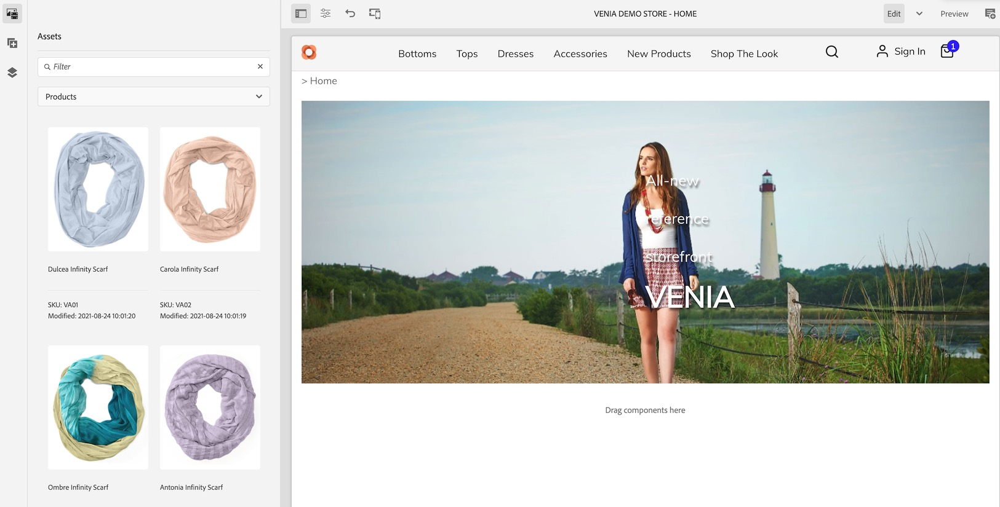

# Skapa Commerce Experience {#authoring-commerce-experiences}

## Ökning {#overview}

CIF-tillägget utökar framtagningen av AEM med handelsspecifika funktioner. På så sätt kan författare skapa och hantera e-handelsrelaterade upplevelser effektivt genom att få tillgång till produktdata och innehåll utan att lämna sammanhanget.

## Väljare {#pickers}

Produkt- och kategoriväljare är modala användargränssnittsdialogrutor som ger AEM författare ett bekvämt sätt att hitta och välja produkter eller kategorier när det behövs. Kärnkomponenter, innehållsassociation och produktmallar är de typiska områdena med konfigurationer som kräver produktkatalogdata. Väljarna har stöd för olika konfigurationsalternativ, t.ex. flerval, variantval och förval av värden.

### Produktväljare {#product-picker}

Den här väljaren gör att du kan bläddra genom katalogstrukturen eller söka i fulltext efter produkten. Produkter med variationer erbjuder en mappikon i kolumnen&quot;Typ&quot;. När du klickar på mappikonen öppnas variationerna för den valda produkten.

Om du klickar på den överordnade kategorin återgår författaren till produktnivån.

#### Exempel på produkttekniker {#example-product-teaser}

Konfigurationsdialogrutan för den här komponenten kräver en produkt. CIF använder SKU:n som produktidentifierare. Författare kan antingen ange sku för hand eller klicka på mappikonen för att öppna produktväljaren. När du har valt och stängt väljaren visas namnet på den valda produkten i komponentdialogrutan

### Kategoriväljaren {#category-picker}

Den här väljaren gör att du kan bläddra i katalogstrukturen för att hitta kategorin.

#### Exempel på kategoriCarousel {#example-carousel}

Konfigurationsdialogrutan för den här komponenten kräver 1: n kategorier. CIF använder UID/ID som kategoriidentifierare. Författare kan antingen ange UID manuellt eller klicka på mappikonen för att öppna kategoriväljaren. När du har valt och stängt väljaren visas namnet på den valda kategorin i komponentdialogrutan.

## Page Editor {#page-editor}

Sidredigeraren i AEM har utökas med funktioner för att komma åt realtidsproduktdata och tillhörande produktinnehåll.

### Åtkomst till produktdata {#access-product-data}

På fliken Assets i redigerarens sidpanel kan du få tillgång till produktdata genom att välja typen Produkter. Data hämtas live från den konfigurerade slutpunkten för e-handel. Filtret är en textsökning på slutpunkten för e-handel för att hitta specifika produkter.

I motsats till resurser kan produkter läggas till på en sida (vilket skapar en produktlaserkomponent som standard) eller komponenter (som för närvarande stöds är produktteaser och produktkarusell).

### Lägga till länkar i textfält med RTE {#rte}

CIF produktkatalogsidor är virtuella sidor som återges direkt. Därför går det inte att bädda in hyperlänkar som för vanliga AEM-sidor. CIF lägger till en ny åtgärd,&quot;Commerce Links&quot;, i textredigeraren. Den här åtgärden fungerar precis som den vanliga hyperlänksåtgärden, men tillåter författare att välja en produkt eller kategori med hjälp av väljarna.

>[!NOTE]
>
> Om du väljer både kategori och produkt används produkten.

Då skapas en platshållarlänk som ersätts med en riktig länk när sidan återges.

### Åtkomst till associerat produktinnehåll {#associated-content}

Om redigeraren känner igen :n produkter på en sida visar sidopanelen automatiskt fliken&quot;Associerat Commerce-innehåll&quot;. På den här fliken kan författare snabbt komma åt AEM-innehåll som taggats med produkten (mer information finns i [Förbättra produktdata med associerat AEM-innehåll](/help/commerce-cloud/cif-storefront/authoring/enrich-product-associated-content.md)). På den här fliken finns listrutor som du kan använda för att filtrera efter innehållstyp och specifika produkter om det finns flera produkter på sidan. Det fungerar precis som att använda innehåll från fliken&quot;Assets&quot;.

### Förhandsgranska mellanlagrade produktdata {#staged-data}

I Timewarp-läget i redigeraren kan författare förhandsgranska och bläddra i en AEM-upplevelse med mellanlagrade produktkatalogdata baserat på Timewarp-datumet.

Komponenterna visar en visuell indikator om det använda datumet mellanlagras.

## Omnisearch {#omnisearch}

Att använda Omnisearch är ett enkelt sätt för användarna att hitta AEM-innehåll och produktkatalogdata med hjälp av fulltextsökning. Omnissearch kommer att köra fulltextsökning i AEM och e-handelsbackend för att hitta produktkatalogobjekt i e-handelsbackend och AEM-innehåll. AEM-resultaten innehåller även innehåll som taggats med produkt-/kategoridata.

Resultatet grupperas efter typ.

>[!NOTE]
>
> Fulltextsökning i Omnissearch stöder inte associerade innehållsfragment. Använd SKU eller UID för att hitta tillhörande innehållsfragment.
