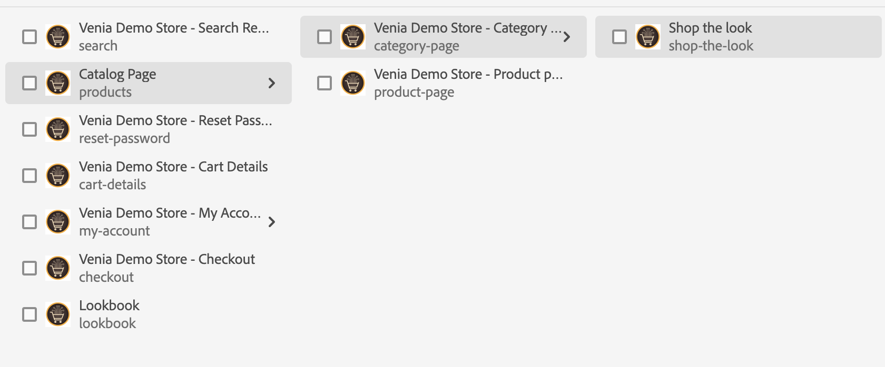

# Hantera produktkatalogsidor och mallar {#product-catalog}

Lär dig hur du hanterar produktkatalogsidor och mallar.

## Story hittills {#story-so-far}

I det föregående dokumentet på redigeringsresan för AEM Content och Commerce, [Getting Started with AEM CIF authoring basics](/help/commerce-cloud/cif-storefront/commerce-journeys/aem-commerce-content-author/getting-started.md), lärde du dig grunderna för CIF-redigering.

Den här artikeln bygger på dessa grunder.

## Syfte {#objective}

Det här dokumentet hjälper dig att förstå hur du hanterar produktkatalogsidor och mallar. När du har läst bör du:

* förstå begreppen för katalogmallar
* hur generiska mallar fungerar
* har skapat en enskild mall

## Det grundläggande konceptet {#basic-concept}

Venia storefront har en typisk produktkatalogsupplevelse med navigering, landning, kategori (PLP) och produktinformationssidor (PDP).

Katalogsidor byggs dynamiskt med en AEM CIF-katalogmall och produktdata i realtid som hämtas från e-handelsslutpunkten vid behov. Varje katalog har en allmän mall för produkt- och kategorisidor.

Navigeringskomponenten visar innehåll och katalogsidor. Det går att visa antingen kataloglandningssidan eller kategorierna på första nivån i navigeringen. Om du placerar pekaren över en kategori visas kategorier på andra nivån som en andra rad.

När du klickar på en kategori öppnas kategorisidan (eller produktlistsidan).

När du klickar på en produkt öppnas informationssidan.

## Mallarna {#templates}

### Allmänna mallar {#generic}

Den generiska mallen för Venedig-katalog använder kärnkomponenten för produktlistan. Den här komponenten visar kategoribilden om den är tillgänglig och produkter från kategorin.

Den generiska Venias produktmall använder kärnkomponenten för produktinformation. Den här komponenten visar produktinformation för olika produkttyper och åtgärd för att lägga till i kundvagnen.

### Redigera mallar {#edit-templates}

Du kan redigera mallar antingen genom att öppna mallsidan direkt eller genom att växla till redigeringsläge när du bläddrar på en produktkatalogsida. Tänk på att om du ändrar sidan ändras mallen och inte bara den specifika sidan i produkten/kategorin.

### Kategori- eller produktspecifika mallar {#specific}

CIF stöder flera mallar med bara några klick. Om du vill skapa en annan mall väljer du den generiska mallen från respektive kategori och skapar en sida med åtgärden **Skapa** .

Välj respektive produkt- eller kategorimall.

Ange rubriken och skapa sidan.

Observera att du nu har en specifik mall under den generiska.

Öppna mallen. Den ser ut precis som den allmänna kategorimallen.

Lägg till en bild ovanpå sidan.

Mallen kan förhandsgranskas med alla kategorier/produkter. Öppna **Sidinformation** och välj sedan **Visa med kategori/produkt**. Välj produkt/kategori i väljaren för att få en förhandsvisning av den här produkten/kategorin. Välj **Köp kategorin Look** om du vill ha en förhandsvisning av den uppdaterade mallen.

Nu måste du tilldela mallen till den specifika kategorin. Öppna egenskaper på menyn **Sidinformation** och växla till fliken E-handel. Klicka på mappikonen och välj kategorin **Leta upp** i kategoriväljaren. Du kan tilldela flera kategorier till en mall och även inkludera underkategorier genom att markera kryssrutan.

Gå tillbaka till huvudstartsidan och klicka på kategorin **Leta upp** för att visa den specifika mallen. Alla andra kategorier använder fortfarande den allmänna mallen.

Samma arbetsflöde kan användas för att skapa enskilda produktmallar.

## What&#39;s Next {#what-is-next}

Nu när du är klar med den här delen av resan bör du:

* förstå begreppen för katalogmallar
* hur generiska mallar fungerar
* har skapat en enskild mall

Bygg vidare på den här kunskapen och fortsätt din resa genom att gå igenom dokumentet [Hantera testade produktkataloger](/help/commerce-cloud/cif-storefront/commerce-journeys/aem-commerce-content-author/staged-catalog.md) där du får lära dig hur du arbetar med testade produktdata och AEM Launches.

## Ytterligare resurser {#additional-resources}

Vi rekommenderar att du går vidare till nästa del av resan genom att granska dokumentet [Hantera testversion av produktkataloger](/help/commerce-cloud/cif-storefront/commerce-journeys/aem-commerce-content-author/staged-catalog.md), men följande är ytterligare, valfria resurser som gör en djupdykning i vissa koncept som nämns i det här dokumentet, men de behöver inte fortsätta på den lösa resan:

* [Skapa flera kategori- och produktsidor](/help/commerce-cloud/cif-storefront/authoring/multi-template-usage.md)
* [Migreringsguide för Experience Manager Cloud Service](/help/commerce-cloud/cif-storefront/migration.md) - Så här migrerar du till tillägget AEM Commerce integration framework (CIF) från en gammal version
