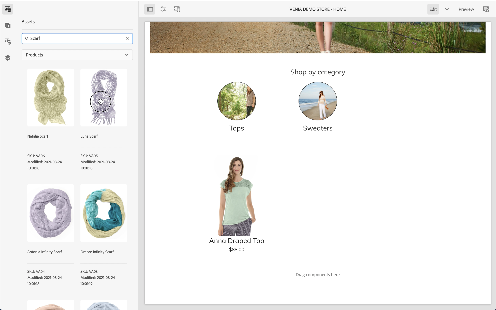
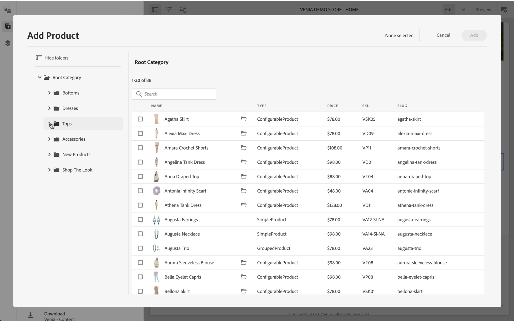
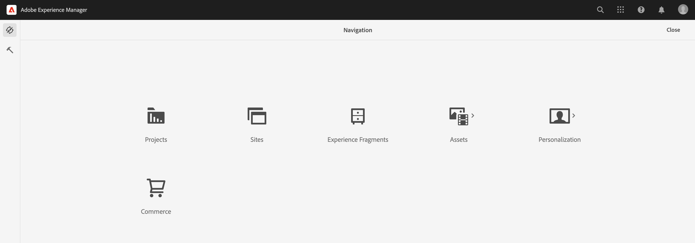

# Komma igång med AEM CIF {#getting-started}

Läs mer om Adobe Experience Manager (AEM) CIF Authoring.

## Story hittills {#story-so-far}

I det föregående dokumentet om AEM Content and Commerce [Learn about AEM Content and Commerce,](/help/commerce-cloud/cif-storefront/introduction.md), lärde du dig grunderna i och koncepten med headless CMS, AEM Content och Commerce.

Den här artikeln bygger på dessa grunder.

## Syfte {#objective}

Det här dokumentet hjälper dig att förstå hur du använder CIF för innehåll och Commerce-specifik redigering. När du har läst bör du:

* Förstå begreppen för CIF redigering med Page Editor i AEM
* Så här kommer du åt produktkatalogdata i AEM med produkt- och kategoriväljare
* Åtkomst till innehåll och e-handelsdata via produktcockpit och AEM Omnisearch

## CIF Authoring in AEM Page Editor {#cif-authoring}

CIF utökar Page Editor i AEM med funktioner för att komma åt realtidsdata utan att lämna kontexten:

Öppna sidopanelen och välj Produkter i listrutan.

Du kan bläddra i produktkatalogen eller använda textsökningsfältet för att hitta produkter.

Produkter kan släppas på komponenter som stöder produktdroppar (t.ex. produktteaser, produktkarusell) direkt på sidan, vilket automatiskt skapar en produktteaserkomponent.

## Produkt- och kategoriväljare {#pickers}

Om produkt- och kategoridata krävs i e-handelskomponenter eller AEM back-office-dialogrutor kan AEM-författare använda väljare som är gränssnittselement för att enkelt söka efter och välja produktkatalogdata.

### Produktväljare {#product-picker}

När du klickar på mappikonen öppnas det modala användargränssnittet för väljaren (till exempel produktsuddgummi).

Du hittar produkterna antingen genom att bläddra i katalogstrukturen till vänster eller genom att söka. Fulltextsökning respekterar den valda kategorin och begränsar sökresultaten till den här kategorin.

Produkter med variationer markeras med en mappikon som du kan klicka på för att visa alla variationer.

### Kategoriväljaren {#category-picker}

Fungerar som en produktväljare. När du klickar på mappikonen öppnas det modala användargränssnittet för väljaren (till exempel kategori carousel).

Bläddra i katalogstrukturen till vänster och markera kategorin.

## Product Cockpit {#cockpit}

Produkcockpiten är en central plats där man snabbt kommer åt produktkatalogen med allt berikat innehåll. I en av de kommande modulerna lär du dig att berika produktdata med innehåll. För närvarande fokuserar vi på att få tillgång till produktdata.

På huvudmenyn klickar du på E-handel för att visa en lista över alla bifogade produktkataloger.

Här visas en lista med alla anslutna produktkataloger.

Produktkatalogen visar som standard alla förstanivåkategorier med alla produkter. Om du klickar på en kategori öppnas den kategorin med alla relaterade produkter och underkategorier, inklusive deras produkter.

Du kan öppna produktegenskaperna genom att klicka på egenskapsikonen. Ikonen visas genom att du håller pekaren över en produktruta.

Alla produktegenskaper är skrivskyddade eftersom data läses in i realtid från den anslutna serverdelen. Du måste ändra produktegenskaper i det serverdelssystem som är arkivsystemet. Fliken **Varianter** visas bara om produkten har variationer. Om du klickar på fliken visas alla variationer med dess attribut.

På de återstående flikarna visas allt AEM-innehåll som är kopplat till produkten. Dessa flikar beskrivs i en av de kommande modulerna.

## AEM Omnisearch {#omnisearch}

Att använda Omnissearch är ett enkelt sätt att söka efter AEM-innehåll med fulltextsökning. CIF utökar Omnissearch med fulltextsökning av produktkataloger och tillhörande AEM-material.

Omnisearch kör en fulltextsökning i e-handelsservern för att hitta alla relaterade produkter. Resultatet visas under **Visa alla produkter**. Omnissearch söker också i AEM efter innehåll som är kopplat till den sökda produkten. Resultaten listas under respektive AEM-kategori. I det här exemplet är ett innehållsfragment relaterat till produkten.

## What&#39;s Next {#what-is-next}

Nu när du är klar med den här delen av resan bör du:

* Förstå begreppen för CIF redigering med Page Editor
* Så här kommer du åt produktkatalogen i AEM med produkt- och kategoriväljare
* Åtkomst till innehåll och e-handelsdata via produktcockpit och AEM Omnisearch

Bygg vidare på den här kunskapen och fortsätt din resa genom att gå igenom dokumentet [Hantera sidor och mallar för produktkataloger](/help/commerce-cloud/cif-storefront/commerce-journeys/aem-commerce-content-author/catalog-templates.md) där du får lära dig hur du skapar och anpassar din första produktkatalogsupplevelse.

## Ytterligare resurser {#additional-resources}

Vi rekommenderar att du går vidare till nästa del av resan - [Hantera produktkatalogsidor och mallar](/help/commerce-cloud/cif-storefront/commerce-journeys/aem-commerce-content-author/catalog-templates.md) - men här finns några valfria resurser som gör en djupdykning i några koncept som nämns här. Dessa valfria resurser krävs dock inte för att fortsätta resan.

* [Konfigurera butiker och kataloger](/help/commerce-cloud/cif-storefront/getting-started.md#catalog)
