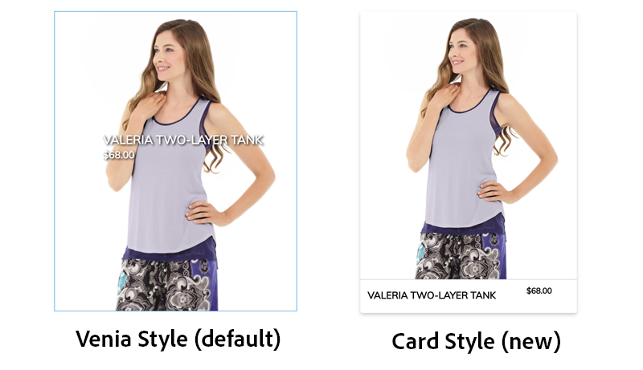
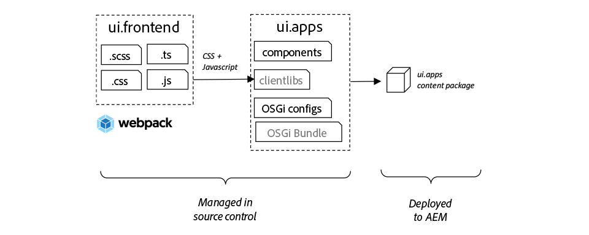
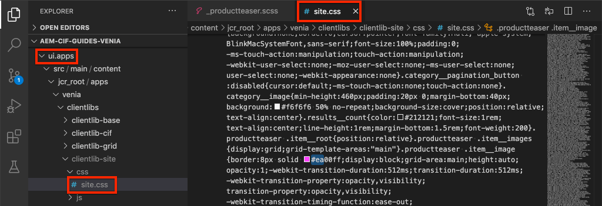
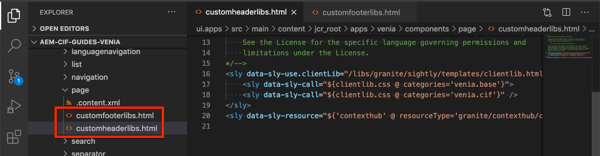

# Formatera AEM CIF Core Components {#style-aem-cif-core-components}

[CIF Venia-projektet](https://github.com/adobe/aem-cif-guides-venia) är en referenskodbas för att använda [CIF Core-komponenter.](https://github.com/adobe/aem-core-cif-components) I den här självstudiekursen inspekterar du Venias referensprojekt och förstår hur CSS och JavaScript som används av AEM CIF Core-komponenter är organiserade. Du skapar också en stil med CSS för att uppdatera standardstilen för komponenten **Product Teaser**.

>[!TIP]
>
> Använd [AEM Project-arkivtypen](https://github.com/adobe/aem-project-archetype) när du startar en egen handelsimplementering.

## Vad du ska bygga {#what-you-will-build}

I den här självstudiekursen implementeras en ny stil för Product Teaser-komponenten som liknar ett kort. Lektioner du lär dig i självstudiekursen kan användas i andra CIF Core-komponenter.



## Förutsättningar {#prerequisites}

Det krävs en lokal utvecklingsmiljö för att slutföra den här självstudiekursen. Den här miljön innehåller en instans av AEM som körs och som är konfigurerad och ansluten till en Adobe Commerce-instans. Granska kraven och stegen för att [konfigurera en lokal utveckling med AEM as a Cloud Service SDK.](/help/commerce-cloud/cif-storefront/develop.md)

## Klona Veniaprojektet {#clone-venia-project}

Du klonar [Venedig-projektet](https://github.com/adobe/aem-cif-guides-venia) och åsidosätter sedan standardformaten.

>[!NOTE]
>
> **Du kan använda ett befintligt projekt** (baserat på AEM Project Archetype med CIF inkluderat) och hoppa över det här avsnittet.

1. Kör följande Git-kommando så att du kan klona projektet:

   ```shell
   $ git clone git@github.com:adobe/aem-cif-guides-venia.git
   ```

1. Bygg och distribuera projektet till en lokal instans av AEM:

   ```shell
   $ cd aem-cif-guides-venia/
   $ mvn clean install -PautoInstallPackage,cloud
   ```

1. Lägg till nödvändiga OSGi-konfigurationer så att du kan ansluta din AEM-instans till en Adobe Commerce-instans eller lägga till konfigurationerna i det skapade projektet.

1. Nu bör du ha en fungerande version av en storefront som är ansluten till en Adobe Commerce-instans. Gå till sidan `US` > `Home` på: [http://localhost:4502/editor.html/content/venia/us/en.html.](http://localhost:4502/editor.html/content/venia/us/en.html)

   Du ser att butiken för närvarande använder temat Venia. När du expanderar huvudmenyn för butiken bör du se olika kategorier som anger att anslutningen till Adobe Commerce fungerar.

   

## Klientbibliotek och modulen ui.frontEdge {#introduction-to-client-libraries}

CSS och JavaScript som ansvarar för att återge temat/formaten för butiken hanteras i AEM av ett [klientbibliotek](/help/implementing/developing/introduction/clientlibs.md) eller&quot;klientlibs&quot; som kort. Med klientbibliotek kan du ordna CSS och JavaScript i ett projekts kod och sedan leverera på sidan.

Du kan tillämpa varumärkesspecifika format på AEM CIF Core Components genom att lägga till och åsidosätta den CSS som hanteras av dessa klientbibliotek. Det är viktigt att förstå hur klientbibliotek är strukturerade och inkluderas på sidan.

[ui.front](https://experienceleague.adobe.com/docs/experience-manager-core-components/using/developing/archetype/uifrontend.html?lang=sv-SE) är ett dedikerat [webpack](https://webpack.js.org/)-projekt som hanterar alla frontendresurser för ett projekt. Med det här webbpaketet kan gränssnittsutvecklare använda valfritt antal språk och tekniker som [TypeScript](https://www.typescriptlang.org/), [Sass](https://sass-lang.com/) och mycket annat.

Modulen `ui.frontend` är också en Maven-modul och integrerad med det större projektet genom att använda en NPM-modul i [ aem-clientlib-generator](https://github.com/wcm-io-frontend/aem-clientlib-generator). Under ett bygge kopierar `aem-clientlib-generator` de kompilerade CSS- och JavaScript-filerna till ett klientbibliotek i modulen `ui.apps`.



*Kompilerad CSS och JavaScript kopieras från modulen `ui.frontend` till modulen `ui.apps` som ett klientbibliotek under ett Maven-bygge*

## Uppdatera Teaser Style {#ui-frontend-module}

Gör sedan en liten ändring i Teaser-formatet för att se hur modulen `ui.frontend` och klientbiblioteken fungerar. Använd [den utvecklingsmiljö du väljer](https://experienceleague.adobe.com/docs/experience-manager-learn/cloud-service/local-development-environment-set-up/development-tools.html?lang=sv-SE#set-up-the-development-ide) för att importera Venia-projektet. Skärmbilder som används är från [Visual Studio Code IDE.](https://experienceleague.adobe.com/docs/experience-manager-learn/cloud-service/local-development-environment-set-up/development-tools.html?lang=sv-SE#microsoft-visual-studio-code)

1. Navigera och expandera modulen **ui.front** och expandera mapphierarkin till: `ui.frontend/src/main/styles/commerce`:

   

   Observera att det finns flera Sass-filer (`.scss`) under mappen. Dessa filer är de Commerce-specifika formaten för var och en av Commerce-komponenterna.

1. Öppna filen `_productteaser.scss`.

1. Uppdatera regeln `.item__image` och ändra kantlinjalen:

   ```scss
   .item__image {
       border: #ea00ff 8px solid; /* <-- modify this rule */
       display: block;
       grid-area: main;
       height: auto;
       opacity: 1;
       transition-duration: 512ms;
       transition-property: opacity, visibility;
       transition-timing-function: ease-out;
       visibility: visible;
       width: 100%;
   }
   ```

   Regeln ovan bör lägga till en fet rosa ram i Product Teaser Component.

1. Öppna ett nytt terminalfönster och navigera till mappen `ui.frontend`:

   ```shell
   $ cd <project-location>/aem-cif-guides-venia/ui.frontend
   ```

1. Kör följande Maven-kommando:

   ```shell
   $ mvn clean install
   ...
   [INFO] ------------------------------------------------------------------------
   [INFO] BUILD SUCCESS
   [INFO] ------------------------------------------------------------------------
   [INFO] Total time:  29.497 s
   [INFO] Finished at: 2020-08-25T14:30:44-07:00
   [INFO] ------------------------------------------------------------------------
   ```

   Kontrollera terminalutdata. Observera att Maven-kommandot körde flera NPM-skript, inklusive `npm run build`. Kommandot `npm run build` definieras i filen `package.json` och kompilerar webbpaketprojektet och utlöser genereringen av klientbiblioteket.

1. Granska filen `ui.frontend/dist/clientlib-site/site.css`:

   

   Filen är den kompilerade och minimerade versionen av alla Sass-filer i projektet.

   >[!NOTE]
   >
   > Filer som detta ignoreras från källkontrollen eftersom de ska genereras under byggtiden.

1. Granska filen `ui.frontend/clientlib.config.js`.

   ```js
   /* clientlib.config.js*/
   ...
   // Config for `aem-clientlib-generator`
   module.exports = {
       context: BUILD_DIR,
       clientLibRoot: CLIENTLIB_DIR,
       libs: [
           {
               ...libsBaseConfig,
               name: 'clientlib-site',
               categories: ['venia.site'],
               dependencies: ['venia.dependencies', 'aem-core-cif-react-components'],
               assets: {
   ...
   ```

   Den här konfigurationsfilen är för [aem-clientlib-generator](https://github.com/wcm-io-frontend/aem-clientlib-generator) och avgör var och hur kompilerad CSS och JavaScript omvandlas till ett AEM-klientbibliotek.

1. Granska filen i modulen `ui.apps`: `ui.apps/src/main/content/jcr_root/apps/venia/clientlibs/clientlib-site/css/site.css`:

   

   Filen `site.css` kopieras till projektet `ui.apps`. Den ingår nu i ett klientbibliotek med namnet `clientlib-site` och kategorin `venia.site`. När filen ingår i modulen `ui.apps` kan den distribueras till AEM.

   >[!NOTE]
   >
   > Filer som detta ignoreras också i källkontrollen eftersom de ska genereras under byggtiden.

1. Kontrollera sedan de andra klientbiblioteken som genereras av projektet:

   

   Dessa klientbibliotek hanteras inte av modulen `ui.frontend`. I stället innehåller dessa klientbibliotek CSS- och JavaScript-beroenden från Adobe. Definitionen för dessa klientbibliotek finns i filen `.content.xml` under varje mapp.

   **clientlib-base** - Ett tomt klientbibliotek som helt enkelt bäddar in nödvändiga beroenden från [AEM Core-komponenter.](https://experienceleague.adobe.com/docs/experience-manager-core-components/using/introduction.html?lang=sv-SE) Kategorin är `venia.base`.

   **clientlib-CIF** - Ett tomt klientbibliotek som helt enkelt bäddar in nödvändiga beroenden från [AEM CIF Core Components.](https://github.com/adobe/aem-core-cif-components) Kategorin är `venia.cif`.

   **clientlib-grid** - Innehåller CSS för att aktivera funktionen för AEM responsiva stödraster. Om du använder stödrastret för AEM aktiveras [layoutläget](/help/sites-cloud/authoring/page-editor/responsive-layout.md) i AEM Editor, vilket ger innehållsförfattare möjlighet att ändra storlek på komponenter. Kategorin är `venia.grid` och är inbäddad i biblioteket `venia.base`.

1. Granska filerna `customheaderlibs.html` och `customfooterlibs.html` under `ui.apps/src/main/content/jcr_root/apps/venia/components/page`:

   

   Dessa skript innehåller biblioteken **venia.base** och **venia.CIF** som en del av alla sidor.

   >[!NOTE]
   >
   > Endast basbiblioteken är&quot;hårdkodade&quot; som en del av sidskripten. `venia.site` ingår inte i de här filerna och inkluderas i stället som en del av sidmallen för större flexibilitet. Den här processen granskas senare.

1. Från terminalen kan du bygga och driftsätta hela projektet till en lokal instans av AEM:

   ```shell
   $ cd aem-cif-guides-venia/
   $ mvn clean install -PautoInstallPackage,cloud
   ```

## Skapa en produkttekniker {#author-product-teaser}

Nu när koduppdateringarna har distribuerats lägger du till en instans av Product Teaser-komponenten på webbplatsens startsida med AEM utvecklingsverktyg. Då kan vi visa de uppdaterade formaten.

1. Öppna en ny flik i webbläsaren och gå till webbplatsens **hemsida**: [http://localhost:4502/editor.html/content/venia/us/en.html.](http://localhost:4502/editor.html/content/venia/us/en.html)

1. Expandera Resurssökaren (sidospåret) i läget **Redigera**. Växla resursfiltret till **Produkter**.

   

1. Dra och släpp en ny produkt på startsidan i huvudlayoutbehållaren:

   

   Du bör se att Product Teaser nu har en ljusrosa kantlinje som baseras på CSS-regeländringen som skapades tidigare.

## Verifiera klientbibliotek på sidan {#verify-client-libraries}

Kontrollera sedan att klientbiblioteken finns med på sidan.

1. Navigera till webbplatsens **hemsida**: [http://localhost:4502/editor.html/content/venia/us/en.html.](http://localhost:4502/editor.html/content/venia/us/en.html)

1. Välj menyn **Sidinformation** och klicka på **Visa som publicerad**:

   

   Den här sidan öppnas utan att någon av AEM-författaren JavaScript har lästs in, som den skulle se ut på den publicerade webbplatsen. Observera att URL:en har frågeparametern `?wcmmode=disabled` tillagd. När du utvecklar CSS och JavaScript är det en god vana att använda den här parametern för att förenkla sidan utan att AEM författare behöver göra något.

1. Visa sidkällan så bör du kunna identifiera flera klientbibliotek:

   ```html
   <!DOCTYPE html>
   <html lang="en-US">
   <head>
       ...
       <link rel="stylesheet" href="/etc.clientlibs/venia/clientlibs/clientlib-base.min.css" type="text/css">
       <link rel="stylesheet" href="/etc.clientlibs/venia/clientlibs/clientlib-site.min.css" type="text/css">
   </head>
   ...
       <script type="text/javascript" src="/etc.clientlibs/venia/clientlibs/clientlib-site.min.js"></script>
       <script type="text/javascript" src="/etc.clientlibs/core/wcm/components/commons/site/clientlibs/container.min.js"></script>
       <script type="text/javascript" src="/etc.clientlibs/venia/clientlibs/clientlib-base.min.js"></script>
   <script type="text/javascript" src="/etc.clientlibs/core/cif/clientlibs/common.min.js"></script>
   <script type="text/javascript" src="/etc.clientlibs/venia/clientlibs/clientlib-cif.min.js"></script>
   </body>
   </html>
   ```

   Klientbibliotek som levereras till sidan har prefixet `/etc.clientlibs` och hanteras via en [proxy](/help/implementing/developing/introduction/clientlibs.md) för att undvika att exponera något känsligt i `/apps` eller `/libs`.

   Obs! `venia/clientlibs/clientlib-site.min.css` och `venia/clientlibs/clientlib-site.min.js`. Dessa filer är de kompilerade CSS- och JavaScript-filerna som härleds från modulen `ui.frontend`.

## Inkludering av klientbibliotek med sidmallar {#client-library-inclusion-pagetemplates}

Det finns flera alternativ för hur du inkluderar ett klientbibliotek. Kontrollera sedan hur det genererade projektet innehåller `clientlib-site`-biblioteken via [Sidmallar.](/help/implementing/developing/components/templates.md)

1. Navigera till webbplatsens **hemsida** i AEM Editor: [http://localhost:4502/editor.html/content/venia/us/en.html.](http://localhost:4502/editor.html/content/venia/us/en.html)

1. Välj menyn **Sidinformation** och klicka på **Redigera mall**:

   

   Mallen **Startsida** öppnas och sidan **Startsida** baseras på den.

   >[!NOTE]
   >
   > Om du vill visa alla tillgängliga mallar från AEM startskärm går du till **Verktyg** > **Allmänt** > **Mallar**.

1. I det övre vänstra hörnet markerar du ikonen **Sidinformation** och klickar på **Sidprofil**.

   

1. Sidprofilen öppnas för mallen Landningssida:

   

   Till höger visas en lista över **kategorier** för klientbibliotek som finns på alla sidor som använder den här mallen.

   * `venia.dependencies` - Tillhandahåller eventuella leverantörsbibliotek som `venia.site` är beroende av.
   * `venia.site` - Kategorin för `clientlib-site` som modulen `ui.frontend` genererar.

   Observera att samma princip används för andra mallar, **Innehållssida**, **Landningssida** och så vidare. Genom att återanvända samma princip säkerställs att samma klientbibliotek inkluderas på alla sidor.

   Fördelen med att använda mallar och sidprofiler för att hantera inkludering av klientbibliotek är att du kan ändra principen per mall. Du kanske hanterar två olika varumärken inom samma AEM-instans. Varje varumärke har sin egen unika stil eller *tema*, men basbiblioteken och koden är desamma. Om du har ett större klientbibliotek som du bara vill visa på vissa sidor kan du skapa en unik sidprofil för just den mallen.

## Utveckling av lokala webbpaket {#local-webpack-development}

I den föregående övningen gjordes en uppdatering av en Sass-fil i modulen `ui.frontend`, och sedan distribuerades ändringarna till AEM när en Maven-version har utförts. Därefter ska vi titta på hur du använder en webpack-dev-server för att snabbt utveckla front end-formaten.

Webbpack-dev-server-proxies bilder och en del CSS/JavaScript från den lokala instansen av AEM, men låter utvecklaren ändra formaten och JavaScript i modulen `ui.frontend`.

1. Gå till sidan **Hem** i webbläsaren och **Visa som publicerad**: [http://localhost:4502/content/venia/us/en.html?wcmmode=disabled.](http://localhost:4502/content/venia/us/en.html?wcmmode=disabled)

1. Visa sidans källa och **kopian** sidans rå-HTML.

1. Gå tillbaka till den utvecklingsmiljö du valt under modulen `ui.frontend` och öppna filen: `ui.frontend/src/main/static/index.html`

   

1. Skriv över innehållet i `index.html` och **paste** som kopierades i det föregående steget.

1. Sök efter inkluderingarna för `clientlib-site.min.css`, `clientlib-site.min.js` och **ta bort**.

   ```html
   <head>
       <!-- remove this link -->
       <link rel="stylesheet" href="/etc.clientlibs/venia/clientlibs/clientlib-base.min.css" type="text/css">
       ...
   </head>
   <body>
       ...
        <!-- remove this link -->
       <script type="text/javascript" src="/etc.clientlibs/venia/clientlibs/clientlib-site.min.js"></script>
   </body>
   ```

   Dessa inkluderingar tas bort eftersom de representerar den kompilerade versionen av CSS och JavaScript som genereras av modulen `ui.frontend`. Lämna kvar de andra klientbiblioteken som de kommer att proxideras från den AEM-instans som körs.

1. Öppna ett nytt terminalfönster och navigera till mappen `ui.frontend`. Kör kommandot `npm start`:

   ```shell
   $ cd ui.frontend
   $ npm start
   ```

   Det här kommandot startar webbpack-dev-server på [http://localhost:8080/.](http://localhost:8080/)

   >[!CAUTION]
   >
   > Om du får ett Sass-relaterat fel stoppar du servern och kör kommandot `npm rebuild node-sass` och upprepar stegen ovan. Detta fel kan uppstå om du har en annan version av `npm` och `node` än vad som anges i projektet `aem-cif-guides-venia/pom.xml`.

1. Navigera till [http://localhost:8080/](http://localhost:8080/) på en ny flik med samma webbläsare som en inloggad instans av AEM. Du kan se Venias hemsida via webbpack-dev-server:

   

   Låt webbpack-dev-server vara igång. Det används i nästa övning.

## Implementera kortstil för Product Teaser {#update-css-product-teaser}

Ändra sedan Sass-filerna i modulen `ui.frontend` för att implementera en kortliknande stil för Product Teaser. Webbpack-dev-server används för att snabbt se ändringarna.

Återgå till utvecklingsmiljön och det genererade projektet.

1. Öppna filen **&#x200B;**&#x200B;igen i modulen `_productteaser.scss`ui.front`ui.frontend/src/main/styles/commerce/_productteaser.scss`.

1. Gör följande ändringar i Product Teaser-gränsen:

   ```diff
       .item__image {
   -       border: #ea00ff 8px solid;
   +       border-bottom: 1px solid #c0c0c0;
           display: block;
           grid-area: main;
           height: auto;
           opacity: 1;
           transition-duration: 512ms;
           transition-property: opacity, visibility;
           transition-timing-function: ease-out;
           visibility: visible;
           width: 100%;
       }
   ```

   Spara ändringarna och webbpack-dev-server uppdateras automatiskt med de nya formaten.

1. Lägg till en skugga och ta med rundade hörn i Product Teaser.

   ```scss
    .item__root {
        position: relative;
        box-shadow: 0 4px 8px 0 rgba(0,0,0,0.2);
        transition: 0.3s;
        border-radius: 5px;
        float: left;
        margin-left: 12px;
        margin-right: 12px;
   }
   
   .item__root:hover {
      box-shadow: 0 8px 16px 0 rgba(0,0,0,0.2);
   }
   ```

1. Uppdatera produktens namn så att det visas längst ned på teaser och ändra textfärgen.

   ```css
   .item__name {
       color: #000;
       display: block;
       float: left;
       font-size: 22px;
       font-weight: 900;
       line-height: 1em;
       padding: 0.75em;
       text-transform: uppercase;
       width: 75%;
   }
   ```

1. Uppdatera produktens pris så att det också visas längst ned på teaser och ändra textfärgen.

   ```css
   .price {
       color: #000;
       display: block;
       float: left;
       font-size: 18px;
       font-weight: 900;
       padding: 0.75em;
       padding-bottom: 2em;
       width: 25%;
   
       ...
   ```

1. Uppdatera mediefrågan längst ned så att du kan stapla namnet och priset på skärmar som är mindre än **992px**.

   ```css
   @media (max-width: 992px) {
       .productteaser .item__name {
           font-size: 18px;
           width: 100%;
       }
       .productteaser .item__price {
           font-size: 14px;
           width: 100%;
       }
   }
   ```

   Nu bör du se kortstilen återspeglas i webbpack-dev-server:

   

   Ändringarna har dock inte distribuerats till AEM ännu. Du kan [hämta lösningsfilen här](../assets/style-cif-component/_productteaser.scss).

1. Distribuera uppdateringarna till AEM med dina Maven-kunskaper från en kommandoradsterminal:

   ```shell
   $ cd aem-cif-guides-venia/
   $ mvn clean install -PautoInstallPackage,cloud
   ```

   >[!NOTE]
   >Det finns ytterligare [IDE-inställningar och verktyg](https://experienceleague.adobe.com/docs/experience-manager-learn/foundation/development/set-up-a-local-aem-development-environment.html?lang=sv-SE#set-up-an-integrated-development-environment) som kan synkronisera projektfiler direkt till en lokal AEM-instans utan att behöva utföra en fullständig Maven-version.

## Visa uppdaterad Product Teaser {#view-updated-product-teaser}

När koden för projektet har distribuerats till AEM bör du nu kunna se ändringarna i Product Teaser.

1. Gå tillbaka till webbläsaren och uppdatera hemsidan: [http://localhost:4502/editor.html/content/venia/us/en.html.](http://localhost:4502/editor.html/content/venia/us/en.html) Du bör se de uppdaterade produktlaserformaten som används.

   

1. Experimentera genom att lägga till ytterligare produktutbildningar. Använd layoutläget om du vill ändra komponenternas bredd och förskjutning så att flera scener visas på en rad.

   

## Felsökning {#troubleshooting}

Du kan verifiera i [CRXDE-Lite](http://localhost:4502/crx/de/index.jsp) att den uppdaterade CSS-filen har distribuerats: [http://localhost:4502/crx/de/index.jsp#/apps/venia/clientlibs/clientlib-site/css/site.css](http://localhost:4502/crx/de/index.jsp#/apps/venia/clientlibs/clientlib-site/css/site.css)

När du distribuerar nya CSS-filer, JavaScript-filer eller båda, är det också viktigt att se till att webbläsaren inte hanterar inaktuella filer. Du kan eliminera det här potentiella problemet genom att rensa webbläsarens cache eller starta en ny webbläsarsession.

AEM försöker också cachelagra klientbibliotek för att få prestandan. Efter en koddistribution skickas de äldre filerna ibland. Du kan göra AEM klientbibliotekscache ogiltigt manuellt med verktyget [Återskapa klientbibliotek.](http://localhost:4502/libs/granite/ui/content/dumplibs.rebuild.html) *Du bör inte validera cacheminnen om du misstänker att AEM har cachelagrat en gammal version av ett klientbibliotek. Återskapa bibliotek är ineffektivt och tidskrävande.*

## Grattis {#congratulations}

Du har utformat din första AEM CIF Core Component och du har använt en webbpaketdev-server!

## Bonus Challenge {#bonus-challenge}

Använd [AEM Style System](/help/sites-cloud/authoring/page-editor/style-system.md) för att skapa två format som kan aktiveras och inaktiveras av en innehållsförfattare. [Utveckla med Style System](https://experienceleague.adobe.com/docs/experience-manager-learn/getting-started-wknd-tutorial-develop/project-archetype/style-system.html?lang=sv-SE) innehåller detaljerade steg och information om hur du utför den här uppgiften.


## Ytterligare resurser {#additional-resources}

* [AEM Project Archetype](https://github.com/adobe/aem-project-archetype)
* [AEM CIF Core Components](https://github.com/adobe/aem-core-cif-components)
* [Konfigurera en lokal AEM-utvecklingsmiljö](https://experienceleague.adobe.com/docs/experience-manager-learn/cloud-service/local-development-environment-set-up/overview.html?lang=sv-SE)
* [Bibliotek på klientsidan](/help/implementing/developing/introduction/clientlibs.md)
* [Komma igång med AEM Sites](https://experienceleague.adobe.com/docs/experience-manager-learn/getting-started-wknd-tutorial-develop/overview.html?lang=sv-SE)
* [Utveckla med formatsystemet](https://experienceleague.adobe.com/docs/experience-manager-learn/getting-started-wknd-tutorial-develop/project-archetype/style-system.html?lang=sv-SE)
