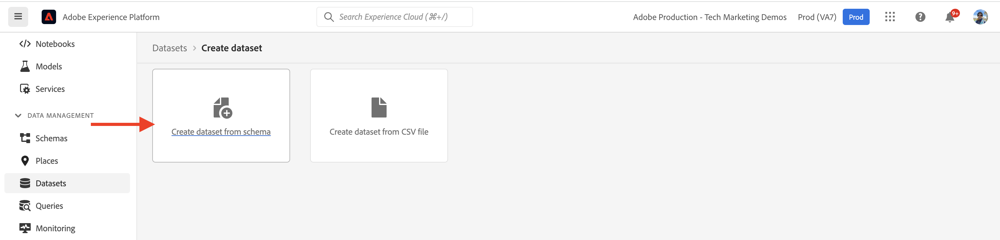
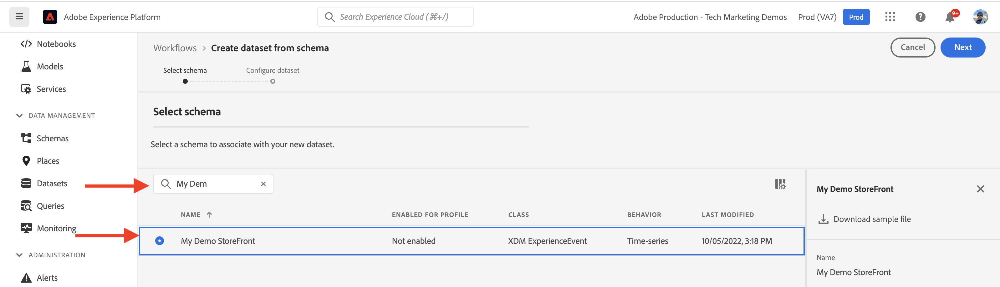

# AEM-CIF kärnkomponenter och Adobe Experience Platform-integrering {#aem-cif-aep-integration}

Kärnkomponenterna [Commerce integration framework (CIF)](https://github.com/adobe/aem-core-cif-components) erbjuder sömlös integrering med [Adobe Experience Platform](https://experienceleague.adobe.com/docs/experience-platform/landing/platform-overview.html?lang=sv-SE) för att vidarebefordra butikshändelser och deras data från interaktioner på klientsidan, som __lägg till i kundvagnen__.

Projektet [AEM CIF Core Components](https://github.com/adobe/aem-core-cif-components) innehåller ett JavaScript-bibliotek med namnet [Adobe Experience Platform Connector för Adobe Commerce](https://github.com/adobe/aem-core-cif-components/tree/master/extensions/experience-platform-connector) som samlar in händelsedata från din Commerce-butik. Dessa händelsedata skickas till Experience Platform där de används i andra Adobe Experience Cloud-produkter, som Adobe Analytics och Adobe Target, för att skapa en helhetsprofil som täcker en kundresa. Genom att ansluta Commerce-data till andra produkter i Adobe Experience Cloud kan ni utföra uppgifter som att analysera användarbeteende på er webbplats, utföra AB-tester och skapa personaliserade kampanjer.

Läs mer om [Experience Platform Data Collection](https://experienceleague.adobe.com/docs/experience-platform/collection/home.html?lang=sv-SE) med tekniker som gör att du kan samla in kundupplevelsedata från källor på klientsidan.

## Skicka händelsedata för `addToCart` till Experience Platform {#send-addtocart-to-aep}

Följande steg visar hur du skickar händelsedata för `addToCart` från AEM-återgivna produktsidor till Experience Platform med CIF - Experience Platform Connector. Genom att använda Adobe Experience Platform Debugger webbläsartillägg kan du testa och granska skickade data.


## Förutsättningar {#prerequisites}

Använd en lokal utvecklingsmiljö för att slutföra denna demo. Detta inkluderar en instans av AEM som körs och som är konfigurerad och ansluten till en Adobe Commerce-instans. Granska kraven och stegen för [konfiguration av lokal utveckling med AEM as a Cloud Service SDK.](/help/commerce-cloud/cif-storefront/develop.md)

Du behöver även åtkomst till [Adobe Experience Platform](https://experienceleague.adobe.com/docs/experience-platform/landing/platform-ui/ui-guide.html?lang=sv-SE) och behörigheter för att skapa schema, datamängd och datastreams för datainsamling. Mer information finns i [Behörighetshantering.](https://experienceleague.adobe.com/docs/experience-platform/collection/permissions.html?lang=sv-SE)

## Installation av AEM Commerce as a Cloud Service {#aem-setup}

Om du vill ha en fungerande lokal miljö i __AEM Commerce as a Cloud Service__ med den kod och konfiguration som krävs utför du följande steg.

### Lokal installation

Följ stegen i [Lokal konfiguration](/help/commerce-cloud/cif-storefront/develop.md#local-setup) så att du kan ha en fungerande AEM Commerce as a Cloud Service-miljö.

### Projektinställningar

Följ [AEM Project Archetype](/help/commerce-cloud/cif-storefront/develop.md#project) så kan du skapa ett helt nytt AEM Commerce-projekt (CIF).

>[!TIP]
>
>I följande exempel heter AEM Commerce-projektet `My Demo Storefront`, men du kan välja ett eget projektnamn.


Skapa och distribuera det skapade AEM Commerce-projektet till det lokala AEM SDK genom att köra följande kommando från projektets rotkatalog.

```bash
$ mvn clean install -PautoInstallSinglePackage
```

Den lokalt distribuerade e-handelswebbplatsen `My Demo StoreFront` med standardkod och standardinnehåll ser ut så här:


### Installera anslutningsberoenden för Premiere och CIF-AEP

Om du vill samla in och skicka händelsedata från kategori- och produktsidorna på den här AEM Commerce-webbplatsen installerar du nyckelpaketen `npm` i modulen `ui.frontend` i AEM Commerce-projektet.

Navigera till modulen `ui.frontend` och installera de nödvändiga paketen genom att köra följande kommandon från kommandoraden.

```bash
npm i --save lodash.get@^4.4.2 lodash.set@^4.3.2
npm i --save apollo-cache-persist@^0.1.1
npm i --save redux-thunk@~2.3.0
npm i --save @adobe/apollo-link-mutation-queue@~1.1.0
npm i --save @magento/peregrine@~12.5.0
npm i --save @adobe/aem-core-cif-react-components --force
npm i --save-dev @magento/babel-preset-peregrine@~1.2.1
npm i --save @adobe/aem-core-cif-experience-platform-connector --force
```

>[!IMPORTANT]
>
>Argumentet `--force` krävs ibland eftersom [PWA Studio](https://developer.adobe.com/commerce/pwa-studio/) är begränsat med peer-beroenden som stöds. Vanligtvis bör detta inte orsaka några problem.


### Konfigurera Maven att använda argumentet `--force`

Som en del av byggprocessen för Maven utlöses den rena nPM-installationen (med `npm ci`). Detta kräver också argumentet `--force`.

Navigera till projektets POM-rotfil `pom.xml` och leta upp körningsblocket `<id>npm ci</id>`. Uppdatera blocket så att det ser ut så här:

```xml
<execution>
    <id>npm ci</id>
    <goals>
    <goal>npm</goal>
    </goals>
    <configuration>
    <arguments>ci --force</arguments>
    </configuration>
</execution>
```

### Ändra konfigurationsformat för Label

Växla från standardfilformatet `.babelrc` relativt konfigurationsfilformat till formatet `babel.config.js`. Det här är ett projektövergripande konfigurationsformat och gör att plugin-program och förinställningar kan användas på `node_module` med större kontroll.

1. Navigera till modulen `ui.frontend` och ta bort den befintliga `.babelrc`-filen.

1. Skapa en `babel.config.js`-fil som använder förinställningen `peregrine`.

   ```javascript
   const peregrine = require('@magento/babel-preset-peregrine');
   
   module.exports = (api, opts = {}) => {
       const config = {
           ...peregrine(api, opts),
           sourceType: 'unambiguous'
       } 
   
       config.plugins = config.plugins.filter(plugin => plugin !== 'react-refresh/babel');
   
       return config;
   }
   ```

### Konfigurera webbpaket för användning av babel

Redigera filen `babel-loader` om du vill transpilera JavaScript-filerna med Babel-inläsaren (`webpack.common.js`) och webbpaketet.

Navigera till modulen `ui.frontend` och uppdatera filen `webpack.common.js` så att du kan ha följande regel inuti egenskapsvärdet `module`:

```javascript
{
    test: /\.jsx?$/,
    exclude: /node_modules\/(?!@magento\/)/,
    loader: 'babel-loader'
}
```

### Konfigurera Apollo-klient

[Apollo-klienten](https://www.apollographql.com/docs/react/) används för att hantera både lokala data och fjärrdata med GraphQL. Resultaten av GraphQL-frågor lagras också i en lokal, normaliserad cache i minnet.

Du behöver en [`InMemoryCache`-fil för att &#x200B;](https://www.apollographql.com/docs/react/caching/cache-configuration/)`possibleTypes.js` ska fungera effektivt. Mer information om hur du genererar den här filen finns i [Genererar possibleTypes automatiskt.](https://www.apollographql.com/docs/react/data/fragments/#generating-possibletypes-automatically)

Se även [PWA Studio referensimplementering](https://github.com/magento/pwa-studio/blob/1977f38305ff6c0e2b23a9da7beb0b2f69758bed/packages/pwa-buildpack/lib/Utilities/graphQL.js#L106-L120) och ett exempel på en [`possibleTypes.js`](../assets/aep-integration/possibleTypes.js)-fil.

1. Navigera till modulen `ui.frontend` och spara filen som `./src/main/possibleTypes.js`

1. Uppdatera `webpack.common.js`-avsnittet för filen `DefinePlugin` så att du kan ersätta de statiska variablerna som krävs under byggtiden.

   ```javascript
   const { DefinePlugin } = require('webpack');
   const { POSSIBLE_TYPES } = require('./src/main/possibleTypes');
   
   ...
   
   plugins: [
       ...
       new DefinePlugin({
           'process.env.USE_STORE_CODE_IN_URL': false,
           POSSIBLE_TYPES
       })
   ]
   ```

### Initiera kärnkomponenterna Peregrine och CIF

Om du vill initiera React-baserade Premiere-komponenter och CIF kärnkomponenter skapar du den konfiguration och de JavaScript-filer som behövs.

1. Navigera till modulen `ui.frontend` och skapa följande mapp: `src/main/webpack/components/commerce/App`

1. Skapa en `config.js`-fil med följande innehåll:

   ```javascript
   // get and parse the CIF store configuration from the <head>
   const storeConfigEl = document.querySelector('meta[name="store-config"]');
   const storeConfig = storeConfigEl ? JSON.parse(storeConfigEl.content) : {};
   
   // the following global variables are needed for some of the peregrine features
   window.STORE_VIEW_CODE = storeConfig.storeView || 'default';
   window.AVAILABLE_STORE_VIEWS = [
       {
           code: window.STORE_VIEW_CODE,
           base_currency_code: 'USD',
           default_display_currency_code: 'USD',
           id: 1,
           locale: 'en',
           secure_base_media_url: '',
           store_name: 'My Demo StoreFront'
       }
   ];
   window.STORE_NAME = window.STORE_VIEW_CODE;
   window.DEFAULT_COUNTRY_CODE = 'en';
   
   export default {
       storeView: window.STORE_VIEW_CODE,
       graphqlEndpoint: storeConfig.graphqlEndpoint,
       // Can be GET or POST. When selecting GET, this applies to cache-able GraphQL query requests only.
       // Mutations will always be executed as POST requests.
       graphqlMethod: storeConfig.graphqlMethod,
       headers: storeConfig.headers,
   
       mountingPoints: {
           // TODO: define the application specific mount points as they may be used by <Portal> and <PortalPlacer>
       },
       pagePaths: {
           // TODO: define the application specific paths/urls as they may be used by the components
           baseUrl: storeConfig.storeRootUrl
       },
       eventsCollector: {
           eventForwarding: {
               acds: true,
               aep: false,
           }
       }
   };
   ```

   >[!IMPORTANT]
   >
   >Du kanske redan känner till filen [`config.js`](https://github.com/adobe/aem-cif-guides-venia/blob/main/ui.frontend/src/main/components/App/config.js) från __AEM Guides - CIF Venia Project__, men du måste göra några ändringar i filen. Granska först eventuella __TODO__-kommentarer. I egenskapen `eventsCollector` kan du sedan hitta objektet `eventsCollector > aep` och uppdatera egenskaperna `orgId` och `datastreamId` till rätt värden. [Läs mer.](#add-aep-values-to-aem)

1. Skapa en `App.js`-fil med följande innehåll. Den här filen liknar en vanlig React-startpunktsfil och innehåller React och egna kopplingar samt React Context-användning som underlättar Experience Platform-integreringen.

   ```javascript
   import config from './config';
   
   import React, { useEffect } from 'react';
   import ReactDOM from 'react-dom';
   import { IntlProvider } from 'react-intl';
   import { BrowserRouter as Router } from 'react-router-dom';
   import { combineReducers, createStore } from 'redux';
   import { Provider as ReduxProvider } from 'react-redux';
   import { createHttpLink, ApolloProvider } from '@apollo/client';
   import { ConfigContextProvider, useCustomUrlEvent, useReferrerEvent, usePageEvent, useDataLayerEvents, useAddToCartEvent } from '@adobe/aem-core-cif-react-components';
   import { EventCollectorContextProvider, useEventCollectorContext } from '@adobe/aem-core-cif-experience-platform-connector';
   import { useAdapter } from '@magento/peregrine/lib/talons/Adapter/useAdapter';
   import { customFetchToShrinkQuery } from '@magento/peregrine/lib/Apollo/links';
   import { BrowserPersistence } from '@magento/peregrine/lib/util';
   import { default as PeregrineContextProvider } from '@magento/peregrine/lib/PeregrineContextProvider';
   import { enhancer, reducers } from '@magento/peregrine/lib/store';
   
   const storage = new BrowserPersistence();
   const store = createStore(combineReducers(reducers), enhancer);
   
   storage.setItem('store_view_code', config.storeView);
   
   const App = () => {
       const [{ sdk: mse }] = useEventCollectorContext();
   
       // trigger page-level events
       useCustomUrlEvent({ mse });
       useReferrerEvent({ mse });
       usePageEvent({ mse });
       // listen for add-to-cart events and enable forwarding to the magento storefront events sdk
       useAddToCartEvent(({ mse }));
       // enable CIF specific event forwarding to the Adobe Client Data Layer
       useDataLayerEvents();
   
       useEffect(() => {
           // implement a proper marketing opt-in, for demo purpose you hard-set the consent cookie
           if (document.cookie.indexOf('mg_dnt') < 0) {
               document.cookie += '; mg_dnt=track';
           }
       }, []);
   
       // TODO: use the App to create Portals and PortalPlaceholders to mount the CIF / Peregrine components to the server side rendered markup
       return <></>;
   };
   
   const AppContext = ({ children }) => {
       const { storeView, graphqlEndpoint, graphqlMethod = 'POST', headers = {}, eventsCollector } = config;
       const { apolloProps } = useAdapter({
           apiUrl: new URL(graphqlEndpoint, window.location.origin).toString(),
           configureLinks: (links, apiBase) =>
               // reconfigure the HTTP link to use the configured graphqlEndpoint, graphqlMethod and storeView header
   
               links.set('HTTP', createHttpLink({
                   fetch: customFetchToShrinkQuery,
                   useGETForQueries: graphqlMethod !== 'POST',
                   uri: apiBase,
                   headers: { ...headers, 'Store': storeView }
               }))
       });
   
       return (
           <ApolloProvider {...apolloProps}>
               <IntlProvider locale='en' messages={{}}>
                   <ConfigContextProvider config={config}>
                       <ReduxProvider store={store}>
                           <PeregrineContextProvider>
                               <EventCollectorContextProvider {...eventsCollector}>
                                   {children}
                               </EventCollectorContextProvider>
                           </PeregrineContextProvider>
                       </ReduxProvider>
                   </ConfigContextProvider>
               </IntlProvider>
           </ApolloProvider>
       );
   };
   
   window.onload = async () => {
       const root = document.createElement('div');
       document.body.appendChild(root);
   
       ReactDOM.render(
           <Router>
               <AppContext>
                   <App />
               </AppContext>
           </Router>,
           root
       );
   };
   ```

   `EventCollectorContext` exporterar React-kontexten som:

   - läser in biblioteket commerce-events-sdk och commerce-events-collector,
   - initierar dem med en viss konfiguration för Experience Platform och/eller ACDS
   - prenumererar på alla evenemang från Premiere och vidarebefordrar dem till händelserna SDK

   Du kan granska implementeringsinformationen för `EventCollectorContext`. Se [aem-core-cif-components i GitHub.](https://github.com/adobe/aem-core-cif-components/blob/3d4e44d81fff2f398fd2376d24f7b7019f20b31b/extensions/experience-platform-connector/src/events-collector/EventCollectorContext.js)

### Bygg och driftsätt det uppdaterade AEM-projektet {#build-and-deploy}

För att se till att ovanstående paketinstallation, kodändringar och konfigurationsändringar är korrekta återskapar och distribuerar du det uppdaterade AEM Commerce-projektet med följande Maven-kommando: `$ mvn clean install -PautoInstallSinglePackage`.

## Experience Platform {#aep-setup}

Så här tar du emot och lagrar händelsedata från AEM Commerce-sidor, t.ex. kategorier och produkter:

>[!AVAILABILITY]
>
>Kontrollera att du ingår i rätt __produktprofiler__ under __Adobe Experience Platform__ och __Adobe Experience Platform datainsamling__. Om det behövs kan du samarbeta med systemadministratören för att skapa, uppdatera eller tilldela __produktprofiler__ under [Admin Console.](https://adminconsole.adobe.com/)

### Skapa schema med fältgruppen Commerce {#create-schema}

Om du vill definiera strukturen för e-handelshändelsedata måste du skapa ett XDM-schema (Experience Data Model). Ett schema är en uppsättning regler som representerar och validerar datastrukturen och dataformatet.

1. Gå till startsidan för __Adobe Experience Platform__-produkten i webbläsaren. Exempel: <https://experience.adobe.com/#/@YOUR-ORG-NAME/sname:prod/platform/home>.

1. Leta upp menyn __Scheman__ i det vänstra navigeringsavsnittet, klicka på knappen __Skapa schema__ i det övre högra avsnittet och välj __XDM ExperienceEvent__.

   

1. Namnge schemat med hjälp av fältet __Schemaegenskaper > Visningsnamn__ och lägg till fältgrupper med knappen __Disposition > Fältgrupper > Lägg till__.

   

1. I dialogrutan __Lägg till fältgrupper__ söker du efter `Commerce`, markerar kryssrutan __Commerce Details__ och klickar på __Add Field groups__.

   


>[!TIP]
>
>Mer information finns i [Grunderna för schemakomposition](https://experienceleague.adobe.com/docs/experience-platform/xdm/schema/composition.html?lang=sv-SE).

### Skapa datauppsättning {#create-dataset}

Om du vill lagra händelsedata måste du skapa en datauppsättning som överensstämmer med schemadefinitionen. En datauppsättning är en lagrings- och hanteringskonstruktion för en datamängd, vanligtvis en tabell som innehåller ett schema (kolumner) och fält (rader).

1. Gå till startsidan för __Adobe Experience Platform__-produkten i webbläsaren. Exempel: <https://experience.adobe.com/#/@YOUR-ORG-NAME/sname:prod/platform/home>.

1. Leta reda på menyn __Datauppsättningar__ i det vänstra navigeringsavsnittet och klicka på knappen __Skapa datauppsättning__ i det övre högra avsnittet.

   

1. På den nya sidan väljer du __Skapa datauppsättning från schemakort__.

   

   På den nya sidan __söker och väljer__ det schema du skapade i föregående steg och klickar på knappen __Nästa__.

   

1. Namnge datauppsättningen med hjälp av fältet __Konfigurera datauppsättning > Namn__ och klicka på knappen __Slutför__ .

   

>[!TIP]
>
>Mer information finns i [Översikt över datauppsättningar](https://experienceleague.adobe.com/docs/experience-platform/catalog/datasets/overview.html?lang=sv-SE).


### Skapa dataström {#create-datastream}

Följ de här stegen för att skapa ett dataflöde i Experience Platform.

1. Gå till startsidan för __Adobe Experience Platform__-produkten i webbläsaren. Exempel: <https://experience.adobe.com/#/@YOUR-ORG-NAME/sname:prod/platform/home>.

1. Leta reda på menyn __Datastreams__ i det vänstra navigeringsavsnittet och klicka på knappen __Ny datastream__ i det övre högra avsnittet.

   

1. Namnge ditt datastream med det obligatoriska fältet __Namn__. Under fältet __Händelseschema__ markerar du det skapade schemat och klickar på __Spara__.

   

1. Öppna den skapade dataströmmen och klicka på __Lägg till tjänst__.

   

1. Under fältet __Tjänst__ väljer du alternativet __Adobe Experience Platform__ . Under fältet __Händelsedatauppsättning__ markerar du datauppsättningsnamnet från föregående steg och klickar på __Spara__.

   

>[!TIP]
>
>Mer information finns i [Datastream-översikten](https://experienceleague.adobe.com/docs/experience-platform/datastreams/overview.html?lang=sv-SE).

## Lägg till datastream-värde i AEM Commerce-konfigurationen {#add-aep-values-to-aem}

När du är klar med ovanstående Experience Platform-konfiguration bör du ha `datastreamId` i den vänstra listen i dataströmsinformationen och `orgId` i det övre högra hörnet av __profilbilden > Kontoinformation > Användarinformation__ modal.


1. Uppdatera filen `ui.frontend` och särskilt objektegenskaperna `config.js` i AEM Commerce-projektets `eventsCollector > aep`-modul.

1. Bygg och driftsätt det uppdaterade AEM Commerce-projektet


## Utlös händelsen `addToCart` och verifiera datainsamling {#event-trigger-verify}

Följ stegen ovan för att installera AEM Commerce och Experience Platform. Nu kan du utlösa en `addToCart`-händelse och verifiera datainsamling med Google Chrome-tillägget _Snöpflödesinspektören_ och datamängden __Metrisk och grafer__ växlar i produktgränssnittet.

Du kan använda AEM-författaren eller publiceringstjänsten från din lokala konfiguration för att utlösa händelsen. I det här exemplet använder du AEM författare genom att logga in på ditt konto.

1. Välj sidan __My Demo StoreFront > us > en__ på sidan Sites och klicka på __Edit__ i det övre åtgärdsfältet.

1. Klicka på __Visa som publicerad__ i det övre åtgärdsfältet och klicka sedan på en önskad kategori i butikens navigering.

1. Klicka på ett önskat produktkort på __produktsidan__ och välj sedan __färg, storlek__ för att aktivera knappen __Lägg till i kundvagnen__.

1. Öppna tillägget __Snowplow Inspector__ från webbläsarens tilläggspanel och välj __Experience Platform Wed SDK__ i den vänstra listen.

1. Gå tillbaka till __produktsidan__ och klicka på __Lägg till i kundvagnen__. Detta skickar data till Experience Platform. Händelseinformationen visas i tillägget __Adobe Experience Platform Debugger__.

   

1. I Experience Platform produktgränssnitt går du till __Datauppsättningar > My Demo StoreFront__, under fliken __Datauppsättningsaktivitet__. Om __Mått och diagram__ är aktiverade visas händelsedatastatistik.

   

## Implementeringsinformation {#implementation-details}

[CIF Experience Platform Connector](https://github.com/adobe/aem-core-cif-components/tree/master/extensions/experience-platform-connector) byggs ovanpå [dataanslutningen för Adobe Commerce](https://commercemarketplace.adobe.com/magento-experience-platform-connector.html), som ingår i [PWA Studio](https://developer.adobe.com/commerce/pwa-studio/) -projektet.

Med PWA Studio-projektet kan du skapa Progressive Web Application-butiker (PWA) med Adobe Commerce eller Magento Open Source i botten. Projektet innehåller också ett komponentbibliotek med namnet [Premiere](https://developer.adobe.com/commerce/pwa-studio/api/peregrine/) som du kan använda för att lägga till logik i visuella komponenter. [Premiere-biblioteket](https://developer.adobe.com/commerce/pwa-studio/api/peregrine/) innehåller även anpassade React-kopplingar som används av [CIF Experience Platform Connector](https://github.com/adobe/aem-core-cif-components/tree/master/extensions/experience-platform-connector) för att integreras med Experience Platform sömlöst.

## Händelser som stöds {#supported-events}

Från och med nu stöds följande händelser:

__Upplev XDM-händelser :__

1. Lägg i kundvagnen (AEM)
1. Visa sida (AEM)
1. Visa produkt (AEM)
1. Sökning har skickats (AEM)
1. Söklösningar mottagna (AEM)

När [Premiere-komponenter](https://developer.adobe.com/commerce/pwa-studio/guides/packages/peregrine/) återanvänds i AEM Commerce-projektet:

__Upplev XDM-händelser :__

1. Ta bort från kundvagnen
1. Open Cart
1. Visa kundvagn
1. Omedelbart köp
1. Starta utcheckning
1. Fullständig utcheckning

__Profil-XDM-händelser :__

1. Logga in
1. Skapa konto
1. Redigera konto

## Ytterligare resurser {#additional-resources}

Mer information finns i följande resurser:

- [PWA Studio](https://developer.adobe.com/commerce/pwa-studio/)
- [[!DNL Data Connection] översikt](https://experienceleague.adobe.com/docs/commerce-merchant-services/data-connection/overview.html?lang=sv-SE)
- [[!DNL Data Connection] Händelser](https://experienceleague.adobe.com/docs/commerce-merchant-services/data-connection/event-forwarding/events.html?lang=sv-SE)
- [Adobe Experience Platform - översikt](https://experienceleague.adobe.com/docs/experience-platform/landing/home.html?lang=sv-SE)
