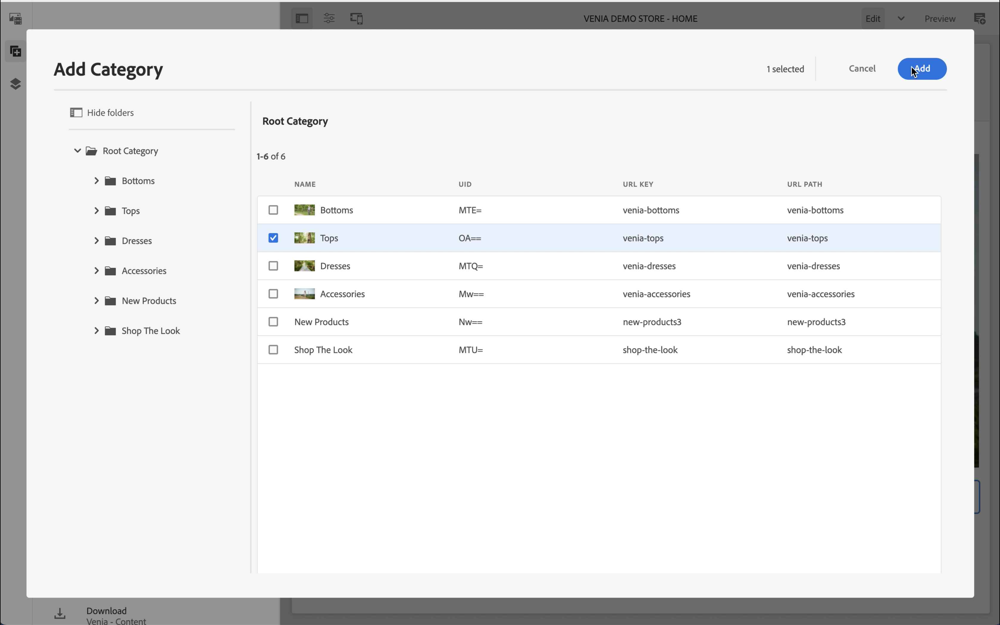
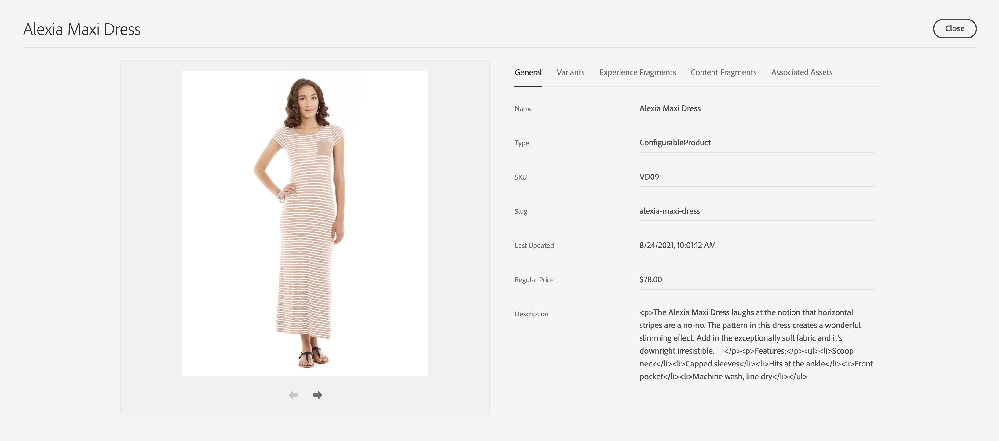
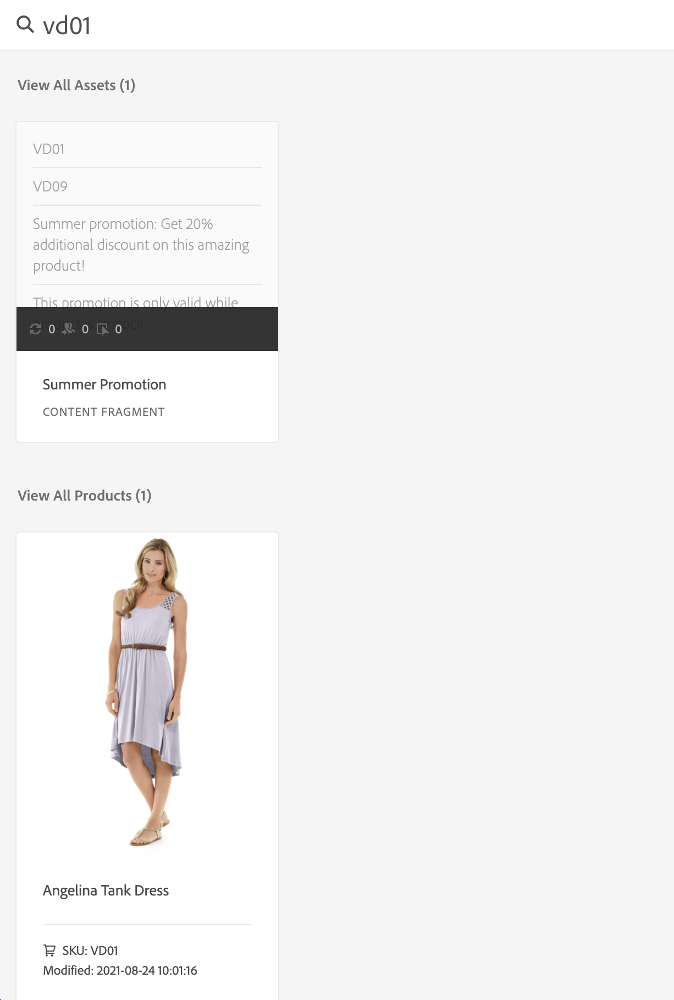

# Komma igång med AEM CIF-redigering {#getting-started}

Lär dig mer om AEM CIF Authoring.

## Story hittills {#story-so-far}

I det föregående dokumentet om den här AEM innehålls- och handelsresan [Läs om AEM innehåll och handel](/help/commerce-cloud/introduction.md)lärde ni er den grundläggande teorin om vad ett headless CMS är och ni bör nu förstå de grundläggande begreppen AEM innehåll och handel.

Den här artikeln bygger på dessa grunder.

## Syfte {#objective}

Det här dokumentet hjälper dig att förstå hur du använder CIF för innehåll- och handelsspecifik redigering. När du har läst bör du:

* Förstå begreppen för CIF-redigering med den universella redigeraren
* Få åtkomst till produktkatalogdata i AEM med produkt- och kategoriväljare
* Åtkomst till innehåll och e-handelsdata via produktcockpit och AEM Omnisearch

## CIF-redigering i den universella redigeraren {#cif-authoring}

CIF utökar den universella redigeraren med funktioner för att komma åt realtidsdata utan att lämna sammanhanget:

Öppna sidopanelen och välj Produkter i listrutan.

Du kan bläddra i produktkatalogen eller använda textsökningsfältet för att hitta produkter.

Produkter kan släppas på komponenter som stöder produktdroppar (t.ex. produktteaser, produktkarusell) direkt på sidan, vilket automatiskt skapar en produktteaser.

## Produkt- och kategoriväljare {#pickers}

Om produkt- och kategoridata krävs i e-handelskomponenter eller AEM dialogrutor kan AEM använda väljare som är gränssnittselement för att söka och välja produktkatalogdata på ett enkelt sätt.

### Produktväljare

Om du klickar på mappikonen öppnas ett modalt användargränssnitt för väljare (t.ex. produktsuddgummi)

Du hittar produkterna antingen genom att bläddra i katalogstrukturen till vänster eller genom att söka. Fulltextsökning respekterar den valda kategorin och begränsar sökresultaten till den här kategorin.

Produkter med variationer markeras med en mappikon som du kan klicka på för att visa alla variationer.

### Kategoriväljaren

Fungerar som en produktväljare. Om du klickar på mappikonen öppnas ett modalt användargränssnitt för väljaren (till exempel en karusell kategori)

Bläddra i katalogstrukturen till vänster och markera kategorin.

## Product Cockpit {#cockpit}

Produkcockpiten är en central plats där man snabbt får tillgång till produktkatalogen med allt berikat innehåll. I en av de kommande modulerna får du lära dig att berika produktdata med innehåll. För närvarande fokuserar vi på att få tillgång till produktdata.

På huvudmenyn klickar du på E-handel för att visa en lista över alla bifogade produktkataloger.

Här visas en lista med alla produktkataloger för anslutning.

Produktkatalogen visar som standard alla första nivåkategorier med alla produkter. Om du klickar på en kategori öppnas den kategorin med alla relaterade produkter och underkategorier, inklusive deras produkter.

Du kan öppna produktegenskaperna genom att klicka på egenskapsikonen. Ikonen visas genom att du håller pekaren över en produktruta.

Alla produktegenskaper är skrivskyddade eftersom data läses in i realtid från den anslutna serverdelen. Du måste ändra produktegenskaper i det serverdelssystem som är arkivsystemet. Fliken **Varianter** visas endast om produkten har variationer. Om du klickar på fliken visas alla variationer med tillhörande attribut.

De återstående flikarna visar allt AEM som är kopplat till produkten. Vi kommer att diskutera dessa flikar i en av de kommande modulerna.

## AEM Omnisearch {#omnisearch}

Att använda Omnissearch är ett enkelt sätt att hitta AEM med hjälp av fulltextsökning. CIF utökar Omnissearch med fulltextsökning av produktkataloger med tillhörande AEM.

Omnissearch kommer att göra en fulltextsökning i e-handelsservern för att hitta alla relaterade produkter. Resultatet visas under **Visa alla produkter**. Omnissearch söker även efter AEM som är kopplad till den sökda produkten. Resultaten listas under respektive AEM. I det här exemplet är ett innehållsfragment relaterat till produkten.

## What&#39;s Next {#what-is-next}

Nu när du är klar med den här delen av resan bör du:

* Förstå begreppen för CIF-redigering med den universella redigeraren
* Så här kommer du åt produktkatalogen i AEM med produkt- och kategoriväljare
* Åtkomst till innehåll och e-handelsdata via produktcockpit och AEM Omnisearch

Bygg vidare på denna kunskap och fortsätt din resa genom att nästa gång du granskar dokumentet [Hantera sidor och mallar för produktkataloger](catalog-templates.md), där du får lära dig hur du bygger och anpassar din första produktkatalogupplevelse.

## Ytterligare resurser {#additional-resources}

Vi rekommenderar att du går vidare till nästa del av resan genom att granska dokumentet [Hantera sidor och mallar för produktkataloger](catalog-templates.md)är följande ytterligare, valfria resurser som gör en djupdykning i vissa koncept som nämns i det här dokumentet, men de behöver inte fortsätta på resan.

* [Konfigurera butiker och kataloger](/help/commerce-cloud/getting-started.md#catalog)
