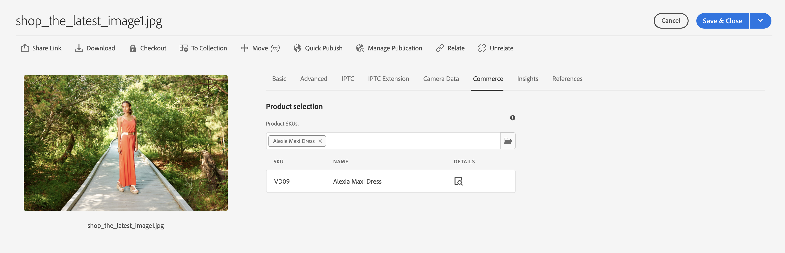
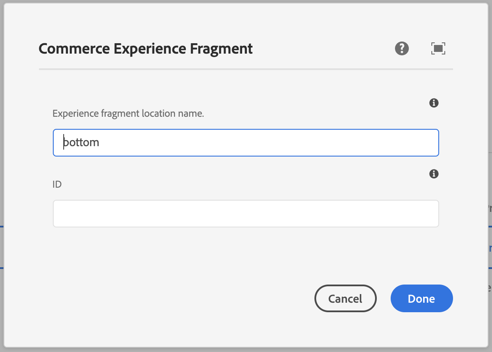
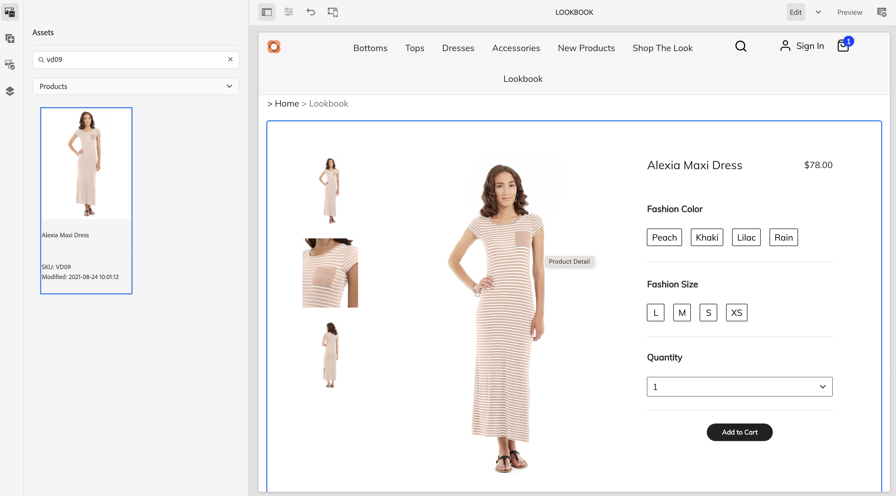
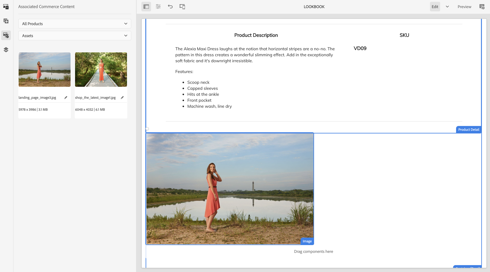

# Bygga produktupplevelser {#building-experiences}

Lär dig hantera produktupplevelser.

## Story hittills {#story-so-far}

I det föregående dokumentet om AEM- och handelsresan [Hantera testade produktkataloger](staged-catalog.md)lärde du dig att hantera upplevelser i mellanlagrade produktkataloger.

## Syfte {#objective}

Det här dokumentet hjälper er att förstå hur ni bygger produktinnehåll och upplevelser.

## Product Experience Management {#management}

Product Experience Management är ett område där man kan dekorera produktdata (som ägs av en PIM- eller e-handelslösning) med marknadsföringsmaterial i AEM. Dessa berikade produktdata med innehåll kan sedan användas i olika kanaler för att skapa en engagerande shoppingupplevelse.

I AEM kan du skapa olika typer av innehåll och länka dem till produktkatalogen. Associerat innehåll kan enkelt hittas och användas, vilket leder till hög produktivitet.

### Assets {#assets}

På en hög nivå finns det två typer av tillgångar som hör till produkterna: produkt och marknadsföring. Produktresurser hanteras vanligtvis av handlare och fokuserar på att visa produkten (främst framför en neutral bakgrund). Resurserna hanteras antingen i e-handelslösningen eller i AEM Assets (med en Assets-integrering till handels-/pim-lösningen).

Marknadsföringsresurser är kopplade till marknadsföring och användning av produkten som vanligtvis ägs av marknadsföringen. Det kan till exempel vara olika produkter (&quot;gå till väga som det ser ut&quot;), i en viss kontext (&quot;utomhusfall&quot;) eller hur man gör-gör-PDF-filer. CIF är ett enkelt sätt att länka AEM resurser till produktkatalogobjekt.

Öppna resursegenskaperna och växla till **Handel** -fliken. På den här fliken kan du hantera associationen med produkter. Tabellen nedanför väljaren innehåller ytterligare information för de länkade objekten (endast synlig med en markering). Klicka på informationsikonen för att få en fullständig vy i produktcockpit. Om du vill associera ett nytt objekt klickar du på produktväljarikonen (mappikonen), markerar ett objekt och stänger väljaren.

### Experience Fragments {#experience-fragments}

Upplevelsefragment är ett bra sätt att skapa återanvändbart eller individuellt produktinnehåll i stor skala. Associationen fungerar på liknande sätt som en tillgång. Öppna egenskaper och växla till **Handel** -fliken. På den här fliken kan du hantera associationen med produkter och kategorier. Tabellerna under väljarna innehåller ytterligare information om de länkade objekten (visas bara med en markering). Klicka på informationsikonen för att få en fullständig vy i produktcockpit. Om du vill associera ett nytt objekt klickar du på produktväljarikonen (mappikonen), markerar ett objekt och stänger väljaren.

### Innehållsfragment {#content-fragments}

Innehållsfragment är den bästa innehållstypen för alla typer av strukturerat innehåll. Detta kan användas för att utöka externa produktdata med ytterligare marknadsföringsdata eller för att skapa innehåll utan rubrik. Kopplingen mellan ett innehållsfragment och ett produktkatalogobjekt sker via produkt- eller kategorireferenstyperna i modellredigeraren för innehållsfragment. Dra och släpp rätt referenstyp på modellen och konfigurera fältet. De här typerna har stöd för en eller flera markeringar.

Om du skapar ett nytt innehållsfragment baserat på den här modellen är det enkelt att välja rätt objekt med hjälp av respektive väljare med hjälp av de här referenstyperna.

### Product Cockpit {#product-cockpit}

Vi har introducerat produktcockpit (eller konsol) i en av de tidigare modulerna. cockpiten är ett enkelt sätt att inte bara bläddra i produktkatalogen utan också att se allt tillhörande AEM innehåll på ett och samma ställe. Gå till produktkonsolen och öppna egenskaperna för en produkt som har associerat innehåll. Växla till respektive flik för att se det associerade innehållet.

Om du klickar på åtgärdsikonen öppnas den delen av innehållet på en ny webbläsarflik.

## Förbättrar enskilda produkt- och kategorisidor {#enrich}

I de föregående modulerna har du lärt dig hur du arbetar med flera produktkatalogmallar. Flera mallar är ett bra sätt att skapa olika mallar, men behövs inte i många fall. I många fall kan samma mall användas tillsammans med platshållare för enstaka innehåll. CIF har stöd för platshållare för innehållsfragment och Experience Fragments.

Låt oss börja med Experience Fragment-platshållaren. Öppna en produktmall i AEM. Dra och släpp **Commerce Experience Fragment** -komponenten i mallen och sedan öppnar du dialogrutan config.

Öppna komponentens dialogruta och ange ett namn för platshållaren. Platshållarnamn krävs och du kan lägga till så många platshållare som du behöver.

Öppna den Experience Fragment du har kopplat till en produkt i föregående steg. Öppna egenskaper och växla till fliken E-handel. Ange samma platshållarnamn under **Platshållarplats för katalog**.

Dra och släpp **Commerce Content Fragment** -komponenten i mallen och öppna konfigurationsdialogrutan.

Den här dialogrutan återanvänder dialogrutan för kärnkomponentinnehållsfragment. Mer information finns under ytterligare resurser. Den enda skillnaden är **Länkelement** som konfigurerar identifierarfältet (produkt-SKU eller kategori-UID) i modellen för innehållsfragment.

Förhandsgranska nu en produktsida som antingen har ett associerat innehållsfragment och/eller Experience Fragment. När AEM återger en sida görs en sökning efter varje platshållare baserat på typ (Innehåll eller Experience Fragment), identifierare och platshållarnamn för Experience Fragments. AEM använder en URL-matchare för att hämta identifieraren (SKU för produkter, UID för kategorier). Om en upplevelse eller ett innehållsfragment returneras återges det på platshållarplatsen, i annat fall ignoreras platshållaren.

## Gör innehåll köpbart {#making-shoppable}

Det går också att göra en vanlig AEM att handla genom att lägga till handelskomponenter. Skapa en ny innehållssida i AEM och öppna den tomma sidan i redigeraren.

Först drar och släpper du en produktdetaljkomponent på sidan. Gå sedan till sidofältet Resurser, byt till produkter och välj en produkt. Dra och släpp produkten på produktkomponenten. Då visas en vanlig produktkomponent på en innehållssida.

Om du har skapat associerat innehåll för den produkten växlar du i sidofältet Resurser till **Associerat Commerce-innehåll**. På den här fliken visas allt AEM innehåll som är kopplat till den här produkten. På så sätt kan du nu snabbt försköna sidorna med allt tillhörande innehåll.

## Slut på resan? {#end-of-journey}

Grattis! Du har slutfört AEM för innehåll och e-handelsutvecklare! Nu bör du:

* förstå hur du kan koppla AEM innehåll till produktkatalogobjekt
* använda platshållare för att berika produkt- och kategorisidor individuellt
* kunna göra innehåll till ett köpbart och använda fliken för tillhörande innehåll

Nu är ni redo att hantera produktupplevelser med hjälp AEM innehåll och handel. AEM Innehåll och handel har dock många ytterligare alternativ. Se vilka ytterligare resurser som finns i [Avsnittet Ytterligare resurser](#additional-resources) om du vill veta mer om de funktioner du såg under den här resan.

## Ytterligare resurser {#additional-resources}

* [Redigering av handelsupplevelser](/help/commerce-cloud/authoring/authoring-commerce-experiences.md)
* [Product Cockpit](/help/commerce-cloud/authoring/product-cockpit.md)
* [Innehållsfragmentkomponent](https://experienceleague.adobe.com/docs/experience-manager-core-components/using/components/content-fragment-component.html?lang=en)
