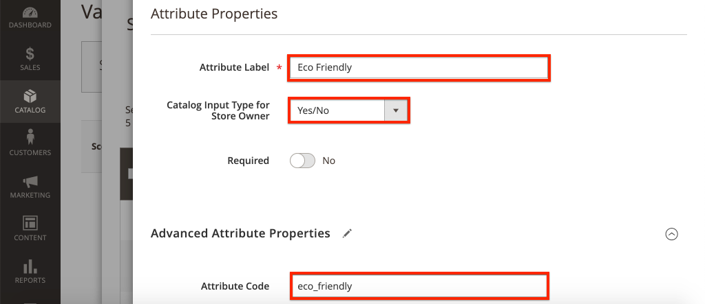

# Anpassa AEM CIF-kärnkomponenter {#customize-cif-components}

CIF Venia Project](https://github.com/adobe/aem-cif-guides-venia) är en referenskodbas för att använda [CIF Core Components](https://github.com/adobe/aem-core-cif-components). [ I den här självstudiekursen utökar du [Product Teaser](https://github.com/adobe/aem-core-cif-components/tree/master/ui.apps/src/main/content/jcr_root/apps/core/cif/components/commerce/productteaser/v1/productteaser)-komponenten ytterligare för att visa ett anpassat attribut från Magento. Du får också lära dig mer om GraphQL-integreringen mellan AEM och Magento och de tilläggskopplingar som finns i CIF Core Components.

>[!TIP]
>
> Använd [AEM Project Archetype](https://github.com/adobe/aem-project-archetype) när du startar en egen handelsimplementering.

## Vad du ska bygga

Varumärket Venia började nyligen tillverka vissa produkter med hjälp av hållbara material och företaget skulle vilja visa ett **miljövänligt**-märke som en del av Product Teaser. Ett nytt anpassat attribut skapas i Magento för att ange om en produkt använder **miljövänligt**-material. Det här anpassade attributet läggs sedan till som en del av GraphQL-frågan och visas i Product Teaser för angivna produkter.


## Förutsättningar {#prerequisites}

Det krävs en lokal utvecklingsmiljö för att slutföra den här självstudiekursen. Detta inkluderar en instans av AEM som körs och som är konfigurerad och ansluten till en Magento-instans. Granska kraven och stegen för [hur du konfigurerar en lokal utveckling med AEM som Cloud Service-SDK](../develop.md). Om du vill följa självstudiekursen fullständigt måste du ha behörighet att lägga till [attribut till en produkt](https://docs.magento.com/user-guide/catalog/product-attributes-add.html) i Magento.

Du behöver också GraphQL IDE, t.ex. [GraphiQL](https://github.com/graphql/graphiql) eller ett webbläsartillägg för att köra kodexempel och självstudiekurser. Om du installerar ett webbläsartillägg måste du se till att det går att ange begäranrubriker. På Google Chrome är [Altair GraphQL Client](https://chrome.google.com/webstore/detail/altair-graphql-client/flnheeellpciglgpaodhkhmapeljopja) ett tillägg som kan utföra jobbet.

## Klona Venieprojektet {#clone-venia-project}

Vi klonar [Veniaprojektet](https://github.com/adobe/aem-cif-guides-venia) och åsidosätter sedan standardformaten.

>[!NOTE]
>
> **Du kan använda ett befintligt projekt**  (baserat på den AEM projektarkitekturen med CIF inkluderat) och hoppa över det här avsnittet.

1. Kör följande Git-kommando för att klona projektet:

   ```shell
   $ git clone git@github.com:adobe/aem-cif-guides-venia.git
   ```

1. Bygg och distribuera projektet till en lokal instans av AEM:

   ```shell
   $ cd aem-cif-guides-venia/
   $ mvn clean install -PautoInstallPackage,cloud
   ```

1. Lägg till nödvändiga OSGi-konfigurationer för att ansluta AEM till en Magento-instans eller lägga till konfigurationerna i det nyskapade projektet.

1. Nu bör du ha en fungerande version av en storefront som är ansluten till en Magento-instans. Gå till sidan `US` > `Home` på: [http://localhost:4502/editor.html/content/venia/us/en.html](http://localhost:4502/editor.html/content/venia/us/en.html).

   Du ser att butiken för närvarande använder temat Venia. När du expanderar huvudmenyn för butiken bör du se olika kategorier som anger att anslutningen Magento fungerar.

   

## Skapa Product Teaser {#author-product-teaser}

Product Teaser Component kommer att byggas ut genom hela kursen. Som ett första steg lägger du till en ny instans av Product Teaser på startsidan för att förstå baslinjefunktionerna.

1. Navigera till webbplatsens **hemsida**: [http://localhost:4502/editor.html/content/acme/us/en.html](http://localhost:4502/editor.html/content/acme/us/en.html)

2. Infoga en ny **Product Teaser**-komponent i sidans huvudlayoutbehållare.

   

3. Expandera sidopanelen (om den inte redan är aktiverad) och växla listrutan för att hitta resurser till **Produkter**. Här visas en lista över tillgängliga produkter från en ansluten Magento-instans. Välj en produkt och **dra+släpp** den på **Product Teaser**-komponenten på sidan.

   

   >[!NOTE]
   >
   > Observera att du även kan konfigurera den visade produkten genom att konfigurera komponenten med hjälp av dialogrutan (klicka på ikonen _skiftnyckel_).

4. Du bör nu se en produkt som visas av Product Teaser. Produktens namn och produktens pris är standardattribut som visas.

   

## Lägg till ett anpassat attribut i Magento {#add-custom-attribute}

De produkter och produktdata som visas i AEM lagras i Magento. Lägg sedan till ett nytt attribut för **Eco Friendly** som en del av produktattributuppsättningen med hjälp av användargränssnittet i Magento.

>[!TIP]
>
> Har du redan ett anpassat **Yes/No**-attribut som en del av produktattributuppsättningen? Du kan använda den och hoppa över det här avsnittet.

1. Logga in på din Magento-instans.
1. Navigera till **Katalog** > **Produkter**.
1. Uppdatera sökfiltret för att hitta **Konfigurerbar produkt** som användes när den lades till i Teaser-komponenten i föregående övning. Öppna produkten i redigeringsläge.

   

1. I produktvyn klickar du på **Lägg till attribut** > **Skapa nytt attribut**.
1. Fyll i formuläret **Nytt attribut** med följande värden (lämna standardinställningarna för andra värden)

   | Fältuppsättning | Fältetikett | Värde |
   | ----------------------------- | ------------------ | ---------------- |
   | Attributegenskaper | Attributetikett | **Miljövänlig** |
   | Attributegenskaper | Indatatyp för katalog | **Ja/Nej** |
   | Avancerade attributegenskaper | Attributkod | **miljövänlig** |

   

   Klicka på **Spara attribut** när du är klar.

1. Bläddra till produktens nederkant och expandera rubriken **Attribut**. Det nya fältet **Eco Friendly** ska visas. Växla till **Ja**.

   

   **** Spara ändringarna i produkten.

   >[!TIP]
   >
   > Mer information om hur du hanterar [produktattribut finns i användarhandboken för Magento](https://docs.magento.com/user-guide/catalog/attribute-best-practices.html).

1. Navigera till **System** > **Verktyg** > **Cachehantering**. Eftersom en uppdatering av dataschemat har gjorts måste vissa cachetyper i Magento ogiltigförklaras.
1. Markera kryssrutan bredvid **Konfiguration** och skicka cachetypen för **Uppdatera**

   

   >[!TIP]
   >
   > Mer information om [Cache Management finns i användarhandboken för Magento](https://docs.magento.com/user-guide/system/cache-management.html).

## Använd en GraphQL IDE för att verifiera attributet {#use-graphql-ide}

Innan du hoppar till AEM kod är det praktiskt att utforska [Magento GraphQL](https://devdocs.magento.com/guides/v2.4/graphql/) med en GraphQL-utvecklingsmiljö. Integreringen med AEM i Magento görs huvudsakligen via en serie GraphQL-frågor. Att förstå och ändra GraphQL-frågor är ett av de viktigaste sätten att utöka CIF Core-komponenterna.

Använd sedan en GraphQL IDE för att verifiera att attributet `eco_friendly` har lagts till i produktattributuppsättningen. Skärmbilder i den här självstudien använder [Altair GraphQL Client](https://chrome.google.com/webstore/detail/altair-graphql-client/flnheeellpciglgpaodhkhmapeljopja).

1. Öppna GraphQL IDE och ange URL:en `http://<magento-server>/graphql` i URL-fältet för IDE eller tillägget.
2. Lägg till följande [produktfråga](https://devdocs.magento.com/guides/v2.4/graphql/queries/products.html) där `YOUR_SKU` är **SKU** för produkten som användes i föregående övning:

   ```json
     {
       products(
       filter: { sku: { eq: "YOUR_SKU" } }
       ) {
           items {
           name
           sku
           eco_friendly
           }
       }
   }
   ```

3. Kör frågan så får du ett svar som följande:

   ```json
   {
     "data": {
       "products": {
         "items": [
           {
             "name": "Valeria Two-Layer Tank",
             "sku": "VT11",
             "eco_friendly": 1
           }
         ]
       }
     }
   }
   ```

   

   Observera att värdet för **Yes** är heltalet **1**. Detta är användbart när vi skriver GraphQL-frågan i Java.

   >[!TIP]
   >
   > Mer detaljerad dokumentation om [Magento GraphQL finns här](https://devdocs.magento.com/guides/v2.4/graphql/index.html).

## Uppdatera Sling-modellen för Product Teaser {#updating-sling-model-product-teaser}

Därefter ska vi utöka produktTeaser affärslogik genom att implementera en Sling Model. [Sling Models](https://sling.apache.org/documentation/bundles/models.html) är anteckningsdrivna &quot;POJOs&quot; (Plain Old Java Objects) som implementerar någon av de affärslogik som komponenten behöver. Sling-modeller används tillsammans med HTML-skript som en del av komponenten. Vi följer delegeringsmönstret [för Sling Models](https://github.com/adobe/aem-core-wcm-components/wiki/Delegation-Pattern-for-Sling-Models) så att vi bara kan utöka delar av den befintliga Product Teaser-modellen.

Sling Models implementeras som Java och finns i **core**-modulen för det genererade projektet.

Använd [den utvecklingsmiljö du väljer](https://experienceleague.adobe.com/docs/experience-manager-learn/cloud-service/local-development-environment-set-up/development-tools.html#set-up-the-development-ide) för att importera Venia-projektet. De skärmbilder som används är från [Visual Studio Code IDE](https://experienceleague.adobe.com/docs/experience-manager-learn/cloud-service/local-development-environment-set-up/development-tools.html#microsoft-visual-studio-code).

1. I din utvecklingsmiljö navigerar du under **core**-modulen till: `core/src/main/java/com/venia/core/models/commerce/MyProductTeaser.java`.

   

   `MyProductTeaser.java` är ett Java-gränssnitt som utökar CIF  [](https://github.com/adobe/aem-core-cif-components/blob/master/bundles/core/src/main/java/com/adobe/cq/commerce/core/components/models/productteaser/ProductTeaser.java) ProductTeaserinterface.

   En ny metod har redan lagts till med namnet `isShowBadge()` för att visa ett märke om produkten betraktas som&quot;ny&quot;.

1. Lägg till en ny metod, `isEcoFriendly()`, i gränssnittet:

   ```java
   @ProviderType
   public interface MyProductTeaser extends ProductTeaser {
       // Extend the existing interface with the additional properties which you
       // want to expose to the HTL template.
       public Boolean isShowBadge();
   
       public Boolean isEcoFriendly();
   }
   ```

   Detta är en ny metod som vi kommer att införa för att kapsla in logiken som anger om produkten har attributet `eco_friendly` inställt på **Yes** eller **No**.

1. Kontrollera sedan `MyProductTeaserImpl.java` på `core/src/main/java/com/venia/core/models/commerce/MyProductTeaserImpl.java`.

   Med [delegeringsmönstret för Sling Models](https://github.com/adobe/aem-core-wcm-components/wiki/Delegation-Pattern-for-Sling-Models) kan `MyProductTeaserImpl` referera till `ProductTeaser`-modellen via egenskapen `sling:resourceSuperType`:

   ```java
   @Self
   @Via(type = ResourceSuperType.class)
   private ProductTeaser productTeaser;
   ```

   För alla metoder som vi inte vill åsidosätta eller ändra kan vi bara returnera värdet som `ProductTeaser` returnerar. Till exempel:

   ```java
   @Override
   public String getImage() {
       return productTeaser.getImage();
   }
   ```

   Detta minimerar mängden Java-kod som en implementering behöver skriva.

1. En av de extra tilläggspunkterna AEM CIF Core Components är `AbstractProductRetriever` som ger åtkomst till specifika produktattribut. Inspect metoden `initModel()`:

   ```java
   import javax.annotation.PostConstruct;
   ...
   @Model(adaptables = SlingHttpServletRequest.class, adapters = MyProductTeaser.class, resourceType = MyProductTeaserImpl.RESOURCE_TYPE)
   public class MyProductTeaserImpl implements MyProductTeaser {
       ...
       private AbstractProductRetriever productRetriever;
   
       /* add this method to intialize the proudctRetriever */
       @PostConstruct
       public void initModel() {
           productRetriever = productTeaser.getProductRetriever();
   
           if (productRetriever != null) {
               productRetriever.extendProductQueryWith(p -> p.createdAt());
           }
   
       }
   ...
   ```

   `@PostConstruct`-anteckningen ser till att den här metoden anropas så snart som Sling-modellen initieras.

   Observera att produktfrågan för GraphQL redan har utökats med metoden `extendProductQueryWith` för att hämta det ytterligare `created_at`-attributet. Det här attributet används senare som en del av metoden `isShowBadge()`.

1. Uppdatera GraphQL-frågan så att den innehåller attributet `eco_friendly` i den partiella frågan:

   ```java
   //MyProductTeaserImpl.java
   
   private static final String ECO_FRIENDLY_ATTRIBUTE = "eco_friendly";
   
   @PostConstruct
   public void initModel() {
       productRetriever = productTeaser.getProductRetriever();
   
       if (productRetriever != null) {
           productRetriever.extendProductQueryWith(p ->
                productRetriever.extendProductQueryWith(p -> p
                   .createdAt()
                   .addCustomSimpleField(ECO_FRIENDLY_ATTRIBUTE)
               );
           );
       }
   }
   ```

   Att lägga till i metoden `extendProductQueryWith` är ett kraftfullt sätt att se till att fler produktattribut är tillgängliga för resten av modellen. Det minimerar även antalet frågor som körs.

   I ovanstående kod används `addCustomSimpleField` för att hämta attributet `eco_friendly`. Detta visar hur du kan söka efter anpassade attribut som ingår i Magento-schemat.

   >[!NOTE]
   >
   > Metoden `createdAt()` har faktiskt implementerats som en del av [produktgränssnittet](https://github.com/adobe/commerce-cif-magento-graphql/blob/master/src/main/java/com/adobe/cq/commerce/magento/graphql/ProductInterface.java). De flesta av de vanligaste schemaattributen har implementerats, så använd bara `addCustomSimpleField` för verkligt anpassade attribut.

1. Lägg till en loggare som kan hjälpa dig att felsöka Java-koden:

   ```java
   import org.slf4j.Logger;
   import org.slf4j.LoggerFactory;
   ...
   @Model(adaptables = SlingHttpServletRequest.class, adapters = MyProductTeaser.class, resourceType = MyProductTeaserImpl.RESOURCE_TYPE)
   public class MyProductTeaserImpl implements MyProductTeaser {
   
   private static final Logger LOGGER = LoggerFactory.getLogger(MyProductTeaserImpl.class);
   ```

1. Implementera sedan metoden `isEcoFriendly()`:

   ```java
   @Override
   public Boolean isEcoFriendly() {
   
       Integer ecoFriendlyValue;
       try {
           ecoFriendlyValue = productRetriever.fetchProduct().getAsInteger(ECO_FRIENDLY_ATTRIBUTE);
           if(ecoFriendlyValue != null && ecoFriendlyValue.equals(Integer.valueOf(1))) {
               LOGGER.info("*** Product is Eco Friendly**");
               return true;
           }
       } catch (SchemaViolationError e) {
           LOGGER.error("Error retrieving eco friendly attribute");
       }
       LOGGER.info("*** Product is not Eco Friendly**");
       return false;
   }
   ```

   I ovanstående metod används `productRetriever` för att hämta produkten och metoden `getAsInteger()` används för att hämta värdet för attributet `eco_friendly`. Baserat på GraphQL-frågor som kördes tidigare vet vi att det förväntade värdet när attributet `eco_friendly` är inställt på **Yes** är ett heltal på **1**.

   Nu när delningsmodellen har uppdaterats måste komponentkoden uppdateras för att visa en indikator på **Eco Friendly** baserat på delningsmodellen.

## Anpassa koden för Product Teaser {#customize-markup-product-teaser}

Ett vanligt tillägg för AEM är att ändra den kod som genereras av komponenten. Detta görs genom att åsidosätta [HTML-skriptet](https://experienceleague.adobe.com/docs/experience-manager-htl/using/overview.html) som komponenten använder för att återge sin kod. HTML-mallspråk (HTL) är ett lättviktsmallspråk som används AEM komponenter för att dynamiskt återge kod baserat på redigerat innehåll, vilket gör att komponenterna kan återanvändas. Product Teaser kan till exempel återanvändas om och om igen för att visa olika produkter.

I det här fallet vill vi återge en banderoll ovanpå teaser för att ange att produkten är&quot;miljövänlig&quot; baserat på ett anpassat attribut. Designmönstret för att [anpassa markeringen](https://experienceleague.adobe.com/docs/experience-manager-core-components/using/developing/customizing.html#customizing-the-markup) för en komponent är i själva verket standard för alla AEM, inte bara för AEM CIF Core Components.

>[!NOTE]
>
> Om du anpassar en komponent med CIF-produkt- och kategoriväljare som denna Product Teaser eller CIF-sidkomponenten måste du ta med det nödvändiga `cif.shell.picker` klientlib för komponentdialogrutorna. Mer information finns i [Användning av CIF-produkt- och kategoriväljare](use-cif-pickers.md).

1. I den integrerade utvecklingsmiljön navigerar och expanderar du modulen `ui.apps` och expanderar mapphierarkin till: `ui.apps/src/main/content/jcr_root/apps/venia/components/commerce/productteaser` och kontrollera `.content.xml`-filen.

   

   ```xml
   <?xml version="1.0" encoding="UTF-8"?>
   <jcr:root xmlns:sling="http://sling.apache.org/jcr/sling/1.0" xmlns:cq="http://www.day.com/jcr/cq/1.0" xmlns:jcr="http://www.jcp.org/jcr/1.0"
       jcr:description="Product Teaser Component"
       jcr:primaryType="cq:Component"
       jcr:title="Product Teaser"
       sling:resourceSuperType="core/cif/components/commerce/productteaser/v1/productteaser"
       componentGroup="Venia - Commerce"/>
   ```

   Ovanför finns komponentdefinitionen för Product Teaser Component i vårt projekt. Observera egenskapen `sling:resourceSuperType="core/cif/components/commerce/productteaser/v1/productteaser"`. Det här är ett exempel på hur du skapar en [Proxy-komponent](https://experienceleague.adobe.com/docs/experience-manager-core-components/using/get-started/using.html#create-proxy-components). I stället för att kopiera och klistra in alla Product Teaser HTML-skript från AEM CIF Core Components kan vi använda `sling:resourceSuperType` för att ärva alla funktioner.

1. Öppna filen `productteaser.html`. Det här är en kopia av `productteaser.html`-filen från [CIF Product Teaser](https://github.com/adobe/aem-core-cif-components/blob/master/ui.apps/src/main/content/jcr_root/apps/core/cif/components/commerce/productteaser/v1/productteaser/productteaser.html)

   ```html
   <!--/* productteaser.html */-->
   <sly
     data-sly-use.product="com.venia.core.models.commerce.MyProductTeaser"
     data-sly-use.templates="core/wcm/components/commons/v1/templates.html"
     data-sly-use.actionsTpl="actions.html"
     data-sly-test.isConfigured="${properties.selection}"
     data-sly-test.hasProduct="${product.url}"
   ></sly>
   ```

   Observera att Sling Model för `MyProductTeaser` används och tilldelas variabeln `product`.

1. Ändra `productteaser.html` om du vill anropa den `isEcoFriendly`-metod som implementerades i föregående övning:

   ```html
   ...
   <div
     data-sly-test="${isConfigured && hasProduct}"
     class="item__root"
     data-cmp-is="productteaser"
     data-virtual="${product.virtualProduct}"
   >
     <div data-sly-test="${product.showBadge}" class="item__badge">
       <span>${properties.text || 'New'}</span>
     </div>
     <!--/* Insert call to Eco Friendly here */-->
     <div data-sly-test="${product.ecoFriendly}" class="item__eco">
       <span>Eco Friendly</span>
     </div>
     ...
   </div>
   ```

   När du anropar en Sling Model-metod i HTML tas delen `get` och `is` bort och den första bokstaven sänks. `isShowBadge()` blir `.showBadge` och `isEcoFriendly` blir `.ecoFriendly`. Baserat på det booleska värdet som returneras från `.isEcoFriendly()` avgör om `<span>Eco Friendly</span>` visas.

   Mer information om `data-sly-test` och andra [HTML-blocksatser finns här](https://experienceleague.adobe.com/docs/experience-manager-htl/using/htl/block-statements.html#test).

1. Spara ändringarna och distribuera uppdateringarna till AEM med dina Maven-kunskaper från en kommandoradsterminal:

   ```shell
   $ cd aem-cif-guides-venia/
   $ mvn clean install -PautoInstallPackage,cloud
   ```

1. Öppna ett nytt webbläsarfönster och navigera till AEM och **OSGi-konsolen** > **Status** > **Sling Models**: [http://localhost:4502/system/console/status-slingmodels](http://localhost:4502/system/console/status-slingmodels)

1. Sök efter `MyProductTeaserImpl` och du bör se en rad som följande:

   ```plain
   com.venia.core.models.commerce.MyProductTeaserImpl - venia/components/commerce/productteaser
   ```

   Detta indikerar att Sling-modellen har distribuerats korrekt och mappats till rätt komponent.

1. Uppdatera till startsidan för **Venia** på [http://localhost:4502/editor.html/content/venia/us/en.html](http://localhost:4502/editor.html/content/venia/us/en.html) där Product Teaser har lagts till.

   

   Om produkten har attributet `eco_friendly` inställt på **Yes** bör du se texten&quot;Eco Friendly&quot; på sidan. Försök att byta till olika produkter för att se hur beteendet förändras.

1. Öppna sedan AEM `error.log` för att se de loggsatser som vi har lagt till. `error.log` finns på `<AEM SDK Install Location>/crx-quickstart/logs/error.log`.

   Sök i AEM loggar för att se de loggsatser som lagts till i Sling-modellen:

   ```plain
   2020-08-28 12:57:03.114 INFO [com.venia.core.models.commerce.MyProductTeaserImpl] *** Product is Eco Friendly**
   ...
   2020-08-28 13:01:00.271 INFO [com.venia.core.models.commerce.MyProductTeaserImpl] *** Product is not Eco Friendly**
   ...
   ```

   >[!CAUTION]
   >
   > Du kan också se vissa stackspår om den produkt som används i teaser inte har attributet `eco_friendly` som en del av dess attributuppsättning.

## Lägg till stilar för etiketten Eco Friendly Badge {#add-styles}

I det här läget fungerar logiken för när märket **Eco Friendly** ska visas, men den oformaterade texten kan använda vissa format. Lägg sedan till en ikon och format i modulen `ui.frontend` för att slutföra implementeringen.

1. Hämta filen [eco_friendly.svg](../assets/customize-cif-components/eco_friendly.svg). Detta används som **Eco Friendly**-märke.
1. Återgå till IDE och navigera till mappen `ui.frontend`.
1. Lägg till filen `eco_friendly.svg` i mappen `ui.frontend/src/main/resources/images`:

   

1. Öppna filen `productteaser.scss` på `ui.frontend/src/main/styles/commerce/_productteaser.scss`.
1. Lägg till följande Sass-regler i klassen `.productteaser`:

   ```scss
   .productteaser {
       ...
       .item__eco {
           width: 60px;
           height: 60px;
           left: 0px;
           overflow: hidden;
           position: absolute;
           padding: 5px;
   
       span {
           display: block;
           position: absolute;
           width: 45px;
           height: 45px;
           text-indent: -9999px;
           background: no-repeat center center url('../resources/images/eco_friendly.svg');
           }
       }
   ...
   }
   ```

   >[!NOTE]
   >
   > Läs [Formatera CIF Core Components](./style-cif-component.md) om du vill ha mer information om frontend-arbetsflöden.

1. Spara ändringarna och distribuera uppdateringarna till AEM med dina Maven-kunskaper från en kommandoradsterminal:

   ```shell
   $ cd aem-cif-guides-venia/
   $ mvn clean install -PautoInstallPackage,cloud
   ```

1. Uppdatera till startsidan för **Venia** på [http://localhost:4502/editor.html/content/venia/us/en.html](http://localhost:4502/editor.html/content/venia/us/en.html) där Product Teaser har lagts till.

   

## Grattis {#congratulations}

Du har just skräddarsytt din första AEM CIF-komponent! Hämta [de färdiga lösningsfilerna här](../assets/customize-cif-components/customize-cif-component-SOLUTION_FILES.zip).

## Bonus Challenge {#bonus-challenge}

Granska funktionaliteten i **märket New** som redan har implementerats i Product Teaser. Försök att lägga till ytterligare en kryssruta där författare kan styra när **etiketten** ska visas. Du måste uppdatera komponentdialogrutan på `ui.apps/src/main/content/jcr_root/apps/venia/components/commerce/productteaser/_cq_dialog/.content.xml`.


## Ytterligare resurser {#additional-resources}

- [AEM](https://experienceleague.adobe.com/docs/experience-manager-core-components/using/developing/archetype/overview.html)
- [AEM CIF-kärnkomponenter](https://github.com/adobe/aem-core-cif-components)
- [Anpassa AEM CIF-kärnkomponenter](https://github.com/adobe/aem-core-cif-components/wiki/Customizing-CIF-Core-Components)
- [Anpassa kärnkomponenter](https://experienceleague.adobe.com/docs/experience-manager-core-components/using/developing/customizing.html)
- [Komma igång med AEM Sites](https://experienceleague.adobe.com/docs/experience-manager-learn/getting-started-wknd-tutorial-develop/overview.html)
- [Användning av CIF-produkt- och kategoriväljare](use-cif-pickers.md)
