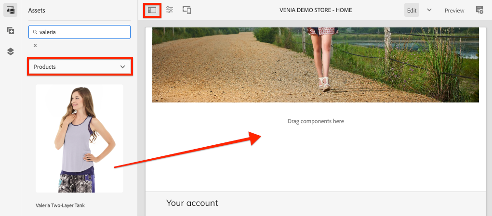
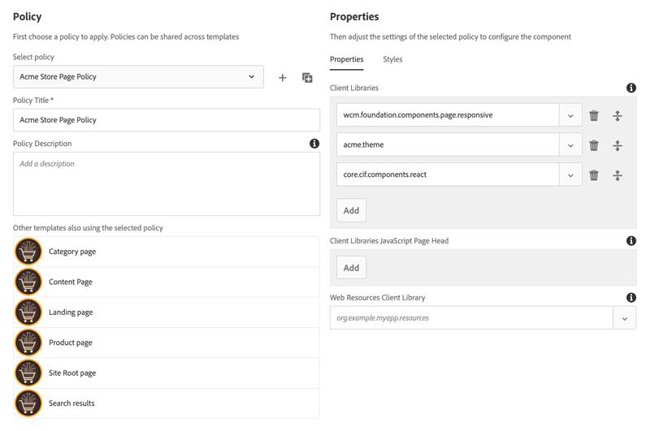
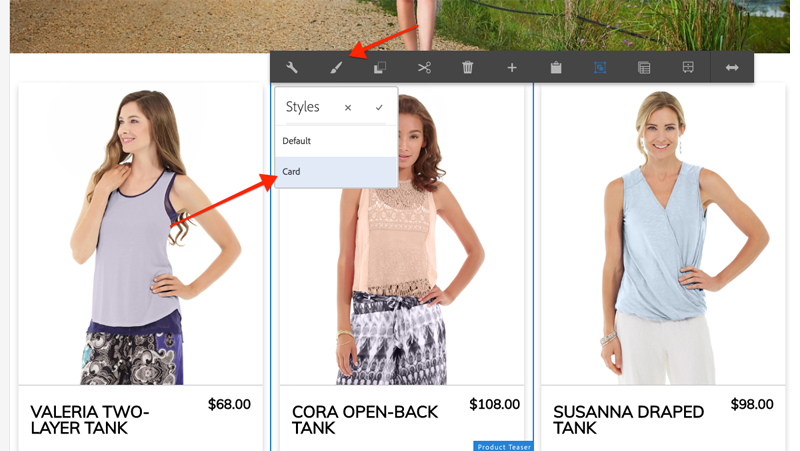

# Stil AEM CIF-kärnkomponenter {#style-aem-cif-core-components}

CIF Venia Project](https://github.com/adobe/aem-cif-guides-venia) är en referenskodbas för att använda [CIF Core Components](https://github.com/adobe/aem-core-cif-components). [ I den här självstudiekursen kommer du att granska Venias referensprojekt och förstå hur CSS och JavaScript som används AEM CIF Core-komponenter är organiserade. Du skapar också ett nytt format med CSS för att uppdatera standardformatet för komponenten **Product Teaser**.

>[!TIP]
>
> Använd [AEM Project Archetype](https://github.com/adobe/aem-project-archetype) när du startar en egen handelsimplementering.

## Vad du ska bygga

I den här självstudiekursen kommer en ny stil att implementeras för Product Teaser-komponenten som liknar ett kort. Lektioner som du lär dig i självstudiekursen kan användas på andra CIF-kärnkomponenter.


## Förutsättningar {#prerequisites}

Det krävs en lokal utvecklingsmiljö för att slutföra den här självstudiekursen. Detta inkluderar en instans av AEM som körs och som är konfigurerad och ansluten till en Magento-instans. Granska kraven och stegen för [hur du konfigurerar en lokal utveckling med AEM som Cloud Service-SDK](../develop.md).

## Klona Venieprojektet {#clone-venia-project}

Vi klonar [Veniaprojektet](https://github.com/adobe/aem-cif-guides-venia) och åsidosätter sedan standardformaten.

>[!NOTE]
>
> **Du kan använda ett befintligt projekt**  (baserat på den AEM projektarkitekturen med CIF inkluderat) och hoppa över det här avsnittet.

1. Kör följande Git-kommando för att klona projektet:

   ```shell
   $ git clone git@github.com:adobe/aem-cif-guides-venia.git
   ```

1. Bygg och distribuera projektet till en lokal instans av AEM:

   ```shell
   $ cd aem-cif-guides-venia/
   $ mvn clean install -PautoInstallPackage,cloud
   ```

1. Lägg till nödvändiga OSGi-konfigurationer för att ansluta AEM till en Magento-instans eller lägga till konfigurationerna i det nyskapade projektet.

1. Nu bör du ha en fungerande version av en storefront som är ansluten till en Magento-instans. Gå till sidan `US` > `Home` på: [http://localhost:4502/editor.html/content/venia/us/en.html](http://localhost:4502/editor.html/content/venia/us/en.html).

   Du ser att butiken för närvarande använder temat Venia. När du expanderar huvudmenyn för butiken bör du se olika kategorier som anger att anslutningen Magento fungerar.

   

## Klientbibliotek och modulen ui.klienttend {#introduction-to-client-libraries}

CSS och JavaScript som ansvarar för att återge temat/formaten för butiken hanteras i AEM av ett [klientbibliotek](/help/implementing/developing/introduction/clientlibs.md) eller klientbibliotek för kort tid. Klientbibliotek erbjuder en mekanism för att ordna CSS och Javascript i ett projekts kod och sedan leverera på sidan.

Märkesspecifika format kan användas på AEM CIF Core-komponenter genom att lägga till och åsidosätta den CSS som hanteras av dessa klientbibliotek. Det är viktigt att förstå hur klientbibliotek är strukturerade och inkluderas på sidan.

[ui.front](https://experienceleague.adobe.com/docs/experience-manager-core-components/using/developing/archetype/uifrontend.html) är ett dedikerat [webbpack](https://webpack.js.org/)-projekt för att hantera alla frontendresurser för ett projekt. Detta gör att gränssnittsutvecklare kan använda valfritt antal språk och tekniker som [TypeScript](https://www.typescriptlang.org/), [Sass](https://sass-lang.com/) och mycket annat.

Modulen `ui.frontend` är också en Maven-modul och integrerad med det större projektet genom att använda en NPM-modul i [aem-clientlib-generator](https://github.com/wcm-io-frontend/aem-clientlib-generator). Under ett bygge kopierar `aem-clientlib-generator` de kompilerade CSS- och JavaScript-filerna till ett klientbibliotek i modulen `ui.apps`.


*Kompilerad CSS och Javascript kopieras från  `ui.frontend` modulen till  `ui.apps` modulen som ett klientbibliotek under ett Maven-bygge*

## Uppdatera Teaser Style {#ui-frontend-module}

Gör sedan en liten ändring i Teaser-formatet för att se hur modulen `ui.frontend` och klientbiblioteken fungerar. Använd [den utvecklingsmiljö du väljer](https://experienceleague.adobe.com/docs/experience-manager-learn/cloud-service/local-development-environment-set-up/development-tools.html#set-up-the-development-ide) för att importera Venia-projektet. De skärmbilder som används är från [Visual Studio Code IDE](https://experienceleague.adobe.com/docs/experience-manager-learn/cloud-service/local-development-environment-set-up/development-tools.html#microsoft-visual-studio-code).

1. Navigera och expandera modulen **ui.front** och expandera mapphierarkin till: `ui.frontend/src/main/styles/commerce`:

   

   Observera att det finns flera Sass-filer (`.scss`) under mappen. Det här är de Commerce-specifika formaten för var och en av Commerce-komponenterna.

1. Öppna filen `_productteaser.scss`.

1. Uppdatera `.item__image`-regeln och ändra kantlinjalen:

   ```scss
   .item__image {
       border: #ea00ff 8px solid; /* <-- modify this rule */
       display: block;
       grid-area: main;
       height: auto;
       opacity: 1;
       transition-duration: 512ms;
       transition-property: opacity, visibility;
       transition-timing-function: ease-out;
       visibility: visible;
       width: 100%;
   }
   ```

   Regeln ovan bör lägga till en mycket fet rosa ram i Product Teaser Component.

1. Öppna ett nytt terminalfönster och navigera till mappen `ui.frontend`:

   ```shell
   $ cd <project-location>/aem-cif-guides-venia/ui.frontend
   ```

1. Kör följande Maven-kommando:

   ```shell
   $ mvn clean install
   ...
   [INFO] ------------------------------------------------------------------------
   [INFO] BUILD SUCCESS
   [INFO] ------------------------------------------------------------------------
   [INFO] Total time:  29.497 s
   [INFO] Finished at: 2020-08-25T14:30:44-07:00
   [INFO] ------------------------------------------------------------------------
   ```

   Inspect terminalutdata. Du kommer att se att Maven-kommandot har kört flera NPM-skript, inklusive `npm run build`. Kommandot `npm run build` definieras i filen `package.json` och har effekten att kompilera webbpaketprojektet och utlösa genereringen av klientbiblioteket.

1. Inspect filen `ui.frontend/dist/clientlib-site/site.css`:

   

   Filen är den kompilerade och minimerade versionen av alla Sass-filer i projektet.

   >[!NOTE]
   >
   > Filer som detta ignoreras från källkontrollen eftersom de ska genereras under byggtiden.

1. Inspect filen `ui.frontend/clientlib.config.js`.

   ```js
   /* clientlib.config.js*/
   ...
   // Config for `aem-clientlib-generator`
   module.exports = {
       context: BUILD_DIR,
       clientLibRoot: CLIENTLIB_DIR,
       libs: [
           {
               ...libsBaseConfig,
               name: 'clientlib-site',
               categories: ['venia.site'],
               dependencies: ['venia.dependencies', 'aem-core-cif-react-components'],
               assets: {
   ...
   ```

   Detta är konfigurationsfilen för [aem-clientlib-generator](https://github.com/wcm-io-frontend/aem-clientlib-generator) och avgör var och hur kompilerad CSS och JavaScript ska omvandlas till ett AEM klientbibliotek.

1. Kontrollera filen i modulen `ui.apps`: `ui.apps/src/main/content/jcr_root/apps/venia/clientlibs/clientlib-site/css/site.css`:

   

   Detta är den kopierade `site.css`-filen till `ui.apps`-projektet. Den ingår nu i ett klientbibliotek med namnet `clientlib-site` och kategorin `venia.site`. När filen ingår i `ui.apps`-modulen kan den distribueras till AEM.

   >[!NOTE]
   >
   > Filer som detta ignoreras också i källkontrollen eftersom de ska genereras under byggtiden.

1. Kontrollera sedan de andra klientbiblioteken som genereras av projektet:

   

   Dessa klientbibliotek hanteras inte av modulen `ui.frontend`. I stället innehåller dessa klientbibliotek CSS- och JavaScript-beroenden från Adobe. Definitionen för dessa klientbibliotek finns i `.content.xml`-filen under varje mapp.

   **clientlib-base**  - Det här är ett tomt klientbibliotek som helt enkelt bäddar in nödvändiga beroenden från  [AEM Core Components](https://experienceleague.adobe.com/docs/experience-manager-core-components/using/introduction.html). Kategorin är `venia.base`.

   **clientlib-CIF**  - Det här är också ett tomt klientbibliotek som helt enkelt bäddar in nödvändiga beroenden från  [AEM CIF Core Components](https://github.com/adobe/aem-core-cif-components). Kategorin är `venia.cif`.

   **clientlib-grid**  - Detta inkluderar den CSS som behövs för att aktivera funktionen AEM responsivt stödraster. Om du använder det AEM stödrastret aktiveras [layoutläget](/help/sites-cloud/authoring/features/responsive-layout.md) i AEM och det ger innehållsförfattare möjlighet att ändra storlek på komponenter. Kategorin är `venia.grid` och är inbäddad i `venia.base`-biblioteket.

1. Inspect filerna `customheaderlibs.html` och `customfooterlibs.html` under `ui.apps/src/main/content/jcr_root/apps/venia/components/page`:

   

   Dessa skript innehåller **venia.base** och **venia.CIF** bibliotek som en del av alla sidor.

   >[!NOTE]
   >
   > Endast basbiblioteken är&quot;hårdkodade&quot; som en del av sidskripten. `venia.site` tas inte med i de här filerna utan inkluderas i sidmallen för större flexibilitet. Detta kommer att inspekteras senare.

1. Bygg och distribuera hela projektet till en lokal instans av AEM:

   ```shell
   $ cd aem-cif-guides-venia/
   $ mvn clean install -PautoInstallPackage,cloud
   ```

## Skapa en produkttekniker {#author-product-teaser}

Nu när koduppdateringarna har distribuerats lägger du till en ny instans av Product Teaser-komponenten på webbplatsens startsida med hjälp av AEM utvecklingsverktyg. På så sätt kan vi visa de uppdaterade formaten.

1. Öppna en ny flik i webbläsaren och gå till **startsidan** för webbplatsen: [http://localhost:4502/editor.html/content/venia/us/en.html](http://localhost:4502/editor.html/content/venia/us/en.html).

1. Expandera Resurssökaren (sidospåret) i läget **Redigera**. Växla resursfiltret till **Produkter**.

   

1. Dra och släpp en ny produkt på startsidan i huvudlayoutbehållaren:

   

   Du bör se att Product Teaser nu har en ljusrosa kantlinje baserat på CSS-regeländringen som skapades tidigare.

## Verifiera klientbibliotek på sidan {#verify-client-libraries}

Kontrollera sedan att klientbiblioteken finns med på sidan.

1. Navigera till webbplatsens **hemsida**: [http://localhost:4502/editor.html/content/venia/us/en.html](http://localhost:4502/editor.html/content/venia/us/en.html).

1. Välj menyn **Sidinformation** och klicka på **Visa som publicerad**:

   

   Sidan öppnas utan att någon av författarens javascript-skript AEM, som det skulle se ut på den publicerade webbplatsen. Observera att frågeparametern `?wcmmode=disabled` har lagts till på URL:en. När du utvecklar CSS och Javascript är det en god vana att använda den här parametern för att förenkla sidan utan att skriva ut något från AEM författare.

1. Visa sidkällan så bör du kunna identifiera flera klientbibliotek:

   ```html
   <!DOCTYPE html>
   <html lang="en-US">
   <head>
       ...
       <link rel="stylesheet" href="/etc.clientlibs/venia/clientlibs/clientlib-base.min.css" type="text/css">
       <link rel="stylesheet" href="/etc.clientlibs/venia/clientlibs/clientlib-site.min.css" type="text/css">
   </head>
   ...
       <script type="text/javascript" src="/etc.clientlibs/venia/clientlibs/clientlib-site.min.js"></script>
       <script type="text/javascript" src="/etc.clientlibs/core/wcm/components/commons/site/clientlibs/container.min.js"></script>
       <script type="text/javascript" src="/etc.clientlibs/venia/clientlibs/clientlib-base.min.js"></script>
   <script type="text/javascript" src="/etc.clientlibs/core/cif/clientlibs/common.min.js"></script>
   <script type="text/javascript" src="/etc.clientlibs/venia/clientlibs/clientlib-cif.min.js"></script>
   </body>
   </html>
   ```

   Klientbibliotek som levereras till sidan har prefixet `/etc.clientlibs` och hanteras via en [proxy](/help/implementing/developing/introduction/clientlibs.md) för att undvika att exponera något känsligt i `/apps` eller `/libs`.

   Obs! `venia/clientlibs/clientlib-site.min.css` och `venia/clientlibs/clientlib-site.min.js`. Detta är de kompilerade CSS- och JavaScript-filerna som härleds från modulen `ui.frontend`.

## Inkludering av klientbibliotek med sidmallar {#client-library-inclusion-pagetemplates}

Det finns flera alternativ för hur du inkluderar ett klientbibliotek. Kontrollera sedan hur det genererade projektet innehåller `clientlib-site`-biblioteken via [Sidmallar](/help/implementing/developing/components/templates.md).

1. Navigera till webbplatsens **hemsida** i AEM Editor: [http://localhost:4502/editor.html/content/venia/us/en.html](http://localhost:4502/editor.html/content/venia/us/en.html).

1. Välj menyn **Sidinformation** och klicka på **Redigera mall**:

   

   Då öppnas mallen **Startsida** som **startsidan** baseras på.

   >[!NOTE]
   >
   > Om du vill visa alla tillgängliga mallar från AEM startskärmen går du till **Verktyg** > **Allmänt** > **Mallar**.

1. I det övre vänstra hörnet väljer du ikonen **Sidinformation** och klickar på **Sidprofil**.

   

1. Då öppnas sidprincipen för mallen Landningssida:

   

   Till höger visas en lista över klientbibliotek **kategorier** som kommer att inkluderas på alla sidor som använder den här mallen.

   * `venia.dependencies` - Tillhandahåller eventuella leverantörsbibliotek som  `venia.site` är beroende av.
   * `venia.site` - Det här är kategorin  `clientlib-site` som  `ui.frontend` modulen genererar.

   Observera att andra mallar använder samma princip, **Innehållssida**, **Landningssida** osv.. Genom att återanvända samma policy kan vi se till att samma klientbibliotek inkluderas på alla sidor.

   Fördelen med att använda mallar och sidprofiler för att hantera inkludering av klientbibliotek är att du kan ändra principen per mall. Du kanske hanterar två olika varumärken inom samma AEM. Varje varumärke kommer att ha sin egen unika stil eller *tema*, men grundbiblioteken och koden kommer att vara desamma. Om du har ett större klientbibliotek som du bara vill visa på vissa sidor kan du skapa en unik sidprofil för just den mallen.

## Utveckling av lokala webbpaket {#local-webpack-development}

I föregående övning gjordes en uppdatering av en Sass-fil i modulen `ui.frontend`, och sedan distribuerades ändringarna till AEM efter att en Maven-version utförts. Därefter ska vi använda en webbpack-dev-server för att snabbt utveckla frontendformaten.

Webbpack-dev-server proxies bilder och en del CSS/JavaScript från den lokala instansen av AEM men gör det möjligt för utvecklaren att ändra formaten och JavaScript i modulen `ui.frontend`.

1. Navigera till sidan **Hem** och **Visa som Publicerad** i webbläsaren: [http://localhost:4502/content/venia/us/en.html?wcmmode=disabled](http://localhost:4502/content/venia/us/en.html?wcmmode=disabled).

1. Visa sidans källa och **kopian** sidans rå-HTML.

1. Gå tillbaka till den utvecklingsmiljö du väljer under `ui.frontend`-modulen för att öppna filen: `ui.frontend/src/main/static/index.html`

   

1. Skriv över innehållet i `index.html` och **klistra in** den HTML-kod som kopierades i föregående steg.

1. Sök efter inkluderingarna för `clientlib-site.min.css`, `clientlib-site.min.js` och **ta bort** dem.

   ```html
   <head>
       <!-- remove this link -->
       <link rel="stylesheet" href="/etc.clientlibs/venia/clientlibs/clientlib-base.min.css" type="text/css">
       ...
   </head>
   <body>
       ...
        <!-- remove this link -->
       <script type="text/javascript" src="/etc.clientlibs/venia/clientlibs/clientlib-site.min.js"></script>
   </body>
   ```

   Dessa tas bort eftersom de representerar den kompilerade versionen av CSS och JavaScript som genereras av modulen `ui.frontend`. Lämna kvar de andra klientbiblioteken så att de proxideras från den AEM som körs.

1. Öppna ett nytt terminalfönster och navigera till mappen `ui.frontend`. Kör kommandot `npm start`:

   ```shell
   $ cd ui.frontend
   $ npm start
   ```

   Detta startar webbpack-dev-server på [http://localhost:8080/](http://localhost:8080/)

   >[!CAUTION]
   >
   > Om du får ett Sass-relaterat fel stoppar du servern och kör kommandot `npm rebuild node-sass` och upprepar stegen ovan. Detta kan inträffa om en annan version av `npm` och `node` har angetts i projektet `aem-cif-guides-venia/pom.xml`.

1. Navigera till [http://localhost:8080/](http://localhost:8080/) på en ny flik med samma webbläsare som en loggad instans av AEM. Webbsidan Venia finns på webbpack-dev-server:

   

   Låt webbpack-dev-server vara igång. Det kommer att användas i nästa övning.

## Implementera kortstil för Product Teaser {#update-css-product-teaser}

Ändra sedan Sass-filerna i modulen `ui.frontend` för att implementera en kortliknande stil för Product Teaser. Webbpack-dev-server används för att snabbt se ändringarna.

Återgå till utvecklingsmiljön och det genererade projektet.

1. I modulen **ui.front** öppnar du filen `_productteaser.scss` på `ui.frontend/src/main/styles/commerce/_productteaser.scss` igen.

1. Gör följande ändringar i Product Teaser-gränsen:

   ```diff
       .item__image {
   -       border: #ea00ff 8px solid;
   +       border-bottom: 1px solid #c0c0c0;
           display: block;
           grid-area: main;
           height: auto;
           opacity: 1;
           transition-duration: 512ms;
           transition-property: opacity, visibility;
           transition-timing-function: ease-out;
           visibility: visible;
           width: 100%;
       }
   ```

   Spara ändringarna och webbpack-dev-server uppdateras automatiskt med de nya formaten.

1. Lägg till en skugga och ta med rundade hörn i Product Teaser.

   ```scss
    .item__root {
        position: relative;
        box-shadow: 0 4px 8px 0 rgba(0,0,0,0.2);
        transition: 0.3s;
        border-radius: 5px;
        float: left;
        margin-left: 12px;
        margin-right: 12px;
   }
   
   .item__root:hover {
      box-shadow: 0 8px 16px 0 rgba(0,0,0,0.2);
   }
   ```

1. Uppdatera produktens namn så att det visas längst ned på teaser och ändra textfärgen.

   ```css
   .item__name {
       color: #000;
       display: block;
       float: left;
       font-size: 22px;
       font-weight: 900;
       line-height: 1em;
       padding: 0.75em;
       text-transform: uppercase;
       width: 75%;
   }
   ```

1. Uppdatera produktens pris så att det också visas längst ned på teaser och ändra textfärgen.

   ```css
   .price {
       color: #000;
       display: block;
       float: left;
       font-size: 18px;
       font-weight: 900;
       padding: 0.75em;
       padding-bottom: 2em;
       width: 25%;
   
       ...
   ```

1. Uppdatera mediefrågan längst ned för att stapla namnet och priset på skärmar som är mindre än **992px**.

   ```css
   @media (max-width: 992px) {
       .productteaser .item__name {
           font-size: 18px;
           width: 100%;
       }
       .productteaser .item__price {
           font-size: 14px;
           width: 100%;
       }
   }
   ```

   Nu bör du se kortstilen återspeglas i webbpack-dev-server:

   

   Ändringarna har dock inte distribuerats till AEM än. Du kan hämta [lösningsfilen här](../assets/style-cif-component/_productteaser.scss).

1. Distribuera uppdateringarna till AEM med hjälp av dina Maven-kunskaper från en kommandoradsterminal:

   ```shell
   $ cd aem-cif-guides-venia/
   $ mvn clean install -PautoInstallPackage,cloud
   ```

   >[!NOTE]
   >Det finns ytterligare [IDE Setup och Tools](https://experienceleague.adobe.com/docs/experience-manager-learn/foundation/development/set-up-a-local-aem-development-environment.html#set-up-an-integrated-development-environment) som kan synkronisera projektfiler direkt till en lokal AEM utan att behöva utföra en fullständig Maven-build.

## Visa uppdaterad produktTeaser {#view-updated-product-teaser}

När koden för projektet har distribuerats till AEM bör vi nu kunna se ändringarna i Product Teaser.

1. Gå tillbaka till webbläsaren och uppdatera hemsidan: [http://localhost:4502/editor.html/content/venia/us/en.html](http://localhost:4502/editor.html/content/venia/us/en.html). Du bör se hur de uppdaterade produktmallarna används.

   

1. Experimentera genom att lägga till ytterligare produktutbildningar. Använd layoutläget om du vill ändra komponenternas bredd och förskjutning för att visa flera scener på en rad.

   

## Felsökning {#troubleshooting}

Du kan verifiera i [CRXDE-Lite](http://localhost:4502/crx/de/index.jsp) att den uppdaterade CSS-filen har distribuerats: [http://localhost:4502/crx/de/index.jsp#/apps/venia/clientlibs/clientlib-site/css/site.css](http://localhost:4502/crx/de/index.jsp#/apps/venia/clientlibs/clientlib-site/css/site.css)

När du distribuerar nya CSS- och/eller JavaScript-filer är det också viktigt att kontrollera att webbläsaren inte hanterar inaktuella filer. Du kan ta bort detta genom att rensa webbläsarens cache eller starta en ny webbläsarsession.

AEM försöker också cachelagra klientbibliotek för att få prestandan. Efter en koddistribution skickas de äldre filerna ibland. Du kan göra AEM klientbibliotekscachen ogiltig manuellt med [verktyget Återskapa klientbibliotek](http://localhost:4502/libs/granite/ui/content/dumplibs.rebuild.html). *Ogiltiga cacheminnen är att föredra om du misstänker att AEM har cachelagrat en gammal version av ett klientbibliotek. Återskapa bibliotek är ineffektivt och tidskrävande.*

## Grattis {#congratulations}

Du formaterade just din första AEM CIF Core Component och du använde en webbpaketdev-server!

## Bonus Challenge {#bonus-challenge}

Använd [AEM Style System](/help/sites-cloud/authoring/features/style-system.md) för att skapa två format som kan aktiveras/inaktiveras av en innehållsförfattare. [Utveckla med Style ](https://experienceleague.adobe.com/docs/experience-manager-learn/getting-started-wknd-tutorial-develop/style-system.html) System innehåller detaljerade steg och information om hur du uppnår detta.



## Ytterligare resurser {#additional-resources}

* [AEM Project Archetype](https://github.com/adobe/aem-project-archetype)
* [AEM CIF-kärnkomponenter](https://github.com/adobe/aem-core-cif-components)
* [Konfigurera en lokal AEM utvecklingsmiljö](https://experienceleague.adobe.com/docs/experience-manager-learn/cloud-service/local-development-environment-set-up/overview.html)
* [Klientbibliotek](/help/implementing/developing/introduction/clientlibs.md)
* [Komma igång med AEM Sites](https://experienceleague.adobe.com/docs/experience-manager-learn/getting-started-wknd-tutorial-develop/overview.html)
* [Utveckla med Style System](https://experienceleague.adobe.com/docs/experience-manager-learn/getting-started-wknd-tutorial-develop/style-system.html)
