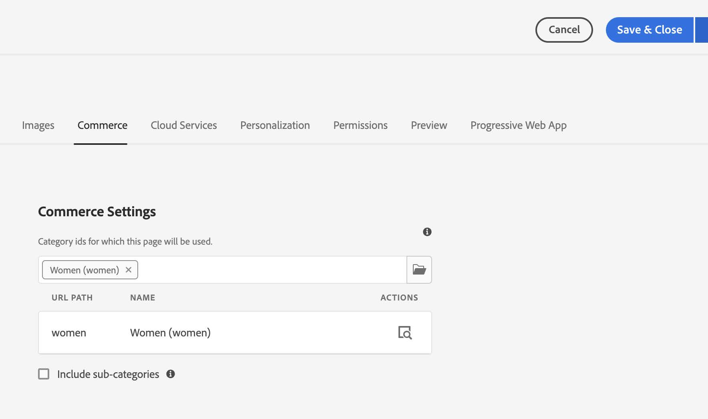

# [!DNL Live Search] CIF {#live-search-cif-component}

Live Search för Adobe Commerce ger en snabb, relevant och intuitiv sökupplevelse utan extra kostnad. Live Search som drivs av Adobe Sensei använder artificiell intelligens och maskininlärningsalgoritmer för att göra en djupgående analys av samlade besöksdata. När dessa data kombineras med din Adobe Commerce-katalog skapas en relevant och personaliserad shoppingupplevelse.

I det här avsnittet beskrivs hur du använder en AEM CIF-komponent för att implementera [!DNL Live Search] Produktlistsida (PLP) i din AEM.

## Förutsättningar {#prerequisites}

Det här avsnittet förutsätter att du har en lokal [AEM](https://experienceleague.adobe.com/docs/experience-manager-learn/foundation/development/set-up-a-local-aem-development-environment.html) konfigurera.

PLP-komponenten kräver [[!DNL Live Search] CIF](live-search-popover.md) installeras. PLP-widgeten kräver en webbläsarsessionsvariabel som genereras av povern.

## Uppdatera disposition {#update-composer}

Lägg till händelsemoduler i `ui.frontend/package.json`.

På rad 27 ska du ändra:

```json
...
  },

  "devDependencies": {

    "@babel/core": "^7.3.4",
...
```

till:

```json
...
  },
  "type": "module",
  "devDependencies": {
    "@adobe/magento-storefront-event-collector": "^1.5.4",
    "@adobe/magento-storefront-events-sdk": "^1.5.4",
    "@babel/core": "^7.3.4",
...
```

## Filändringar {#files-changes}

Flera filer måste uppdateras för att kunna aktiveras [!DNL Live Search] funktionalitet. Redigera följande filer. Radnummer kan skilja sig något från dem som visas här.

* ui.apps/src/main/content/jcr_root/apps/venia/clientlibs/clientlib-cif/.content.xml

  Lägg till `core.cif.productlist.v1` till `embed` linje.

  ```
  embed="[core.cif.components.common,core.cif.components.product.v3,core.cif.components.productcarousel.v1,core.cif.components.productcollection.v2,core.cif.components.productteaser.v1,core.cif.components.searchbar.v2,core.cif.components.header.v1,core.cif.components.carousel.v1,core.cif.components.categorycarousel.v1,core.cif.components.featuredcategorylist.v1,core.cif.components.storefront-events.v1,core.cif.components.extensions.product-recs.storefront-events-collector.v1,core.wcm.components.commons.site.link,core.cif.productlist.v1]"
  ```

* ui.apps/src/main/content/jcr_root/apps/venia/components/commerce/productlist/clientlibs/.content.xml

  Skapa en fil `.content.xml`:

  ```xml
  <?xml version="1.0" encoding="UTF-8"?>
  <jcr:root xmlns:cq="http://www.day.com/jcr/cq/1.0" xmlns:jcr="http://www.jcp.org/jcr/1.0"
    jcr:primaryType="cq:ClientLibraryFolder"
    allowProxy="{Boolean}true"
    categories="[core.cif.productlist.v1]"
    jsProcessor="[default:none,min:none]"/>
  ```

* ui.apps/src/main/content/jcr_root/apps/venia/components/commerce/productlist/clientlibs/css.txt

  Skapa filen `css.txt`:

  ```text
  #base=css
  
  productlist.css
  ```

* ui.apps/src/main/content/jcr_root/apps/venia/components/commerce/productlist/clientlibs/css/productlist.css

  Skapa filen `productlist.css`

  ```css
    /* #search-plp-root */
  
  html {
    font-size: 62.5% !important;
  }
  
  body {
    font-size: 1.6rem;
  }
  
  .root.container {
    max-width: inherit;
  }
  
  .container {
    margin-left: auto;
    margin-right: auto;
  }
  
  div.ds-sdk-sort-dropdown {
    z-index: 9;
  }
  ```

* ui.apps/src/main/content/jcr_root/apps/venia/components/commerce/productlist/clientlibs/js.txt

  Skapa filen `js.txt`:

  ```text
  js/productlist.js
  ```

* ui.apps/src/main/content/jcr_root/apps/venia/components/commerce/productlist/clientlibs/js/productlist.js

  Skapa filen `productlist.js`:

  ```javascript
  /*~~~~~~~~~~~~~~~~~~~~~~~~~~~~~~~~~~~~~~~~~~~~~~~~~~~~~~~~~~~~~~~~~~~~~~~~~~~~~~
  ~ Copyright 2023 Adobe
  ~
  ~ Licensed under the Apache License, Version 2.0 (the "License");
  ~ you may not use this file except in compliance with the License.
  ~ You may obtain a copy of the License at
  ~
  ~     http://www.apache.org/licenses/LICENSE-2.0
  ~
  ~ Unless required by applicable law or agreed to in writing, software
  ~ distributed under the License is distributed on an "AS IS" BASIS,
  ~ WITHOUT WARRANTIES OR CONDITIONS OF ANY KIND, either express or implied.
  ~ See the License for the specific language governing permissions and
  ~ limitations under the License.
  ~~~~~~~~~~~~~~~~~~~~~~~~~~~~~~~~~~~~~~~~~~~~~~~~~~~~~~~~~~~~~~~~~~~~~~~~~~~~~*/
  "use strict";
  
  class ProductList {
    constructor() {
      const stateObject = {
        categoryName: null,
        currentCategoryUrlPath: null,
      };
      this._state = stateObject;
      this._init();
    }
  
    _init() {
      this._initWidgetPLP();
    }
  
    _injectStoreScript(src) {
      const script = document.createElement("script");
      script.type = "text/javascript";
      script.src = src;
  
      document.head.appendChild(script);
    }
  
    async _getStoreData() {
      // get from session storage
      const sessionData = sessionStorage.getItem(
        "WIDGET_STOREFRONT_INSTANCE_CONTEXT"
      );
      // WIDGET_STOREFRONT_INSTANCE_CONTEXT is set from searchbar/clientlibs/js/searchbar.js
      // if not, we will need to retrieve from graphql separately here.
  
      if (sessionData) {
        this._state.dataServicesSessionContext = JSON.parse(sessionData);
        return;
      }
    }
  
    getStoreConfigMetadata() {
      const storeConfig = JSON.parse(
        document
          .querySelector("meta[name='store-config']")
          .getAttribute("content")
      );
  
      const { storeRootUrl } = storeConfig;
      const redirectUrl = storeRootUrl.split(".html")[0];
      return { storeConfig, redirectUrl };
    }
  
    async _initWidgetPLP() {
      if (!window.LiveSearchPLP) {
        const liveSearchPlpSrc =
          "https://plp-widgets-ui.magento-ds.com/v1/search.js";
        this._injectStoreScript(liveSearchPlpSrc);
        // wait until script is loaded
        await new Promise((resolve) => {
          const interval = setInterval(() => {
            if (window.LiveSearchPLP && window.LiveSearchAutocomplete) {
              // Widget expects LiveSearchAutocomplete already loaded to rely on data-service-graphql
              clearInterval(interval);
              resolve();
            }
          }, 200);
        });
      }
      await this._getStoreData();
      const { dataServicesSessionContext } = this._state;
      if (!dataServicesSessionContext) {
        console.log("no dataServicesSessionContext");
        return;
      }
  
      const root = document.getElementById("search-plp-root");
      if (!root) {
        console.log("plp root not found.");
        return;
      }
      // get dataset from root
      const categoryUrlPath = root.getAttribute("data-plp-urlPath") || "";
      const categoryName = root.getAttribute("data-plp-title") || "";
      const storeDetails = {
        environmentId: dataServicesSessionContext.environment_id,
        environmentType: dataServicesSessionContext.environment,
        apiKey: dataServicesSessionContext.api_key,
        websiteCode: dataServicesSessionContext.website_code,
        storeCode: dataServicesSessionContext.store_code,
        storeViewCode: dataServicesSessionContext.store_view_code,
        config: {
          pageSize: dataServicesSessionContext.page_size,
          perPageConfig: {
            pageSizeOptions: dataServicesSessionContext.page_size_options,
            defaultPageSizeOption:
              dataServicesSessionContext.default_page_size_option,
          },
          minQueryLength: dataServicesSessionContext.min_query_length,
          currencySymbol: dataServicesSessionContext.currency_symbol,
          currencyRate: dataServicesSessionContext.currency_rate,
          displayOutOfStock: dataServicesSessionContext.display_out_of_stock,
          allowAllProducts: dataServicesSessionContext.allow_all_products,
          locale: dataServicesSessionContext.locale,
          currentCategoryUrlPath: categoryUrlPath,
          categoryName,
          displayMode: "", // "" for plp || "PAGE" for category/catalog
        },
        context: {
          customerGroup: dataServicesSessionContext.customer_group,
        },
        route: ({ sku }) => {
          return `${
            this.getStoreConfigMetadata().redirectUrl
          }.cifproductredirect.html/${sku}`;
        },
        searchQuery: "search_query",
      };
      setTimeout(() => {
        console.log("init PLP");
        window.LiveSearchPLP({ storeDetails, root });
      }, 0);
    }
  }
  
  (function () {
    function onDocumentReady() {
      new ProductList({});
    }
  
    if (document.readyState !== "loading") {
      onDocumentReady();
    } else {
      document.addEventListener("DOMContentLoaded", onDocumentReady);
    }
  })();
  ```

* ui.apps/src/main/content/jcr_root/apps/venia/components/commerce/productlist/productlist.html

  Skapa fil `productlist.html`:

  ```html
  <div
  data-sly-use.productList="com.adobe.cq.commerce.core.components.models.productlist.ProductList"
  id="search-plp-root"
  class="productlist__root"
  data-plp-urlPath="${productList.storefrontContext.urlPath}"
  data-plp-title="${productList.title}">
  </div>
  ```

* ui.apps/src/main/content/jcr_root/apps/venia/components/commerce/searchresults/.content.xml

  Redigera `.content.xml` på rad 6:

  ```xml
  sling:resourceSuperType="venia/components/commerce/productlist"
  ```

* ui.content/src/main/content/jcr_root/content/venia/language-masters/en/search/.content.xml

  Redigera `.content.xml` på rad 21-22:

  ```xml
  sling:resourceType="venia/components/commerce/productlist"
  ```

* ui.content/src/main/content/jcr_root/content/venia/us/en/search/.content.xml

  Redigera `.content.xml` på rad 26:

  ```xml
  sling:resourceType="venia/components/commerce/productlist"
  ```

* ui.frontend/src/main/components/App/App.js

  Redigera `App.js` på rad 47, precis ovanför `../../site/main.scss`:

  ```javascript
  import '@adobe/magento-storefront-event-collector';
  ```

* ui.tests/test-module/specs/venia/productlist-dialog.js

  Redigera `productlist-dialog.js` och ändra `describe` till `describe.skip` på rad 20:

  ```javascript
  describe.skip('Product List Component Dialog', function () {
  ```

## Sidor som inte är PLP {#non-plp-pages}

Det kan finnas kategorier där standardkategorin eller katalogsidan är önskad, i stället för att använda PLP-widgeten. I AEM måste dessa kategorisidor konfigureras manuellt.

1. Välj en kategorisidmall på sidan Författare. _Venedig Store - startsida_ > _Katalogsida_ > _Venedig Store - kategorisida_ och väljer&quot;Leta upp utseendet&quot; eller skapar en ny sidmall.


1. Klicka på _Egenskaper_ -avsnittet och välj _Handel_ -fliken.


1. Välj den kategori som du vill visa med den valda kategorisidmallen.


