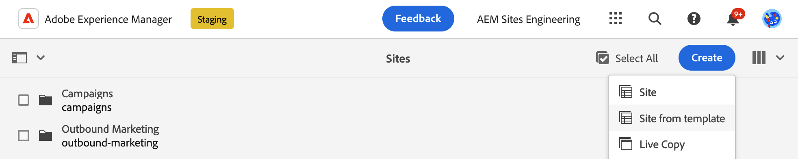
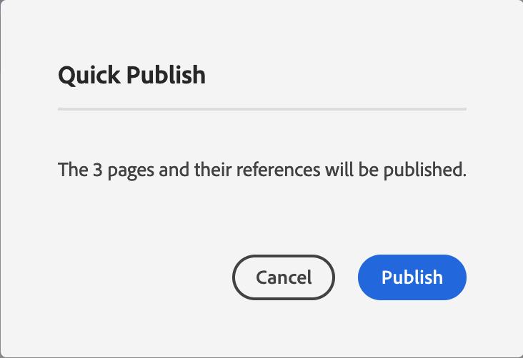

# Guiden Komma igång för utvecklare för AEM med Edge Delivery Services {#edge-dev-getting-started}

Den här guiden hjälper dig att komma igång med en ny Adobe Experience Manager-webbplats med hjälp av Edge Delivery Services och den universella redigeraren för framtagning av innehåll.

## Förutsättningar {#prerequisites}

Innan du börjar den här guiden bör du känna till grunderna i och ha tillgång till Edge Delivery Services som:

* Du har slutfört [Självstudiekurs om Edge Delivery Service.](/help/edge/developer/tutorial.md)
* Du har tillgång till en [AEM Cloud Service sandlåda.](/help/implementing/cloud-manager/getting-access-to-aem-in-cloud/introduction-sandbox-programs.md)
* Du har [har aktiverat den universella redigeraren i samma sandlådemiljö.](/help/implementing/universal-editor/getting-started.md)

## Välj rätt redigerare {#editor-choice}

AEM erbjuder två olika innehållsredigerare och vilka alternativ du kan välja mellan beror på din situation.

* **Universal Editor** - Det här bör vara standardalternativet för nya platser.
* **AEM Page Editor** - Detta bör väljas för en befintlig migrering från AEM Sites till Edge Delivery Services.

Den här guiden fokuserar AEM projekt på Edge Delivery Services med hjälp av den universella redigeraren. Se dokumentet [Använda Edge Delivery Services med AEM](/help/edge/using.md) om du vill ha mer information om hur du väljer rätt redigerare och migrerar befintliga AEM till Edge Delivery Services.

## Grundbegrepp vid utveckling för Edge Delivery Services {#core-concepts}

Edge Delivery Services bygger på konceptet med block. AEM innehåller ett omfattande bibliotek med fördefinierade block, som kan byggas ut efter dina projektbehov. Kod för Edge Delivery Services-projekt hanteras i GitHub.

### Block {#blocks}

Block är den mest grundläggande delen av en sida som levereras av Edge Delivery Services. Ett -block kapslar in format och kod som driver en logisk komponent på en innehållssida.

AEM tillhandahåller standardblock som en del av produkten i projektmallen. Exempel på sådana block är rubrik, text, bilder, länkar, listor osv.

>[!TIP]
>
>Se [Byggavsnitt](/help/edge/developer/block-collection.md) av dokumentationen till Edge Delivery Servicens för mer information om block och hur du utvecklar för Edge Delivery-tjänster.

### Edge Delivery Services och GitHub {#github-edge}

Edge Delivery utnyttjar GitHub så att du kan hantera och driftsätta kod direkt från din GitHub-databas.

Dina författare kan skapa innehåll med antingen dokumentbaserad redigering eller innehåll i AEM med den universella redigeraren. Utvecklare kan anpassa webbplatsens funktionalitet med hjälp av CSS och JavaScript i GitHub, oavsett hur författarna skapar sitt innehåll.

Webbplatser skapas automatiskt för var och en av dina grenar, från förhandsgranskning av innehåll till produktion. Alla resurser du lägger in i GitHub-databasen är tillgängliga på din webbplats utan någon byggprocess.

>[!TIP]
>
>Se [Byggavsnitt](/help/edge/developer/block-collection.md) av dokumentationen till Edge Delivery Servicens för mer information om block och hur du utvecklar för Edge Delivery-tjänster.

## Komma igång med AEM och Edge Delivery Services {#getting-started}

När du är klar [förutsättningarna](#prerequisites) och har gjort [valet av universell redigerare,](#editor-choice) du kan komma igång med ditt eget projekt.

### Skapa ditt GitHub-projekt {#create-github-project}

Först måste du skapa ett nytt projekt på GitHub, baserat på mallen Adobe.

1. Navigera till [`https://github.com/adobe-rnd/aem-boilerplate-xwalk`](https://github.com/adobe-rnd/aem-boilerplate-xwalk) och klicka på **Använd den här mallen** och markera **Skapa en ny databas**.

   * Du måste vara inloggad på GitHub för att kunna se det här alternativet.

   

1. Som standard tilldelas databasen till dig. Ändra vid behov, ange ett databasnamn och en beskrivning och klicka på **Skapa databas**.

   

1. På en ny flik i samma webbläsare går du till [`https://github.com/apps/aem-code-sync`](https://github.com/apps/aem-code-sync) och klicka **Konfigurera**.

   

1. Klicka **Konfigurera** för den organisation där du skapade din nya databas i föregående steg.

   

1. På AEM Code Sync GitHub-sidan under **Databasåtkomst**, markera **Välj endast databaser** väljer du databasen som du skapade i föregående steg och klickar sedan på **Spara**.

   

1. När AEM Code Sync har installerats får du en bekräftelse. Gå tillbaka till webbläsarfliken i din nya databas.

   

1. Klicka på `fstab.yaml` filen som ska öppnas och sedan **Redigera den här filen** för att redigera den.

   

1. Redigera `fstab.yaml` fil för att uppdatera monteringspunkten för projektet. Ersätt Google Docs-URL:en som är standard med URL:en för den AEM as a Cloud Service författarinstansen och klicka sedan på **Genomför ändringar...**.

   * `https://<aem-author>/bin/franklin.delivery/<owner>/<repository>/main`
   * Om du ändrar monteringspunkten får Edge Delivery Servicens information om var innehållet på platsen finns.

   

1. Lägg till ett implementeringsmeddelande efter behov och klicka sedan på **Verkställ ändringar**, implementera dem direkt i `main` gren.

   

1. Återgå till rotkatalogen i databasen och klicka på `paths.json` och sedan **Redigera den här filen** -ikon.

   

1. Standardmappningen använder databasens namn. Uppdatera den standardmappning som krävs för ditt projekt med `/content/<site-name>/:/` och klicka **Genomför ändringar...**.

   * Ange din egen `<site-name>`. Du kommer att behöva det i ett senare steg.
   * Mappningarna anger för Edge Delivery Servicens hur innehållet i din AEM ska mappas till webbplatsens URL.

   

1. Lägg till ett implementeringsmeddelande efter behov och klicka sedan på **Verkställ ändringar**, implementera dem direkt i `main` gren.

   

### Skapa och redigera en ny AEM {#create-aem-site}

Nu när du har ett GitHub-projekt måste du skapa en ny AEM som projektet kan använda.

>[!NOTE]
>
>Om du vill redigera webbplatsen med Universal Editor måste du använda en Chromium-baserad webbläsare.

1. Hämta den senaste AEM Authoring with Edge Delivery Services site template från GitHub på [`https://github.com/adobe-rnd/aem-boilerplate-xwalk`](https://github.com/adobe-rnd/aem-boilerplate-xwalk).

1. Logga in på din AEM as a Cloud Service redigeringsinstans och navigera till webbplatskonsolen och tryck eller klicka **Skapa** -> **Plats från mall**.

   

1. På **Välj en webbplatsmall** klickar du på **Importera** om du vill importera en ny mall.

   

1. Ladda upp webbplatsmallen AEM redigering med Edge Delivery Services som du får från Adobe Engineering.

   * Mallen får bara överföras en gång. När den har överförts kan den återanvändas för att skapa ytterligare webbplatser.

1. När mallen har importerats visas den i guiden. Tryck eller klicka för att markera den och tryck eller klicka sedan på **Nästa**.

   

1. Ange följande fält och tryck eller klicka **Skapa**.

   * **Platsrubrik** - Lägg till en beskrivande rubrik för webbplatsen.
   * **Platsrubrik** - Använd `<site-name>` som du definierade i [föregående steg.](#create-github-project)
   * **GitHub-URL** - Använd URL:en för GitHub-projektet som du skapade i föregående steg.

   

1. AEM bekräftar att webbplatsen har skapats med en dialogruta. Tryck eller klicka **OK** för att stänga.

   

1. Gå till webbplatskonsolen `index.html` för den nyligen skapade webbplatsen och tryck eller klicka **Redigera** i verktygsfältet.

   

1. Den universella redigeraren öppnas på en ny flik. Du kan behöva trycka eller klicka **Logga in med Adobe** för att autentisera för att redigera sidan.

   

Nu kan du redigera webbplatsen med Universal Editor. Se [Dokumentation för Universal Editor](/help/sites-cloud/authoring/universal-editor/authoring.md) för mer information.

### Publicera din nya webbplats {#publishing}

När du är klar med redigeringen av den nya webbplatsen med Universal Editor kan du publicera innehållet.

1. På webbplatskonsolen väljer du alla sidor som du har skapat för den nya platsen och trycker eller klickar på **Snabbpublicering** i verktygsfältet.

   

1. Tryck eller klicka **Publicera** i bekräftelsedialogrutan för att starta processen.

   

1. Öppna en ny flik i samma webbläsare och navigera till URL:en för den nya platsen.

   * `https://main--<site-name>--<owner>.hlx.page`

1. Se innehållet publiceras.

   

## Nästa steg {#next-steps}

Nu när du har en AEM med Edge Delivery Services kan du börja skapa och formatera dina egna block.

Se guiden [Skapa block som är instrumenterade för användning med den universella redigeraren](/help/edge/aem-authoring/create-block.md) för mer information.

>[!TIP]
>
>Om du vill få en genomgång av hur du skapar ett nytt projekt för Edge Delivery Services som är aktiverat för AEM med AEM as a Cloud Service som innehållskälla kan du titta på [det här AEM GEMs webbinarium.](https://experienceleague.adobe.com/en/docs/events/experience-manager-gems-recordings/gems2024/aem-authoring-and-edge-delivery)

