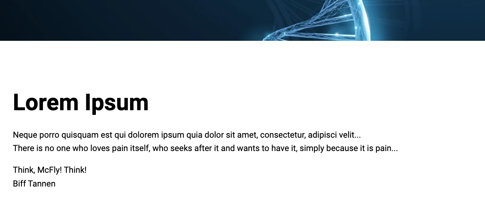
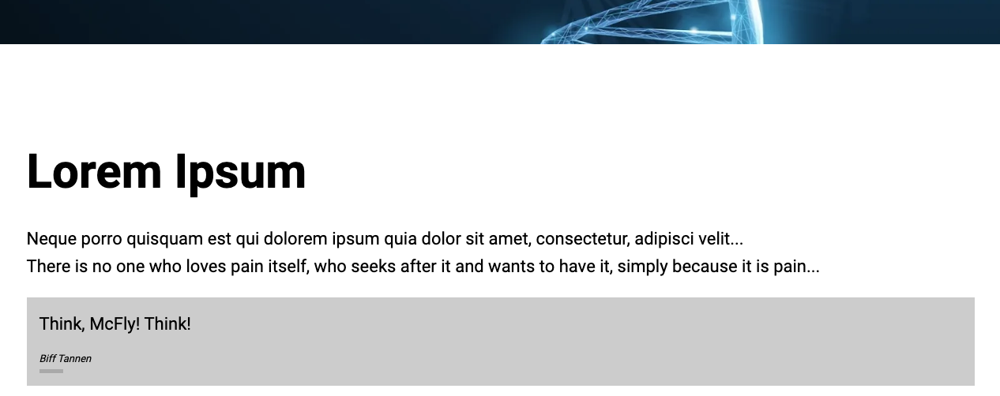

# Skapa block som är instrumenterade för användning med den universella redigeraren {#create-block}

Lär dig hur du skapar block som är instrumenterade för användning med den universella redigeraren AEM redigering med Edge Delivery Services.

{{aem-authoring-edge-early-access}}

## Förutsättningar {#prerequisites}

Den här handboken innehåller stegvisa instruktioner för hur du skapar block som är instrumenterade för den universella redigeraren när du redigerar AEM Edge Delivery Services. Det handlar om att lägga till komponenter, läsa in komponentdefinitioner i den universella redigeraren, publicera sidor, implementera blockdekoration och format, göra ändringar i produktionen och verifiera dem. När du är klar med den här guiden kan du skapa och distribuera ett nytt block för ditt eget projekt.

Den här guiden kräver kunskaper om AEM med Edge Delivery Services och den universella redigeraren. Innan du börjar den här guiden bör du ha tillgång till Edge Delivery Services och känna till grunderna i den:

* Du har slutfört [Självstudiekurs om Edge Delivery Service.](/help/edge/developer/tutorial.md)
* Du har tillgång till en [AEM Cloud Service sandlåda.](/help/implementing/cloud-manager/getting-access-to-aem-in-cloud/introduction-sandbox-programs.md)
* Du har [har aktiverat den universella redigeraren i samma sandlådemiljö.](/help/implementing/universal-editor/getting-started.md)
* Du har slutfört [Guiden Komma igång för utvecklare för AEM med Edge Delivery Services](/help/edge/edge-dev-getting-started.md) guide.

Den här guiden bygger vidare på det arbete som gjorts i [Guiden Komma igång för utvecklare för AEM med Edge Delivery Services](/help/edge/edge-dev-getting-started.md) guide.

## Lägga till ett nytt block i projektet {#add-block}

I den här guiden skapar du ett block som återger ett minnesvärt citat på sidan.

För att förenkla det här exemplet görs alla ändringar i `main` gren av projektdatabasen. Självklart för ditt projekt, [du bör följa bästa praxis för utveckling](https://www.aem.live/docs/dev-collab-and-good-practices) genom att utveckla på en annan gren och granska alla ändringar via pull-begäran innan de sammanfogas med `main`.

Adobe rekommenderar att du utvecklar block i tre faser:

1. Skapa definitionen och modellen för blocket, granska det och ta det till produktion.
1. Skapa innehåll med det nya blocket.
1. Implementera dekoration och stilar för det nya blocket.

Följande exempel på offertblock följer den här metoden.

### Skapa blockdefinition och modell {#create-block-model}

1. Klona GitHub-projektet lokalt som du skapade i [Guiden Komma igång för utvecklare för AEM med Edge Delivery Services](/help/edge/edge-dev-getting-started.md) och öppna den i valfri redigerare.

   * Microsoft Code används här för illustrativa ändamål.

   

1. Redigera `component-definition.json` filen i projektets rot och lägg till följande definition för det nya offertblocket och spara filen.

   ```json
   {
     "title": "Quote",
     "id": "quote",
     "plugins": {
       "xwalk": {
         "page": {
           "resourceType": "core/franklin/components/block/v1/block",
           "template": {
             "name": "Quote",
             "model": "quote",
             "quote": "<p>Think, McFly! Think!</p>",
             "author": "Biff Tannen"
           }
         }
       }
     }
   }
   ```

   

1. Redigera `component-models.json` filen i projektets rot och lägg till följande [modelldefinition](/help/implementing/universal-editor/field-types.md#model-structure) för det nya offertblocket och spara filen.

   * Se dokumentet [Innehållsmodellering för AEM med Edge Delivery Services Projects](/help/edge/content-modeling.md) för mer information om vad som är viktigt att tänka på när du skapar innehållsmodeller.

   ```json
   {
     "id": "quote",
     "fields": [
        {
          "component": "text-area",
          "name": "quote",
          "value": "",
          "label": "Quote",
          "valueType": "string"
        },
        {
          "component": "text-input",
          "valueType": "string",
          "name": "author",
          "label": "Author",
          "value": ""
        }
      ]
   }
   ```

   

1. Redigera `component-filters.json` filen i projektets rot och lägg till offertblocket i [filterdefinition](/help/implementing/universal-editor/customizing.md#filtering-components) så att blocket kan läggas till i valfritt avsnitt och spara filen.

   ```json
   {
     "id": "section",
     "components": [
       "text",
       "image",
       "button",
       "title",
       "hero",
       "cards",
       "columns",
       "quote"
      ]
   }
   ```

   

1. Använd Git för att implementera dessa ändringar i `main` gren.

   * Bekräftar till `main` är endast till för illustrativa ändamål. [Följ vedertagna standarder](https://www.aem.live/docs/dev-collab-and-good-practices) och använda en pull-begäran för faktiskt projektarbete.

### Skapa innehåll med blocket {#create-content}

Nu när det grundläggande offertblocket är definierat och implementerat i exempelprojektet kan du lägga till ett offertblock på en befintlig sida.

1. Logga in AEM as a Cloud Service i en webbläsare. [Med Sites-konsolen](/help/sites-cloud/authoring/getting-started/basic-handling.md) navigera till webbplatsen som du skapade i [Guiden Komma igång för utvecklare för AEM med Edge Delivery Services](/help/edge/edge-dev-getting-started.md) och markera en sida.

   * I detta fall `index` används för illustrativa ändamål.

   

1. Tryck eller klicka **Redigera** i konsolens verktygsfält och Universal Editor öppnas.

   * Om du vill läsa in sidan kan du behöva trycka eller klicka **Logga in med Adobe** för att autentisera till AEM i Universal Editor.

1. Markera ett avsnitt i Universella redigeringsprogram. Tryck eller klicka på **Lägg till** ikonen och välj sedan din nya **Citat** på menyn.

   * The **Lägg till** är en plustecken.
   * Du vet att du har markerat ett avsnitt om den blå konturen för det markerade objektet har en tabb med etiketten **Avsnitt**.
   * I det här exemplet trycker eller klickar du något ovanför **Lorem Ipsum** heading markerar ett avsnitt som innehåller rubriken och lorem ipsum text.

   

1. Sidan läses in igen och offertblocket läggs till längst ned i det markerade avsnittet med standardinnehållet som anges i `component-definitions.json` -fil.

   * Citatteckenblocket kan markeras och redigeras som vilket annat block som helst, antingen på plats eller i egenskapsfältet.
   * Formateringen görs i ett steg till.

   

1. När du är nöjd med offertens innehåll kan du publicera sidan genom att trycka på eller klicka på **Publicera** i verktygsfältet i Universal Editor.

1. Kontrollera att innehållet har publicerats genom att gå till den publicerade sidan. Länken påminner om `https://<branch>--<repo>--<owner>.hlx.page`

   

### Formatera blocket {#style-block}

Nu när du har ett fungerande offertblock kan du formatera det.

1. Gå tillbaka till redigeraren för ditt projekt.

1. Skapa en `quote` mappen under `blocks` mapp.

   

1. I nya `quote` mapp, lägga till `quote.js` -fil som ska implementera blockdekoration genom att lägga till följande JavaScript och spara filen.

   ```javascript
   export default function decorate(block) {
     const [quoteWrapper] = block.children;
   
     const blockquote = document.createElement('blockquote');
     blockquote.textContent = quoteWrapper.textContent.trim();
     quoteWrapper.replaceChildren(blockquote);
   }
   ```

   


1. I `quote` mapp, lägga till `quote.css` -fil för att definiera blockets format genom att lägga till följande CSS-kod och spara filen.

   ```css
   .block.quote {
       background-color: #ccc;
       padding: 0 0 24px;
       display: flex;
       flex-direction: column;
       margin: 1rem 0;
   }
   
   .block.quote blockquote {
       margin: 16px;
       text-indent: 0;
   }
   
   .block.quote > div:last-child > div {
       margin: 0 16px;
       font-size: small;
       font-style: italic;
       position: relative;
   }
   
   .block.quote > div:last-child > div::after {
       content: "";
       display: block;
       position: absolute;
       left: 0;
       bottom: -8px;
       height: 5px;
       width: 30px;
       background-color: darkgray;
   }
   ```

   

1. Använd Git för att implementera dessa ändringar i `main` gren.

   * Bekräftar till `main` är endast till för illustrativa ändamål. [Följ vedertagna standarder](https://www.aem.live/docs/dev-collab-and-good-practices) och använda en pull-begäran för faktiskt projektarbete.

1. Gå tillbaka till webbläsarfliken i Universal Editor där du redigerade sidan i ditt projekt och läs in sidan igen för att visa det formaterade blocket.

1. Se det nu formaterade citattecknet på sidan.

   

1. Kontrollera att ändringarna har flyttats till produktion genom att navigera till den publicerade sidan. Länken påminner om `https://<branch>--<repo>--<owner>.hlx.page`

   

Grattis! Du har nu ett fullt fungerande och formaterat citattecken. Du kan använda det här exemplet som bas för att utforma egna projektspecifika block.

## Använda andra arbetsgrenar {#other-branches}

Den här guiden gav dig en direkt bindning till `main` för enkelhetens skull. Detta är vanligtvis inte något problem vid försök i en exempeldatabas. För verkligt projektarbete, [du bör följa bästa praxis för utveckling](https://www.aem.live/docs/dev-collab-and-good-practices) genom att utveckla på en annan gren och granska alla ändringar via pull-begäran innan de sammanfogas med `main`.

När du inte utvecklar på `main` gren, du kan lägga till `?ref=<branch>` i fältet Universal Editor för att läsa in sidan från din gren. `<branch>` är filialnamnet som det skulle användas för projektets förhandsgransknings- eller direktadresser, t.ex. `https://<branch>--<repo>--<owner>.hlx.page`.

Publicering av innehåll med en ny modell stöds bara när modellen sammanfogas med `main` gren.
