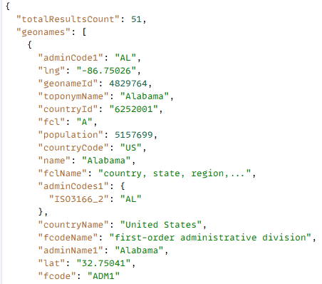
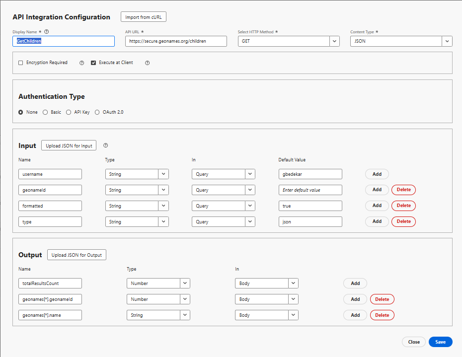

# Skapa API-integrering

I den här självstudiekursen skapas två API-integreringar

- GetAllcountries returnerar en lista över länder
- GetChildren - Returnera omedelbart underordnade till landet eller staten som representeras av geonameId

## GetAllcountries - API-integreringskonfiguration

- Konfiguration av API-integrering

   - Visningsnamn: GetAllcountries → en etikett för detta API i systemet.

   - API-URL: `https://secure.geonames.org/countryInfoJSON` - slutpunkten som du anropar.

   - HTTP-metod: GET - du gör en enkel begäran från GET.

   - Innehållstyp: JSON - svar förväntas i JSON-format.

- Alternativ:

   - Kryptering krävs avmarkerat - inget krypteringslager förutom HTTPS.

   - Kör vid klienten är markerat - anropet körs från klienten/webbläsaren, inte från servern.
- Autentiseringstyp
   - Inget - eftersom API:t GeoNames inte kräver OAuth- eller API-nycklar i rubriker
- Indata:
   - I inmatningsavsnittet definieras vad som skickas till API:t
   - **användarnamn** → typ: String, skickad i frågan, standard: gbedekar.
   - Varje begäran bifogar ?username=gbedekar till URL:en
- Utdata
   - Output definierar vilka fält från JSON-svaret som ska extraheras och användas.
GeoNames-svaret ser ut så här:

  
   - Mappade två fält inifrån geonames-arrayen:

     geonames[*].geonameId → som Number

     geonames[*].countryName → som en sträng

     [*] betyder att den upprepas för varje land i arrayen.

## GetChildren

Det frågar GeoNames efter de direkt underordnade för platsen vars geonamesId skickas som en frågeparameter

- Konfiguration av API-integrering

   - Visningsnamn: GetAllcountries → en etikett för detta API i systemet.

   - API-URL: `https://secure.geonames.org/children` → slutpunkten som du anropar.

   - HTTP-metod: GET → du gör en enkel begäran från GET.

   - Innehållstyp: JSON → svar förväntas i JSON-format.

- Alternativ:

   - Kryptering krävs ej ikryssad → inget krypteringslager förutom HTTPS.

   - Kör vid Klienten är ikryssad → anropet körs från klienten/webbläsaren, inte från servern.
- Autentiseringstyp
   - Inget - eftersom API:t GeoNames inte kräver OAuth- eller API-nycklar i rubriker
- Indata:
   - Definierar vad som skickas till API:t
   - **användarnamn** → typ: String, skickad i frågan, standard: gbedekar.
   - Varje begäran bifogar ?username=gbedekar till URL:en
   - **geonameId** -> typ: String. Returnerar underordnade för landet/staten som representeras av geonameId
   - **type** =>Sträng. Om du ställer in på json returneras svaret i JSON-format.
- Utdata
   - Definierar vilka fält från JSON-svaret som ska extraheras och användas.
GeoNames-svaret ser ut så här:

  
   - Mappade två fält inifrån geonames-arrayen:

     geonames[*].geonameId → som Number

     geonames[*].name → as a String

     [*] betyder att den upprepas för varje land i arrayen.

