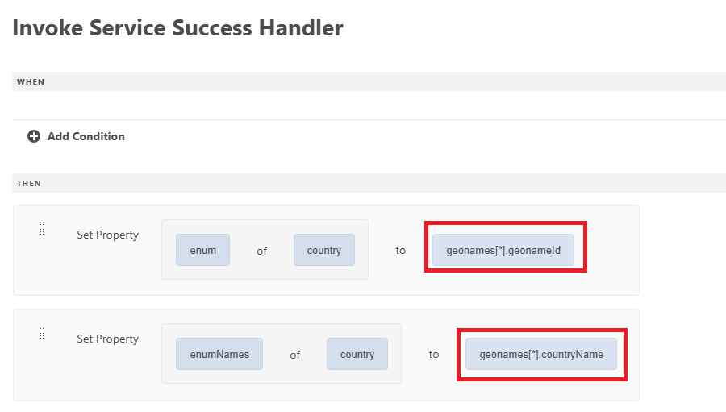

# Skapa formulär med en universell redigerare

Skapa följande formulär med den universella redigeraren. Formuläret har tre nedrullningsbara listor, vars värden fylls i med API-integreringen

## Bosättningsland

Vid initieringen fylls den nedrullningsbara listrutan i med resultatet av API-anropet.

## Processhanterare

Hanteraren för lyckade åtgärder definierades för att ställa in enum och enumNames för den nedrullningsbara listan med lämpliga värden från geonames-arrayen. Geonames-arrayen är tillgänglig under alternativet Händelsenyttolast

## Hämta underordnade värden

Listrutan Region fylls i när användaren gör ett val i listrutan Land. Det geonameId som är associerat med det valda landet skickas som en indataparameter till API-integreringen GetChildren

Framgångshanteraren definierades för att ställa in enum/enumNames för listrutan StateOrRegion

När du har valt stat eller provins kan du fylla i den nedrullningsbara listan genom att följa mönstret som används för att fylla i den nedrullningsbara listan.