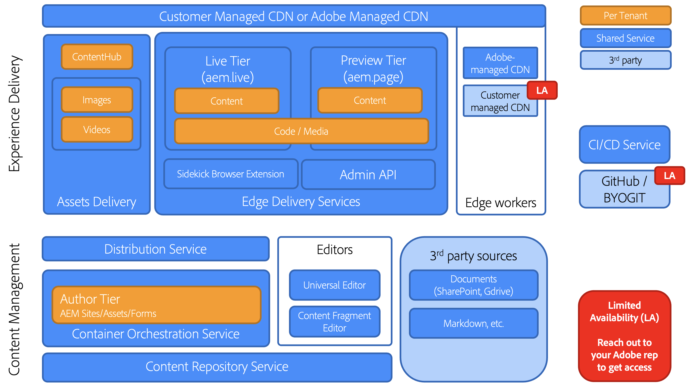

# Edge Delivery Services - översikt {#edge-delivery-services}

>[!TIP]
>
>**Vill du prova på saker direkt?**
>
>Om du vill prova på Edge Delivery Services direkt har du två alternativ.
>* [Börja skriva direkt med en färdig självstudiemiljö - helt konfigurerad och klar att användas.](https://www.aem.live/developer/ue-trial)
>* Gräv in på mer av detaljerna och konfigurera en egen miljö på mindre än 30 minuter genom att [checka ut självstudiekursen på aem.live.](https://www.aem.live/developer/ue-tutorial)

## Vad är Edge Delivery Services? {#what-is-edge}

Edge Delivery Services är ett modernt ramverk för innehållsleverans som omdefinierar hur webbplatser byggs och levereras och optimerar för snabbhet, enkelhet och skalbarhet. Det är en viktig del av Adobe Experience Manager och ger snabbare digitala upplevelser genom att föra renderingen och leveransen närmare användaren, i nätverkets utkant.

Det ersätter inte ett leveransnätverk (CDN), men integreras sömlöst med ditt eget CDN eller det medföljande [Adobe-hanterade CDN.](/help/implementing/dispatcher/cdn.md)

## Varför Edge Delivery Services? {#why-edge}

### Ökar upptäckbarheten och trafiken {#increase-traffic}

Edge Delivery webbplatser är sökmotorer som är optimerade (SEO) och generativa motorer som är optimerade (GEO) för LLM. Detta gör att alla befintliga och kommande källor för organisk trafik blir synliga och upptäcks på hög nivå. Den **prestandaförsta kompletta arkitekturen** säkerställer en attraktiv kundupplevelse som positivt påverkar engagemanget.

### Effektivare utvecklare {#developer-efficientcy}

Lev på några dagar och veckor istället för månader och år! Edge Delivery har alla verktyg som **moderna webbutvecklare** gillar: GitHub, lokal utveckling med automatisk uppladdning, prestanda, enkelhet och inga av komplikationerna: ingen transplantation, inga paket, inga konfigurationer, inga overheadkostnader.

Enkelheten i Edge Delivery kräver inte att ni använder komplicerade ramverk, verktyg eller processer som är idealiska för att skapa AI-kod. Använd HTML, modern CSS och vanilj JavaScript för att skapa exceptionella upplevelser snabbare än någonsin. Fokusera på arbetet och lägg mindre tid på att utbilda och lära sig nya verktyg.

Med Edge Delivery kan alla utvecklare få 100 fyr.

### Stöd för flera innehållskällor {#multiple-content-sources}

Innehåll från olika lösningar kan integreras direkt med Edge Delivery, **inklusive alla dina befintliga AEM-instanser**. Författare kan hantera och **publicera innehåll från alla system, som SharePoint till Edge Delivery**, för att bli mer flexibla med verktyg de redan känner till.

### Sammansättningsbar arkitektur {#composable-architeture}

Oavsett om du är headless eller headful kan du leverera rätt innehåll i rätt format och lägga till rätt dekoration så att det blir en upplevelse som sticker ut i alla kanaler.

## Hur fungerar det? {#how-does-it-work}

Edge Delivery Services är en sammansättningsbar uppsättning tjänster som ger stor flexibilitet när det gäller hur du skapar innehåll på din webbplats. Det ersätter AEM Publish/Dispatcher och det traditionella sättet att skapa upplevelser med AEM Core Components med en SaaS-lösning med flera moln och en helhetsutvecklingsstrategi.

Edge Delivery Services använder GitHub så att du kan hantera och distribuera kod direkt från din GitHub-databas. Nytt innehåll läggs till direkt utan någon omgenereringsprocess.

## Redigering {#authoring}

### Kontextredigering {#in-context-editing}

[Den universella redigeraren](/help/implementing/universal-editor/introduction.md) är en&quot;what-you-see-is-what-you-get&quot; (WYSIWYG) som kan anpassas på en och samma plats för att redigera innehåll live och i sitt sammanhang med en visuell förhandsvisning.

* Med AEM och Universal Editor blir du effektivare, både headless och headful.
* Du kan utnyttja AEM omfattande funktioner för innehållshantering, inklusive arbetsflöde och styrning.
* Ni kan utnyttja ett stort antal tilläggspunkter för att stödja era egna processer och integreringar.
* Du kan utveckla webbplatsens funktionalitet med hjälp av CSS och JavaScript i GitHub.

### Dokumentbaserad redigering {#document-based-editing}

[Ett annat tillvägagångssätt är dokumentbaserad redigering](https://www.aem.live/docs/authoring) där innehåll hanteras som dokument. Microsoft Word är ett populärt val eftersom många företag har SharePoint på plats där det ursprungliga innehållet skapas. Du behöver inte lära dig något nytt verktyg och publicera material direkt från SharePoint och Word för att slippa krånglet med att kopiera och klistra in innehåll i AEM. Kunder som inte har SharePoint kan också använda Google Drive som ett alternativ.

## Drifttelemetri {#telemetry}

Adobe Experience Manager använder [Operational Telemetry](https://www.aem.live/docs/operational-telemetry) för att samla in operationsdata som är absolut nödvändiga för att upptäcka och åtgärda funktions- och prestandaproblem på webbplatser med Adobe Experience Manager. Operativa telemetridata kan användas för att diagnostisera prestandaproblem och för att mäta effekten av försök. Operativ telemetri bevarar besökarnas integritet genom [sampling](https://www.aem.live/docs/operational-telemetry#operational-telemetry-data-is-sampled) (endast en liten del av alla sidvisningar övervakas) och [genom att personligt identifierbar information utesluts ](https://www.aem.live/docs/operational-telemetry#what-data-is-being-collected) (PII).

## Börja utforska {#start-exploring}

Kom igång med AEM-redigering med Universal Editor och Edge Delivery Services:

* Edge Delivery Services-dokumentation [Edge Delivery Services](https://www.aem.live)
* En översikt över AEM-redigering med den universella redigeraren finns i dokumentet [Skapa med AEM för Edge Delivery Services](https://www.aem.live/docs/aem-authoring) i aem.live-dokumentationen.
* En utvecklaröversikt finns i dokumentet [Getting Started - Universal Editor Developer Tutorial](https://www.aem.live/developer/ue-tutorial) i aem.live-dokumentationen.

## Edge Delivery Services och andra Adobe Experience Cloud-produkter {#edge-other-products}

Edge Delivery Services ingår i Adobe Experience Manager. Därför kan Edge Delivery Services och AEM Sites finnas parallellt på samma domän, vilket är ett vanligt användningsexempel för större webbplatser. Dessutom kan dina AEM Sites-sidor enkelt förbruka innehåll från Edge Delivery Services, och det motsatta är också sant.

Du kan också använda Edge Delivery Services med [Adobe Target](https://www.aem.live/developer/target-integration) och [Launch.](https://experienceleague.adobe.com/en/docs/experience-platform/tags/home)

## Få hjälp från Adobe {#getting-help}

Adobe har tre lager som kan hjälpa dig med Edge Delivery Services:

* Engagera med [communityresurser](#community-resources) för allmänna frågor.
* Gå till din [produktsamarbetskanal](#collaboration-channel) om du vill ha specifika frågor.
* [Logga en supportanmälan](#support-ticket) för att lösa viktiga och allvarliga problem **inom den avtalsenliga supporten SLA**.

### Använd communityresurser {#community-resources}

Adobe ger dig det bästa användarinteraktionen och stödet för Edge Delivery Services, AEM-redigering med den universella redigeraren och dokumentbaserad redigering.

* Delta i [Experience League Community](https://adobe.ly/3Q6kTKl) för att ställa frågor, dela med dig av feedback, starta diskussioner, söka hjälp av Adobe experter och AEM Advisors/Champs samt få kontakt med likasinnade individer i realtid.
* Gå med i [Discord-kanalen](https://discord.gg/aem-live), en mer tillfällig plattform för realtidsinteraktioner och snabbt idéutbyte.

### Logga en supportanmälan {#support-ticket}

{{support-ticket}}
