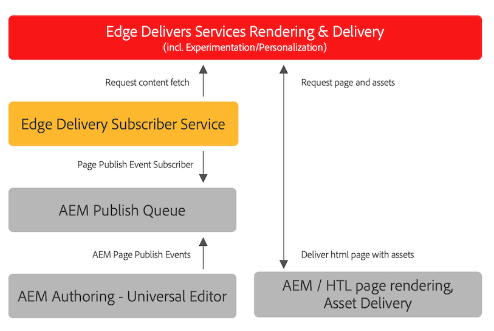

# Publicera innehåll för Edge Delivery Services {#publishing-edge}

Med Edge Delivery Services är det smidigt att publicera innehåll oavsett innehållskälla:

* Dokumentbaserat innehåll - se [Publiceringsavsnitt](https://www.aem.live/docs/#publish) av Edge Delivery Servicens dokumentation.
* AEM - Se informationen nedan.

## Publiceringsflöde från AEM {#publishing-flow}

När du använder den universella redigeraren för att skapa AEM innehåll är det bara att klicka på **Publicera** i Universal Editor. Se dokumentet [Publicera innehåll med den universella redigeraren.](/help/implementing/universal-editor/publishing.md)

Informationsflödet vid publicering är följande. När författaren börjar publicera är det här ett automatiskt flöde som illustreras här i informationssyfte.

1. Innehållsförfattaren publicerar AEM i Universell redigerare.
1. En publiceringshändelse skickas till Adobe Pipeline-kön.
1. Edge Delivery Publish Service skickar relevanta händelser till Edge Delivery Admin API.
1. Edge Delivery pulls and ingest semantic HTML from AEM Author.
1. AEM uppdateras med publiceringsstatus.

## Så här kommer du igång {#how-to-get-started}

Kontakta din Adobe-representant för att få tillgång till den här funktionen.
