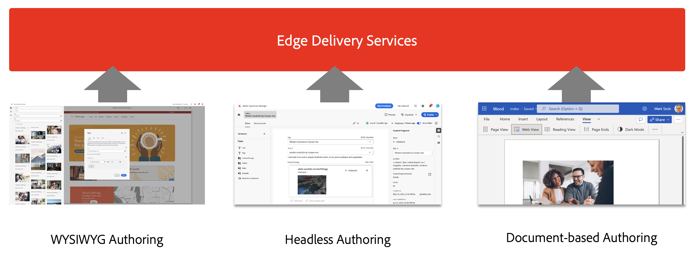

# Använda Edge Delivery Services {#usingedge}

Med Edge Delivery Services kan ni skapa snabba utvecklingsmiljöer där författare snabbt kan uppdatera och publicera innehåll, och nya webbplatser kan lanseras snabbt. Därför kan du arbeta med flera olika innehållskällor på samma webbplats och publiceringen blir smidig och smidig oavsett vilken källa du väljer. Det tar därför bara några sekunder att gå från redigering till att se innehållet live på internet.

Edge Delivery Services är fristående från innehållskällan och kan importera innehåll från olika innehållskällor.

Inhämtning från olika innehållskällor ger maximal flexibilitet för användaren. Adobe har hjälp att välja vilka innehållskällor som passar bäst för ditt projekt.

Det finns fall där innehållskällan är fördefinierad eller på annat sätt inte flexibel (projektet kan t.ex. inte använda Sharepoint eller Google Drive). Men i många fall är verktyget inte förberett och valet av verktyg är inte svartvitt.

Adobe är enkel. Börja med dokumentbaserad redigering och lägg till komplexitet vid behov. Om det behövs en verktygsändring omfattar integreringen av AEM Edge Delivery Services innehållsmigrering.

## Redigering {#authoring-edge}

Med Edge Delivery Services är det enkelt, snabbt och flexibelt att skapa. Du kan välja att redigera med hjälp av dokumentbaserad redigering eller redigering i AEM med den universella redigeraren.

Se dokumentet [Skapa innehåll för Edge Delivery Services](authoring.md) för mer information.

## Publicering {#publishing-edge}

Med Edge Delivery Services är det smidigt att publicera innehåll oavsett innehållskälla.

Se dokumentet [Publicera innehåll för Edge Delivery Services](publishing.md) för mer information.

## Utvecklar {#developing-edge}

Edge Delivery Services bygger på konceptet med block. AEM innehåller ett omfattande bibliotek med fördefinierade block, som kan byggas ut efter dina projektbehov. Kod för Edge Delivery Services-projekt hanteras i GitHub.

Se dokumentet [Utveckla för Edge Delivery Services](developing.md) för mer information.

## Befintliga AEM {#existing-projects}

Du behöver inte vänta på ett nytt AEM projekt för att kunna dra nytta av Edge Delivery Services. Edge Delivery Services kan integreras i ditt befintliga AEM så att du kan utnyttja prestandavinster direkt.

Se dokumentet [Använda Edge Delivery Services med befintliga AEM](existing-projects.md) för mer information.
