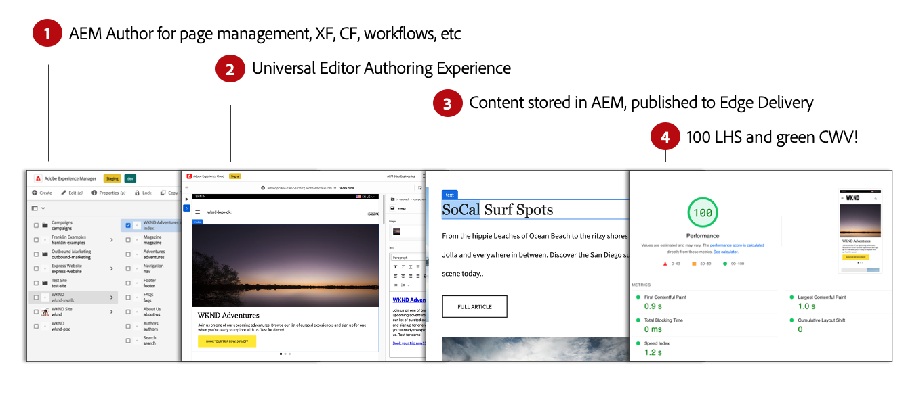

# WYSIWYG Content Authoring for Edge Delivery Services {#authoring-edge}

Med Edge Delivery Services är det enkelt, snabbt och flexibelt att skapa. Du kan skapa innehåll för Edge Delivery Services på två sätt:

* [Universell redigerare](#universal-editor) - Ett modernt användargränssnitt för det du-se-is-what-you-get (WYSIWYG) för att skapa innehåll i AEM
* [Dokumentbaserad redigering](#document-based) - t.ex. Microsoft Word eller Google Docs

## Redigering i Universal Editor {#universal-editor}

När du använder Edge Delivery Services med AEM as a Cloud Service är det viktigaste att förstå att det innehåll du skapar bevaras i AEM as a Cloud Service.

1. [AEM Sites-miljön](/help/sites-cloud/authoring/quick-start.md) används för innehållshantering som att skapa nya sidor, upplevelsefragment, innehållsfragment osv.
   * Alla funktioner i AEM är tillgängliga, t.ex. arbetsflöden, MSM, översättning, startprogram.
1. [Den universella redigeraren](/help/sites-cloud/authoring/universal-editor/authoring.md) används för att skapa innehåll som hanteras i AEM.
   * Universal Editor har ett nytt och modernt gränssnitt för framtagning av material.
   * För redigering återges HTML i AEM men skript, format, ikoner och andra resurser från Edge Delivery Services tas med.
   * Även om Universell redigerare används sparas alla ändringar i AEM.
   * Den universella redigeraren fungerar ännu inte som den AEM sidredigeraren och en del AEM funktioner kanske inte är tillgängliga i den universella redigeraren.
1. Innehåll som du redigerar med den universella redigeraren och som bevaras för AEM publiceras till Edge Delivery Services.
   * Innehållet sparas i AEM.
   * AEM återger semantiskt HTML som behövs för intag.
   * Innehåll publiceras till Edge Delivery Services.
1. [Edge Delivery Services](/help/edge/developer/keeping-it-100.md) säkerställer 100 % Lighthhade-poäng.

Block är grundläggande komponenter i en sida som levereras av Edge Delivery Services. Författare kan välja bland standardblock som tillhandahålls som standard av Adobe eller block som anpassas för ditt projekt av utvecklarna.

Universal Editor är ett modernt och intuitivt GUI som du kan använda för att skapa innehåll genom att lägga till och ordna block.

Information om blocken kan sedan konfigureras på egenskapspanelen.

Mer information om hur du redigerar med den universella redigeraren finns i dokumentet [Skapa innehåll med den universella redigeraren](/help/sites-cloud/authoring/universal-editor/authoring.md).

Läs [Utvecklarhandboken Komma igång för WYSIWYG-redigering med Edge Delivery Services](/help/edge/wysiwyg-authoring/edge-dev-getting-started.md) om du vill veta hur du startar ett eget projekt som du kan skapa med AEM och Edge Delivery Services.

## Ytterligare redigeringsmetoder  {#authoring-methods}

WYSIWYG är ett kraftfullt och intuitivt verktyg för skribenter. Det finns dock många olika användningsområden, och det är därför AEM erbjuder ytterligare redigeringslösningar.

Läs dokumentet [Välja en redigeringsmetod](/help/edge/authoring-methods.md) om du vill veta mer om de redigeringslösningar AEM erbjuder, inklusive dokumentbaserad redigering och headless.
