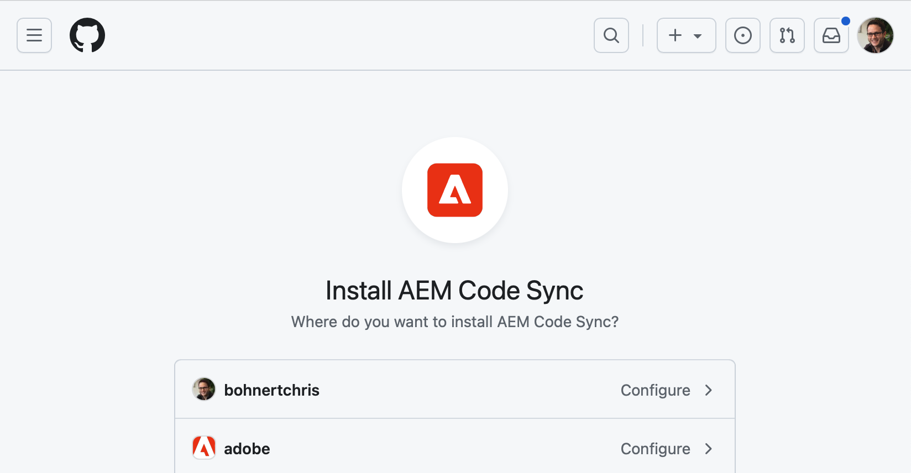

# Guiden Komma igång med utvecklare för WYSIWYG-redigering med Edge Delivery Services {#edge-dev-getting-started}

Den här guiden hjälper dig att komma igång med en ny Adobe Experience Manager-sajt med Edge Delivery Services och Universal Editor för WYSIWYG.

## Förutsättningar {#prerequisites}

Innan du börjar med den här guiden bör du känna till grunderna i och ha tillgång till Edge Delivery Services:

* Du har slutfört [självstudiekursen om Edge Delivery-tjänster](/help/edge/developer/tutorial.md).
* Du har åtkomst till en [AEM Cloud-tjänstsandlåda](/help/implementing/cloud-manager/getting-access-to-aem-in-cloud/introduction-sandbox-programs.md).
* Du har [aktiverat den universella redigeraren i samma sandlådemiljö](/help/implementing/universal-editor/getting-started.md).

## Grundbegrepp vid utveckling för Edge Delivery Services {#core-concepts}

Edge Delivery Services bygger på konceptet med block. AEM har ett omfattande bibliotek med fördefinierade block som kan byggas ut efter dina projektbehov. Kod för Edge Delivery Services-projekt hanteras i GitHub.

### Block {#blocks}

Block är den mest grundläggande delen av en sida som levereras av Edge Delivery Services. Ett -block kapslar in format och kod som driver en logisk komponent på en innehållssida.

AEM tillhandahåller standardblock som en del av produkten i projektmallen. Exempel på sådana block är rubrik, text, bilder, länkar, listor osv.

>[!TIP]
>
>Se avsnittet [Build](/help/edge/developer/block-collection.md) i Edge Delivery Services-dokumentationen för mer information om hur du skapar block och hur du utvecklar för Edge Delivery-tjänster.

### Edge Delivery Services och GitHub {#github-edge}

Edge Delivery utnyttjar GitHub så att du kan hantera och driftsätta kod direkt från din GitHub-databas.

Dina författare kan skapa innehåll med hjälp av antingen dokumentbaserad redigering eller innehåll i AEM med den universella redigeraren. Utvecklare kan anpassa webbplatsens funktionalitet med hjälp av CSS och JavaScript i GitHub oavsett hur författarna skapar sitt innehåll.

Webbplatser skapas automatiskt för var och en av dina grenar, från förhandsgranskning av innehåll till produktion. Alla resurser du lägger in i GitHub-databasen är tillgängliga på din webbplats utan någon byggprocess.

>[!TIP]
>
>Se avsnittet [Build](/help/edge/developer/block-collection.md) i Edge Delivery Services-dokumentationen för mer information om hur du skapar block och hur du utvecklar för Edge Delivery-tjänster.

## Komma igång med WYSIWYG Authoring och Edge Delivery Services {#getting-started}

När du har uppfyllt [villkoren](#prerequisites) och har gjort [till ett val att använda den universella redigeraren](#editor-choice) kan du komma igång med ditt eget projekt.

### Skapa ditt GitHub-projekt {#create-github-project}

Först måste du skapa ett nytt projekt på GitHub, baserat på Adobe-mallen.

1. Navigera till [`https://github.com/adobe-rnd/aem-boilerplate-xwalk`](https://github.com/adobe-rnd/aem-boilerplate-xwalk) och klicka på **Använd den här mallen** och välj **Skapa en ny databas**.

   * Du måste vara inloggad på GitHub för att kunna se det här alternativet.

   

1. Som standard tilldelas databasen till dig. Ändra detta om det behövs, ange ett databasnamn och en beskrivning och klicka på **Skapa databas**.

   

1. Navigera till [`https://github.com/apps/aem-code-sync`](https://github.com/apps/aem-code-sync) och klicka på **Konfigurera** på en ny flik i samma webbläsare.

   

1. Klicka på **Konfigurera** för den organisation där du skapade din nya databas i föregående steg.

   

1. På AEM Code Sync GitHub-sidan under **Databasåtkomst** väljer du **Endast databaser**, markerar databasen som du skapade i föregående steg och klickar sedan på **Spara**.

   

1. När AEM Code Sync är installerat får du en bekräftelse. Gå tillbaka till webbläsarfliken i din nya databas.

   

1. Klicka på filen `fstab.yaml` för att öppna den och redigera den sedan genom att klicka på ikonen **Redigera den här filen** .

   

1. Redigera filen `fstab.yaml` för att uppdatera monteringspunkten för projektet. Ersätt standardwebbadressen för Google Docs med webbadressen för AEM as a Cloud Service-redigeringsinstansen och klicka sedan på **Verkställ ändringar..**.

   * `https://<aem-author>/bin/franklin.delivery/<owner>/<repository>/main`
   * När du ändrar monteringspunkten får Edge Delivery Services information om var innehållet på webbplatsen ska hittas.

   

1. Lägg till ett implementeringsmeddelande efter behov och klicka sedan på **Verkställ ändringar** och implementera dem direkt i `main` -grenen.

   

1. Gå tillbaka till roten för databasen, klicka på `paths.json` och sedan på ikonen **Redigera den här filen** .

   

1. Standardmappningen använder databasens namn. Uppdatera den standardmappning som krävs för ditt projekt med `/content/<site-name>/:/` och klicka på **Verkställ ändringar..**.

   * Ange din egen `<site-name>`. Du kommer att behöva det i ett senare steg.
   * Mappningarna anger för Edge Delivery Services hur innehållet i din AEM-databas ska mappas till webbplatsens URL.

   

1. Lägg till ett implementeringsmeddelande efter behov och klicka sedan på **Verkställ ändringar** och implementera dem direkt i `main` -grenen.

   

>[!TIP]
>
>Mer information om sökvägsmappningar finns i dokumentet [Sökvägsmappning för Edge Delivery Services](/help/edge/wysiwyg-authoring/path-mapping.md).

### Skapa och redigera en ny AEM-webbplats {#create-aem-site}

Nu när du har ett GitHub-projekt måste du skapa en ny AEM-webbplats som projektet kan använda.

>[!NOTE]
>
>Om du vill redigera webbplatsen med Universal Editor måste du använda en Chromium-baserad webbläsare.

1. Hämta den senaste WYSIWYG-redigeringen med Edge Delivery Services webbplatsmall från GitHub på [`https://github.com/adobe-rnd/aem-boilerplate-xwalk/releases`](https://github.com/adobe-rnd/aem-boilerplate-xwalk/releases).

1. Logga in på din AEM as a Cloud Service-redigeringsinstans och navigera till webbplatskonsolen och klicka på **Skapa** > **Plats från mall**.

   

1. På fliken **Välj en platsmall** i guiden Skapa plats klickar du på knappen **Importera** för att importera en ny mall.

   

1. Överför WYSIWYG-redigeringen med Edge Delivery Services webbplatsmall som du hämtade från GitHub.

   * Mallen får bara överföras en gång. När den har överförts kan den återanvändas för att skapa ytterligare webbplatser.

1. När mallen har importerats visas den i guiden. Klicka för att markera den och sedan på **Nästa**.

   

1. Ange följande fält och tryck eller klicka på **Skapa**.

   * **Platstitel** - Lägg till en beskrivande titel för webbplatsen.
   * **Platstitel** - Använd `<site-name>` som du definierade i [föregående steg](#create-github-project).
   * **GitHub-URL** - Använd URL:en för GitHub-projektet som du skapade i föregående steg.

   

1. AEM bekräftar att webbplatsen har skapats med en dialogruta. Klicka på **OK** för att stänga.

   

1. På webbplatskonsolen går du till `index.html` för den nyligen skapade webbplatsen och klickar på **Redigera** i verktygsfältet.

   

1. Den universella redigeraren öppnas på en ny flik. Du kan behöva trycka eller klicka på **Logga in med Adobe** för att autentisera för att redigera sidan.

   

Nu kan du redigera webbplatsen med Universal Editor. Mer information finns i [dokumentationen för den universella redigeraren](/help/sites-cloud/authoring/universal-editor/authoring.md).

### Publicera din nya webbplats {#publishing}

När du är klar med redigeringen av den nya webbplatsen med Universal Editor kan du publicera innehållet.

1. På webbplatskonsolen markerar du alla sidor som du har skapat för den nya webbplatsen och trycker eller klickar på **Snabbpublicering** i verktygsfältet.

   

1. Tryck eller klicka på **Publicera** i bekräftelsedialogrutan för att starta processen.

   

1. Öppna en ny flik i samma webbläsare och navigera till URL:en för den nya platsen.

   * `https://main--<repository-name>--<owner>.aem.page`

1. Se innehållet publiceras.

   

## Nästa steg {#next-steps}

Nu när du har en fungerande WYSIWYG-design med Edge Delivery Services-projekt kan du börja skapa och formatera egna block.

Mer information finns i guiden [Skapa block som är instrumenterade för användning med den universella redigeraren](/help/edge/wysiwyg-authoring/create-block.md).

>[!TIP]
>
>En genomgång av hur du skapar ett nytt Edge Delivery Services-projekt som är aktiverat för WYSIWYG-redigering med AEM as a Cloud Service som innehållskälla finns i [det här AEM GEM-webbinariet](https://experienceleague.adobe.com/sv/docs/events/experience-manager-gems-recordings/gems2024/aem-authoring-and-edge-delivery).
