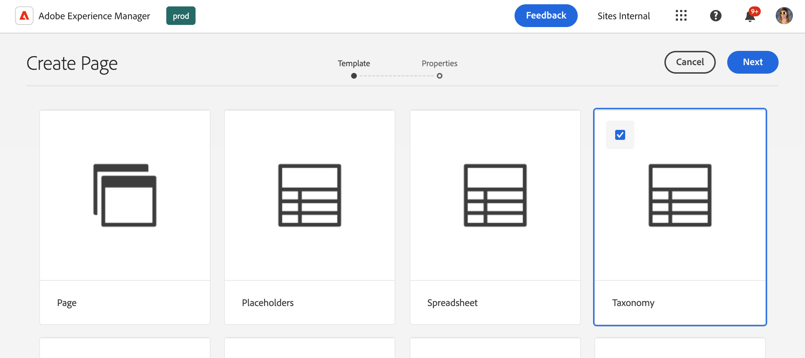
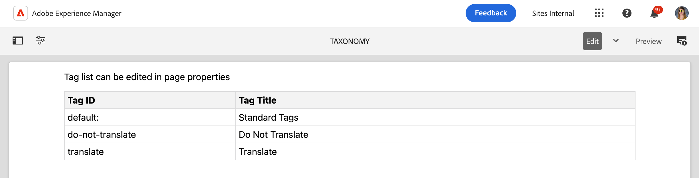
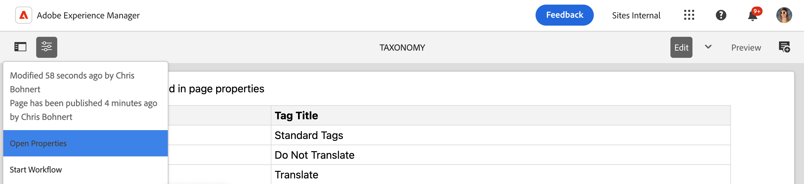
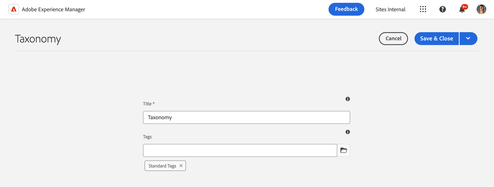

# Hantera taxonomidata {#managing-taxonomy-data}

Lär dig hur du hanterar taxonomidata för att använda taggar med dina AEM med Edge Delivery Services.

## Introduktion {#introduction}

Taggning är en viktig funktion som hjälper dig att ordna och hantera dina sidor. [Med taggningskonsolen](/help/sites-cloud/administering/tags.md#tagging-console) i AEM kan du skapa en omfattande taxonomi med taggar för att ordna sidorna.

Dessa taggar är användbara inte bara för dig och dina författare när du organiserar ditt innehåll, utan kan även vara till för dina läsare. Taggar och deras taxonomi kan användas i komponenter på sidan för att hjälpa läsarna navigera i innehållet.

Universal Editor fungerar bara med ID:n för dina taggar. Genom att skapa en taxonomisida för ditt innehåll visar du beskrivningarna av taggarna på alla språk för den universella redigeraren så att den kan använda den informationen när du återger innehåll.

## Skapa en taxonomisida {#creating}

En taxonomi skapas som [en annan sida i AEM](/help/sites-cloud/authoring/sites-console/creating-pages.md).

1. Navigera till [**webbplatskonsolen**](/help/sites-cloud/authoring/sites-console/introduction.md).

1. Välj den plats där du vill skapa taxonomin.

1. Tryck eller klicka på **Skapa** -> **Sida**.

   

1. På fliken **Mall** i guiden **Skapa sida** väljer du mallen **Taxonomi** och trycker eller klickar på **Nästa**.

   

1. På fliken **Egenskaper** i guiden **Skapa sida** anger du en meningsfull **rubrik** för sidan och i fältet **Taggar** [använder du taggväljaren](/help/sites-cloud/authoring/sites-console/tags.md) för att välja de taggar eller namnutrymmen som du vill ska ingå i taxonomin.

   

1. Tryck eller klicka på **Skapa**.

Taxonomisidan skapas. I dialogrutan **Slutfört** kan du trycka på eller klicka på dialogrutan **Klar** för att stänga meddelandet eller **Öppna** för att redigera sidan i [sidredigeraren](/help/sites-cloud/authoring/page-editor/introduction.md).

Observera det resulterande sidnamnet på taxonomisidan som kan användas i följande steg.

## Redigera en taxonomisida {#editing}

Du börjar redigera en taxonomisida precis som andra sidor i AEM.

1. Navigera till [**webbplatskonsolen**](/help/sites-cloud/authoring/sites-console/introduction.md).

1. Välj den taxonomi du vill redigera.

1. Tryck eller klicka på **Redigera** i åtgärdsfältet.

1. Sidredigeraren öppnas och taxonomin visas.

   * Taxonomisidan är skrivskyddad i sidredigeraren.

   

1. Tryck eller klicka på ikonen **Sidinformation** i verktygsfältet och välj **Öppna egenskaper**.

   

1. I fönstret **Sidegenskaper** kan du uppdatera sidans namn och använda taggväljaren för att uppdatera de taggar och namnutrymmen som ingår i taxonomin.

   

1. Tryck eller klicka på **Spara och stäng**.

Sidan som visas i sidredigeraren är skrivskyddad eftersom innehållet i taxonomin genereras automatiskt från de markerade taggarna och namnutrymmena. De fungerar som en typ av filter som automatiskt genererar innehållet i taxonomin. Därför finns det ingen anledning att redigera sidan direkt i redigeraren.

AEM uppdaterar automatiskt innehållet på taxonomisidan när du uppdaterar underliggande taggar och namnutrymmen. Du måste [publicera taxonomin](#publishing) igen efter en ändring för att ändringarna ska bli tillgängliga för användarna.

## Uppdatera paths.json för taxonomipublikation {#paths-json}

Precis som när du [hanterar och publicerar tabelldata för din Edge Delivery Services-webbplats](/help/edge/wysiwyg-authoring/tabular-data.md) måste du uppdatera `paths.json`-filen för ditt projekt så att dina taxonomidata kan publiceras.

1. Öppna projektets rot i GitHub.

1. Tryck eller klicka på filen `paths.json` för att öppna informationen om den och sedan på ikonen **Redigera** .

   

1. Lägg till en linje för att mappa din nya taxonomisida till en `.json`-resurs.

   ```json
   {
     "mappings": [
      "/content/<site-name>/:/",
      "/content/<site-name>/<taxonomy-page-name>:/<taxonomy-json-name>.json"
     ]
   }
   ```

   * `<taxonomy-page-name>` måste matcha namnet på den [taxonomisida du skapade](#creating).
   * `<taxonomy-json-name>` kan vara vilket giltigt namn du vill.

1. Klicka på **Verkställ ändringar..** om du vill spara ändringarna i `main`.

   * Bekräfta `main` eller skapa en pull-begäran enligt din process.

Den här processen behöver bara göras en gång per taxonomisida. När du är klar kan du publicera taxonomin.

>[!TIP]
>
>Mer information om sökvägsmappningar finns i dokumentet [Sökvägsmappning för Edge Delivery Services](/help/edge/wysiwyg-authoring/path-mapping.md).

## Publicera en taxonomi {#publishing}

En taxonomi är inte tillgänglig för Universal Editor eller dina användare förrän den publiceras.

Taxonomisidor publiceras på samma sätt som andra sidor av [med hjälp av ikonerna **Quick Publish** eller **Manage Publication** i verktygsfältet](/help/sites-cloud/authoring/sites-console/publishing-pages.md).

Du måste publicera taxonomisidan igen varje gång du:

* Redigera taxonomisidan.
* Redigera eller lägg till i de taggar och namnutrymmen som finns på taxonomisidan.

Om du skapar en ny taxonomisida måste du först [lägga till en mappning till den i `paths.json`-filen i projektet](#paths-json).

## Åtkomst till taxonomiinformation {#accessing}

När taxonomin publicerats kan informationen utnyttjas av den universella redigeraren och göras synlig för användarna.

Du kan komma åt taxonomin som JSON-data på följande adress.

`https://<branch>--<repository>--<owner>.aem.page/<taxonomy-json-name>.json`

Använd `<taxonomy-json-name>` som du definierade när du [mappar taxonomin till `paths.json`-filen i ditt projekt](#paths-json). Taxonomidata returneras som JSON-data, som i följande exempel.

```json
{
  "total": 3,
  "offset": 0,
  "limit": 3,
  "data": [
    {
      "tag": "default:",
      "title": "Standard Tags"
    },
    {
      "tag": "do-not-translate",
      "title": "Do Not Translate"
    },
    {
      "tag": "translate",
      "title": "Translate"
    }
  ],
  "columns": [
    "tag",
    "title"
  ],
  ":type": "sheet"
}
```

Dessa JSON-data uppdateras automatiskt när du uppdaterar taxonomin och publicerar den på nytt. Ditt program kan programmässigt komma åt den här informationen för dina användare.

[Om du behåller taggar på flera språk ](/help/sites-cloud/administering/tags.md#managing-tags-in-different-languages) kan du komma åt de språken genom att skicka ISO2-språkkoden som värdet för en `sheet=` -parameter.

## Exponera ytterligare taggegenskaper {#additional-properties}

Som standard innehåller din taxonomi `tag`- och `title`-värden enligt [ i föregående exempel](#accessing). Du kan konfigurera taxonomin så att ytterligare taggegenskaper visas. I det här exemplet visar vi taggbeskrivningen.

1. Använd Sites-konsolen för att välja den taxonomi du skapade.
1. Tryck eller klicka på ikonen **Egenskaper** i verktygsfältet.
1. I avsnittet **Ytterligare egenskaper** trycker eller klickar du på **Lägg till** för att lägga till ett fält.
1. I det nya fältet anger du JRC-egenskapens namn som ska visas. I det här fallet anger du `jcr:description` som taggbeskrivning.
1. Tryck eller klicka på **Spara och stäng**.
1. Ha taxonomin markerad och tryck eller klicka på **Snabba Publish** i verktygsfältet.

Nu [när du kommer åt din taxonomi](#accessing) inkluderas taggbeskrivningen (eller den egenskap du väljer att visa) i JSON.

```json
{
  "total": 3,
  "offset": 0,
  "limit": 3,
  "data": [
    {
      "tag": "default:",
      "title": "Standard Tags",
      "jcr:description": "These are the standard tags"
    },
    {
      "tag": "do-not-translate",
      "title": "Do Not Translate",
      "jcr:description": "Tag to mark pages that should not be translated"
    },
    {
      "tag": "translate",
      "title": "Translate",
      "jcr:description": "Tag to mark pages that should be translated"
    }
  ],
  "columns": [
    "tag",
    "title",
    "jcr:description"
  ],
  ":type": "sheet"
}
```
