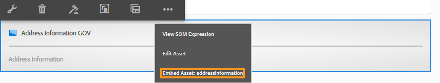

# Skapa och använda adaptiva Forms-fragment i ett adaptivt formulär  {#adaptive-form-fragments}

| Version | Artikellänk |
| -------- | ---------------------------- |
| AEM 6.5 | [Klicka här](https://experienceleague.adobe.com/docs/experience-manager-65/forms/adaptive-forms-basic-authoring/adaptive-form-fragments.html?lang=en) |
| AEM as a Cloud Service | Den här artikeln |

Alla formulär har utformats för ett specifikt ändamål, men det finns några vanliga segment i de flesta formulär, till exempel för att ge personliga uppgifter som namn och adress, familjeinformation, inkomstinformation och så vidare. Formulärutvecklare måste skapa dessa gemensamma segment varje gång ett nytt formulär skapas. Adaptiv Forms är en praktisk mekanism för att skapa formulärsegment som en panel eller en grupp fält endast en gång och återanvända dem i adaptiv Forms. Dessa återanvändbara och fristående segment kallas adaptiva formulärfragment.

## Skapa ett fragment {#create-a-fragment}

Du kan skapa ett anpassat formulärfragment från grunden eller spara en panel i ett befintligt anpassat formulär som fragment.

### Skapa fragment från grunden {#create-fragment-from-scratch}

1. Logga in [!DNL AEM Forms] författarinstans på https://[*värdnamn*]:[*port*]/aem/forms.html.
1. Klicka **Skapa > Adaptivt formulärfragment**.
1. Ange rubrik, namn, beskrivning och taggar för fragmentet.

   >[!NOTE]
   >
   >Se till att du anger ett unikt namn för fragmentet. Om det redan finns ett annat fragment med samma namn kan fragmentet inte skapas.

1. Klicka för att öppna **Formulärmodell** -fliken och från **Välj från** väljer du en av följande modeller för fragmentet:

   * **Ingen**: Anger att fragmentet ska skapas från grunden utan att någon formulärmodell används.

     >[!NOTE]
     >
     > I Adaptiv Forms kan du använda ett enda formulärfragment (baserat på kärnkomponenter) flera gånger i ett formulär. Den har stöd för både icke-baserade och schemabaserade formulärfragment.

   * **Formulärmall**: Anger att fragmentet ska skapas med hjälp av en XDP-mall som överförts till [!DNL AEM Forms]. Välj lämplig XDP-mall som formulärmodell för fragmentet.

   

   Delformulären som är markerade som fragment i den valda formulärmallen visas också. Du kan välja ett delformulär för Adaptivt formulärfragment i listrutan.

   

   Dessutom kan du skapa ett adaptivt formulärfragment med hjälp av delformulär som inte är markerade som fragment i formulärmallen genom att ange SOM-uttrycket för delformuläret i listrutan.

   * **XML-schema**: Anger att fragmentet ska skapas med ett XML-schema som har överförts till [!DNL AEM Forms]. Du kan överföra eller välja bland tillgängliga XML-scheman som formulärmodell för fragmentet.

   

   Du kan också skapa ett adaptivt formulärfragment genom att välja en complexType som finns i det valda schemat i listrutan.

   

1. Klicka **Skapa** och sedan klicka **Öppna** om du vill öppna fragmentet, med en standardmall, i redigeringsläge.

I redigeringsläge kan du dra och släppa alla adaptiva formulärkomponenter från AEM-sidan till fragmentet. <!-- For information about Adaptive Form components, see Introduction to authoring Adaptive Forms. -->

Om du dessutom har valt ett XML-schema eller en XDP-formulärmall som formulärmodell för fragmentet visas en ny flik som visar formulärmodellhierarkin i innehållssökaren. Du kan dra och släppa formulärmodellelement till fragmentet. De tillagda formulärmodellelementen konverteras till formulärkomponenter samtidigt som de ursprungliga egenskaperna från den associerade XDP- eller XSD-filen behålls.

### Spara panelen som ett fragment {#save-panel-as-a-fragment}

1. Öppna ett anpassat formulär som innehåller den panel som du vill spara som anpassat formulärfragment.
1. Klicka på i panelens verktygsfält **[!UICONTROL Save as Fragment]**. Dialogrutan Spara som fragment öppnas.

   >[!NOTE]
   >
   >Om panelen som du sparar som fragment innehåller en underordnad panel, kommer det resulterande fragmentet att inkludera dem.

1. Ange följande information i dialogrutan Skapa fragment:

   * **Namn**: Namnet på fragmentet. Standardvärdet är panelens elementnamn. Det är ett obligatoriskt fält.

     >[!NOTE]
     >
     >Se till att du anger ett unikt namn för fragmentet. Om det redan finns ett annat fragment med samma namn kan fragmentet inte skapas.

   * **Titel**: Fragmentets namn. Standardvärdet är panelens namn.

   * **Beskrivning**: Beskrivning av fragmentet.

   * **Taggar**: Taggar metadata för fragmentet.

   * **Målsökväg**: Databassökväg där fragmentet sparas. Om du inte anger en sökväg skapas en nod med samma namn som fragmentet bredvid noden som innehåller det adaptiva formuläret. Fragmentet sparas i den här noden.

   * **Formulärmodell**: Beroende på formulärmodellen för det adaptiva formuläret visas det här fältet **XML-schema**, **Formulärmall**, eller **Ingen**. Det är ett icke-redigerbart fält.

   * **Fragment Model Root**: Visas bara i XSD-baserad adaptiv Forms. Den anger fragmentmodellens rot. Du kan välja **/** eller XSD-komplextypen från rullgardinsmenyn. Du kan bara återanvända fragmentet i ett annat adaptivt formulär om du väljer den komplexa typen som fragmentmodellroten.
Om du väljer **/** som fragmentmodellrot är det fullständiga XSD-trädet från roten synligt på fliken Adaptiv formulärdatamodell. För en fragmentmodellrot av en komplex typ visas bara de underordnade för den valda komplexa typen på fliken Adaptiv formulärdatamodell.

   * **XSD-referens**: Visas endast i XSD-baserad Adaptive Forms. Den visar platsen för XML-schemat.

   * **XDP-referens**: Visas endast i XDP-baserade adaptiva Forms. Här visas platsen för XDP-formulärmallen.

   

   Dialogrutan Spara som fragment

1. Klicka **OK**.

   Panelen sparas på den angivna platsen eller standardplatsen i databasen. I det adaptiva formuläret ersätts panelen av en ögonblicksbild av fragmentet. Som visas nedan sparas den allmänna informationspanelen och dess underordnade paneler, Personlig information och Adress, som ett fragment.

   Om du vill redigera fragmentet klickar du på **[!UICONTROL Edit Asset]** i panelens verktygsfält. Fragmentet öppnas i en ny flik eller i ett nytt fönster i redigeringsläge.

   

## Arbeta med fragment {#working-with-fragments}

### Konfigurera fragmentutseende {#configure-fragment-appearance}

Alla fragment som du infogar i Adaptiv Forms visas som en platshållarbild. Platshållaren visar titlar på upp till högst tio underordnade paneler i fragmentet. Du kan konfigurera [!DNL AEM Forms] om du vill visa hela avsnittet i stället för platshållarbilden.

Utför följande steg för att visa fullständiga fragment i formulär:

1. Gå AEM webbkonsolens konfigurationssida på https:[*värd*]:[*port*]/system/console/configMgr.

1. Sök och klicka **[!UICONTROL Adaptive Form Configuration Service]** för att öppna den i redigeringsläge.
1. Inaktivera **[!UICONTROL Enable Placeholder in place of Fragment]** om du vill visa hela fragment i stället för platshållarbilden.

### Infoga ett fragment i ett anpassat formulär {#insert-a-fragment-in-an-adaptive-form}

De adaptiva formulärfragment som du skapar visas på fliken Adaptiva formulärfragment i AEM innehållssökning. Så här infogar du ett adaptivt formulärfragment i ett adaptivt format:

1. Öppna det adaptiva formuläret i redigeringsläge där du vill infoga ett adaptivt formulärfragment.
1. Klicka **Resurser**  i sidlisten. Välj **Adaptiva formulärfragment** i listrutan.

   Du kan också välja att visa alla adaptiva formulärfragment eller filter baserat på formulärmodellen - Formulärmall, XML-schema eller Grundläggande.

1. Dra och släpp ett adaptivt formulärfragment på det adaptiva formuläret.

   >[!NOTE]
   >
   >Det adaptiva formulärfragmentet är inte aktiverat för redigering inifrån det adaptiva formuläret. Dessutom kan du inte använda ett XSD-baserat fragment i ett JSON-baserat adaptivt formulär och tvärtom.

Det adaptiva formulärfragmentet infogas som referens i det adaptiva formuläret och synkroniseras med det fristående adaptiva formulärfragmentet. Det innebär att när du uppdaterar det adaptiva formulärfragmentet återspeglas ändringarna i alla adaptiva Forms där fragmentet används.

### Bädda in ett fragment i adaptiv form {#embed-a-fragment-in-adaptive-form}

Du kan välja att bädda in ett adaptivt formulärfragment i ett adaptivt formulär genom att klicka på **Bädda in resurs: &lt;*fragmentName*>** på panelens verktygsfält för det tillagda fragmentet, vilket visas i följande exempelbild.

>[!NOTE]
>
>Det inbäddade fragmentet är inte längre länkat till det fristående fragmentet. Du kan redigera komponenterna i det inbäddade fragmentet i det adaptiva formuläret.

### Använda fragment inom fragment {#using-fragments-within-fragments}

Du kan skapa kapslade adaptiva formulärfragment, vilket betyder att du kan dra och släppa ett fragment i ett annat fragment och ha en kapslad fragmentstruktur.

### Ändra fragment {#change-fragments}

Du kan ersätta eller ändra ett adaptivt formulärfragment med ett annat fragment genom att använda **Välj fragmentresurs** i dialogrutan Redigera-komponent för en anpassad formulärfragmentpanel.

### Använda ett formulärfragment flera gånger i ett adaptivt formulär {#using-form-fragment-mutiple-times-in-af}

Du kan använda ett schemabaserat formulärfragment flera gånger i ett adaptivt formulär för att spara data unikt för varje formulärfragmentfält. Du kan t.ex. använda ett adressformulärfragment för att samla in adressinformation för permanenta adresser, kommunikationer och för att presentera levande adresser i ett låneansökningsformulär.

>[!NOTE]
>
> Om du använder icke-baserade formulärfragment flera gånger i ett adaptivt formulär uppstår problem med datasynkronisering mellan fragmentens fält. Du kan använda ett kärnkomponentbaserat formulärfragment](/help/forms/adaptive-form-fragments-core-components.md) som inte är knutet till någon formulärdatamodell, flera gånger i ett [formulär utan att det uppstår problem med datasynkroniseringen.

## Automatisk mappning av fragment för databindning {#auto-mapping-of-fragments-for-data-binding}

När du skapar ett adaptivt formulärfragment med en XFA-formulärmall eller XSD-komplex typ och drar och släpper fragmentet till ett adaptivt formulär, ersätts XFA-fragmentet eller den komplexa XSD-typen automatiskt med motsvarande adaptiva formulärfragment vars fragmentmodellrot mappas till XFA-fragmentet eller XSD-komplextypen.

Du kan ändra fragmentresursen och dess bindningar i dialogrutan Redigera komponent.

>[!NOTE]
>
>Du kan också dra och släppa ett bundet adaptivt formulärfragment från biblioteket för adaptivt formulärfragment i AEM innehållssökare och ange rätt bindningsreferens från dialogrutan Redigera komponent på panelen Adaptivt formulärfragment.

## Hantera fragment {#manage-fragments}

Du kan utföra flera åtgärder på adaptiva formulärfragment med [!DNL AEM Forms] Gränssnitt.

1. Gå till `https://[hostname]:'port'/aem/forms.html`.

1. Klicka **Välj** i [!DNL AEM Forms] Användargränssnittets verktygsfält och välj ett adaptivt formulärfragment. I verktygsfältet visas följande åtgärder som du kan utföra på det valda adaptiva formulärfragmentet.

<table>
 <tbody>
  <tr>
   <td>
<strong>Åtgärd</strong>
 </td>
   <td>
<strong>Beskrivning</strong>
 </td>
  </tr>
  <tr>
   <td>
Öppna
 </td>
   <td>
Öppnar det markerade adaptiva formulärfragmentet i redigeringsläge.    
 </td>
  </tr>
  <tr>
   <td>
Visa egenskaper
 </td>
   <td>
Öppnar egenskapspanelen. På panelen Egenskaper kan du visa och redigera egenskaper, generera en förhandsvisning och överföra en miniatyrbild för det valda fragmentet. Mer information finns i <a href="manage-form-metadata.md" target="_blank">Hantera metadata</a>.    
 </td>
  </tr>
  <tr>
   <td>
Kopiera
 </td>
   <td>
Kopierar det markerade fragmentet. Knappen Klistra in visas i verktygsfältet.    
 </td>
  </tr>
  <tr>
   <td>
Ladda ned
 </td>
   <td>
Hämtar det markerade fragmentet.    
 </td>
  </tr>
  <tr>
   <td>
Förhandsgranska
 </td>
   <td>
Tillhandahåller alternativ för att förhandsgranska fragmentet som HTML eller som en anpassad förhandsgranskning genom att sammanfoga data från en XML-fil med fragmentet. <!-- For more information, see <a href="previewing-forms.md" target="_blank">Previewing a form</a>.    -->
 </td>
  </tr>
  <tr>
   <td>
Starta granskning/hantera granskning
 </td>
   <td>
Gör att du kan initiera och hantera en granskning av det valda fragmentet. <!-- For more information, see <a href="create-reviews-forms.md" target="_blank">Creating and managing reviews</a>.    
 --> </td>
  </tr>
  <tr>
   <td>
Skapa ordlista
 </td>
   <td>
Skapar en ordlista för lokalisering av det valda fragmentet. <!-- For more information, see <a href="lazy-loading-adaptive-forms.md" target="_blank">Localizing Adaptive Forms</a>.    --> 
 </td>
  </tr>
  <tr>
   <td>
Publicera/avpublicera
 </td>
   <td>
Publicerar/avpublicerar det markerade fragmentet.    
 </td>
  </tr>
  <tr>
   <td>
Ta bort
 </td>
   <td>
Tar bort det markerade fragmentet.    
 </td>
  </tr>
 </tbody>
</table>

## Lokalisera anpassat formulär som innehåller fragment {#localizing-adaptive-form-containing-fragments}

Om du vill lokalisera ett adaptivt formulär som innehåller adaptiva formulärfragment måste du lokalisera fragmentet och formuläret separat. Tanken är att lokalisera ett fragment en gång och återanvända det i flera adaptiva Forms.

>[!NOTE]
>
>Lokaliseringstangenterna i fragmentet visas inte i XLIFF-filen för ett adaptivt formulär.

## Viktiga punkter att komma ihåg när du arbetar med fragment {#key-points-to-remember-when-working-with-fragments}

* Kontrollera att fragmentnamnet är unikt. Fragmentet kan inte skapas om det finns ett befintligt fragment med samma namn.
* Om du sparar en panel som ett fragment som innehåller ett annat XDP-fragment i ett XDP-baserat adaptivt formulär, binds det resulterande fragmentet automatiskt till det underordnade XDP-fragmentet. Om det finns ett XSD-baserat adaptivt formulär är det resulterande fragmentet bundet till schemaroten.
* När du skapar ett adaptivt formulärfragment skapas en fragmentnod, som liknar noden guideContainer för ett adaptivt formulär i CRXDe Lite.
* Ett fragment i ett adaptivt formulär som använder en annan formulärdatamodell stöds inte. Ett XDP-baserat fragment stöds till exempel inte i en XSD-baserad adaptiv form och omvänt.
* Anpassade formulärfragment kan användas via fliken Adaptiva formulärfragment i AEM innehållssökaren.
* Alla uttryck, skript och format i ett fristående adaptivt formulärfragment behålls när de infogas som referens eller bäddas in i ett adaptivt formulär.
* Du kan inte redigera ett adaptivt formulärfragment som infogas med referens i ett adaptivt formulär. Om du vill redigera kan du antingen redigera det fristående adaptiva formulärfragmentet eller bädda in fragmentet i det adaptiva formuläret.
* När du publicerar ett adaptivt formulär måste du publicera de fristående adaptiva formulärfragmenten som infogats som referens i det adaptiva formuläret.
* När du publicerar om ett uppdaterat adaptivt formulärfragment återspeglas ändringarna i de publicerade instanserna av det adaptiva formulär där fragmentet används.
* Adaptivt formulär som innehåller komponenten Verify har inte stöd för anonyma användare. Det rekommenderas inte heller att använda komponenten Verify i ett adaptivt formulärfragment.
* (**Endast** Mac) Om du vill vara säker på att funktionen för formulärfragment fungerar perfekt i alla scenarier lägger du till följande post i filen /private/etc/hosts:
  `127.0.0.1 <Host machine>` **Värddator**: Den Apple Mac-dator som [!DNL AEM Forms] distribueras.

<!--
## Reference Fragments {#reference-fragments}

Reference Adaptive Form Fragments that you can use to create your form are available. For more information, see [Reference Fragments](reference-adaptive-form-fragments.md).
-->

>[!MORELIKETHIS]
>
>* [Adaptiva formulärfragment i kärnkomponenter](/help/forms/adaptive-form-fragments-core-components.md)
