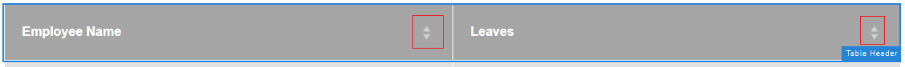

# Tabeller i adaptiv form {#tables-in-adaptive-forms}

Att använda tabeller är ett effektivt, förenklat och organiserat sätt att presentera komplexa data. Det gör det enkelt för användarna att identifiera information och ge indata i en ordnad ordning av rader och kolumner. De flesta formulär från finanssektorn och myndigheter kräver stora datatabeller för att skicka siffror och utföra beräkningar.

AEM Forms tillhandahåller en tabellkomponent i komponentwebbläsaren i sidofältet som gör att du kan skapa tabeller i adaptiva formulär. Några av de viktigaste funktionerna i den är:

* Responsiv layout på mobila enheter
* Konfigurerbara rader och kolumner
* Dynamisk infogning och borttagning av rader vid körning
* Kombinera eller sammanfoga och dela celler
* Tillgängliga för skärmläsare
* Anpassad layout med CSS
* Kompatibel och mappad med XDP-tabellkomponent
* Stöd för att lägga till rader eller celler med XSD-element för komplexa typer
* Sammanfoga data från en XML-fil

## Skapa en tabell {#create-a-table}

Om du vill skapa en tabell drar och släpper du tabellkomponenten från komponentwebbläsaren i sidosparken på det adaptiva formuläret. Tabellen innehåller som standard två kolumner och tre rader, inklusive rubrikraden.


### Om rubrik- och brödceller {#about-header-and-body-cells}

Rubrikcellerna är textfält. Om du vill ändra rubrikens etikett högerklickar du på rubrikcellen och klickar på **Redigera**. Uppdatera etiketten i dialogrutan Redigera **Värde** fält och klicka **OK**.

Tabellcellerna är som standard textrutor. Du kan ersätta en innehållscell med andra adaptiva formulärkomponenter som är tillgängliga i sidosparken, till exempel en numerisk ruta, datumväljare eller nedrullningsbar lista.

Den första innehållsraden i följande tabell innehåller till exempel textruta, datumväljare och nedrullningsbara listkomponenter som celler.


Du kan sammanfoga två eller flera innehållsceller genom att markera cellerna som du vill sammanfoga, högerklicka och markera **Sammanfoga**. Du kan också dela en sammanfogad cell genom att högerklicka på den och markera **Dela celler**.

### Lägga till, ta bort, flytta rader och kolumner {#add-delete-move-rows-and-columns}

Du kan lägga till och ta bort en rad eller kolumn och flytta en rad uppåt och nedåt i en tabell.

#### Lägga till, ta bort eller flytta en rad

Om du vill lägga till, ta bort eller flytta raden klickar du på en cell i raden. öppna innehållsläsaren  och markerar motsvarande rad markeras den markerade raden med verktygsfältsalternativet där du kan lägga till, ta bort eller flytta raden uppåt eller nedåt.

* The **[!UICONTROL Move Up]** och **[!UICONTROL Move Down]** flyttar den markerade raden uppåt och nedåt.

* The **[!UICONTROL Add Column]** läggs en rad till nedanför den markerade raden.

* The **[!UICONTROL Delete Column]** tar bort den markerade raden.


Dubbelklicka på raden för att konfigurera egenskaper för en rad, till exempel Namn, Bind-referens, Upprepa inställningar, CSS-klass.


#### Lägga till eller ta bort en kolumn

Om du vill lägga till eller ta bort en kolumn klickar du på textcellen i rubrikavsnittet. Ett verktygsfält öppnas med alternativ för att lägga till eller ta bort en kolumn:


>[!NOTE]
>
>Du kan lägga till valfritt antal rader i en tabell, men det maximala antalet kolumner du kan lägga till är sex. Du kan inte heller ta bort rubrikraden från tabellen.

### Lägg till tabellbeskrivning {#add-table-description}

Du kan lägga till en beskrivning av tabellen för att förklara hur informationen är organiserad och att skärmläsare kan tolka och läsa upp den. Så här lägger du till beskrivningen:

1. Markera tabellen och tryck på  om du vill visa dess egenskaper i sidofältet.
1. Ange en sammanfattning på fliken Tillgänglighet.
1. Klicka **Klar**.

### Sortera kolumner i en tabell {#sortcolumnstable}

Du kan sortera data baserat på valfri kolumn i en tabell i det anpassade formuläret. Värdena i kolumnen kan sorteras i stigande eller fallande ordning.

Sortering kan användas för tabellkolumner som innehåller:

* Statisk text
* Egenskaper för datamodellsobjekt
* Kombination av statiska text- och datamodellsobjektsegenskaper

Om du vill använda sortering på tabellkolumner måste tabellkolumncellerna innehålla någon av följande komponenter: Numerisk ruta, Numerisk nummerlista, Datumindatafält, Datumväljare, Text eller Textruta.

Så här aktiverar du sortering:

1. Markera tabellen och tryck på  (Konfigurera). Du kan också markera tabellen med **Innehåll** webbläsaren i sidospåret av Interactive Communication.
1. Välj **Aktivera sortering**.
1. Tryck  för att spara tabellegenskaperna. Sorteringsikonerna, uppåt- och nedåtpilarna, i kolumnrubriker representerar att sorteringen har aktiverats.

   

1. Växla till **Förhandsgranska** för att visa utdata. Tabellen sorteras automatiskt baserat på tabellens första kolumn.
1. Klicka på kolumnrubriken om du vill sortera värdena baserat på kolumnen.

   En kolumnrubrik med en uppåtpil representerar att tabellen sorteras baserat på den kolumnen. Dessutom visas värdena i kolumnen i stigande ordning.

   

   På samma sätt visas en kolumnrubrik med en nedpil som värden i kolumnen i fallande ordning.

   Du kan också göra ändringar i tabellen i **Förhandsgranska** och klicka på kolumnrubriken igen för att sortera kolumnvärdena.

## Ange kolumnbredd för en tabell {#set-column-width}

Gör så här för att ange kolumnbredd för en tabell:

1. I **[!UICONTROL Content]** trycker du på **[!UICONTROL Table]** och tryck på Konfigurera ()ikon.

1. Ange den kommaavgränsade listan med värden i dialogrutan **[!UICONTROL Column Width]** -fält för att ange den proportionella bredden för varje kolumn i tabellen. För en tabell som innehåller 3 kolumner anger du till exempel 2,4,6 som värde i **[!UICONTROL Column Width]** resulterar i att kolumnbredden ställs in som 2/12 för den första kolumnen, 4/12 för den andra kolumnen och 6/12 för den tredje kolumnen. 2/12 som bredd för den första kolumnen avser en sjättedel av tabellbredden. På samma sätt anger 4/12 den andra kolumnbredden som en tredjedel av tabellbredden och 6/12 den tredje kolumnbredden som halva tabellbredden.

## Konfigurera tabellformat {#configure}

Du kan definiera formatet för en tabell med hjälp av stilläget i verktygsfältet på sidan. Utför följande steg för att växla till formateringsläge och redigera tabellformatet

1. Tryck på innan du förhandsgranskar i sidverktygsfältet  > **Stil**.

1. Markera en tabell i sidlisten och tryck på redigeringsknappen .
Du kan se formategenskaperna i sidofältet.


>[!NOTE]
>
>Du kan ändra färgtemat för huvud- och innehållsrader genom att ändra värdena för [LESS-variabler](https://lesscss.org//). Mer information finns i [Teman i AEM Forms](/help/forms/themes.md).

## Lägga till eller ta bort en rad dynamiskt {#add-or-delete-a-row-dynamically}

Tabeller har körklara funktioner för att dynamiskt lägga till eller ta bort rader vid körning.

1. Markera en tabellrad och tryck på .
1. På fliken Upprepa inställningar anger du minsta och högsta antal rader för att begränsa antalet rader i tabellen.
1. Klicka **Klar**.

Vid körning eller förhandsgranskning visas **+** och  för att lägga till eller ta bort en rad.


>[!NOTE]
>
>Det går inte att lägga till eller ta bort en rad dynamiskt i Sidhuvuden i den vänstra mobila layouten för tabeller.

## Uttryck i en tabell {#expressions-in-a-table}

Tabeller i anpassningsbara formulär gör att du kan skriva uttryck i JavaScript för att skapa beteenden som att visa eller dölja en tabell eller en rad, lägga till alla tal och visa summan i en cell, aktivera eller inaktivera en cell, validera användarindata och så vidare. Dessa uttryck använder API:er för adaptiva formulärskriptmodeller.

Tabellerna och raderna har endast stöd för synlighetsuttryck som styr synligheten baserat på värdet som returneras av ett uttryck, men cellerna har stöd för följande uttryck:

* **Initieringsskript:** för att utföra en åtgärd vid initiering av ett fält.
* **Värde för implementeringsskript:** om du vill ändra komponenterna i ett formulär efter att värdet för ett fält har ändrats.

>[!NOTE]
>
>Om XFA-skriptet för ändring/utträde också tillämpas på samma fält, körs XFA-skriptet för ändring/utträde före skriptet för värdeimplementering.

* **Beräkna uttryck**: till automatisk beräkning av ett fälts värde.
* **Valideringsuttryck**: för att validera ett fält.
* **Åtkomstuttryck**: för att aktivera/inaktivera ett fält.
* **Synlighetsuttryck**: för att styra visningen av ett fält och en panel.

Synlighetsuttrycket för en tabell eller rad kan definieras på fliken Panelegenskaper i motsvarande dialogruta för redigeringskomponenter. Uttrycken för en cell kan definieras på fliken Skript i dialogrutan Redigera komponent.

En fullständig lista över adaptiva formulärklasser, händelser, objekt och offentliga API:er finns på [API-referens för JavaScript-bibliotek för adaptiva formulär](https://helpx.adobe.com/experience-manager/6-5/forms/javascript-api/index.html).

## Mobillayouter {#mobile-layouts}

Tabeller i anpassningsbara formulär ger oöverträffad upplevelse i mobila enheter tack vare dess flytande och responsiva layouter. AEM Forms har två typer av mobila layouter för tabeller - rubriker till vänster och fällbara kolumner.

Du kan konfigurera en mobil layout för en tabell på fliken Format i dialogrutan Redigera komponent för en tabell.

### Sidhuvuden till vänster {#headers-on-left}

I sidhuvudena i den vänstra layouten flyttas tabellhuvudet till vänster och bara en cell visas mot en rubrik. Varje rad i den här layouten visas som ett distinkt avsnitt. I följande bilder jämförs en tabell på en dator med den på en mobil enhet.


Skrivbordsvy av en tabell med sidhuvud i den vänstra layouten


Mobil vy av en tabell med sidhuvud i vänster layout

### Komprimerbar kolumnlayout {#collapsible-columns-layout}

I kolumnlayouten Komprimerbar komprimeras kolumnerna i tabellen så att en eller två kolumner visas, beroende på enhetens storlek, medan andra kolumner komprimeras. Du kan klicka på ikonen för att komprimera/expandera om du vill visa andra kolumner i tabellen.

>[!NOTE]
>
>Kolumnlayout som kan komprimeras är optimerad för mobila enheter, men fungerar även på stationära datorer, om den tillgängliga bredden inte räcker för att visa alla kolumner i en tabell.

Följande bilder jämför hur en tabell ser ut på en enhet med komprimerade och expanderade kolumner.


Komprimerade kolumner i en tabell där bara två kolumner visas på en mobil enhet


Utökad kolumn i en tabell på en mobil enhet

## Sammanfoga data i en tabell {#merge-data-in-a-table}

Tabeller i anpassningsbara formulär gör att du kan fylla i tabellen under körning med data från en XML-fil. Data-XML-filen kan finnas i det lokala filsystemet på den dator där AEM Forms-servern körs eller i CRX-databasen.

Låt oss ta ett exempel på följande sammanfattande tabell över banktransaktioner som vi vill fylla med data från en XML-fil.


I det här exemplet används elementnamnsegenskapen för:

* raden är **Rad1**
* innehållscellen under transaktionsdatumet är **tableItem1**
* innehållscellen under Beskrivning är **tableItem2**
* innehållscellen under Transaktionstypen är **type**
* den cell under Belopp i USD är **tableItem3**

XML-filen som innehåller data i följande format:

```xml
<?xml version="1.0" encoding="UTF-8"?><afData>
  <afUnboundData>
    <data>
 <typeSelect>0</typeSelect>
 <Row1>
      <tableItem1>2015-01-08</tableItem1>
      <tableItem2>Purchase laptop</tableItem2>
      <type>0</type>
      <tableItem3>12000</tableItem3>
 </Row1>
 <Row1>
      <tableItem1>2015-01-05</tableItem1>
      <tableItem2>Transport expense</tableItem2>
      <type>0</type>
      <tableItem3>120</tableItem3>
 </Row1>
 <Row1>
      <tableItem1>2014-01-08</tableItem1>
      <tableItem2>Laser printer</tableItem2>
      <type>0</type>
      <tableItem3>500</tableItem3>
 </Row1>
 <Row1>
      <tableItem1>2014-12-08</tableItem1>
      <tableItem2>Credit card payment</tableItem2>
      <type>0</type>
      <tableItem3>300</tableItem3>
 </Row1>
 <Row1>
      <tableItem1>2015-01-06</tableItem1>
      <tableItem2>Interest earnings</tableItem2>
      <type>1</type>
      <tableItem3>12000</tableItem3>
 </Row1>
 <Row1>
      <tableItem1>2015-01-05</tableItem1>
      <tableItem2>Payment from a client</tableItem2>
      <type>1</type>
      <tableItem3>500</tableItem3>
 </Row1>
 <Row1>
      <tableItem1>2015-01-08</tableItem1>
      <tableItem2>Food expense</tableItem2>
      <type>0</type>
      <tableItem3>120</tableItem3>
 </Row1>
 </data>
  </afUnboundData>
  <afBoundData>
    <data/>
  </afBoundData>
  <afBoundData/>
</afData>
```

I XML-exemplet definieras data för en rad av `<Row1>` -taggar, som är elementnamnet för raden i tabellen. I `<Row1>` -taggen definieras data för varje cell i -taggen för elementnamnet, till exempel `<tableItem1>`, `<tableItem2>`, `<tableItem3>`och `<type>`.

Om du vill sammanfoga dessa data med tabellen vid körning måste vi peka det adaptiva formuläret som innehåller tabellen mot den absoluta XML-platsen med wcmmode inaktiverat. Om det adaptiva formuläret till exempel är *https://localhost:4502/myForms/bankTransaction.html* och XML-filen sparas på *C:/myTransactions/bankSummary.xml* kan du visa tabellen med data på följande URL:

*https://localhost:4502/myForms/bankTransaction.html?dataRef=file:/// C:/myTransactions/bankSummary.xml&amp;wcmmode=disabled*


## Använd XDP-komponenter och komplexa XSD-typer {#use-xdp-components-and-xsd-complex-types}

Om du har skapat ett adaptivt formulär baserat på en XFA-formulärmall är XFA-elementen tillgängliga på fliken Datamodell AEM Content Finder. Du kan dra och släppa dessa XFA-element, inklusive tabeller, i det anpassningsbara formuläret.

XFA-tabellelementet mappas till tabellkomponenten och fungerar som det ska i adaptiva former. Alla egenskaper och funktioner i XDP-tabellen bevaras när den flyttas till ett anpassat formulär, och du kan utföra vilken åtgärd som helst på den på samma sätt som du gör med en intern adaptiv formulärtabell. Om en rad i en XDP-tabell till exempel är markerad som upprepningsbar upprepas den även när den tas bort i anpassningsbara former.

Dessutom kan du dra och släppa XDP-delformulär för att lägga till en ny rad i tabellen. Observera dock att det inte går att släppa ett kapslat delformulär.

>[!NOTE]
>
>En XDP-tabell utan rubrikrad mappas inte till den adaptiva formulärtabellkomponenten. Istället mappas den till den anpassningsbara formulärpanelskomponenten med flytande layout. När du lägger till en kapslad tabell från en XDP-fil i ett adaptivt formulär konverteras den yttre tabellen till en panel med den inre tabellen bibehållen.

Dessutom kan du dra och släppa en grupp XSD-element med komplex typ för att skapa en tabellrad. En ny rad skapas precis nedanför den rad där du släppte elementen. Cellerna som skapas med XSD-elementen för komplexa typer behåller en bindningsreferens till XSD. Du kan också ersätta en innehållscell med ett XSD-element av komplex typ genom att släppa elementet i cellen.

>[!NOTE]
>
>Antalet element i en XDP-tabellkomponent, ett delformulär eller en XSD-komplex typ får inte överstiga antalet celler i en rad. Du kan till exempel inte släppa fyra element på en rad som bara har tre celler. Det resulterar i ett fel.
>
>Om antalet element är mindre än antalet celler i en rad lägger den nya raden först till celler som baseras på elementen, och därefter läggs standardcellerna till för att fylla i de återstående cellerna i raden. Om du till exempel släpper en grupp med tre element på en rad som har fyra celler, baseras de första tre cellerna på elementen som du släppte och den återstående cellen är standardtabellcellen.

## Viktiga överväganden {#key-considerations}

* Om du flyttar rader uppåt och nedåt när du redigerar en XSD-baserad tabell, visas en del dataförluster från tabellrader i den data-XML som genereras när formuläret skickas.
* Varje tabellcell i standardtabellen har ett fördefinierat elementnamn kopplat till sig. Om du lägger till en annan tabell i det adaptiva formuläret får standardcellerna i den nya tabellen samma elementnamn som i den första tabellen. I sådana fall kommer de data som genereras när formuläret skickas endast att innehålla data i standardcellerna för en av tabellerna. Se därför till att du byter namn på elementnamnen för standardcellerna för brödtext så att de är unika i alla tabeller och undvika dataförlust.

  Observera att detta endast gäller för standardcellerna. Om du lägger till fler rader eller kolumner i en tabell genereras unika elementnamn automatiskt för brödtextceller som inte är standard.
