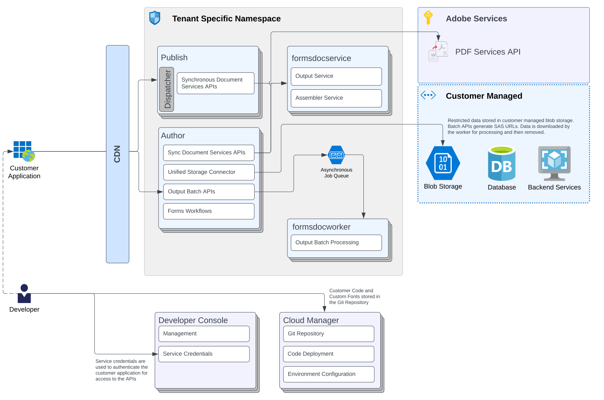

# [!DNL AEM] Forms as a Cloud Service arkitektur {#architecture}

| Version | Artikellänk |
| -------- | ---------------------------- |
| AEM 6.5 | [Klicka här](https://experienceleague.adobe.com/docs/experience-manager-65/forms/install-aem-forms/aem-forms-architecture-deployment.html) |
| AEM as a Cloud Service | Den här artikeln |

[!DNL Adobe Experience Manager Forms] as a Cloud Service är en molnbaserad lösning för företag som vill skapa, hantera, publicera och uppdatera komplexa digitala formulär och kommunikation och samtidigt integrera inlämnade data med back-end-processer, affärsregler och spara data i ett externt datalager. Den utökas [!DNL Adobe Experience Manager as a Cloud Service]. Mer information om skalning, driftsättning, miljöer och annan infrastruktur finns i [En introduktion till arkitekturen i [!DNL Adobe Experience Manager as a Cloud Service]](https://experienceleague.adobe.com/docs/experience-manager-cloud-service/core-concepts/architecture.html).

AEM Forms as a Cloud Service har stöd för två användningsområden: Digital registrering och kundkommunikation. Följande illustrationer visar arkitekturen för båda användningsområdena.

## Forms Digital Enrollment

## Forms Communications

## Komponenter

Forms as a Cloud Service består av flera komponenter:

### CDN (Content Delivery Network)

Alla AEM Forms as a Cloud Service program har tillgång till [inbyggd CDN-tjänst](https://experienceleague.adobe.com/docs/experience-manager-cloud-service/content/implementing/content-delivery/cdn.html). Det ingår i licensen för Forms som Cloud Services.

### Författare

En författare är en as a Cloud Service AEM Forms-instans som körs i standardkörningsläget för författare. Det är avsett för interna användare, formulärdesigners och utvecklare. I en redigeringsmiljö kan du använda följande funktioner:

* Skapa och hantera formulär.
* Ansluter till tjänsten Automated forms conversion för att konvertera ett PDF- eller XDP-formulär till ett adaptivt formulär.
* Skapa och köra Forms-centrerade arbetsflöden.
* Hantera adaptiva formulärresurser.
* Hantera kommunikationsresurser.
* Synkrona RESTful API:er (Real-time API:er) och Batch API:er för att skapa, sammanställa och leverera varumärkesorienterad och personaliserad kommunikation.
* Synkrona API:er för att kombinera, ordna om och validera PDF-dokument.

### Publicera

En Publish-instans är en AEM Forms-as a Cloud Service som körs i det vanliga publiceringskörningsläget. Publiceringsinstanser är avsedda för slutanvändare av formulärbaserade program, t.ex. användare som öppnar en offentlig webbplats och som skickar formulär. Det aktiverar följande funktioner:

* Återge och skicka formulär för slutanvändare.
* Transportering av obearbetade inlämnade formulärdata för vidare bearbetning och lagring i det slutliga databassystemet.
* Ansluter till kundhanterad lagring för att lagra data.
* Koppla upp dig med Adobe Sign för att e-signera en adaptiv post för att skicka formulär.
* Synkronisera API:er för att skapa, sammanställa och leverera varumärkesorienterad och personaliserad kommunikation.
* Synkronisera API:er för att kombinera, ordna om och validera PDF-dokument.

Omvänd replikering är inte tillgängligt på AEM as a Cloud Service för att skicka innehåll/data från publiceringstjänsten till författartjänsten. Du kan dock konfigurera ett adaptivt Forms som körs vid publicering så att data skickas till ett arbetsflöde på en författare (arbetsflöden kan bara köras på författaren). Detta är praktiskt vid användning av godkännanden.

#### Dispatcher

[Dispatcher](https://experienceleague.adobe.com/docs/experience-manager-cloud-service/content/implementing/content-delivery/disp-overview.html) är Adobe Experience Manager verktyg för cachelagring och/eller belastningsutjämning som kan användas med en webbserver i företagsklass.

### Adobes tjänster

**Tjänsten Automated forms conversion**

[Tjänsten automated forms conversion](https://experienceleague.adobe.com/docs/aem-forms-automated-conversion-service/using/introduction.html) konverterar automatiskt dina PDF- och XFA-formulär till enhetsvänliga, responsiva och HTML5-baserade adaptiva formulär.

**Adobe Sign**

Adobe Sign är en molnbaserad e-signaturtjänst som gör att användaren kan skicka, signera, spåra och hantera signaturprocesser via en webbläsare eller mobil enhet. Ni kan integrera Adobe Sign med ett adaptivt formulär för att automatisera signeringsarbetsflöden, förenkla processerna med en eller flera signaturer samt för att elektroniskt signera adaptiva formulär.

<!-- **PDF Service API**
Adobe’s PDF Services API lets create, combine, export, and extract data from PDFs through powerful and flexible cloud-based APIs. -->

### Kundhanterad lagring

Forms as a Cloud Service innehåller alternativ för att lagra innehåll i ett externt lagringssystem som Blob Store, Database eller en lagringstjänst. Du kan också lagra processdata (AEM data från arbetsflödesvariabler) som innehåller känsliga SPD-element (Personal Data) i en kundhanterad databas för säker bearbetning. Adobe rekommenderar att du endast lagrar känsliga data på kundhanterade lager.

Du kan använda **Enhetlig lagringsanslutning** för att ansluta till Blob Storage och **Formulärdatamodell** för att ansluta till databaser eller backend-tjänster (RESTful, SOAP, Azure Blob Storage med mera).

### Dokumenttjänster

Dokumenttjänster består av följande:

* **Utdatatjänst (kommunikation - API:er för dokumentgenerering)** hjälper er att skapa varumärkesgodkända, personaliserade och standardiserade dokument som affärskorrespondenser, kontoutdrag, kravbrev, förmånsmeddelanden, månatliga räkningar eller välkomstpaket.

* **Assembler Service (kommunikation - API:er för dokumenthantering)** hjälper dig att kombinera, ordna om och validera PDF-dokument.

* **DoR-tjänst (Document of Record)** används för att generera DoR (Document of Record). Tjänsten körs i sina egna poder, separat från författaren och publiceringsinstanser av Forms as a Cloud Service. Det ger bättre prestanda och skalar fönstren oberoende av belastningen.

### Cloud Manager

Cloud Manager är en viktig komponent i [AEM as a Cloud Service](https://experienceleague.adobe.com/docs/experience-manager-cloud-service/overview/introduction.html). Det är den enda ingångspunkten för våra kunders verksamhet och utvecklarprofiler. Det är den plats där AEM program och miljöer kan hanteras. Cloud Manager har utvecklats till en självbetjäningsportal där huvudkomponenterna i AEM as a Cloud Service kan skapas och konfigureras:

* Skapa och hantera program
* Skapa och hantera AEM miljöer i programmen
* Skapa och hantera pipelines för distribution av kundkoden och konfigurationen till en viss miljö
* Få meddelanden om viktiga livscykelhändelser för de här komponenterna (t.ex. produktuppdateringar) Mer information om Cloud Manager finns i [Förstå Adobe Cloud Manager](https://experienceleague.adobe.com/docs/experience-manager-learn/foundation/cloud-manager/understand-cloud-manager-for-aem.html) och [Introduktion till Cloud Manager](https://experienceleague.adobe.com/docs/experience-manager-cloud-manager/using/introduction-to-cloud-manager.html).

### Developer Console

En Developer Console innehåller olika detaljer om varje Forms som körs som en molntjänstmiljö. Dessa detaljer är användbara vid felsökning av miljön. Mer information finns i [Felsökning AEM as a Cloud Service med Developer Console](https://experienceleague.adobe.com/docs/experience-manager-learn/cloud-service/debugging/debugging-aem-as-a-cloud-service/developer-console.html).

<!--

+++CDN (Content Delivery Network):

Every AEM Forms as a Cloud Service program has access to Fastly CDN service. It is included in the licence of Forms as a Cloud Services.

+++

+++Adaptive Forms
Adaptive Forms enable customers to author web-friendly reflowable web forms and fragments that are used by the customers for their data capture needs. This feature enables customers to manage their complex data capture needs easily, by leveraging multiple integrations with Adobe Sign, Document Services, Form Data Model, Automated Forms Conversion service, and more.

+++

+++Automated Forms Conversion Service (AFCS)
Automated Forms Conversion service helps accelerate digitization and modernization of data capture experience through automated conversion of PDF forms to adaptive forms. The service, powered by Adobe Sensei, automatically converts your PDF forms to device-friendly, responsive, and HTML5-based adaptive forms. While leveraging the existing investments in PDF Forms and XFA, the service also applies appropriate validations, styling, and layout to adaptive form fields during conversion.

+++

+++Form Data Model
The Form Data Model (FDM) feature is the standard way of creating data integrations with external/internal data sources and using them across the different Forms as a Cloud Service features. FDM provides a rich editor for customers to integrate, define, and manage relationships between the different entities and data sources and perform operations on them. Form data is stored in a data store hosted on the customer premises. Organizations can also use blob store hosted by the cloud provider and Adobe Experince Platform to store data.

+++

+++Forms Workflows
Forms-centric workflows is an extension to the default AEM Workflow and provides our customers with additional workflow capabilities like Form Data review, task assignment, and document services invocation.

+++

+++Communications
Forms as a Cloud Service offering consists of multiple services tailored specifically for document processing.

+++

+++Document of Record
A Document of Record is a PDF version of a form. It provides an ability to keep a record of the information  that you provide and submit in an Adaptive Form in PDF fromat. The service provides a default DoR template and tools to develop a custom template.

+++

## Terminologies

<!-- ## Cloud Manager{#cloud-manager}

Cloud Manager is an essential component to [AEM as a Cloud Service](https://experienceleague.adobe.com/docs/experience-manager-cloud-service/overview/introduction.html?lang=en). Each new tenant of the [!DNL AEM Forms] as a Cloud Service is first provisioned for Cloud Manager access. Cloud Manager is the single-entry point for the operations and developer persona of our customers. It is the place from where the AEM programs and environments can be managed. Cloud Manager has evolved as a self-service portal where the main components of the AEM as a Cloud Service can be created and configured:

* Creating and managing programs
* Creating and managing the AEM environments within the programs
* Creating and managing the pipelines for deploying the customer code and configuration to a particular environment
* Getting notified of important lifecycle events for these components (for example, product updates)
For more information about Cloud Manager, see [Understand Adobe Cloud Manager](https://experienceleague.adobe.com/docs/experience-manager-learn/foundation/cloud-manager/understand-cloud-manager-for-aem.html) and [Introduction to Cloud Manager](https://experienceleague.adobe.com/docs/experience-manager-cloud-manager/using/introduction-to-cloud-manager.html).

## Users and Authentication {#users-and-authentication}

AEM as a Cloud Service includes Admin Console support for AEM instances and Adobe Identity Management System (IMS) based authentication. The Admin Console allows administrators to centrally manage all Experience Cloud users. Users and Groups can be assigned to product profiles associated with AEM as a Cloud Service instances, allowing them to log in to that instance. For more information about users, authentication, and, and accessing an instance of AEM as a Cloud Service, see [IMS Support for [!DNL Adobe Experience Manager] as a Cloud Service](https://experienceleague.adobe.com/docs/experience-manager-cloud-service/security/ims-support.html?lang=en#introduction).

Various personas are involved in a typical [!DNL AEM Forms] project. After you log in to your [!DNL AEM Forms] as a Cloud Service instance, you can [add users in admin console](https://experienceleague.adobe.com/docs/experience-manager-cloud-service/security/ims-support.html) for personas applicable to your organization or project and [assign users to built-in groups](forms-groups-privileges-tasks.md) to provide them required privileges.

To learn various in-built [!DNL AEM Forms] specific user groups and privileges available on [!DNL AEM Forms] as a Cloud Services instance, see [Configure, user, roles and groups](forms-groups-privileges-tasks.md). 

## Developer Experience {#developer-experience}

The new architecture supporting AEM as a Cloud Service brings some key changes to the overall developer experience. One of the major goals for the changes to developer experience is to allow migration to AEM as a Cloud Service as quickly as possible, with little modifications to existing custom code.

## Cloud development {#cloud-development}

Here are the guidelines to run your existing code smoothly on AEM as a Cloud Service environment:

* Store your code and configurations to the Git repository of the associated Cloud Manager program. It makes managing and integrating code with CI/CD a breeze.  
* Make application code and configuration compatible with the baseline [!DNL AEM Forms] images. Using the latest APIs helps to build faster and secure applications.
* Use the Cloud Manager pipeline associated with the Cloud Manager environment to build and deploy applications. It helps you bring the latest features and bug fixed for [!DNL AEM Forms] as a Cloud Service to your environment.
* Try that your custom applications pass all the code quality, security, and performance gates enforced in the pipeline. It helps build secure and better performing applications which leads to better customer experience. You can always use Cloud Manager UI to skip some checks.
This process is commonly referred to as cloud-first development. [!DNL AEM Forms] as a Cloud Service also provides an SDK to support rapid development before the pending code and configuration changes are attempted in the cloud.
Some interfaces that were previously part of the AEM QuickStart are no longer available to the users of the AEM as a Cloud Service environment. For instance, the Web Console where OSGI bundles and their associated configuration are managed. The CRXDE Lite content repository browser becomes only accessible on non-production environment types. A subset of the Web Console functionalities that developers require, especially when it comes to diagnostics and status purposes, is made available via a new developer console.
Also, one of the most common requirements for developers is quick access to the log files of the various environments. With [!DNL AEM Cloud Service], the log files of the different nodes in the Author, Publish are made available via the Cloud Manager, either in the form of files that can be downloaded or via APIs for tailing the logs. Due to the clear separation of code and content, developers can use a particular process for updating content as part of a deployment. The typical use cases for mutable content are:
* Standard “default” content that is part of the customer project (for example, folders, templates, workflows...)
* Search index definitions
* ACLs and permissions
* Service users and user groups
Set up your development environment, [Configure your CI/CD Pipeline](https://experienceleague.adobe.com/docs/experience-manager-cloud-manager/using/how-to-use/configuring-pipeline.html), and learn to [deploy your code](https://experienceleague.adobe.com/docs/experience-manager-cloud-manager/using/how-to-use/deploying-code.html) on the environment. -->

### Adaptiv formulärredigering {#local-development}

När du konfigurerar och konfigurerar [!DNL AEM Forms] i en as a Cloud Service miljö kan du skapa utvecklings-, staging- och produktionsmiljöer. Konfigurera dessutom en lokal utvecklingsmiljö för snabb utveckling och upprepningar. Du kan hämta och konfigurera AEM SDK och [!DNL AEM Forms] arkiv med tilläggsfunktioner för att konfigurera en lokal [!DNL Forms] as a Cloud Service utvecklingsmiljö.  Detaljerade anvisningar finns i [Konfigurera en lokal utvecklingsmiljö](setup-local-development-environment.md).

## Felsökning {#debugging}

AEM as a Cloud Service använder självbetjäning, skalbar, molninfrastruktur. Det kräver att AEM utvecklare förstår och felsöker olika aspekter av AEM as a Cloud Service, från att bygga och distribuera till att få information om AEM program som körs. Mer information finns i [Felsökning AEM as a Cloud Service](https://experienceleague.adobe.com/docs/experience-manager-learn/cloud-service/debugging/debugging-aem-as-a-cloud-service/overview.html).
