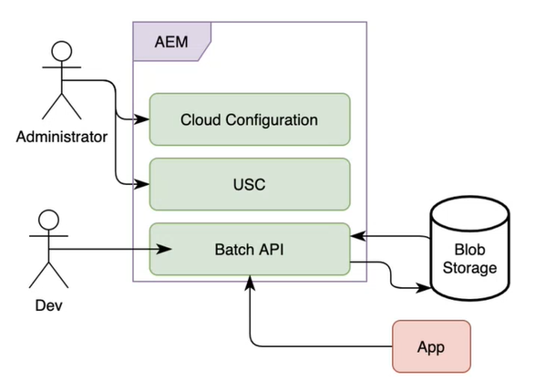

# Använd batchbearbetning

Med kommunikation kan ni skapa, sammanställa och leverera varumärkesorienterad och personaliserad kommunikation som affärskontakter, dokument, kontoutdrag, kravbrev, förmånsbesked, kravbrev, månatliga räkningar och välkomstpaket. Du kan använda API:er för kommunikation för att kombinera en mall (XFA eller PDF) med kunddata för att generera dokument i formaten PDF, PS, PCL, DPL, IPL och ZPL.

Kommunikationen tillhandahåller API:er för on demand- och schemalagd dokumentgenerering. Du kan använda synkrona API:er för on demand- och batch-API:er (asynkrona API:er) för schemalagd dokumentgenerering:

* Synkrona API:er är lämpliga för dokumentgenerering on demand, med låg latens och en post. Dessa API:er lämpar sig bättre för användaråtgärdsbaserade användningsfall. Du kan till exempel skapa ett dokument när en användare har fyllt i ett formulär.

* API:er för gruppbearbetning (asynkrona API:er) är lämpliga för schemalagd hög genomströmning vid användning av flera dokumentgenereringar. Dessa API:er genererar dokument gruppvis. Till exempel telefonräkningar, kontoutdrag och förmånsräkningar som genereras varje månad.

<!-- The following skills are required to create templates and use HTTP APIs: 

* Understanding of Adobe Forms Designer or Acrobat Forms to create templates

* Understanding of HTTP APIs and experience of using HTTP APIs

* Basic understanding of Adobe Experience Manager -->

## Gruppåtgärder {#batch-operations}

En gruppåtgärd är en process för att generera flera dokument av liknande typ för en uppsättning poster med schemalagda intervall. En gruppåtgärd består av två delar: Konfiguration (definition) och körning.

* **Konfiguration (definition)**: En batchkonfiguration lagrar information om olika resurser och egenskaper som ska anges för genererade dokument. Det innehåller till exempel information om XDP- eller PDF-mallen och platsen för kunddata som ska användas tillsammans med att ange olika egenskaper för utdatadokument.

* **Körning**: Om du vill starta en gruppåtgärd skickar du gruppkonfigurationsnamnet till API:t för batchkörning.

### Komponenter i en gruppåtgärd {#components-of-a-batch-operations}

**Molnkonfiguration**: Med Experience Manager Cloud-konfigurationen kan du ansluta en Experience Manager-instans till kundägd Microsoft Azure Storage. Här kan du ange autentiseringsuppgifter för ett kundägt Microsoft Azure-konto som du kan ansluta till.

**Konfiguration av batchdatalager (USC)**: Med batchdatakonfigurationen kan du konfigurera en specifik instans av Blob Storage för API:er för grupper. Här kan du ange in- och utdataplatser i kundägd Microsoft Azure Blob-lagring.

**Grupp-API:er**: Gör att du kan skapa en gruppkonfiguration och köra batchkörningar baserat på dessa konfigurationer för att sammanfoga en PDF- eller XDP-mall med data och generera utdata i formaten PDF, PS, PCL, DPL, IPL och ZPL. Kommunikationen innehåller batch-API:er för konfigurationshantering och batchkörning.

**Lagring**: Kommunikations-API:er använder kundägd Microsoft Azure Cloud-lagring för att hämta kundposter och lagra genererade dokument. Du konfigurerar Microsoft Azure Storage i Experience Manager Cloud Service Configuration.

**App**: Ditt anpassade program som använder API:erna för grupper för att generera och använda dokument.

## Generera flera dokument med gruppåtgärder {#generate-multiple-documents-using-batch-operations}

Du kan använda gruppåtgärder för att generera flera dokument med schemalagda intervall.

>[!VIDEO](https://video.tv.adobe.com/v/338349)

Du kan titta på videon eller följa instruktionerna nedan för att lära dig hur du genererar dokument med gruppåtgärder. API-referensdokumentationen som används i video är tillgänglig i formatet .yaml. Du kan ladda ned [Grupp-API:er](assets/batch-api.yaml) och ladda upp den till Postman för att kontrollera API:ernas funktionalitet och följa med i videon.

### Krav {#pre-requisites}

Följande krävs för att använda batch-API:

* [Microsoft Azure Storage-konto](https://docs.microsoft.com/en-us/azure/storage/common/storage-account-create)
* PDF- eller XDP-mallar
* [Data som ska sammanfogas med mallar](#form-data)
* Användare med administratörsbehörighet för Experience Manager

### Konfigurera din miljö {#setup-your-environment}

Innan du använder en gruppåtgärd:

* Överför kunddata (XML-filer) till Microsoft Azure Blob Storage
* Skapa en molnkonfiguration
* Skapa konfiguration för batchdatalager
* Överför mallar och annat material till Experience Manager Forms Cloud Service

### Överför kunddata (XML-filer) till Azure Storage {#upload-customer-data-to-Azure-Storage}

Skapa på din Microsoft Azure-lagring [behållare](https://docs.microsoft.com/en-us/azure/vs-azure-tools-storage-explorer-blobs) och [ladda upp kunddata (XML)](https://docs.microsoft.com/en-us/azure/vs-azure-tools-storage-explorer-blobs#managing-blobs-in-a-blob-container) till [mappar](https://docs.microsoft.com/en-us/azure/storage/blobs/storage-quickstart-blobs-portal) i behållarna.
>[!NOTE]
>
>Du kan konfigurera Microsoft Azure-lagring så att indatamappen rensas automatiskt eller så att innehåll i utdatamappen flyttas till en annan plats vid schemalagda intervall. Se dock till att mapparna inte rensas när en gruppåtgärd som refererar till mapparna fortfarande körs.

### Skapa en molnkonfiguration {#create-a-cloud-configuration}

Molnkonfigurationen ansluter din Experience Manager-instans till Microsoft Azure Storage. Så här skapar du en molnkonfiguration:

1. Gå till Verktyg > Cloud Service > Azure Storage
1. Öppna en mapp som är värd för konfigurationen och klicka på Skapa. Du använder mappen Global eller skapar en mapp.
1. Ange namnet på konfigurationen och autentiseringsuppgifterna som ska anslutas till tjänsten. Du kan [hämta dessa autentiseringsuppgifter från din Microsoft Azure-lagringsportal](https://docs.microsoft.com/en-us/azure/storage/common/storage-account-keys-manage?tabs=azure-portal#view-account-access-keys).
1. Klicka på Skapa.

Din Experience Manager-instans är nu redo att ansluta till Microsoft Azure Storage och använda den för att lagra och läsa innehåll, när det behövs.

### Skapa konfiguration för batchdatalager {#create-batch-data-store-configuration}

Med batchdatakonfigurationen kan du konfigurera behållare och mappar för indata och utdata. Du sparar dina kundposter i källmappen och genererade dokument placeras i målmappen.

Så här skapar du konfigurationen:

1. Gå till Verktyg > Forms > Unified Storage Connector.
1. Öppna en mapp som är värd för konfigurationen och klicka på Skapa. Du använder mappen Global eller skapar en mapp.
1. Ange namn och namn på konfigurationen. I Lagring väljer du Microsoft Azure Storage.
1. I Sökväg till lagringskonfiguration bläddrar du till och väljer den molnkonfiguration som innehåller autentiseringsuppgifter för det kundägda Azure-lagringskontot.
1. I källmappen anger du namnet på Azure Storage-behållaren och mappen som innehåller poster.
1. Ange sökvägen till Azure Storage-behållaren och mappen där de genererade dokumenten ska lagras i målmappen.
1. Klicka på Skapa.

Din Experience Manager-instans är nu ansluten till Microsoft Azure Storage och konfigurerad att hämta och skicka data till specifika platser på Microsoft Azure Storage.

### Överför mallar och andra resurser till din Experience Manager-instans {#upload-templates-and-other-assets-to-your-AEM-instance}

En organisation har vanligtvis flera mallar. Till exempel en mall var för kreditkortskontoutdrag, förmånskontoutdrag och ansökningar. Överför alla sådana XDP- och PDF-mallar till din Experience Manager-instans. Så här överför du en mall:

1. Öppna instansen Experience Manager.
1. Gå till Forms > Forms och dokument
1. Klicka på Skapa > Mapp och skapa en mapp. Öppna mappen.
1. Klicka på Skapa > Filöverföring och överför mallarna.

## Använd batch-API för att generera dokument {#use-batch-API-to-generate-documents}

Om du vill använda ett batch-API skapar du en batchkonfiguration och kör en körning som baseras på den konfigurationen. API-dokumentationen innehåller information om API:er för att skapa och köra en batch, motsvarande parametrar och eventuella fel. Du kan ladda ned [API-definitionsfil](assets/batch-api.yaml) och ladda upp den till [Postman](https://go.postman.co/home) eller liknande program för att testa API:erna för att skapa och köra en gruppåtgärd.

### Skapa en batch {#create-a-batch}

Använd kommandot `POST /config` API. Inkludera följande obligatoriska egenskaper i HTTP-begärans innehåll:

* **configName**: Ange gruppnamnet. Till exempel, `wknd-job`
* **dataSourceConfigUri**: Ange plats för konfigurationen för batchdatalagret. Den kan vara en relativ eller absolut sökväg till konfigurationen. Till exempel: `/conf/global/settings/forms/usc/batch/wknd-batch`
* **outputTypes**: Ange utdataformat: PDF och PRINT. Om du använder utdatatypen PRINT, `printedOutputOptionsList` anger du minst ett utskriftsalternativ. Utskriftsalternativen identifieras av sin renderingstyp, så för närvarande tillåts inte flera utskriftsalternativ med samma renderingstyp. De format som stöds är PS, PCL, DPL, IPL och ZPL.

* **mall**: Ange en absolut eller relativ sökväg för mallen. Till exempel, `crx:///content/dam/formsanddocuments/wknd/statements.xdp`

Om du anger en relativ sökväg anger du även en innehållsrot. Mer information om innehållsroten finns i API-dokumentationen.

<!-- For example, you include the following JSON in the body of HTTP APIs to create a batch named wknd-job: -->

Du kan använda `GET /config /[configName]` för att se information om batchkonfigurationen.

### Kör en batch {#run-a-batch}

Om du vill köra (köra) en batch använder du `POST /config /[configName]/execution`. Om du till exempel vill köra en batch med namnet wknd-demo använder du /config/wknd-demo/execution. Servern returnerar HTTP-svarskod 202 när den godkänner begäran. API:t returnerar ingen nyttolast förutom en unik kod (execution-identifier) i huvudet för HTTP-svaret för batchjobbet som körs på servern. Du kan använda körnings-ID:t för att hämta batchstatus.

>[!NOTE]
>
>Gör inga ändringar i motsvarande käll- och målmappar, datakällkonfiguration och Microsoft Azure Cloud-konfiguration medan batchen körs.

### Kontrollera status för en batch {#status-of-a-batch}

Om du vill hämta status för en batch använder du `GET /config /[configName]/execution/[execution-identifier]`. Körnings-ID:t inkluderas i rubriken för HTTP-svar för gruppkörningsbegäran.

Svaret på statusbegäran innehåller statusavsnittet. Den innehåller information om batchjobbets status, antalet poster som redan är i pipeline (som redan har lästs och bearbetats) och status för varje outputType/renderType(antal pågående, slutförda och misslyckade objekt). Statusen omfattar även start- och sluttid för batchjobb tillsammans med information om eventuella fel. Sluttiden är -1 tills batchkörningen faktiskt har slutförts.

>[!NOTE]
>
>* När du begär flera PRINT-format innehåller statusen flera poster. Exempel: PRINT/ZPL, PRINT/IPL.
>* Ett batchjobb läser inte alla poster samtidigt, utan jobbet fortsätter att läsa och öka antalet poster. Statusen returnerar alltså -1 tills alla poster har lästs.

### Visa genererade dokument {#view-generated-documents}

När jobbet är klart lagras de genererade dokumenten i `success` på den målplats som anges i konfigurationen för batchdatalagret. Om det finns några fel skapar tjänsten en `failure` mapp. Här finns information om typ och orsak till fel.

Låt oss förstå med hjälp av ett exempel: Anta att det finns en indatafil `record1.xml` och två utdatatyper: `PDF` och `PCL`. Sedan innehåller målplatsen två undermappar `pdf` och `pcl`, en för varje utdatatyp. Låt oss anta att genereringen av PDF har slutförts, och sedan `pdf` undermappen innehåller `success` undermapp som i sin tur innehåller det genererade PDF-dokumentet `record1.pdf`. Låt oss anta att PCL-genereringen misslyckades, sedan `pcl` undermappen innehåller en `failure` undermapp som i sin tur innehåller en felfil `record1.error.txt` som innehåller information om felet. Dessutom innehåller målplatsen en tillfällig mapp med namnet `__tmp__` som innehåller vissa filer som krävs vid batchkörning. Den här mappen kan tas bort när det inte finns några aktiva batchkörningar som refererar till målmappen.

>[!NOTE]
>
>Det kan ta en stund att bearbeta en batch beroende på antalet indataposter och mallens komplexitet. Vänta några minuter innan du kontrollerar om målmapparna innehåller utdatafiler.

## API-referensdokumentation

API-referensdokumentationen innehåller detaljerad information om alla parametrar, autentiseringsmetoder och olika tjänster som tillhandahålls av API:er. API-referensdokumentationen finns i .yaml-format. Du kan ladda ned [Grupp-API:er](assets/batch-api.yaml) och ladda upp den till Postman för att kontrollera API:ernas funktionalitet.
