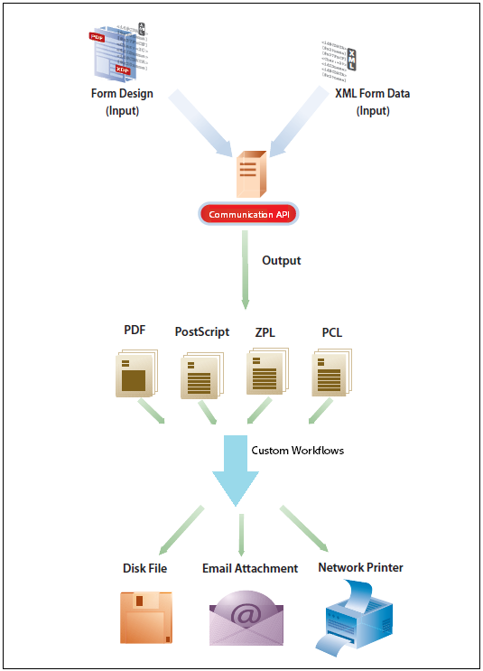

# Använd AEM Forms as a Cloud Service Communications {#frequently-asked-questions}

**AEM Forms as a Cloud Service Communications-funktionen är i betaversion.**

Med kommunikationsfunktioner kan ni skapa varumärkesorienterade, personaliserade och standardiserade dokument som affärskontakter, kontoutdrag, kravbrev, förmånsmeddelanden, månatliga räkningar eller välkomstpaket.


Du kan generera ett dokument på begäran eller skapa ett batchjobb för att generera flera dokument med definierade intervall. Kommunikations-API:er ger:

* smidiga funktioner för att generera on demand- och batchdokumentation

* HTTP-API:er för enklare integrering med befintliga system. Separata API:er för on demand-åtgärder (låg fördröjning) och batchåtgärder (högdataåtgärder) ingår. Det gör dokumentgenereringen till en effektiv uppgift.

* säker åtkomst till data. Kommunikations-API:er ansluter till och får endast åtkomst till data från kundutsedda datalager, gör inga lokala kopior av data, vilket gör kommunikationen mycket säker.


Ett exempel på kreditkortsutdrag kan skapas med hjälp av kommunikationsAPI:er. Satsen använder samma mall men separata data för varje kund beroende på hur de använder kreditkortet.

## Hur fungerar det?

Kommunikationen utnyttjar [PDF och XFA-mallar](#supported-document-types) med [XML-data](#form-data) för att generera ett enda dokument on demand eller flera dokument med hjälp av ett batchjobb vid angivet intervall.

Ett kommunikations-API hjälper till att kombinera en mall (XFA eller PDF) med kunddata ([XML-data](#form-data)) för att generera dokument i PDF och utskriftsformat som PS, PCL, DPL, IPL och ZPL.

Vanligtvis skapar du en mall med [Designer](use-forms-designer.md) och använda API:er för kommunikation för att sammanfoga data med mallen. Programmet kan skicka utdatadokumentet till en nätverksskrivare, en lokal skrivare eller till ett lagringssystem för arkivering. Ett typiskt exempel och anpassade arbetsflöden ser ut så här:



Beroende på hur de används kan du även göra dessa dokument tillgängliga för hämtning via din webbplats eller en lagringsserver.

## Kommunikations-API:er

Kommunikationen tillhandahåller HTTP-API:er för on demand- och batchdokumentgenerering:

* **[Synkrona API:er](https://adobedocs.github.io/experience-manager-forms-cloud-service-developer-reference/api/sync/)** lämpar sig för dokumentgenerering on-demand, låg latens och en post. Dessa API:er lämpar sig bättre för användaråtgärdsbaserade användningsfall. Du kan till exempel skapa ett dokument när en användare har fyllt i ett formulär.

* **[Batch-API:er (asynkrona API:er)](https://adobedocs.github.io/experience-manager-forms-cloud-service-developer-reference/api/batch/)** är lämpliga för schemalagda, höga genomströmningsscenarier och flera dokumentgenereringsscenarier. Dessa API:er genererar dokument gruppvis. Till exempel telefonräkningar, kreditkortsräkningar och förmånsräkningar som genereras varje månad.

## Onboarding

Kommunikation finns som fristående modul och tilläggsmodul för as a Cloud Service användare av Forms. Du kan kontakta Adobe säljteam eller din Adobe-representant för att begära åtkomst.

Adobe aktiverar åtkomst för organisationen och tillhandahåller behörigheter åt den person som utses till administratör i organisationen. Administratören kan ge AEM Forms-utvecklare (användare) i organisationen åtkomst till API:erna.

<!--

Communication help you combine a template and XML data to generate print documents in various formats. The service allows you to generate documents in synchronous and batch modes. The APIs enables you to create applications that let you:

  * Generate documents by populating template files (PDF and XDP) with XML data.
  * Generate output forms in various formats, including non-interactive PDF print streams.

Consider a scenario where you have one or more templates and multiple records of XML data for each template. You can use Communications APIs to generate a print document for each record.  You can also combine the records into a single document.  The result is a non-interactive PDF document. A non-interactive PDF document does not let users enter data into its fields.

 There are two main Communications APIs. The _generatePDFOutput_ generates PDFs, while the _generatePrintedOutput_ generates PostScript, ZPL, and PCL formats. These APIs are available as REST endpoints on your environment, both on author and publish instances. Since the publish instances are configured to scale faster than the author instances, it is recommended use these APIs via publish instances.

The first parameter of both the operations accept the path and name of the template file (for example ExpenseClaim.xdp). You can specify a fully qualified path, reference path of your AEM Repository, or path of a binary file. The second parameter accepts an XML document that is merged with the template while generating the output document.  

The [API reference documentation](https://documentcloud.adobe.com/link/track?uri=urn:aaid:scds:US:b1223732-ae0f-4921-bdc0-c31e48b56044) provides detailed information about all the parameters, authentication methods, and various services provided by APIs. The API reference documentation is also available in the .yaml format. You can download the .yaml for [Batch APIs](assets/batch-api.yaml) or [non-Batch API.yaml](assets/non-batch-api.yaml) file and upload it to postman to check functionality of APIs.

>[!VIDEO](https://video.tv.adobe.com/v/335771)

Uploading Communication APIs .yaml file to postman to check functionality of APIs.

## Using the Communications APIs {#workflows}

Typically, you create a template using [Designer](use-forms-designer.md) and use communications APIs ( generatePDFOutput and generatePrintedOutput) to:

* Convert these templates to various formats, including PDF, PostScript, ZPL, and PCL.
* Merge XML form data with a form design to generate a document.
* Generate a document without merging XML form data into the document. However, the primary workflow is merging data into the document.

Then, the output document is stored to a file. You can design custom workflows to send the file to a network printer, a local printer, or to a storage system for archival. A typical out of the box and custom workflows look like the following:


### Create PDF documents {#create-pdf-documents}

You can use the _generatePDFOutput_ API to create PDF document that is based on a form design and XML form data. The output is a non-interactive PDF document. That is, users cannot enter or modify form data. A basic workflow is to merge XML form data with a form design to create a PDF document. The following illustration shows the merging of a form design and XML form data to produce a PDF document.


### Create PostScript (PS), Printer Command Language (PCL), Zebra Printing Language (ZPL) document {#create-PS-PCL-ZPL-documents}

You can use Communications APIs to create PostScript (PS), Printer Command Language (PCL), and Zebra Printing Language (ZPL) document that are based on a XDP form design or PDF document. The _generatePrintedOutput_ API merges a form design with form data to generate a document. You can save the document to a file and develop a custom process to send it to a printer.

 ### Processing batch data to create multiple documents

Communications APIs can create separate documents for each record within an XML batch data source. The APIs can also create a single document that contains all records (this functionality is the default). Assume that an XML data source contains ten records and you instruct the APIs to create a separate document for each record (for example, PDF documents). As a result, the APIs generate ten PDF documents.

The following illustration also shows Communications APIs processing an XML data file that contains multiple records. However, assume that you instruct the APIs to create a single PDF document that contains all data records. In this situation, the APIs generate one document that contains all of the records.

The following illustration shows Communications APIs processing an XML data file that contains multiple records. Assume that you instruct the Communications APIs to create a separate PDF document for each data record. In this situation, the APIs generates a separate PDF document for each data record.


### Processing batch data to create multiple documents {#processing-batch-data-to-create-multiple-documents}

You create separate documents for each record within an XML batch data source. You can can also create a single document that contains all records (this functionality is the default). Assume that an XML data source contains ten records and you have a requirement to create a separate document for each record (for example, PDF documents). You can use the Communication APIs to generate ten PDF documents.

The following illustration shows the Communication APIs processing an XML data file that contains multiple records. However, assume that you instruct the Communication APIs to create a single PDF document that contains all data records. In this situation, the Communication APIs generate one document that contains all of the records.


The following illustration shows the Communication APIs processing an XML data file that contains multiple records. Assume that you instruct the Communication APIs to create a separate PDF document for each data record. In this situation, the Communication APIs generates a separate PDF document for each data record.


For detailed information on using Batch APIs, see Communication APIs: Processing batch data to create multiple documents.

### Flatten interactive PDF documents {#flatten-interactive-pdf-documents}

You can use the Communications APIs to transform an interactive PDF document (for example, a form) to a non-interactive PDF document. An interactive PDF document lets users enter or modify data located in the PDF document fields. The process of transforming an interactive PDF document to a non-interactive PDF document is called flattening. When a PDF document is flattened, a user cannot modify the data located in the document’s fields. One reason to flatten a PDF document is to ensure that data cannot be modified.

You can flatten the following types of PDF documents:

* Interactive PDF documents created in Designer (that contain XFA streams).

* Acrobat PDF forms

If you attempt to flatten a non-interactive PDF document, an exception occurs.

### Retain Form State {#retain-form-state}

An interactive PDF document contains various elements that constitute a form. These elements may include fields (to accept or display data), buttons (to trigger events), and scripts (commands to perform a specific action). Clicking a button may trigger an event that changes the state of a field. For example, choosing a gender option may change the color of a field or the appearance of the form. This is an example of a manual event causing the form state to change.

When such an interactive PDF document is flattened using the Communications APIs, the state of the form is not retained. To ensure that the state of the form is retained even after the form is flattened, set the Boolean value _retainFormState_ to True to save and retain the state of the form.  -->

## Överväganden {#considerations-for-communications-apis}

Innan du börjar generera dokument med API:er för kommunikation bör du tänka på följande:

### Formulärdata {#form-data}

Kommunikations-API:er accepterar en formulärdesign som vanligtvis skapas i [Designer](use-forms-designer.md) och XML som indata. Om du vill fylla i ett dokument med data måste det finnas ett XML-element i XML-formulärdata för varje formulärfält som du vill fylla i. XML-elementnamnet måste matcha fältnamnet. Om ett XML-element inte motsvarar ett formulärfält eller om XML-elementnamnet inte matchar fältnamnet, ignoreras XML-elementet. Det är inte nödvändigt att matcha den ordning i vilken XML-elementen visas. Den viktiga faktorn är att XML-elementen anges med motsvarande värden.

Ta följande exempel på låneansökningsformulär:


Om du vill sammanfoga data i den här formulärdesignen skapar du en XML-datakälla som motsvarar formulärhierarkin, fältnamngivning och datatyper. Följande XML representerar en XML-datakälla som motsvarar exempelformuläret för låneansökan.

```XML
* <xfa:datasets xmlns:xfa="http://www.xfa.org/schema/xfa-data/1.0/">
* <xfa:data>
* <data>
    * <Layer>
        <closeDate>1/26/2007</closeDate>
        <lastName>Johnson</lastName>
        <firstName>Jerry</firstName>
        <mailingAddress>JJohnson@NoMailServer.com</mailingAddress>
        <city>New York</city>
        <zipCode>00501</zipCode>
        <state>NY</state>
        <dateBirth>26/08/1973</dateBirth>
        <middleInitials>D</middleInitials>
        <socialSecurityNumber>(555) 555-5555</socialSecurityNumber>
        <phoneNumber>5555550000</phoneNumber>
    </Layer>
    * <Mortgage>
        <mortgageAmount>295000.00</mortgageAmount>
        <monthlyMortgagePayment>1724.54</monthlyMortgagePayment>
        <purchasePrice>300000</purchasePrice>
        <downPayment>5000</downPayment>
        <term>25</term>
        <interestRate>5.00</interestRate>
    </Mortgage>
</data>
</xfa:data>
</xfa:datasets>
```

### Dokumenttyper som stöds {#supported-document-types}

Du bör använda en XDP-fil som indata för att få fullständig åtkomst till återgivningsfunktionerna i API:erna för kommunikation. Ibland kan en PDF-fil användas. Att använda en PDF-fil som indata har dock följande begränsningar:

Ett PDF-dokument som inte innehåller en XFA-ström kan inte återges som PostScript, PCL eller ZPL. Kommunikations-API:er kan återge PDF-dokument med XFA-strömmar (d.v.s. formulär skapade i [Designer](use-forms-designer.md)) i laser- och etikettformat. Om PDF-dokumentet är signerat, certifierat eller innehåller användarrättigheter (som används med tjänsten AEM Forms Reader Extensions) kan det inte återges i dessa utskriftsformat.

<!-- Run-time options such as PDF version and tagged PDF are not supported for Acrobat forms. They are valid for PDF forms that contain XFA streams; however, these forms cannot be signed or certified. 

### Email support {#email-support}

For email functionality, you can create a process in Experience Manager Workflows that uses the Email Step. A workflow represents a business process that you are automating. -->

### Utskrivbara områden {#printable-areas}

Den icke utskrivbara standardmarginalen på 0,25 tum är inte exakt för etikettskrivare och varierar från skrivare till skrivare och från etikettstorlek till etikettstorlek. Du bör emellertid behålla marginalen på 0,25 tum eller minska den. Du bör dock inte öka marginalen som inte går att skriva ut. Annars skrivs inte informationen i det utskrivbara området ut korrekt.

Se alltid till att du använder rätt XDC-fil för skrivaren. Undvik till exempel att välja en XDC-fil för en skrivare med 300 dpi och skicka dokumentet till en skrivare med 200 dpi.

### Skript för XFA-formulär (XDP/PDF) {#scripts}

En formulärdesign som används med kommunikations-API:erna kan innehålla skript som körs på servern. Kontrollera att en formulärdesign inte innehåller skript som körs på klienten. Mer information om hur du skapar formulärdesignskript finns i [Designer - hjälp](use-forms-designer.md).

<!-- #### Working with Fonts
 Document Considerations for Working with Fonts>> -->

### Teckensnittsmappning {#font-mapping}

Om du vill designa ett formulär som använder teckensnitt som finns i skrivaren, väljer du ett teckensnittsnamn i Designer som matchar teckensnitten som finns i skrivaren. En lista med teckensnitt som stöds för PCL eller PostScript finns i motsvarande enhetsprofiler (XDC-filer). Du kan också skapa teckensnittsmappning för att mappa teckensnitt som inte finns installerade på skrivaren till teckensnitt med ett annat teckensnittsnamn. I ett PostScript-scenario kan referenser till teckensnittet Arial® mappas till det skrivarresidenta Helvetica®-teckensnittet.

Om ett teckensnitt är installerat på en klientdator är det tillgängligt i listrutan i Designer. Om teckensnittet inte är installerat måste du ange teckensnittsnamnet manuellt. Alternativet&quot;Ersätt ej tillgängliga teckensnitt permanent&quot; i Designer kan vara inaktiverat. I annat fall skrivs ersättningsteckensnittets namn till XDP-filen när XDP-filen sparas i Designer. Det innebär att det skrivarresidenta teckensnittet inte används.

Det finns två typer av OpenType®-teckensnitt. En typ är ett TrueType OpenType®-teckensnitt som PCL stöder. Den andra är CFF OpenType®. PDF och PostScript-utdata har stöd för inbäddade Type-1-, TrueType- och OpenType®-teckensnitt. PCL-utdata stöder inbäddade TrueType-teckensnitt.

Type-1- och OpenType®-teckensnitt bäddas inte in i PCL-utdata. Innehåll som är formaterat med Type-1- och OpenType®-teckensnitt rastreras och genereras som en bitmappsbild som kan vara stor och långsammare att generera.

Hämtade eller inbäddade teckensnitt ersätts automatiskt när du genererar PostScript-, PCL- eller PDF-utdata. Det innebär att endast den deluppsättning av teckensnittstecknen som krävs för att det genererade dokumentet ska kunna återges korrekt inkluderas i det genererade utdata.

### Arbeta med enhetsprofilfiler (XDC-fil) {#working-with-xdc-files}

En enhetsprofil (XDC-fil) är en skrivarbeskrivningsfil i XML-format. Den här filen gör det möjligt för kommunikations-API:erna att skriva ut dokument som laserskrivare eller etikettskrivarformat. Kommunikations-API:er använder XDC-filer som innehåller följande:

* hppcl5c.xdc

* hppcl5e.xdc

* ps_plain_level3.xdc

* ps_plain.xdc

* zpl300.xdc

* zpl600.xdc

* zpl300.xdc

* ipl300.xdc

* ipl400.xdc

* tpcl600.xdc

* dpl300.xdc

* dpl406.xdc

* dpl600.xdc

Du kan använda de medföljande XDC-filerna för att generera utskriftsdokument eller ändra dem efter behov.
<!-- It is not necessary to modify these files to create documents. However, you can modify them to meet your business requirements. -->

Dessa filer är XDC-referensfiler som har stöd för funktioner på vissa skrivare, t.ex. inbyggda teckensnitt, pappersfack och häftare. Syftet med dessa referenser är att hjälpa dig att förstå hur du konfigurerar egna skrivare med hjälp av enhetsprofiler. Referensen är också en utgångspunkt för liknande skrivare i samma produktserie.

### Arbeta med XCI-konfigurationsfilen {#working-with-xci-files}

Kommunikations-API:er använder en XCI-konfigurationsfil för att utföra åtgärder, till exempel kontrollera om utdata är en enskild panel eller sidnumrerad. Även om den här filen innehåller inställningar som kan anges är det normalt inte att ändra det här värdet. <!-- The default.xci file is located in the svcdata\XMLFormService folder. -->

Du kan skicka en ändrad XCI-fil när du använder ett kommunikations-API. När du gör det skapar du en kopia av standardfilen, ändrar bara de värden som behöver ändras för att uppfylla dina affärskrav och använder den ändrade XCI-filen.

Kommunikations-API:er börjar med XCI-standardfilen (eller den ändrade filen). Sedan tillämpas värden som anges med kommunikations-API:erna. Dessa värden åsidosätter XCI-inställningar.

I följande tabell anges XCI-alternativ.

| XCI-alternativ | Beskrivning |
| ------------------------------------| ----------------------------------------------------------------------------------------------------------------------------------------------------------------------------------------------------------------------------------------------------------------------------------------------------------------------------------------------------------------------------------------------------------------------------------------------------------------------------------------------------------|
| config/present/pdf/creator | Identifierar den som har skapat dokumentet med hjälp av posten Skapare i dokumentinformationsordlistan. Mer information om det här lexikonet finns i referenshandboken för PDF. |
| config/present/pdf/producer | Identifierar dokumenttillverkaren med hjälp av posten Producer i dokumentinformationsordlistan. Mer information om det här lexikonet finns i referenshandboken för PDF. |
| config/present/layout | Anger om utdata är en enda panel eller sidnumrerad. |
| config/present/pdf/compression/level | Anger den komprimeringsgrad som ska användas när ett PDF-dokument skapas. |
| config/present/pdf/scriptModel | Styr om XFA-specifik information ska inkluderas i utdata-PDF-dokumentet. |
| config/present/common/data/adjustData | Kontrollerar om XFA-programmet justerar data efter sammanslagningen. |
| config/present/pdf/renderPolicy | Kontrollerar om genereringen av sidinnehåll görs på servern eller skjuts upp till klienten. |
| config/present/common/locale | Anger standardspråket som används i utdatadokumentet. |
| config/present/destination | Anger utdataformatet när det finns i ett aktuellt element. Anger vilken åtgärd som ska utföras när dokumentet öppnas i en interaktiv klient när det finns i ett openAction-element. |
| config/present/output/type | Anger vilken typ av komprimering som ska användas för en fil eller vilken typ av utdata som ska skapas. |
| config/present/common/temp/uri | Anger formulär-URI. |
| config/present/common/template/base | Anger en basplats för URI:er i formulärdesignen. När det här elementet saknas eller är tomt används platsen för formulärdesignen som bas. |
| config/present/common/log/to | Styr platsen dit loggdata eller utdata skrivs. |
| config/present/output/to | Styr platsen dit loggdata eller utdata skrivs. |
| config/present/script/currentPage | Anger den inledande sidan när dokumentet öppnas. |
| config/present/script/exclude | Informerar AEM Forms server-/Communications API:er om vilka händelser som ska ignoreras. |
| config/present/pdf/linearized | Anger om utdatadokumentet för PDF är linjärt. |
| config/present/script/runScripts | Styr vilken uppsättning skript AEM Forms kör. |
| config/present/pdf/tagged | Styr om taggar ska tas med i utdatadokumentet för PDF. Taggar i PDF är ytterligare information som ingår i ett dokument för att visa dokumentets logiska struktur. Taggar underlättar hjälpmedelsanvändningen och formateringen. Ett sidnummer kan till exempel taggas som en artefakt så att skärmläsaren inte omsluter den mitt i texten. Även om märkord gör ett dokument mer användbart, ökar de även storleken på dokumentet och bearbetningstiden för att skapa det. |
| config/present/pdf/version | Anger vilken version av PDF-dokument som ska genereras. |
