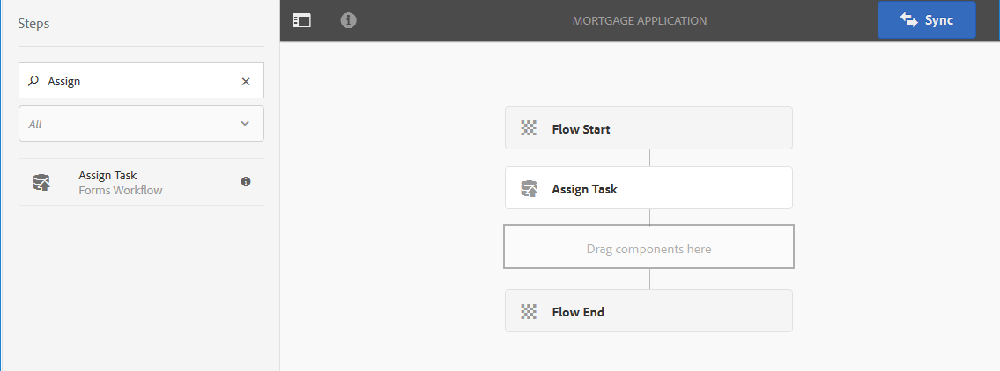
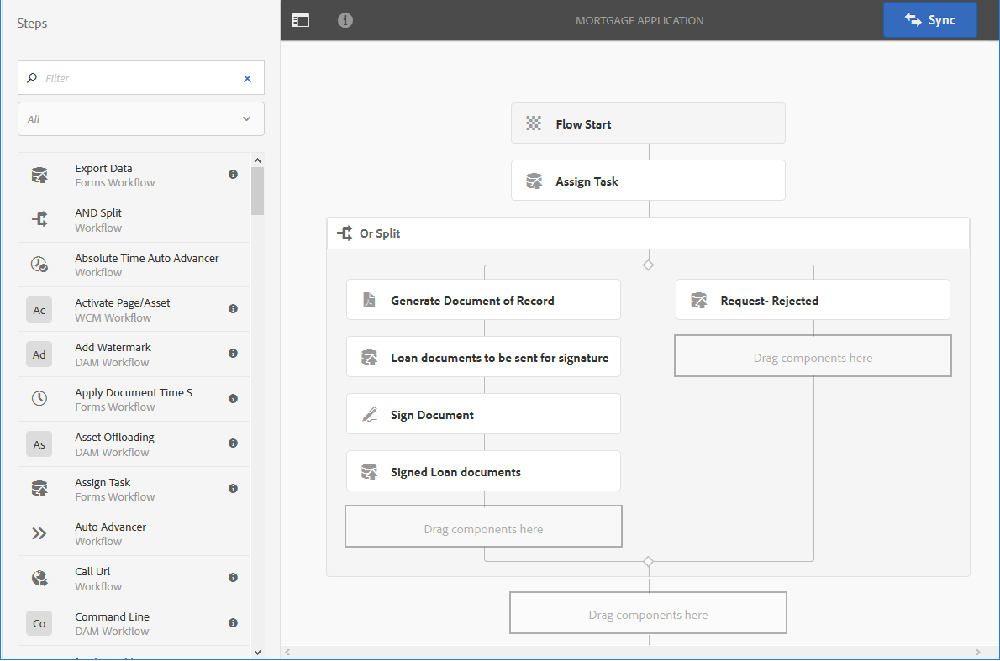

# Forms-centrerat arbetsflöde i OSGi{#forms-centric-workflow-on-osgi}

Företag samlar in data från hundratals och tusentals formulär, olika datasystem samt online- och offlinedatakällor. De har också en dynamisk uppsättning användare som kan fatta beslut om data, vilket innefattar iterativa gransknings- och godkännandeprocesser.

Förutom arbetsflöden för granskning och godkännande för interna och externa målgrupper har stora organisationer och företag repetitiva uppgifter. Du kan till exempel konvertera ett PDF-dokument till ett annat format. När du gör det manuellt tar dessa uppgifter lång tid och tar mycket tid och resurser. Företag har också juridiska krav på att digitalt signera ett dokument och arkivera formulärdata för senare användning i fördefinierade format.

## Introduktion till Forms-centrerat arbetsflöde i OSGi {#introduction-to-forms-centric-workflow-on-osgi}

Du kan använda AEM arbetsflöden för att snabbt skapa adaptiva Forms-baserade arbetsflöden. Dessa arbetsflöden kan användas för granskning och godkännande, affärsprocessflöden, för att starta dokumenttjänster, integrera med Adobe Sign signaturarbetsflöde och liknande åtgärder. Till exempel kreditkortsansökningsbehandling, godkännandearbetsflöden för medarbetare och spara ett formulär som ett PDF-dokument. Dessutom kan dessa arbetsflöden användas inom en organisation eller över nätverkets brandvägg.

Med Forms-baserade arbetsflöden i OSGi kan du snabbt skapa och distribuera arbetsflöden för olika uppgifter i OSGi-stacken, utan att behöva installera den fullständiga processhanteringsfunktionen i JEE-stacken. För utveckling och hantering av arbetsflöden används de välbekanta funktionerna för AEM och AEM. Arbetsflöden är grunden för automatisering av affärsprocesser som spänner över flera olika system, nätverk, avdelningar och till och med organisationer.

När du väl har konfigurerat arbetsflödena kan de aktiveras manuellt för att slutföra en definierad process eller köras programmatiskt när användare skickar ett formulär <!-- or [correspondence management](cm-overview.md) letter-->. <!-- With this enhanced AEM Workflow capabilities, [!DNL AEM Forms] offers two distinct, yet similar, capabilities. As part of your deployment strategy, you need to decide which one works for you. See a [comparison](capabilities-osgi-jee-workflows.md) of the Forms-centric AEM Workflows on OSGi and Process Management on JEE. Moreover, for the deployment topology see, [Architecture and deployment topologies for [!DNL AEM Forms]]((aem-forms-architecture-deployment.md). -->

Forms-centrerat arbetsflöde i OSGi utökar [AEM](https://experienceleague.adobe.com/docs/experience-manager-cloud-service/sites/authoring/getting-started/inbox.html#authoring) och innehåller extra komponenter (steg) för AEM Workflow Editor som kan lägga till stöd för [!DNL AEM Forms]-centrerade arbetsflöden. <!-- The extended AEM Inbox has functionalities similar to [[!DNL AEM Forms] Workspace](introduction-html-workspace.md). Along with managing human-centric workflows (Approval, Review, and so on), you can use AEM workflows to automate [document services](https://experienceleague.adobe.com/docs/experience-manager-65/developing/extending-aem/extending-workflows/workflows-step-ref.html#extending-aem)-related operations (for example, Generate PDF) and electronically signing (Adobe Sign) documents. -->

Alla [!DNL AEM Forms] arbetsflödessteg stöder användning av variabler. Variabler möjliggör arbetsflödessteg för att lagra och skicka metadata mellan steg vid körning. Du kan skapa olika typer av variabler för att lagra olika typer av data. Du kan också skapa variabelsamlingar (arrayer) för att lagra flera instanser av relaterade data av samma typ. Vanligtvis använder du en variabel eller en samling variabler när du behöver fatta ett beslut baserat på det värde som den innehåller eller för att lagra information som du behöver senare i en process. Mer information om hur du använder variabler i dessa Forms-centrerade arbetsflödeskomponenter (steg) finns i [Forms-centrerat arbetsflöde i OSGi - stegreferens](aem-forms-workflow-step-reference.md). Mer information om att skapa och hantera variabler finns i [Variabler i AEM arbetsflöden](variable-in-aem-workflows.md).

I följande diagram visas hela proceduren för att skapa, köra och övervaka ett Forms-orienterat arbetsflöde i OSGi.

## Innan du börjar {#before-you-start}

* Ett arbetsflöde är en representation av en affärsprocess i verkligheten. Håll er verkliga affärsprocess och lista över deltagarna i affärsprocessen klar. Ha också materialet (Adaptiv Forms, PDF Documents med mera) färdigt innan du börjar skapa ett arbetsflöde.
* Ett arbetsflöde kan ha flera steg. De här stegen visas i AEM Inkorg och hjälper till att rapportera arbetsflödets förlopp. Dela upp affärsprocessen i logiska steg.
* Du kan konfigurera tilldelningssteget AEM arbetsflöden för att skicka e-postmeddelanden till användare eller tilldelade användare. Så, [aktivera e-postmeddelanden](#configure-email-service).
* Ett arbetsflöde kan även använda Adobe-signaturer för digitala signaturer. Om du tänker använda Adobe Sign i ett arbetsflöde, [konfigurera Adobe Sign för [!DNL AEM Forms]](adobe-sign-integration-adaptive-forms.md) innan du använder den i ett arbetsflöde.

## Skapa en arbetsflödesmodell {#create-a-workflow-model}

En arbetsflödesmodell består av logik och flöde i en affärsprocess. Den består av en serie av steg. De här stegen är AEM komponenter. Du kan utöka arbetsflödesstegen med parametrar och skript för att få mer funktionalitet och kontroll efter behov. [!DNL AEM Forms] innehåller några steg utöver AEM steg som är tillgängliga direkt. En detaljerad lista över AEM och [!DNL AEM Forms] steg, se [AEM för arbetsflödessteg](https://experienceleague.adobe.com/docs/experience-manager-65/developing/extending-aem/extending-workflows/workflows-step-ref.html#extending-aem) och [Forms-centrerat arbetsflöde i OSGi - stegreferens](aem-forms-workflow.md).

AEM tillhandahåller ett intuitivt användargränssnitt för att skapa en arbetsflödesmodell med de angivna arbetsflödesstegen. Stegvisa instruktioner om hur du skapar en arbetsflödesmodell finns i [Skapa arbetsflödesmodeller](https://experienceleague.adobe.com/docs/experience-manager-cloud-service/sites/authoring/workflows/overview.html#workflows). Följande exempel innehåller stegvisa instruktioner för att skapa en arbetsflödesmodell för ett arbetsflöde för godkännande och granskning:

>[!NOTE]
>
>Du måste vara medlem i arbetsflödets redigeringsgrupp för att kunna skapa eller redigera en arbetsflödesmodell.

### Skapa en modell för ett arbetsflöde för godkännande och granskning {#create-a-model-for-an-approval-and-review-workflow}

Arbetsflödet för godkännande och granskning är avsett för de uppgifter som kräver mänsklig medverkan för att fatta beslut. I följande exempel skapas en arbetsflödesmodell för en låneansökan som ska fyllas av en banktjänsteman. När ansökan är ifylld skickas den för godkännande. Senare skickas den godkända ansökan till den som ansöker om elektroniska signaturer med Adobe Sign.

Exemplet är tillgängligt som ett paket som bifogas nedan. Importera och installera exemplet med hjälp av pakethanteraren. Du kan även utföra följande steg för att manuellt skapa arbetsflödesmodellen för programmet:

I exemplet skapas en arbetsflödesmodell för en låneansökan som ska fyllas av en bankagent på ett bankkontor. När ansökan är ifylld skickas den för godkännande. Senare skickas den godkända ansökan till kunden för elektroniska signaturer med Adobe Sign. Du kan importera och installera exemplet med hjälp av pakethanteraren.

[Hämta fil](assets/example-mortgage-loan-application.zip)

1. Öppna konsolen Arbetsflödesmodeller. Standardwebbadressen är `https://[server]:[port]/libs/cq/workflow/admin/console/content/models.html/etc/workflow/models`
1. Välj **Skapa** sedan **Skapa modell**. Dialogrutan Lägg till arbetsflödesmodell visas.
1. Ange **Titel** och **Namn** (valfritt). Till exempel en låneansökan. Tryck **Klar**.
1. Välj den nya arbetsflödesmodellen och tryck **Redigera**. Nu kan du lägga till arbetsflödessteg för att skapa affärslogik. När du först skapar en arbetsflödesmodell innehåller den:

   * Stegen: Flödesstart och Flödesslut. De här stegen representerar början och slutet av arbetsflödet. Dessa steg är obligatoriska och kan inte redigeras eller tas bort.
   * Ett exempel på deltagarsteg som heter Steg 1. Det här steget är konfigurerat för att tilldela en arbetsuppgift till administratörsanvändaren. Ta bort steget.

1. Aktivera e-postmeddelanden. Du kan konfigurera ett Forms-orienterat arbetsflöde på OSGi för att skicka e-postmeddelanden till användare eller tilldelade användare. Gör följande konfigurationer för att aktivera e-postmeddelanden:

   1. Gå till AEM konfigurationshanteraren på `https://[server]:[port]/system/console/configMgr`.
   1. Öppna **[!UICONTROL Day CQ Mail Service]** konfiguration. Ange ett värde för **[!UICONTROL SMTP server host name]**, **[!UICONTROL SMTP server port,]** och **[!UICONTROL "From" address]** fält. Klicka på **[!UICONTROL Save]**.
   1. Öppna **[!UICONTROL Day CQ Link Externalizer]** konfiguration. I **[!UICONTROL Domains]** anger du den faktiska värdnamnet/IP-adressen och portnumret för lokala instanser, författare och publiceringsinstanser. Klicka på **[!UICONTROL Save]**.

1. Skapa arbetsflödesfaser. Ett arbetsflöde kan ha flera steg. De här stegen visas i AEM Inkorg och rapporterar arbetsflödets förlopp.

   Definiera en scen genom att trycka på  ikon för att öppna arbetsflödesmodellegenskaper, öppna **Steg** lägg till faser för arbetsflödesmodellen och tryck på **Spara och stäng**. I exemplet med låneansökan kan du skapa faser: låneansökan, status för låneansökan, signerade dokument och signerade lånedokument.

1. Dra och släpp **Tilldela uppgift** steg webbläsare till arbetsflödesmodellen. Gör det till modellens första steg.

   Tilldela en uppgiftskomponent tilldelar uppgiften, som skapas i ett arbetsflöde, till en användare eller grupp. Förutom att tilldela uppgiften kan du använda komponenten för att ange ett adaptivt formulär eller ett icke-interaktivt PDF för uppgiften. Det adaptiva formuläret krävs för att kunna ta emot indata från användare och icke-interaktiva PDF eller ett skrivskyddat anpassat formulär används endast för granskning.

   Du kan också använda steget för att styra aktivitetens beteende. Om du t.ex. skapar ett automatiskt dokument för post tilldelar du uppgiften till en viss användare eller grupp, sökvägen till skickade data, sökvägen till data som ska fyllas i i förväg samt standardåtgärder. Detaljerad information om alternativen för tilldelningssteget finns i [Forms-centrerat arbetsflöde i OSGi - stegreferens](aem-forms-workflow.md) -dokument.

   

   I exemplet med låneansökan ska du konfigurera tilldelningssteget så att det använder ett skrivskyddat anpassat formulär och visa PDF-dokument när uppgiften är klar. Välj även en användargrupp som kan godkänna lånebegäran. På **Åtgärder** -flik, inaktivera **Skicka** alternativ. Skapa en **actionTaken** variabeln för datatypen String och ange variabeln som **Flödesvariabel**. Till exempel actionTaken. Lägg även till rutterna Godkänn och Avvisa. Vägarna visas som separata åtgärder (knappar) i AEM. Arbetsflödet väljer en gren baserat på den åtgärd (knapp) som användaren knackar på.

   Du kan importera exempelpaketet, som är tillgängligt för hämtning i början av avsnittet, för den fullständiga uppsättningen värden för alla fält i tilldelningssteget som konfigurerats för exempelvis låneprogram.

1. Dra och släpp OR-komponenten från stegwebbläsaren till arbetsflödesmodellen. Med ELLER-delning skapas en delning i arbetsflödet, varefter endast en gren är aktiv. I det här steget kan du lägga in sökvägar för villkorlig bearbetning i arbetsflödet. Du kan lägga till arbetsflödessteg i varje gren efter behov.

   Du kan definiera routningsuttryck för en gren med en regeldefinition, ett ECMA-skript eller ett externt skript.

   Använd uttrycksredigeraren för att skapa routningsuttryck för Förgrening 1 och Förgrening 2. Dessa routningsuttryck hjälper dig att välja en gren baserat på användaråtgärden i AEM Inbox.

   **Routningsuttryck för gren 1**

   När en användare trycker **Godkänn** AEM Inkorgen är grenen 1 aktiverad.

   

   **Routningsuttryck för gren 2**

   När en användare trycker **Avvisa** AEM Inkorgen aktiveras grenen 2.

   

   Mer information om hur du skapar routningsuttryck med variabler finns i [Variabler [!DNL AEM Forms] arbetsflöden](variable-in-aem-workflows.md).

1. Lägg till andra arbetsflödessteg för att skapa affärslogiken.

   I hypoteksexemplet lägger du till ett generera dokument för post, två steg för tilldelning av uppgifter och ett steg för signeringsdokument i förgrening 1 av modellen, som visas i bilden nedan. Ett tilldelningssteg är att visa och skicka **ska undertecknas av den sökande** och en annan tilldelad uppgiftskomponent är **för att visa signerade dokument**. Lägg också till en tilldelad uppgiftskomponent i gren 2. Den aktiveras när en användare trycker på Avvisa i AEM Inkorg.

   Om du vill visa en fullständig uppsättning värden för alla fält i tilldelningsstegen, dokumentsteget och signeringsdokumentsteget som konfigurerats för exempelvis låneprogram importerar du exempelpaketet som är tillgängligt för hämtning i början av det här avsnittet.

   Arbetsflödesmodellen är klar. Du kan starta arbetsflödet på olika sätt. Mer information finns i [Starta ett Forms-orienterat arbetsflöde i OSGi](#launch).

   

## Skapa ett Forms-centrerat arbetsflödesprogram {#create-a-forms-centric-workflow-application}

Programmet är det adaptiva formulär som är associerat med arbetsflödet. När ett program skickas via Inkorgen startar det tillhörande arbetsflödet. Göra ett Forms-arbetsflöde tillgängligt som ett program i AEM Inkorg och [!DNL AEM Forms] Skapa ett arbetsflödesprogram genom att göra följande:

>[!NOTE]
>
>Du måste vara medlem i gruppen fd-administrator för att kunna skapa och hantera arbetsflödesprogram.

1. Gå till AEM  > **[!UICONTROL Forms]** > **[!UICONTROL Manage Workflow Application]** och **[!UICONTROL Create]**.
1. Ange indata för följande fält och tryck på dem i fönstret Skapa arbetsflödesprogram **Skapa**. Ett nytt program skapas och visas på skärmen Arbetsflödesprogram.

<table>
 <tbody>
  <tr>
   <td>Fält</td>
   <td>Beskrivning</td>
  </tr>
  <tr>
   <td>Titel</td>
   <td>Titeln visas AEM Inkorgen och hjälper användarna att välja ett program. Behåll det beskrivande. Exempel: Öppningsprogram för sparkonto.  </td>
  </tr>
  <tr>
   <td>Namn </td>
   <td>Ange programmets namn. Alla tecken utom alfabet, siffror, bindestreck och understreck ersätts med bindestreck. </td>
  </tr>
  <tr>
   <td>Beskrivning</td>
   <td>Beskrivningen visas i AEM. Ange detaljerad information om programmet i beskrivningsfälten. Till exempel programmets syfte.  </td>
  </tr>
  <tr>
   <td>Adaptiv form</td>
   <td>
Ange sökvägen för ett adaptivt formulär. När en användare startar ett program visas det angivna adaptiva formuläret.
 
<strong>Anteckning</strong>: Arbetsflödesprogram stöder inte formulär och PDF-dokument som är längre än en sida eller som behöver rullas i Apple iPad. När ett program öppnas i Apple iPad och dokumentet Adaptivt formulär eller PDF är längre än en sida, försvinner formulärfälten och innehållet från den andra sidan.
 </td>
  </tr>
  <tr>
   <td>Åtkomstgrupp</td>
   <td>
Markera en grupp. Programmet visas i AEM Inkorg endast för medlemmarna i den markerade gruppen. Med alternativet Åtkomstgrupp kan du skapa alla grupper i [!DNL workflow-users] grupp tillgänglig för markering. 
   </td>
  </tr>
  <tr>
   <td>Förifyllningstjänst</td>
   <td>Välj en <a href="prepopulate-adaptive-form-fields.md#aem-forms-custom-prefill-service" target="_blank">förifyllning</a> för den adaptiva formen.  </td>
  </tr>
  <tr>
   <td>Arbetsflödesmodell</td>
   <td>Välj en <a href="aem-forms-workflow.md#create-a-workflow-model">arbetsflödesmodell</a> för programmet. En arbetsflödesmodell består av logik och flöde i affärsprocessen. </td>
  </tr>
  <tr>
   <td>Sökväg till datafil</td>
   <td>Ange sökvägen till datafilen i crx-databasen. Sökvägen är relativ till nyttolasten för adaptiva formulär och innehåller datafilens namn. Inkludera alltid filens fullständiga namn, inklusive filnamnstillägget, om tillämpligt. Exempel: [nyttolast]/data.xml. </td>
  </tr>
  <tr>
   <td>Sökväg till bifogad fil</td>
   <td>Ange sökvägen till mappen för bifogade filer i crx-databasen. Sökvägen till den bifogade filen är relativ till nyttolastplatsen. Exempel: [nyttolast]/data.xml. </td>
  </tr>
  <tr>
   <td>Dokumentsökväg</td>
   <td>Ange sökvägen till filen Dokument för post i crx-databasen. Sökvägen är relativ till nyttolastplatsen för adaptiva formulär. Inkludera alltid filens fullständiga namn, inklusive filnamnstillägget, om tillämpligt. Exempel: [nyttolast]/DOR/creditcard.pdf.</td>
  </tr>
 </tbody>
</table>

## Starta ett Forms-orienterat arbetsflöde i OSGi {#launch}

Du kan starta eller utlösa ett Forms-centrerat arbetsflöde genom att:

* [Skicka ett program från AEM Inbox](#inbox)
* [Skicka en ansökan från [!DNL AEM Forms] App](#afa)

* [Skicka ett anpassat formulär](#af)
* [Använda bevakad mapp](#watched)

* [Skicka ett interaktivt meddelande eller ett brev](#letter)

### Skicka ett program från AEM Inbox {#inbox}

Arbetsflödesprogrammet som du skapade är tillgängligt som ett program i Inbox. Användare som är medlemmar i [!DNL workflow-users] kan fylla i och skicka programmet som utlöser det associerade arbetsflödet. Mer information om hur du använder AEM Inbox för att skicka program och hantera uppgifter finns i [Hantera Forms-program och -uppgifter i AEM Inkorg](manage-applications-inbox.md).

<!-- ### Submitting an application from [!DNL AEM Forms] App {#afa}

The [!DNL AEM Forms] app syncs with an [!DNL AEM Forms] server and lets you make changes to the form data, tasks, workflow applications, and saved information (drafts/templates) in your account. For more information, see [[!DNL AEM Forms] app]((aem-forms-app.md) and related articles.-->

### Skicka ett anpassat formulär {#af}

Du kan konfigurera Skicka-åtgärder för ett anpassat formulär så att ett arbetsflöde startas när det anpassade formuläret skickas. Adaptive Forms ger **Anropa ett AEM** Skicka åtgärd för att starta ett arbetsflöde när ett anpassat formulär skickas. Mer information om Skicka-åtgärden finns i [Konfigurera åtgärden Skicka](configuring-submit-actions.md). Skicka in ett adaptivt formulär via [!DNL AEM Forms] app, aktivera synkronisering med [!DNL AEM Forms] Appen i egenskaperna för adaptiva formulär.

<!-- You can configure an Adaptive Form to sync, submit, and trigger a workflow from [!DNL AEM Forms] app. For details, see [working with a form]((working-with-form.md). -->

<!-- ### Using a watched folder {#watched}

An administrator (a member of fd-administrators group) can configure a network folder to run a pre-configured workflow when a user places a file (such as a PDF file) in the folder. After the workflow completes, it can save the result file to a specified output folder. Such a folder is known as [Watched Folder](watched-folder-in-aem-forms.md). Perform the following procedure to configure a watched folder to launch a workflow:

1. On your AEM author instance, go to  > **[!UICONTROL Forms]** > **[!UICONTROL Configure Watched Folder]**. A list of already configured watched folders is displayed.
1. Tap **[!UICONTROL New]**. A list of fields is displayed. Specify a value for the following fields to configure a Watched Folder for a workflow:

<table>
 <tbody>
  <tr>
   <td>Field</td>
   <td>Description</td>
  </tr>
  <tr>
   <td>Name</code></td>
   <td>Specify the name of the Watched Folder. This field support only alphanumeric.</td>
  </tr>
  <tr>
   <td>Path</code></td>
   <td>Specify the physical location of the Watched Folder. In a clustered environment, use a shared network folder that is accessible from AEM cluster node.</td>
  </tr>
  <tr>
   <td>Process Files Using</code></td>
   <td>Select the Workflow </code>option. </td>
  </tr>
  <tr>
   <td>Workflow Model</code></td>
   <td>Select a workflow model.  </td>
  </tr>
  <tr>
   <td>Output File Pattern</code></td>
   <td>Specify the directory structure for output files and directories. </a>.</td>
  </tr>
 </tbody>
</table>

1. Tap **Advanced**. Specify a value for the following field and taps **Create**. The Watched Folder is configured to launch a workflow. Now, whenever a file is placed in the input directory of the Watched Folder, the specified workflow is triggered.

   | Field |Description |
   |---|---|
   | Payload Mapper Filter |When you create a watched folder, it creates a folder structure in the crx-repository. The folder structure can serve as a payload to the workflow. You can write a script to map an AEM Workflow to accept inputs from the watched folder structure. An out of the box implementation is available and listed in the Payload Mapper Filter. If you do not have a custom implementation, select the default implementation. |

   The Advanced tab contains more fields. Most of these fields contain a default value. To learn about all the fields, see the [Create or Configure a watched folder]((admin-help/configuring-watched-folder-endpoints.md) article. -->

<!-- ### Submitting an interactive communication or a letter {#letter}

You can associate and execute a Forms-centric workflow on OSGi on submission of an interactive communication or a letter. In correspondence management workflows are used for post processing interactive communications and letters. For example, emailing, printing, faxing, or archiving final letters. For detailed steps, see [Post processing of interactive communications and letters](submit-letter-topostprocess.md).

## Additional Configurations {#additional-configurations}

### Configure email service {#configure-email-service}

You can use the Assign Task and Send Email steps of AEM Workflows to send an email. Perform the following steps to specify email servers and other configurations required to send email:

1. Go to AEM configuration manager at `https://[server]:[port]/system/console/configMgr`.
1. Open the **[!UICONTROL Day CQ Mail Service]** configuration. Specify a value for the **[!UICONTROL SMTP server host name]**, **[!UICONTROL SMTP server port,]** and **[!UICONTROL "From" address]** fields. Click **[!UICONTROL Save]**.
1. Open the **[!UICONTROL Day CQ Link Externalizer]** configuration. In the **[!UICONTROL Domains]** field, specify the actual hostname/IP address and port number for local, author, and publish instances. Click **[!UICONTROL Save]**. -->

### Rensa arbetsflödesinstanser {#purge-workflow-instances}

Om du minimerar antalet arbetsflödesinstanser ökas arbetsflödesmotorns prestanda, så att du regelbundet kan rensa avslutade eller pågående arbetsflödesinstanser från databasen. Mer information finns i [Vanlig tömning av arbetsflödesinstanser](https://experienceleague.adobe.com/docs/experience-manager-cloud-service/operations/maintenance.html) tömning av arbetsflödesinstanser
