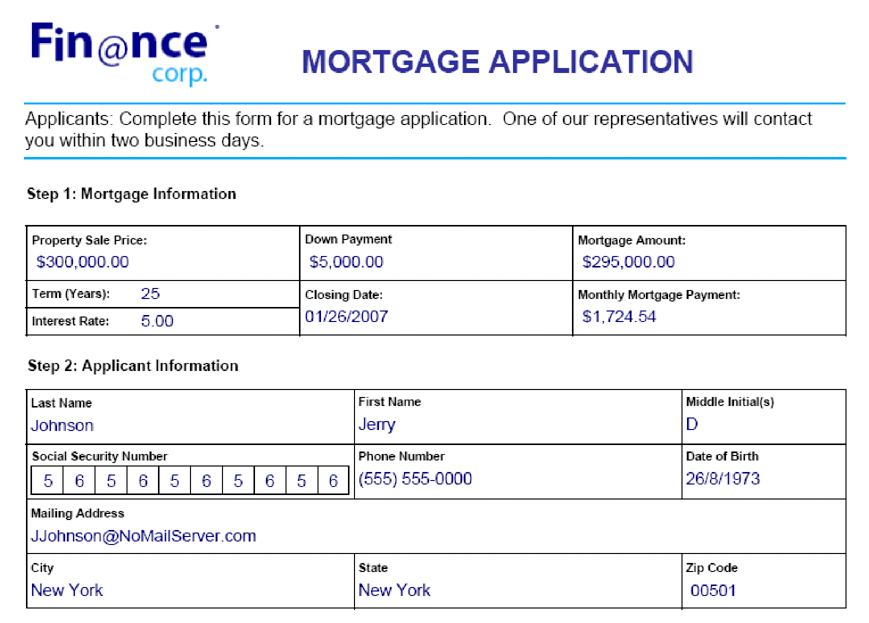

# Kända fel och god praxis {#best-practices-known-issues-and-limitations}

Innan du börjar använda API:er för kommunikation bör du ta reda på följande saker, kända fel och vanliga frågor:

## Överväganden  {#considerations-for-communications-apis}

### Formulärdata {#form-data}

Kommunikations-API:er accepterar både en formulärdesign som vanligtvis skapas i Designer och XML-formulärdata som indata. Om du vill fylla i ett dokument med data måste det finnas ett XML-element i XML-formulärdata för varje formulärfält som du vill fylla i. XML-elementnamnet måste matcha fältnamnet. Ett XML-element ignoreras om det inte motsvarar ett formulärfält eller om XML-elementnamnet inte matchar fältnamnet. Det är inte nödvändigt att matcha den ordning i vilken XML-elementen visas. Den viktiga faktorn är att XML-elementen anges med motsvarande värden.

Ta följande exempel på låneansökningsformulär:



Om du vill sammanfoga data i den här formulärdesignen skapar du en XML-datakälla som motsvarar formuläret. Följande XML representerar en XML-datakälla som motsvarar exempelformuläret för låneansökan.

```XML
<?xml version="1.0" encoding="UTF-8" ?>
- <xfa:datasets xmlns:xfa="http://www.xfa.org/schema/xfa-data/1.0/">
- <xfa:data>
- <data>
    - <Layer>
        <closeDate>1/26/2007</closeDate>
        <lastName>Johnson</lastName>
        <firstName>Jerry</firstName>
        <mailingAddress>JJohnson@NoMailServer.com</mailingAddress>
        <city>New York</city>
        <zipCode>00501</zipCode>
        <state>NY</state>
        <dateBirth>26/08/1973</dateBirth>
        <middleInitials>D</middleInitials>
        <socialSecurityNumber>(555) 555-5555</socialSecurityNumber>
        <phoneNumber>5555550000</phoneNumber>
    </Layer>
    - <Mortgage>
        <mortgageAmount>295000.00</mortgageAmount>
        <monthlyMortgagePayment>1724.54</monthlyMortgagePayment>
        <purchasePrice>300000</purchasePrice>
        <downPayment>5000</downPayment>
        <term>25</term>
        <interestRate>5.00</interestRate>
    </Mortgage>
</data>
</xfa:data>
</xfa:datasets>
```

### Dokumenttyper som stöds {#supported-document-types}

Du bör använda en XDP-fil som indata för att få fullständig åtkomst till återgivningsfunktionerna i API:erna för kommunikation. Ibland kan en PDF-fil användas. Det finns dock vissa begränsningar när du använder en PDF-fil som indata:

Ett PDF-dokument som inte innehåller en XFA-ström kan inte återges som PostScript, PCL eller ZPL. Kommunikations-API:er kan återge PDF-dokument med XFA-strömmar (d.v.s. formulär skapade i Designer) till laser- och etikettformat. Om PDF-dokumentet är signerat, certifierat eller innehåller användarrättigheter (som används med tjänsten AEM Forms Reader Extensions) kan det inte återges i dessa utskriftsformat.


### Utskrivbara områden {#printable-areas}

Den icke utskrivbara standardmarginalen på 0,25 tum är inte exakt för etikettskrivare och varierar från skrivare till skrivare och från etikettstorlek till etikettstorlek. Du bör emellertid behålla marginalen på 0,25 tum eller minska den. Du bör dock inte öka marginalen som inte går att skriva ut. Annars skrivs inte informationen i det utskrivbara området ut korrekt.

Se alltid till att du använder rätt XDC-fil för skrivaren. Undvik till exempel att välja en XDC-fil för en skrivare med 300 dpi och skicka dokumentet till en skrivare med 200 dpi.

### Skript för XFA-formulär (XDP/PDF) {#scripts}

En formulärdesign som används med kommunikations-API:erna kan innehålla skript som körs på servern. Kontrollera att en formulärdesign inte innehåller skript som körs på klienten. Mer information om hur du skapar formulärdesignskript finns i [Designer - hjälp](use-forms-designer.md).

<!-- #### Working with Fonts
 Document Considerations for Working with Fonts>> -->

### Teckensnittsmappning {#font-mapping}

Om du vill designa ett formulär som använder teckensnitt som finns i skrivaren, väljer du ett teckensnittsnamn i Designer som matchar teckensnitten som finns i skrivaren. En lista med teckensnitt som stöds för PCL eller PostScript finns i motsvarande enhetsprofiler (XDC-filer). Du kan också skapa teckensnittsmappning för att mappa teckensnitt som inte finns installerade på skrivaren till teckensnitt med ett annat teckensnittsnamn. I ett PostScript-scenario kan referenser till teckensnittet Arial® mappas till det skrivarresidenta Helvetica®-teckensnittet.

Om ett teckensnitt är installerat på en klientdator är det tillgängligt i listrutan i Designer. Om teckensnittet inte är installerat måste du ange teckensnittsnamnet manuellt. Alternativet&quot;Ersätt ej tillgängliga teckensnitt permanent&quot; i Designer kan vara inaktiverat. I annat fall skrivs ersättningsteckensnittets namn till XDP-filen när XDP-filen sparas i Designer. Det innebär att det skrivarresidenta teckensnittet inte används.

Det finns två typer av OpenType®-teckensnitt. En typ är ett TrueType OpenType®-teckensnitt som PCL stöder. Den andra är CFF OpenType®. PDF och PostScript-utdata har stöd för inbäddade Type-1-, TrueType- och OpenType®-teckensnitt. PCL-utdata stöder inbäddade TrueType-teckensnitt.

Type-1- och OpenType®-teckensnitt bäddas inte in i PCL-utdata. Innehåll som är formaterat med Type-1- och OpenType®-teckensnitt rastreras och genereras som en bitmappsbild som kan vara stor och långsammare att generera.

Hämtade eller inbäddade teckensnitt ersätts automatiskt när du genererar PostScript-, PCL- eller PDF-utdata. Det innebär att endast den deluppsättning av teckensnittstecknen som krävs för att det genererade dokumentet ska kunna återges korrekt inkluderas i det genererade utdata.

### Arbeta med enhetsprofilfiler (XDC-fil) {#working-with-xdc-files}

En enhetsprofil (XDC-fil) är en skrivarbeskrivningsfil i XML-format. Den här filen gör det möjligt för kommunikations-API:erna att skriva ut dokument som laserskrivare eller etikettskrivarformat. Kommunikations-API:er använder XDC-filer som innehåller följande:

* hppcl5c.xdc

* hppcl5e.xdc

* ps_plain_level3.xdc

* ps_plain.xdc

* zpl300.xdc

* zpl600.xdc

* zpl300.xdc

* ipl300.xdc

* ipl400.xdc

* tpcl600.xdc

* dpl300.xdc

* dpl406.xdc

* dpl600.xdc

Du kan använda de medföljande XDC-filerna för att generera utskriftsdokument eller ändra dem efter behov.
<!-- It is not necessary to modify these files to create documents. However, you can modify them to meet your business requirements. -->

Dessa filer är XDC-referensfiler som har stöd för funktioner på vissa skrivare, t.ex. inbyggda teckensnitt, pappersfack och häftare. Syftet med dessa referenser är att hjälpa dig att förstå hur du konfigurerar egna skrivare med hjälp av enhetsprofiler. Referensen är också en utgångspunkt för liknande skrivare i samma produktserie.

### Arbeta med XCI-konfigurationsfilen {#working-with-xci-files}

Kommunikations-API:er använder en XCI-konfigurationsfil för att utföra åtgärder, till exempel kontrollera om utdata är en enskild panel eller sidnumrerad. Även om den här filen innehåller inställningar som kan anges är det normalt inte att ändra det här värdet. <!-- The default.xci file is located in the svcdata\XMLFormService folder. -->

Du kan skicka en ändrad XCI-fil när du använder ett kommunikations-API. När du gör det skapar du en kopia av standardfilen, ändrar bara de värden som behöver ändras för att uppfylla dina affärskrav och använder den ändrade XCI-filen.

Kommunikations-API:er börjar med XCI-standardfilen (eller den ändrade filen). Sedan tillämpas värden som anges med kommunikations-API:erna. Dessa värden åsidosätter XCI-inställningar.

I följande tabell anges XCI-alternativ.

| XCI-alternativ | Beskrivning |
| ------------------------------------| ----------------------------------------------------------------------------------------------------------------------------------------------------------------------------------------------------------------------------------------------------------------------------------------------------------------------------------------------------------------------------------------------------------------------------------------------------------------------------------------------------------|
| config/present/pdf/creator | Identifierar den som har skapat dokumentet med hjälp av posten Skapare i dokumentinformationsordlistan. Mer information om det här lexikonet finns i referenshandboken för PDF. |
| config/present/pdf/producer | Identifierar dokumenttillverkaren med hjälp av posten Producer i dokumentinformationsordlistan. Mer information om det här lexikonet finns i referenshandboken för PDF. |
| config/present/layout | Anger om utdata är en enda panel eller sidnumrerad. |
| config/present/pdf/compression/level | Anger den komprimeringsgrad som ska användas när ett PDF-dokument skapas. |
| config/present/pdf/scriptModel | Styr om XFA-specifik information ska inkluderas i utdata-PDF-dokumentet. |
| config/present/common/data/adjustData | Kontrollerar om XFA-programmet justerar data efter sammanslagningen. |
| config/present/pdf/renderPolicy | Kontrollerar om genereringen av sidinnehåll görs på servern eller skjuts upp till klienten. |
| config/present/common/locale | Anger standardspråket som används i utdatadokumentet. |
| config/present/destination | Anger utdataformatet när det finns i ett aktuellt element. Anger vilken åtgärd som ska utföras när dokumentet öppnas i en interaktiv klient när det finns i ett openAction-element. |
| config/present/output/type | Anger vilken typ av komprimering som ska användas för en fil eller vilken typ av utdata som ska skapas. |
| config/present/common/temp/uri | Anger formulär-URI. |
| config/present/common/template/base | Anger en basplats för URI:er i formulärdesignen. När det här elementet saknas eller är tomt används platsen för formulärdesignen som bas. |
| config/present/common/log/to | Styr platsen dit loggdata eller utdata skrivs. |
| config/present/output/to | Styr platsen dit loggdata eller utdata skrivs. |
| config/present/script/currentPage | Anger den inledande sidan när dokumentet öppnas. |
| config/present/script/exclude | Informerar AEM Forms server-/Communications API:er om vilka händelser som ska ignoreras. |
| config/present/pdf/linearized | Anger om utdatadokumentet för PDF är linjärt. |
| config/present/script/runScripts | Styr vilken uppsättning skript AEM Forms kör. |
| config/present/pdf/tagged | Styr om taggar ska tas med i utdatadokumentet för PDF. Taggar i PDF är ytterligare information som ingår i ett dokument för att visa dokumentets logiska struktur. Taggar underlättar hjälpmedelsanvändningen och formateringen. Ett sidnummer kan till exempel taggas som en artefakt så att skärmläsaren inte omsluter den mitt i texten. Även om märkord gör ett dokument mer användbart, ökar de även storleken på dokumentet och bearbetningstiden för att skapa det. |
| config/present/pdf/version | Anger vilken version av PDF-dokument som ska genereras. |


## Kända fel

* Du kan bara använda en viss renderingstyp (PDF, PRINT) en gång i listan med utskriftsalternativ. Du kan t.ex. inte ha två PRINT-alternativ där var och en anger en PCL-återgivningstyp.

* För en gruppkonfiguration är det bara en instans av en kombination av värden av OutputType (PDF, PRINT) och RenderType(PostScript, PCL, IPL, ZPL, osv.) är tillåtet.

## Bästa praxis

* Adobe rekommenderar att du använder blobbbehållarlagring för datafiler i molnregionen som används av AEM Cloud Service.

## Vanliga frågor {#faq}

**Kan jag använda en bevakad mapp eller andra lagringsmekanismer för att lagra indata och utdata?**

För tillfället kan du använda Microsoft Azure Storage för att spara indata och genererade dokument. Microsoft Azure-lagring ger olika alternativ för att [automatisera dataförflyttningar](https://docs.microsoft.com/en-us/azure/storage/common/storage-use-azcopy-v10).

**Ingår ett Microsoft Azure Storage-konto i Experience Manager Forms Cloud Service-licensen?**

Microsoft Azure Storage-kontot är oberoende av Experience Manager Forms Cloud Service-licensen.

**Lagrar kommunikations-API:er data på Experience Manager Forms Cloud Service-servrar?**

Indata och utdata sparas endast på Microsoft Azure Storage.

**Finns bara API:er för kommunikation för Experience Manager Forms Cloud Service? Kan jag få liknande funktionalitet i en lokal miljö?**

Du kan använda AEM Forms Output-tjänsten för att kombinera en mall (XFA eller PDF) med kunddata för att generera dokument i PDF, PS-, PCL- och ZPL-format.

Jämfört med en lokal miljö ger Cloud Servicen ytterligare fördelar med automatisk skalning och kostnadseffektivitet.

<!--**Where is data processed?**

**Who has access to data?**

**Is data encrypted?**

**Where is data hosted?** -->

**Kan jag köra flera gruppåtgärder samtidigt?**
Ja, du kan köra flera batchåtgärder samtidigt. Använd alltid olika käll- och målmappar för varje åtgärd för att undvika konflikter.
