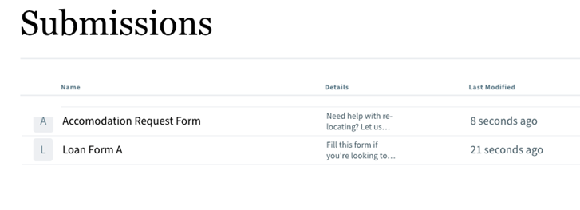

# List Adaptive Forms on a Portal {#publish-forms-on-portal}

<span class="preview"> Adobe rekommenderar att man använder modern och utbyggbar datainhämtning [Kärnkomponenter](https://experienceleague.adobe.com/docs/experience-manager-core-components/using/adaptive-forms/introduction.html) for [skapa ny Adaptive Forms](/help/forms/creating-adaptive-form-core-components.md) eller [lägga till adaptiv Forms på AEM Sites-sidor](/help/forms/create-or-add-an-adaptive-form-to-aem-sites-page.md). De här komponenterna utgör ett betydande framsteg när det gäller att skapa adaptiva Forms-filer, vilket ger imponerande användarupplevelser. I den här artikeln beskrivs det äldre sättet att skapa Adaptiv Forms med baskomponenter. </span>

| Version | Artikellänk |
| -------- | ---------------------------- |
| AEM 6.5 | [Klicka här](https://experienceleague.adobe.com/docs/experience-manager-65/forms/publish-process-aem-forms/introduction-publishing-forms.html) |
| AEM as a Cloud Service | Den här artikeln |

I ett typiskt formulärcentrerat portalscenario är formulärutveckling och portalutveckling två osammanhängande aktiviteter. När formulärdesigners designar och lagrar formulär i en databas skapar webbutvecklare ett webbprogram som listar formulär och hanterar inskickandet av formulär. Forms kopieras till webbnivån eftersom det inte finns någon kommunikation mellan formulärdatabasen och webbprogrammet.

Sådana scenarier leder ofta till hanteringsproblem och produktionsförseningar. Om det till exempel finns en nyare version av ett formulär i databasen måste du ersätta formuläret på webbnivån, ändra webbprogrammet och distribuera om formuläret på den offentliga webbplatsen. Om du omdistribuerar webbprogrammet kan det orsaka serverdriftavbrott. Vanligtvis är serverns driftstopp en planerad aktivitet och därför kan ändringarna inte skickas direkt till den offentliga platsen.

AEM Forms tillhandahåller portalkomponenter som minskar administrationskostnaderna och förseningarna i produktionen. Komponenterna gör det möjligt för webbutvecklare att skapa och anpassa en Forms Portal på webbplatser som skapats med Adobe Experience Manager (AEM).

Med Form Portal-komponenterna kan du lägga till följande funktioner:

* Visa formulär i anpassade layouter. Layouter för listvyn och kortvyn medföljer. Du kan skapa egna layouter.
* Gör att du kan visa anpassade metadata och anpassade åtgärder när du listar dem.
* Visa en lista över formulär som publicerats av AEM Forms-gränssnittet på den publiceringsinstans där Forms Portal-komponenter används.
* Tillåt slutanvändare att återge formulär i HTML och PDF.
* Möjliggör sökning av formulär baserat på titel och beskrivning.
* Använd anpassad CSS för att anpassa utseendet på portalen.
* Skapa länkar till formulär.
* Visar utkast och inskickade data som rör Adaptiv Forms som har skapats av slutanvändaren.

## Komponenter på en Forms Portal-sida {#forms-portal-components}

AEM Forms tillhandahåller följande portalkomponenter direkt:

* Sök och lista: Med den här komponenten kan du lista formulär från formulärdatabasen på din portalsida och du kan ange konfigurationsalternativ för att lista formulär baserat på angivna villkor.

* Utkast och inskickningar: Medan komponenten Sök och lista visar formulär som har publicerats av Forms-författare, visar komponenten Utkast och inskickningar formulär som har sparats som utkast för att fylla i senare och skickade formulär. Den här komponenten ger en personaliserad upplevelse till alla inloggade användare.

* Länk: Med den här komponenten kan du skapa en länk till ett formulär var som helst på sidan.

Du kan [importera färdiga Forms Portal-komponenter](#import-forms-portal-components-aem-archetype) från AEM Project Archetype. Utför följande konfigurationer efter importen:

* [Konfigurera en extern lagring](#configure-azure-storage-adaptive-forms)

* [Aktivera komponenterna i Forms Portal](#enable-forms-portal-components)

* [Konfigurera komponenterna i Forms Portal](#configure-forms-portal-components)

## Importera Forms Portal-komponenter {#import-forms-portal-components-aem-archetype}

Så här importerar du färdiga Forms Portal-komponenter på AEM Forms as a Cloud Service:

1. **Git-databasen för Cloud Manager på din lokala utvecklingsinstans:**  Din Cloud Manager Git-databas innehåller ett AEM. Den baseras på [AEM](https://github.com/adobe/aem-project-archetype/). Klona din Cloud Manager Git-databas med Git-kontohantering för självbetjäning från användargränssnittet i Cloud Manager för att få projektet i din lokala utvecklingsmiljö. Mer information om hur du använder databasen finns i [Åtkomst till databaser](https://experienceleague.adobe.com/docs/experience-manager-cloud-manager/using/managing-code/accessing-repos.html).

1. **Skapa [!DNL Experience Manager Forms] som [Cloud Service] projekt:** Skapa [!DNL Experience Manager Forms] som [Cloud Service] projekt baserat på [AEM 27](https://github.com/adobe/aem-project-archetype/releases/tag/aem-project-archetype-27) eller senare. Med denna typ kan utvecklarna enkelt börja utveckla för [!DNL AEM Forms] as a Cloud Service. Den innehåller även några exempelteman och mallar som hjälper dig att snabbt komma igång.

   Skapa [!DNL Experience Manager Forms] as a Cloud Service projekt, öppna kommandotolken och kör kommandot nedan. Inkludera [!DNL Forms] specifika konfigurationer, teman och mallar, ange `includeForms=y`.

   ```shell
   mvn -B archetype:generate -DarchetypeGroupId=com.adobe.aem -DarchetypeArtifactId=aem-project-archetype -DarchetypeVersion=30 -DaemVersion="cloud" -DappTitle="My Site" -DappId="mysite" -DgroupId="com.mysite" -DincludeForms="y"
   ```

   Ändra också `appTitle`, `appId`och `groupId`, i ovanstående kommando för att återspegla din miljö.

   När projektet är klart uppdaterar du `<core.forms.components.version>x.y.z</core.forms.components.version>` på den översta nivån `pom.xml` av Arketype-projektet för att återspegla den senaste versionen av [core-forms-components](https://github.com/adobe/aem-core-forms-components) i `AEM Archetype` projekt.

1. **Distribuera projektet till din lokala utvecklingsmiljö:** Du kan använda följande kommando för att distribuera till den lokala utvecklingsmiljön

   `mvn -PautoInstallPackage clean install`

   En fullständig lista med kommandon finns på [Bygga och installera](https://experienceleague.adobe.com/docs/experience-manager-core-components/using/developing/archetype/using.html?lang=en#building-and-installing)

1. [Distribuera koden till [!DNL AEM Forms] as a Cloud Service miljö](https://experienceleague.adobe.com/docs/experience-manager-cloud-service/content/implementing/developing/aem-project-content-package-structure.html#embeddeds).


## Konfigurera Azure Storage för adaptiv Forms {#configure-azure-storage-adaptive-forms}

[[!DNL Experience Manager Forms] Dataintegrering](data-integration.md) innehåller [!DNL Azure] lagringskonfiguration för att integrera formulär med [!DNL Azure] lagringstjänster. Formulärdatamodellen kan användas för att skapa adaptiv Forms som interagerar med [!DNL Azure] server för att möjliggöra arbetsflöden.

### Skapa Azure Storage-konfiguration {#create-azure-storage-configuration}

Innan du utför dessa steg måste du se till att du har ett Azure-lagringskonto och en åtkomstnyckel för att auktorisera åtkomst till [!DNL Azure] lagringskonto.

1. Navigera till **[!UICONTROL Tools]** > **[!UICONTROL Cloud Services]** > **[!UICONTROL Azure Storage]**.
1. Välj en mapp för att skapa konfigurationen och tryck på **[!UICONTROL Create]**.
1. Ange en rubrik för konfigurationen i dialogrutan **[!UICONTROL Title]** fält.
1. Ange namnet på [!DNL Azure] lagringskonto i **[!UICONTROL Azure Storage Account]** fält.

### Konfigurera Unified Storage Connector för Forms Portal {#configure-usc-forms-portal}

Så här konfigurerar du Unified Storage Connector för AEM arbetsflöden:

1. Navigera till **[!UICONTROL Tools]** > **[!UICONTROL Forms]** > **[!UICONTROL Unified Storage Connector]**.
1. I **[!UICONTROL Forms Portal]** avsnitt, markera **[!UICONTROL Azure]** från **[!UICONTROL Storage]** listruta.
1. Ange [konfigurationssökväg för Azure-lagringskonfigurationen](#create-azure-storage-configuration) i **[!UICONTROL Storage Configuration Path]** fält.
1. Tryck **[!UICONTROL Publish]** och sedan trycka **[!UICONTROL Save]** för att spara konfigurationen.

## Aktivera Forms Portal-komponenter {#enable-forms-portal-components}

Om du vill använda en huvudkomponent (inklusive färdiga portalkomponenter) på en Adobe Experience Manager-webbplats (AEM) måste du skapa en proxykomponent och aktivera den för din webbplats. Information om hur du skapar en proxykomponent och aktiverar portalkomponenter finns i [Använda kärnkomponenter](https://experienceleague.adobe.com/docs/experience-manager-core-components/using/get-started/using.html?lang=en#create-proxy-components).

När en portalkomponent är aktiverad kan du använda den i författarinstansen av din webbplatssida.

## Lägga till och konfigurera Forms Portal-komponenter {#configure-forms-portal-components}

Du kan skapa och anpassa Forms Portal på webbplatser som skapats med AEM genom att lägga till och konfigurera portalkomponenterna. Se till att [komponenter är aktiverade](#enable-forms-portal-components) innan du använder dem i Forms Portal.

Om du vill lägga till en komponent drar och släpper du komponenten från rutan Komponenter till layoutbehållaren på sidan eller trycker på ikonen Lägg till i layoutbehållaren och lägger till komponenten från [!UICONTROL Insert New Component] -dialogrutan.

### Konfigurera komponenten Utkast och överföringar {#configure-drafts-submissions-component}

Komponenten Utkast och inskickningar visar formulär som har sparats som utkast för att fylla i senare och skickade formulär. Konfigurera genom att trycka på komponenten och sedan på knappen . I [!UICONTROL Drafts and Submissions] anger du rubriken för att ange att formulärlistan ska vara ett utkast eller skickade formulär. Ange också om komponenten ska lista formulärutkast eller inskickade formulär i kort- eller listformat.




### Konfigurera Search &amp; Lister Component {#configure-search-lister-component}

Komponenten Sök och lista används för att lista anpassningsbara formulär på en sida och för att implementera sökning i de listade formulären.


Konfigurera genom att trycka på komponenten och sedan på knappen . The [!UICONTROL Search and Lister] öppnas.

1. I [!UICONTROL Display] konfigurerar du följande på -fliken:
   * I **[!UICONTROL Title]** anger du namnet på komponenten Sök efter och visa. Med en titel kan användarna göra snabba sökningar i hela formulärlistan.
   * Från **[!UICONTROL Layout]** väljer du den layout som ska användas för att representera formulären i kort- eller listformat.
   * Välj **[!UICONTROL Hide Search]** och **[!UICONTROL Hide Sorting]** om du vill dölja sökningen och sortera efter funktioner.
   * I **[!UICONTROL Tooltip]** innehåller verktygstipset som visas när du hovrar över komponenten.
1. I [!UICONTROL Asset Folder] anger du var formulären ska hämtas och visas på sidan. Du kan konfigurera flera mapplatser.
1. I [!UICONTROL Results] konfigurerar du maximalt antal formulär som ska visas per sida. Standardvärdet är åtta formulär per sida.

### Konfigurera länkkomponent {#configure-link-component}

Med länkkomponenten kan du skapa länkar till ett anpassat formulär på sidan. Konfigurera genom att trycka på komponenten och sedan på knappen . The [!UICONTROL Edit Link Component] öppnas.

1. I [!UICONTROL Display] ska du ange länkens beskrivning och verktygstips för att underlätta identifiering av de formulär som länken representerar.
1. I [!UICONTROL Asset Info] anger du databassökvägen där resursen lagras.
1. I [!UICONTROL Query Params] anger du ytterligare parametrar i nyckelvärdepar-formatet. När användaren klickar på länken skickas dessa ytterligare parametrar tillsammans med formuläret.

## Konfigurera asynkron formuläröverföring med Adobe Sign {#configure-asynchronous-form-submission-using-adobe-sign}

Du kan konfigurera så att ett anpassat formulär skickas endast när alla mottagare har slutfört signeringsceremonin. Följ stegen nedan för att konfigurera inställningen med Adobe Sign.

1. Öppna ett adaptivt formulär i redigeringsläget i författarinstansen.
1. Tryck på ikonen Egenskaper i den vänstra rutan och expandera dialogrutan **[!UICONTROL ELECTRONIC SIGNTATURE]** alternativ.
1. Välj **[!UICONTROL Enable Adobe Sign]**. Olika konfigurationsalternativ visas.
1. I [!UICONTROL Submit the form] väljer du **[!UICONTROL after every recipient completes signing ceremony]** för att konfigurera åtgärden Skicka formulär, där formuläret först skickas till alla mottagare för signering. När alla mottagare har signerat formuläret skickas bara formuläret.

## Spara adaptiva Forms som utkast {#save-adaptive-forms-as-drafts}

Du kan spara formulär som utkast och fylla i dem senare. Det finns två sätt att spara ett formulär som ett utkast:
* Skapa en regel av typen &quot;Spara formulär&quot; för en formulärkomponent, till exempel en knapp. När du klickar på knappen utlöses regeln och formuläret sparas som ett utkast.
* Aktivera funktionen Spara automatiskt, som sparar formuläret enligt den angivna händelsen eller efter ett konfigurerat tidsintervall.

### Skapa regler för att spara ett anpassat formulär som utkast {#rule-to-save-adaptive-form-as-draft}

Följ stegen nedan för att skapa en&quot;Spara formulär&quot;-regel för en formulärkomponent, till exempel en knapp:

1. Öppna ett adaptivt formulär i redigeringsläge i författarinstansen.
1. Tryck på  och dra [!UICONTROL Button] till formuläret.
1. Tryck på [!UICONTROL Button] och sedan trycka på .
1. Tryck på [!UICONTROL Edit Rules] om du vill öppna Regelredigeraren.
1. Tryck **[!UICONTROL Create]** för att konfigurera och skapa regeln.
1. I [!UICONTROL When] väljer du&quot;klickas&quot; och i [!UICONTROL Then] väljer du alternativet &quot;Spara formulär&quot;.
1. Tryck **[!UICONTROL Done]** för att spara regeln.

### Aktivera Spara automatiskt {#enable-auto-save}

Du kan konfigurera funktionen för att spara automatiskt för ett anpassat formulär enligt följande:

1. Öppna ett adaptivt formulär i redigeringsläge i författarinstansen.
1. Tryck på  och utöka [!UICONTROL AUTO-SAVE] alternativ.
1. Välj **[!UICONTROL Enable]** om du vill att formuläret ska sparas automatiskt. Du kan konfigurera följande:
* Som standard är [!UICONTROL Adaptive Form Event] är inställt på &quot;true&quot;, vilket betyder att formuläret sparas automatiskt efter varje händelse.
* I [!UICONTROL Trigger], konfigurera så att automatiskt sparas baserat på förekomsten av en händelse eller efter ett visst tidsintervall.
