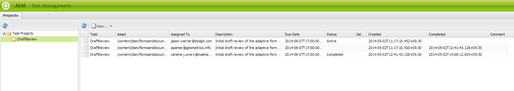

# Skapa och hantera granskningar av resurser i formulär{#creating-and-managing-reviews-for-assets-in-forms}

## Granska {#review}

En granskning är en mekanism som gör att en eller flera granskare kan kommentera en resurs som är tillgänglig i ett formulär.

## Konfigurera en granskning {#setting-up-a-review}

1. Navigera till fliken Forms och markera ett formulär.
1. Om resursen inte har någon pågående granskning visas en Starta granskning  visas i åtgärdsfältet. Klicka på Starta granskning  ikon.
1. Ange följande information:

   * Granskningsnamn: Obligatoriskt, kan innehålla alfanumeriska tecken, bindestreck eller understreck.
   * Granskningsbeskrivning: Valfritt, beskrivning av syftet/innehållet som ska granskas.
   * Tidsgräns för granskning: Valfritt, det datum då granskningen avslutas. När tidsgränsen har passerats visas aktiviteten som&quot;Försenad&quot;.
   * Granskare: Minst ett är obligatoriskt. Använd kombinationsrutan för att lägga till granskare. Om du skriver ett namn visas alla matchande namn; markera ett namn och klicka på Lägg till.

1. Fyll i alla återstående uppgifter och klicka sedan på Start.

### Åtgärder som inträffar när en granskning konfigureras {#actions-that-occur-when-a-review-is-set-up}

I det här avsnittet beskrivs vad som händer när en granskning skapas eller konfigureras.

1. En ny granskningsuppgift skapas och tilldelas initieraren av granskningen.
1. Alla granskare tilldelas en granskningsuppgift. Uppgiften visas i meddelandeavsnittet. Granskaren kan klicka på ett meddelande eller gå till Inkorgen för att visa uppgiften. Granskaren kan klicka för att öppna granskningsprocessen, visa formuläret och börja lägga till kommentarer.

   

   Aviseringsvarning för granskare

1. Kommentarsrutan är tillgänglig för initieraren och granskarna av resursen. Andra kan visa kommentarerna, men inte skriva kommentarer.

## Hantera en granskning {#managing-a-review}

>[!NOTE]
>
>Endast pågående granskningar kan ändras. Fullständiga granskningar kan inte ändras.

1. Navigera till fliken Forms och markera ett formulär.

1. Om en granskning pågår för en resurs och du är den som initierar granskningen, kan du välja Hantera granskning  ikoner visas i åtgärdsfältet. Det är bara granskningsinitieraren som kan hantera (uppdatera/avsluta) granskningen.

   Klicka på Hantera granskning ikon.

   För andra användare än initieraren är ikonen Hantera granskning inaktiverad.

1. Du får en skärm som visar information:

   * **Granskningsnamn**: Kan inte redigeras.

   * **Granskningsbeskrivning**: Finns för redigering.

   * **Granska deadline**: Finns för redigering. Du kan ändra deadline till vilket datum och vilken tid som helst efter det aktuella datumet och den aktuella tiden.

   * **Granskare**: Finns för redigering. Du kan lägga till eller ta bort granskare. Om en uppgift är försenad kan du bara lägga till granskare efter att du har förlängt tidsgränsen efter det aktuella datumet.

1. Redigera de nödvändiga fälten och klicka sedan på Uppdatera.

   

   Granska uppdaterat läge i Aktivitetshanteraren

1. Klicka på Slutför för att avsluta granskningen.

### Åtgärder som inträffar när en granskning ändras {#actions-that-occur-when-a-review-is-modified}

I det här avsnittet beskrivs vad som händer när granskningen avslutas/ändras:

1. Om granskningsbeskrivningen ändras uppdateras motsvarande uppgift för granskarna och initieraren.
1. Om deadlinen för granskning ändras uppdateras motsvarande uppgift för granskarna med det nya datumet.

1. Om en granskare tas bort:

   

   Ta bort en granskare

   1. Om den tilldelade aktiviteten är ofullständig avslutas den.
   1. Granskaren kan inte längre kommentera resursen.

1. Om en granskare läggs till:

   

   Lägga till en granskare

   1. En granskningsåtgärd skapas och tilldelas den nya granskaren.
   1. Granskaren kan lägga till kommentarer för resursen.

1. När en granskning avslutas:

   1. **Granskare**: För varje granskare avslutas den ofullständiga uppgift som är relaterad till granskningen. Aktiviteten visas inte längre som Väntande i granskarens meddelandeavsnitt.
   1. **Initierare**: Uppgiften som tilldelats granskningsinitieraren är markerad som slutförd. Aktiviteten tas bort från meddelandeavsnittet för granskningsinitieraren.
   1. **Alla**: Granskningen visas i avsnittet Tidigare granskningar. Inga fler kommentarer kan läggas till.

