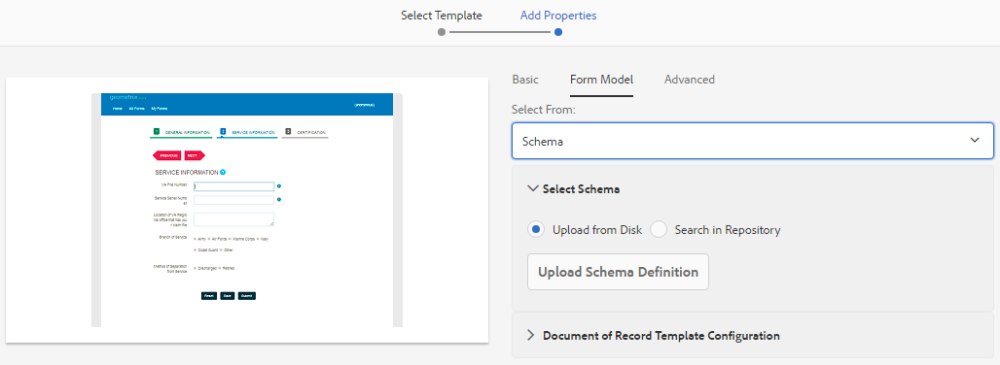

# Skapa ett adaptivt formulär (grundkomponenter) {#creating-an-adaptive-form}

| Version | Artikellänk |
| -------- | ---------------------------- |
| AEM 6.5 | [Klicka här](https://experienceleague.adobe.com/docs/experience-manager-65/forms/adaptive-forms-basic-authoring/creating-adaptive-form.html) |
| AEM as a Cloud Service | Den här artikeln |

 Adobe rekommenderar att man använder modern och utbyggbar datainhämtning [Kärnkomponenter](https://experienceleague.adobe.com/docs/experience-manager-core-components/using/adaptive-forms/introduction.html) for [skapa ny Adaptive Forms](/help/forms/creating-adaptive-form-core-components.md) eller [lägga till adaptiv Forms på AEM Sites-sidor](/help/forms/create-or-add-an-adaptive-form-to-aem-sites-page.md). De här komponenterna utgör ett betydande framsteg när det gäller att skapa adaptiva Forms-filer, vilket ger imponerande användarupplevelser. I den här artikeln beskrivs det äldre sättet att skapa Adaptiv Forms med baskomponenter. 

Med anpassningsbara Forms kan du skapa engagerande, responsiva, dynamiska och anpassningsbara formulär. AEM Forms har en användarvänlig guide för att snabbt skapa Adaptiv Forms. Guiden har en snabb fliknavigering där du enkelt kan välja förkonfigurerade mallar, format, fält och alternativ för att skicka formulär för att skapa ett adaptivt formulär.

Innan du börjar får du lära dig mer om vilken typ av Forms-komponenter du kan använda:

* [Adaptiva Forms Core-komponenter](https://experienceleague.adobe.com/docs/experience-manager-core-components/using/adaptive-forms/introduction.html?lang=en) är standardiserade komponenter för datainhämtning. Dessa komponenter har anpassningsmöjligheter, kortare utvecklingstid och lägre underhållskostnader för era digitala registreringsupplevelser. En utvecklare kan enkelt anpassa och utforma dessa komponenter. Adobe rekommenderar att du använder dessa moderna och utbyggbara komponenter för att utveckla Adaptiv Forms.

* [Adaptiva Forms Foundation-komponenter](creating-adaptive-form.md) är klassiska (gamla) komponenter för datainhämtning. Du kan fortsätta att använda dessa för att redigera dina befintliga grundläggande komponentbaserade adaptiva formulär. Om du skapar nya formulär rekommenderar Adobe att du använder  [Adaptiva Forms Core-komponenter](creating-adaptive-form-core-components.md) för att skapa en adaptiv Forms.

<!-- 

You can choose to create an Adaptive Form based on a form model or schema or without a form model. It is important to carefully choose the form model that not only suits your requirements but extends your existing infrastructural investments and assets. You get to choose from the following options to create an Adaptive Form: 

-->

<!-- 

Adaptive Forms allow you to create forms that are engaging, responsive, dynamic, and adaptive. [!DNL AEM Forms] provides an intuitive wizard and out-of-the-box components to create Adaptive Forms. You can choose to create an Adaptive Form based on a form model or schema or without a form model. It is important to carefully choose the form model that not only suits your requirements but extends your existing infrastructural investments and assets. You get to choose from the following options to create an Adaptive Form:

* **Using a form data model**
  [Data integration](data-integration.md) lets you integrate entities and services from disparate data sources in to a Form Data Model that you can use to create Adaptive Forms. Choose Form Data Model if the Adaptive Form you are creating involves fetching and write data from and to multiple data source.

  <!--  * **Using an XDP Form Template**
   It is an ideal form model if you have investments in XFA-based or XDP forms. It provides a direct way to convert your XFA-based forms into Adaptive Forms. Any existing XFA rules are retained in the associated Adaptive Forms. The resulting Adaptive Forms support XFA constructs, such as validations, events, properties, and patterns. 

* **Using an XML Schema Definition (XSD) or a JSON Schema**
   XML and JSON schemas represent the structure in which data is produced or consumed by the back-end system in your organization. You can associate the schema to an Adaptive Form and use its elements to add dynamic content to the Adaptive Form. The elements of the schema are available for use in the Data Model Objects tab of the Content browser when authoring Adaptive Forms.

* **Using none or without a form model**
   Adaptive Forms created with this option do not use any form model. The data XML generated from such forms has flat structure with fields and corresponding values. -->

## Krav

Du behöver följande för att skapa ett adaptivt formulär:

* **Behörigheter**: Lägg till dina användare i [!DNL forms-users] för att ge dem behörighet att skapa ett adaptivt formulär. En detaljerad lista över formulärspecifika användargrupper finns i [Grupper och behörigheter](forms-groups-privileges-tasks.md).

* **Ett adaptivt formulärtema**: Ett tema innehåller formatinformation för komponenterna och panelerna. Format innehåller egenskaper som bakgrundsfärger, lägesfärger, genomskinlighet, justering och storlek. När du använder ett tema återspeglas det angivna formatet i motsvarande komponenter. Du kan [skapa ett tema](themes.md) eller [importera ett befintligt tema](import-export-forms-templates.md#uploading-a-theme). Du kan också distribuera [senaste arketype](https://experienceleague.adobe.com/docs/experience-manager-core-components/using/developing/archetype/using.html#create-project) för vissa exempelteman.

* **En adaptiv formulärmall**: En mall innehåller en grundläggande struktur och definierar utseendet (layouter och format) för ett adaptivt formulär. Den har förformaterade komponenter som innehåller vissa egenskaper och innehållsstruktur. Här finns också alternativ för att definiera ett tema och en skicka-åtgärd. Temat definierar utseendet, känslan och skickaåtgärden definierar vilken åtgärd som ska vidtas när ett adaptivt formulär skickas in. Du kan till exempel skicka insamlade data till en datakälla. Molntjänsten har stöd för två typer av mallar:

   * **Redigerbar mall**: Du kan [skapa en](template-editor.md) eller [importera en befintlig redigerbar mall](migrate-to-forms-as-a-cloud-service.md). Du kan också distribuera [senaste arketype](https://experienceleague.adobe.com/docs/experience-manager-core-components/using/developing/archetype/using.html?lang=en#:~:text=The%20AEM%20Archetype%20is%20made%20up%20of%20modules%3A,and%20request%20filters.%20it.tests%3A%20are%20Java-based%20integration%20tests.) om du vill ha några redigerbara mallar.

   * **Statisk mall**: Dessa är äldre mallar och rekommenderas endast för kunder som migrerar från Adobe Managed Services (AMS) och AEM Forms lokala installationer (AEM 6.5 Forms eller tidigare). På så sätt kan du fortsätta att använda dina befintliga investeringar i statiska mallar. När du skapar ett adaptivt formulär använder du en redigerbar mall.

## Skapa ett adaptivt formulär (grundkomponenter) {#create-an-adaptive-form-foundation-components}

1. Åtkomst [!DNL Experience Manager Forms] Författarinstans. Det kan vara en molninstans eller en lokal utvecklingsinstans.

1. Ange dina uppgifter på inloggningssidan för Experience Manager.

   När du är inloggad trycker du på **[!UICONTROL Adobe Experience Manager]** > **[!UICONTROL Forms]** > **[!UICONTROL Forms & Documents]**.

1. Tryck på **[!UICONTROL Create]**  > **[!UICONTROL Adaptive Forms]**. Guiden öppnas.
1. Välj en mall på fliken Källa:

   * När du väljer en redigerbar mall markeras ett tema och en skicka-åtgärd som anges i mallen automatiskt, och **[!UICONTROL Create]** knappen är aktiverad. Du kan gå till **[!UICONTROL Style]** eller **[!UICONTROL Submission]** för att välja ett annat tema eller skicka-åtgärd. Om den valda redigerbara mallen inte anger något tema är knappen Skapa inaktiverad. Du kan gå till **[!UICONTROL Styles]** om du vill välja ett tema manuellt.

     >[!NOTE]
     >
     > Du kan också skapa [!UICONTROL Document of Record] -mall med en adaptiv Forms-redigerare. Mer information finns i [Dokumentstöd i anpassad formulärredigerare](/help/forms/generate-document-of-record-for-non-xfa-based-adaptive-forms.md#document-of-record-support-in-adaptive-form-editor-dor-support-in-adaptiveform).

   * När du väljer en statisk mall är alternativen för data, format, sändning, leverans och förhandsgranskning inte tillgängliga. När du skapar ett adaptivt formulär använder du en redigerbar mall.

1. I **[!UICONTROL Style]** väljer du ett tema:

   * När den valda mallen anger ett tema väljs temat automatiskt i guiden. Du kan också välja ett annat tema på fliken Format.
   * Om den valda mallen inte anger något tema kan du använda fliken Format för att välja ett tema. The **[!UICONTROL Create]** knappen aktiveras först när ett tema har valts.

1. (Valfritt) I dialogrutan **[!UICONTROL Data]** väljer du en datamodell:

   * **Formulärdatamodell**: A [Formulärdatamodell](data-integration.md) Med kan ni integrera enheter och tjänster från olika datakällor i ett adaptivt formulär. Välj Formulärdatamodell om det adaptiva formulär du skapar inbegriper att hämta och skriva data från och till flera datakällor.

   * **JSON-schema**: [JSON-schema](adaptive-form-json-schema-form-model.md) representerar den struktur i vilken data produceras eller används av det bakomliggande systemet i organisationen. Du kan koppla schemat till ett adaptivt formulär och använda dess element för att lägga till dynamiskt innehåll i det adaptiva formuläret. Elementen i schemat är tillgängliga för användning på fliken Datamodellsobjekt i innehållsläsaren när du redigerar Adaptiv Forms och alla fält läggs även till i det nyskapade adaptiva formuläret.

   Som standard markeras alla fält i datamodellen. När du skapar det adaptiva formuläret konverteras alla markerade datamodellfält till motsvarande adaptiva formulärkomponenter. Guiden innehåller kryssrutor som du kan använda för att markera endast de fält som ska ingå i det adaptiva formuläret.

   <!-- 
   
   If your JSON schema contains a fragment, the fragment is considered a single unit. You can select or deselect a complete fragment and all the fields of the fragment are selected or deselected accordingly. 
   
   -->

1. I **[!UICONTROL Submission]** väljer du en Skicka-åtgärd:

   * När du väljer en mall markeras åtgärden Skicka som anges i mallen automatiskt. Du kan välja en annan skickaåtgärd på fliken Skicka. The **[!UICONTROL  Submission]** på -fliken visas alla tillgängliga skicka-åtgärder.

   * När den valda mallen inte anger någon skicka-åtgärd kan du använda **[!UICONTROL Submission]** flik för att välja en skicka-åtgärd

1. (Valfritt) På fliken Leverans kan du ange ett publicerings- eller avpubliceringsdatum för ett adaptivt formulär.

1. Tryck på **[!UICONTROL Create]**. En dialogruta där du kan ange namn, namn och plats för att spara det adaptiva formuläret visas:

   * **[!UICONTROL Title]** Anger formulärets visningsnamn. Titeln hjälper dig att identifiera formuläret i [!DNL Experience Manager Forms] användargränssnitt.
   * **[!UICONTROL Name:]** Anger formulärets namn. En nod med det angivna namnet skapas i databasen. När du börjar skriva en titel genereras värdet för namnfältet automatiskt. Du kan ändra det föreslagna värdet. Namnfältet får endast innehålla alfanumeriska tecken, bindestreck och understreck. Alla ogiltiga indata ersätts med ett bindestreck.
   * **[!UICONTROL Path:]** Anger platsen där det adaptiva formuläret ska sparas. Du kan spara det anpassade formuläret direkt på `/content/dam/formsanddocuments` eller skapa en mapp som `/content/dam/formsanddocuments/adaptiveforms` för att spara ett adaptivt formulär. Se till att du skapar mappen innan du använder den i sökvägen. The **[!UICONTROL Path:]** skapas ingen mapp automatiskt.

1. Tryck på **[!UICONTROL Create]**. Ett adaptivt formulär skapas och öppnas i den adaptiva Forms-redigeraren. Redigeraren visar det innehåll som är tillgängligt i mallen. Här visas också sidlisten där du kan anpassa det nya formuläret efter behov.

   Baserat på typen av adaptiv form finns formulärelementen i den associerade <!--XFA form template, XML schema or --> JSON-schema eller formulärdatamodell visas i **[!UICONTROL Data Model Objects]** -fliken i **[!UICONTROL Content Browser]** i sidlisten. Du kan också dra och släppa dessa element för att skapa ett anpassat formulär.

<!-- ## Create an Adaptive Form based on a Form Data Model {#fdm}

[Data integration](data-integration.md) lets you integrate multiple data sources and bring their entities and services together to create a form data model. It is an extension of JSON schema. You can use a Form Data Model to create an Adaptive Form. The entities or data model objects configured in a Form Data Model are available as data model objects for form authoring. They are bound to respective data sources and used to prefill a form and write submitted data back to the respective data sources. You can also call services configured in a Form Data Model using Adaptive Form rules.

To use a Form Data Model for creating an Adaptive Form:

1. In Form Model tab on Add Properties screen, select **[!UICONTROL Form Data Model]** in the **[!UICONTROL Select From]** drop-down list.

   

1. Tap to expand **[!UICONTROL Select Form Data Model]**. All available form data models are listed.Select a from data model.

>[!NOTE]
>
>You can also change the Form Data Model for an Adaptive Form. For detailed steps, see [Edit Form Model properties of an Adaptive Form](#edit-form-model).

## Create an Adaptive Form based on XML or JSON schema {#create-an-adaptive-form-based-on-xml-or-json-schema}

XML and JSON schemas represent the structure in which data is produced or consumed by the back-end system in your organization. You can associate a schema to an Adaptive Form and use its elements to add dynamic content to the Adaptive Form. The elements of the schema are available in the Data Model Object tab of the content browser for authoring Adaptive Forms. You can drag-drop the schema elements to build the form.

See the following documents to understand how to design XML or JSON schema for authoring Adaptive Forms.

* [Creating Adaptive Forms using XML schema](adaptive-form-xml-schema-form-model.md)
* [Creating Adaptive Forms using JSON schema](adaptive-form-json-schema-form-model.md)

Do the following to use XML or JSON schema as form model for an Adaptive Form:

1. On the **[!UICONTROL Add Properties]** step of Adaptive Form creation page, tap on the **[!UICONTROL Form Model]** tab.
1. In the Form Model tab, select **[!UICONTROL Schema]** from the **[!UICONTROL Select From]** drop-down field.

1. Tap **[!UICONTROL Select Schema]** and do one of the following:

    * **[!UICONTROL Upload from disk]** - Select this option and tap Upload Schema Definition to browse and upload an XML schema or JSON schema from your file system. The uploaded schema file resides with the form and is not accessible to other Adaptive Forms.
    * **[!UICONTROL Search in repository]** - Select this option to select from the list of schema definition files available in the repository. Select the XML or JSON schema file as form model. The selected schema is associated with the form by reference and is accessible for use in other Adaptive Forms.

      Ensure that the JSON schema filename ends with **.schema.json**. For example: mySchema.schema.json

   
**Figure:** *Selecting XML or JSON schema*

1. (For XML schema only) After you select or upload an XML Schema, specify a root element of the selected XSD file to map with the Adaptive Form.

   
**Figure:** *Selecting XSD root element*

>[!NOTE]
>
>You can also change the schema for an Adaptive Form. For detailed steps, see [Edit Form Model properties of an Adaptive Form](#edit-form-model). -->

## Redigera formulärmodellegenskaper för ett adaptivt formulär {#edit-form-model}

Du kan ändra formulärmodellen för ett adaptivt formulär (JSON-baserat eller Formulärdatamodell). Du kan inte ändra från en formulärmodell till en annan.

1. Markera det adaptiva formuläret och tryck på **Egenskaper** -ikon.
1. Öppna **[!UICONTROL Form Model]** och gör något av följande.

   * Om det adaptiva formuläret inte har någon formulärmodell kan du välja en annan formulärmodell och därefter välja <!-- a form template, --> XML- eller JSON-schema eller formulärdatamodell.
   * Om det adaptiva formuläret är baserat på en formulärmodell kan du välja ett annat <!-- form template, --> XML- eller JSON-schema eller formulärdatamodell för samma formulärmodell.

1. Tryck **[!UICONTROL Save]** för att spara egenskaperna.

Du kan också ändra formulärmodellens egenskaper i den adaptiva formulärredigeraren eller i den adaptiva formulärmallsredigeraren.

1. Välj **[!UICONTROL Adaptive Form container (Root)]** -komponenten.
1. Klicka  -ikonen för att öppna **[!UICONTROL Properties]** i behållaren för adaptiv form.
1. Välj **[!UICONTROL Data Model]** och gör något av följande:

   * Om det adaptiva formuläret inte har någon formulärmodell kan du välja en formulärmodell och därefter välja <!-- a form template, --> XML- eller JSON-schema eller formulärdatamodell.
   * Om det adaptiva formuläret är baserat på en formulärmodell kan du inte ändra formulärmodellen. Du kan välja ett annat <!-- form template, --> XML- eller JSON-schema eller formulärdatamodell för samma formulärmodell som är tillämplig.
1. Tryck  för att spara egenskaperna.

>[!NOTE]
>
> Du kan också spara ett tilläggsformulär som en mall. Mer information finns i [Skapa en mall med ett adaptivt formulär](/help/forms/template-editor.md#saving-an-adaptive-form-as-template-saving-adaptive-form-as-template).

## Se även {#see-also}

{{see-also}}