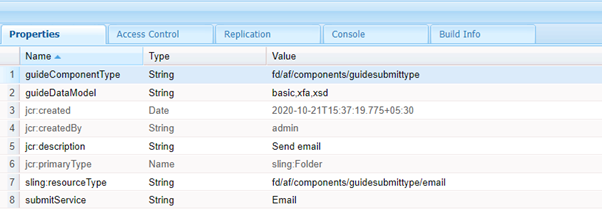

# Skapa en anpassad inskickningsåtgärd för Adaptiv Forms {#writing-custom-submit-action-for-adaptive-forms}

| Version | Artikellänk |
| -------- | ---------------------------- |
| AEM 6.5 | [Klicka här](https://experienceleague.adobe.com/docs/experience-manager-65/forms/customize-aem-forms/custom-submit-action-form.html) |
| AEM as a Cloud Service | Den här artikeln |

Ett anpassat formulär innehåller flera färdiga inskickningsåtgärder (OTB). En Skicka-åtgärd specificerar vilka åtgärder som ska utföras på data som samlats in via det adaptiva formuläret. Du kan till exempel skicka data via ett e-postmeddelande.

Du kan skapa en anpassad Skicka-åtgärd för att lägga till funktioner som inte ingår i [färdiga Skicka-åtgärder](configuring-submit-actions.md) eller stöds inte via en enda OOTB-överföringsåtgärd. Du kan till exempel skicka data till ett arbetsflöde, spara data i ett datalager, skicka e-postmeddelanden till den person som skickar formuläret och skicka ett e-postmeddelande till den person som ansvarar för att bearbeta det inskickade formuläret för godkännande och avslag genom en enda Skicka-åtgärd.

## XML-dataformat {#xml-data-format}

XML-data skickas till servern med **`jcr:data`** request-parameter. Skicka åtgärder kan komma åt parametern för att bearbeta data. I följande kod beskrivs formatet för XML-data. Fälten som är bundna till formulärmodellen visas i dialogrutan **`afBoundData`** -avsnitt. Obundna fält visas i `afUnoundData`-avsnitt. <!--For more information about the format of the `data.xml` file, see [Introduction to prepopulating Adaptive Form fields](prepopulate-adaptive-form-fields.md).-->

```xml
<?xml ?>
<afData>
<afUnboundData>
<data>
<field1>value</field2>
<repeatablePanel>
    <field2>value</field2>
</repeatablePanel>
<repeatablePanel>
    <field2>value</field2>
</repeatablePanel>
</data>
</afUnboundData>
<afBoundData>
<!-- xml corresponding to the Form Model /XML Schema -->
</afBoundData>
</afData>
```

### Åtgärdsfält {#action-fields}

En Skicka-åtgärd kan lägga till dolda inmatningsfält (med HTML) [input](https://developer.mozilla.org/en/docs/Web/HTML/Element/Input) -tagg) till det återgivna formuläret HTML. Dessa dolda fält kan innehålla värden som behövs när formulärinlämningen behandlas. När du skickar formuläret bokförs dessa fältvärden som begärandeparametrar som åtgärden Skicka kan använda när formuläret skickas. Indatafälten kallas åtgärdsfält.

En Skicka-åtgärd som även fångar upp den tid det tar att fylla i ett formulär kan t.ex. lägga till dolda inmatningsfält `startTime` och `endTime`.

Ett skript kan ange värdena för `startTime` och `endTime` fält när formuläret återges och innan formuläret skickas. Skriptet Skicka åtgärd `post.jsp` kan sedan komma åt dessa fält med hjälp av frågeparametrar och beräkna den totala tid som krävs för att fylla i formuläret.

### Bifogade filer {#file-attachments}

Skicka funktionsmakron kan även använda de bifogade filer som du överför med komponenten Bifogad fil. Skicka funktionsmakroskript kan komma åt dessa filer med hjälp av slingan [API för RequestParameter](https://sling.apache.org/apidocs/sling5/org/apache/sling/api/request/RequestParameter.html). The [isFormField](https://sling.apache.org/apidocs/sling5/org/apache/sling/api/request/RequestParameter.html#isFormField()) API-metoden hjälper till att identifiera om parametern request är en fil eller ett formulärfält. Du kan iterera över parametrarna för begäran i en Skicka-åtgärd för att identifiera parametrar för bifogade filer.

Följande exempelkod identifierar de bifogade filerna i begäran. Därefter läses data in i filen med [Hämta API](https://sling.apache.org/apidocs/sling5/org/apache/sling/api/request/RequestParameter.html#get()). Slutligen skapas ett Document-objekt med hjälp av data och läggs till i en lista.

```java
RequestParameterMap requestParameterMap = slingRequest.getRequestParameterMap();
for (Map.Entry<String, RequestParameter[]> param : requestParameterMap.entrySet()) {
    RequestParameter rpm = param.getValue()[0];
    if(!rpm.isFormField()) {
        fileAttachments.add(new Document(rpm.get()));
    }
}
```

När du bifogar filer till det adaptiva formuläret validerar servern de bifogade filerna efter att det adaptiva formuläret skickats in och returnerar ett felmeddelande om:

* Bifogade filer innehåller ett filnamn som börjar med (.) tecken, innehåller \ / : * ? &quot; &lt; > | ; % $-tecken, eller innehåller speciella filnamn som är reserverade för operativsystemet Windows, till exempel `nul`, `prn`, `con`, `lpt`, eller `com`.

* Storleken på den bifogade filen är 0 byte.

* Den bifogade filens format definieras inte i [Filtyper som stöds](https://helpx.adobe.com/document-cloud/help/supported-file-formats-fill-sign.html#main-pars_text) när komponenten Bifogad fil konfigureras i ett adaptivt formulär.

### Framåtsökväg och omdirigerings-URL {#forward-path-and-redirect-url}

När du har utfört den nödvändiga åtgärden vidarebefordrar servern Skicka begäran till sökvägen framåt. En åtgärd använder API:t setForwardPath för att ställa in framåtsökvägen på tjänsten Skicka stödlinje.

Om åtgärden inte har någon framåtriktad sökväg dirigeras webbläsaren om med hjälp av omdirigerings-URL:en. Författaren konfigurerar omdirigerings-URL:en med hjälp av Tack-sidan i dialogrutan Redigera anpassat formulär. Du kan också konfigurera omdirigerings-URL:en via Submit Action (Skicka-åtgärd) eller setRedirectUrl API i Submit (Skicka guide). Du kan också konfigurera de Request-parametrar som skickas till Redirect URL med API:t setRedirectParameters i guiden Submit.

>[!NOTE]
>
>En författare tillhandahåller en omdirigerings-URL (med hjälp av Tack-sidkonfigurationen). [OTB-överföringsåtgärder](configuring-submit-actions.md) Använd omdirigerings-URL:en för att omdirigera webbläsaren från resursen som den framåtriktade sökvägen refererar till.
>
>Du kan skriva en anpassad Skicka-åtgärd som vidarebefordrar en begäran till en resurs eller server. Adobe rekommenderar att skriptet som utför resurshantering för den framåtriktade sökvägen omdirigerar begäran till omdirigerings-URL:en när bearbetningen är klar.

## Skicka åtgärd {#submit-action}

En Skicka-åtgärd är en sling:Mapp som innehåller följande:

* **addfields.jsp**: Det här skriptet innehåller de åtgärdsfält som läggs till i filen HTML under återgivningen. Använd det här skriptet för att lägga till dolda indataparametrar som krävs vid överföring i skriptet post.POST.jsp.
* **dialog.xml**: Det här skriptet liknar CQ Component dialog. Det innehåller konfigurationsinformation som författaren anpassar. Fälten visas på fliken Skicka åtgärder i dialogrutan Redigera anpassat formulär när du väljer åtgärden Skicka.
* **post.POST.jsp**: Sändningsservern anropar det här skriptet med de data som du skickar och de ytterligare data som finns i föregående avsnitt. Om du kör en åtgärd på den här sidan måste du köra skriptet post.POST.jsp. Om du vill registrera åtgärden Skicka med den adaptiva Forms som ska visas i dialogrutan Redigera anpassat formulär lägger du till dessa egenskaper i dialogrutan `sling:Folder`:

   * **guideComponentType** av typen String och value **fd/af/components/guidepittype**
   * **guideDataModel** av typen String som anger vilken typ av adaptiv form som åtgärden Skicka gäller för. <!--**xfa** is supported for XFA-based Adaptive Forms while -->**xsd** stöds för XSD-baserad Adaptive Forms. **grundläggande** stöds för Adaptive Forms som inte använder XDP eller XSD. Om du vill visa åtgärden för flera typer av Adaptiv Forms lägger du till motsvarande strängar. Avgränsa varje sträng med kommatecken. Gör till exempel en åtgärd synlig på <!--XFA- and -->XSD-baserad Adaptiv Forms, ange värdet som <!--**xfa** and--> **xsd**.

   * **jcr:description** av typen String. Värdet för den här egenskapen visas i listan Skicka åtgärd på fliken Skicka åtgärder i dialogrutan Redigera anpassat formulär. OOTB-åtgärderna finns i CRX-databasen på platsen **/libs/fd/af/components/guideSubittype**.

   * **submitService** av typen String. Mer information finns i [Schemalägg inlämning av anpassat formulär för anpassade åtgärder](#schedule-adaptive-form-submission).

## Skapa en anpassad skickaåtgärd {#creating-a-custom-submit-action}

Utför följande steg för att skapa en anpassad Skicka-åtgärd som sparar data i CRX-databasen och skickar sedan ett e-postmeddelande till dig. Det adaptiva formuläret innehåller innehållet i OTB-inlämningsåtgärdsarkivet (föråldrat) som sparar data i CRX-databasen. Dessutom innehåller AEM en [E-post](https://www.adobe.io/experience-manager/reference-materials/6-5/javadoc/com/day/cq/mailer/package-summary.html) API som kan användas för att skicka e-post. Konfigurera tjänsten Day CQ Mail via systemkonsolen innan du använder e-post-API:t. Du kan återanvända åtgärden Lagra innehåll (föråldrat) för att lagra data i databasen. Åtgärden Lagra innehåll (borttaget) finns på platsen /libs/fd/af/components/guideSubittype/store i CRX-databasen.

1. Logga in på CRXDE Lite på URL:en https://&lt;server>:&lt;port>/crx/de/index.jsp. Skapa en nod med egenskapen sling:Folder och name store_and_mail i mappen /apps/custom_submit_action. Skapa mappen custom_submit_action om den inte redan finns.

   

1. **Ange obligatoriska konfigurationsfält.**

   Lägg till den konfiguration som krävs för Store-åtgärden. Kopiera **cq:dialog** noden i Store-åtgärden från /libs/fd/af/components/guideSubittype/store till åtgärdsmappen på /apps/custom_submit_action/store_and_email.

   

1. **Ange konfigurationsfält som uppmanar författaren att ange e-postkonfigurationen.**

   Det adaptiva formuläret innehåller även en e-poståtgärd som skickar e-post till användarna. Anpassa den här åtgärden baserat på dina behov. Gå till /libs/fd/af/components/guideSubmitType/email/dialog. Kopiera noderna i cq:dialog-noden till cq:dialog-noden i din Submit-åtgärd (/apps/custom_submit_action/store_and_email/dialog).

   

1. **Gör åtgärden tillgänglig i dialogrutan Redigera anpassat formulär.**

   Lägg till följande egenskaper i noden store_and_email:

   * **guideComponentType** av typen **Sträng** och värde **fd/af/components/guidepittype**

   * **guideDataModel** av typen **Sträng** och värde **<!--xfa, -->xsd, grundläggande**

   * **jcr:description** av typen **Sträng** och värde **Åtgärd för att lagra och skicka e-post**

   * **submitService** av typen **Sträng** och värde **Lagra och skicka med e-post**. Mer information finns i [Schemalägg inlämning av anpassat formulär för anpassade åtgärder](#schedule-adaptive-form-submission).

1. Öppna ett anpassat formulär. Klicka på **Redigera** knapp bredvid **Starta** för att öppna **Redigera** dialogrutan för behållaren för adaptivt formulär. Den nya åtgärden visas i **Skicka funktionsmakron** Tabb. Markera **Åtgärd för att lagra och skicka e-post** visar konfigurationen som lagts till i noden i dialogrutan.

   

1. **Använd åtgärden för att slutföra en uppgift.**

   Lägg till skriptet post.POST.jsp i åtgärden. (/apps/custom_submit_action/store_and_mail/).

   Kör åtgärden OTB Store (skriptet post.POST.jsp). Använd [FormsHelper.runAction](https://www.adobe.io/experience-manager/reference-materials/6-5/javadoc/com/day/cq/wcm/foundation/forms/FormsHelper.html#runAction-java.lang.String-java.lang.String-org.apache.sling.api.resource.Resource-org.apache.sling.api.SlingHttpServletRequest-org.apache.sling.api.SlingHttpServletResponse-)(java.lang.String, java.lang.String, org.apache.sling.api.resource, org.apache.sling.api.SlingHttpServletRequest, org.apache.sling.api.SlingHttpServletResponse) API som CQ tillhandahåller i koden för att köra Store-åtgärden . Lägg till följande kod i JSP-filen:

   `FormsHelper.runAction("/libs/fd/af/components/guidesubmittype/store", "post", resource, slingRequest, slingResponse);`

   För att skicka e-postmeddelandet läser koden mottagarens e-postadress från konfigurationen. Om du vill hämta konfigurationsvärdet i åtgärdens skript läser du egenskaperna för den aktuella resursen med följande kod. På samma sätt kan du läsa andra konfigurationsfiler.

   `ValueMap properties = ResourceUtil.getValueMap(resource);`

   `String mailTo = properties.get("mailTo");`

   Använd slutligen CQ Mail API för att skicka e-postmeddelandet. Använd [SimpleEmail](https://commons.apache.org/proper/commons-email/apidocs/org/apache/commons/mail/SimpleEmail.html) klassen för att skapa e-postobjektet enligt nedan:

   >[!NOTE]
   >
   >Kontrollera att JSP-filen har namnet post.POST.jsp.

   ```java
   <%@include file="/libs/fd/af/components/guidesglobal.jsp" %>
   <%@page import="com.day.cq.wcm.foundation.forms.FormsHelper,
          org.apache.sling.api.resource.ResourceUtil,
          org.apache.sling.api.resource.ValueMap,
                   com.day.cq.mailer.MessageGatewayService,
     com.day.cq.mailer.MessageGateway,
     org.apache.commons.mail.Email,
                   org.apache.commons.mail.SimpleEmail" %>
   <%@taglib prefix="sling"
                   uri="https://sling.apache.org/taglibs/sling/1.0" %>
   <%@taglib prefix="cq"
                   uri="https://www.day.com/taglibs/cq/1.0"
   %>
   <cq:defineObjects/>
   <sling:defineObjects/>
   <%
           String storeContent =
                       "/libs/fd/af/components/guidesubmittype/store";
           FormsHelper.runAction(storeContent, "post", resource,
                                   slingRequest, slingResponse);
    ValueMap props = ResourceUtil.getValueMap(resource);
    Email email = new SimpleEmail();
    String[] mailTo = props.get("mailto", new String[0]);
    email.setFrom((String)props.get("from"));
           for (String toAddr : mailTo) {
               email.addTo(toAddr);
      }
    email.setMsg((String)props.get("template"));
    email.setSubject((String)props.get("subject"));
    MessageGatewayService messageGatewayService =
                       sling.getService(MessageGatewayService.class);
    MessageGateway messageGateway =
                   messageGatewayService.getGateway(SimpleEmail.class);
    messageGateway.send(email);
   %>
   ```

   Välj åtgärden i det adaptiva formuläret. Åtgärden skickar ett e-postmeddelande och lagrar data.

## Använd egenskapen submitService för anpassade överföringsåtgärder {#submitservice-property}

När du anger en anpassad skickaåtgärd, som innehåller `submitService` -egenskapen, formuläret utlöser [FormSubmitActionService](https://helpx.adobe.com/experience-manager/6-5/forms/javadocs/com/adobe/aemds/guide/service/FormSubmitActionService.html) när de skickas in. The `FormSubmitActionService` använder `getServiceName` metod för att hämta värdet för `submitService` -egenskap. Baserat på värdet på `submitService` egenskapen, anropar tjänsten rätt överföringsmetod. Inkludera `FormSubmitActionService` till det anpassade paket som du överför till [!DNL AEM Forms] server.

Lägg till `submitService` egenskap av typen sträng till `sling:Folder` av din anpassade Skicka-åtgärd för att aktivera [!DNL Adobe Sign] för den adaptiva formen. Du kan välja **[!UICONTROL Enable Adobe Sign]** i **[!UICONTROL Electronic Signature]** -avsnittet i behållaregenskaperna för det adaptiva formuläret först efter att du har angett värdet för `submitService` egenskapen för den anpassade åtgärden Skicka.

<!--As a result of setting an appropriate value for the `submitService` property and enabling [!DNL Adobe Sign], you can schedule the submission of an Adaptive Form to ensure that all configured signers have taken an action on the form. [!DNL Adobe Sign] Configuration Service keeps polling [!DNL Adobe Sign] server at regular intervals to verify the status of signatures. If all the signers complete signing the form, the Submit Action service is started and the form is submitted.-->




<!-- You can't do comments within comments, so I changed comment tags to <start-comment> <end-comment> -->

<!--
## Workflow for a Submit Action {#workflow-for-a-submit-action}

The flowchart depicts the workflow for a Submit Action that is triggered when you click the **[!UICONTROL Submit]** button in an Adaptive Form. The files in the File Attachment component are uploaded to the server, and the form data is updated with the URLs of the uploaded files. Within the client, the data is stored in the JSON format. The client sends an Ajax request to an internal servlet that massages the data you specified and returns it in the XML format. The client collates this data with action fields. It submits the data to the final servlet (Guide Submit servlet) through a Form Submit Action. Then, the servlet forwards the control to the Submit Action. The Submit Action can forward the request to a different sling resource or redirect the browser to another URL.


### XML data format {#xml-data-format}

The XML data is sent to the servlet using the **`jcr:data`** request parameter. Submit Actions can access the parameter to process the data. The following code describes the format of the XML data. The fields that are bound to the Form model appear in the **`afBoundData`** section. Unbound fields appear in the `afUnoundData`section. For more information about the format of the `data.xml` file, see [Introduction to prepopulating Adaptive Form fields](prepopulate-adaptive-form-fields.md).

```xml
<?xml ?>
<afData>
<afUnboundData>
<data>
<field1>value</field2>
<repeatablePanel>
    <field2>value</field2>
</repeatablePanel>
<repeatablePanel>
    <field2>value</field2>
</repeatablePanel>
</data>
</afUnboundData>
<afBoundData>
<start comment> xml corresponding to the Form Model /XML Schema <end comment>
<start comment> </afBoundData> <end comment>
</afData>
```

### Action fields {#action-fields}

A Submit Action can add hidden input fields (using the HTML [input](https://developer.mozilla.org/en/docs/Web/HTML/Element/Input) tag) to the rendered form HTML. These hidden fields can contain values that it needs while processing form submission. When submitting the form, these field values are posted back as request parameters that the Submit Action can use during submission handling. The input fields are called action fields.

For example, a Submit Action that also captures the time taken to fill a form can add the hidden input fields `startTime` and `endTime`.

A script can supply the values of the `startTime` and `endTime` fields when the form renders and before form submission, respectively. The Submit Action script `post.jsp` can then access these fields using request parameters and compute the total time required to fill the form.

### File attachments {#file-attachments}

Submit Actions can also use the file attachments you upload using the File Attachment component. Submit Action scripts can access these files using the sling [RequestParameter API](https://sling.apache.org/apidocs/sling5/org/apache/sling/api/request/RequestParameter.html). The [isFormField](https://sling.apache.org/apidocs/sling5/org/apache/sling/api/request/RequestParameter.html#isFormField()) method of the API helps identify whether the request parameter is a file or a form field. You can iterate over the Request parameters in a Submit Action to identify File Attachment parameters.

The following sample code identifies the file attachments in the request. Next, it reads the data into the file using the [Get API](https://sling.apache.org/apidocs/sling5/org/apache/sling/api/request/RequestParameter.html#get()). Finally, it creates a Document object using the data and appends it to a list.

```java
RequestParameterMap requestParameterMap = slingRequest.getRequestParameterMap();
for (Map.Entry<String, RequestParameter[]> param : requestParameterMap.entrySet()) {
    RequestParameter rpm = param.getValue()[0];
    if(!rpm.isFormField()) {
        fileAttachments.add(new Document(rpm.get()));
    }
}
```

### Forward path and Redirect URL {#forward-path-and-redirect-url}

After performing the required action, the Submit servlet forwards the request to the forward path. An action uses the setForwardPath API to set the forward path in the Guide Submit servlet.

If the action does not provide a forward path, the Submit servlet redirects the browser using the Redirect URL. The author configures the Redirect URL using the Thank You Page configuration in the Adaptive Form Edit dialog. You can also configure the Redirect URL through the Submit Action or the setRedirectUrl API in the Guide Submit servlet. You can also configure the Request parameters sent to the Redirect URL using the setRedirectParameters API in the Guide Submit servlet.

>[!NOTE]
>
>An author provides the Redirect URL (using the Thank You Page Configuration). [OOTB Submit Actions](configuring-submit-actions.md) use the Redirect URL to redirect the browser from the resource that the forward path references.
>
>You can write a custom Submit Action that forwards a request to a resource or servlet. Adobe recommends that the script that performs resource handling for the forward path redirect the request to the Redirect URL when the processing completes.

## Submit Action {#submit-action}

A Submit Action is a sling:Folder that includes the following:

* **addfields.jsp**: This script provides the action fields that are added to the HTML file during rendition. Use this script to add hidden input parameters required during submission in the post.POST.jsp script.
* **dialog.xml**: This script is similar to the CQ Component dialog. It provides configuration information that the author customizes. The fields are displayed in the Submit Actions Tab in the Adaptive Form Edit dialog when you select the Submit Action.
* **post.POST.jsp**: The Submit servlet calls this script with the data that you submit and the additional data in the previous sections. Any mention of running an action in this page implies running the post.POST.jsp script. To register the Submit Action with the Adaptive Forms to display in the Adaptive Form Edit dialog, add these properties to the sling:Folder:

    * **guideComponentType** of type String and value **fd/af/components/guidesubmittype**
    * **guideDataModel** of type String that specifies the type of Adaptive Form for which the Submit Action is applicable. **xfa** is supported for XFA-based Adaptive Forms while **xsd** is supported for XSD-based Adaptive Forms. **basic** is supported for Adaptive Forms that do not use XDP or XSD. To display the action on multiple types of Adaptive Forms, add the corresponding strings. Separate each string by a comma. For example, to make an action visible on XFA- and XSD-based Adaptive Forms, specify the values **xfa** and **xsd** respectively.

    * **jcr:description** of type String. The value of this property is displayed in the Submit Action list in the Submit Actions Tab of the Adaptive Form Edit dialog. The OOTB actions are present in the CRX repository at the location **/libs/fd/af/components/guidesubmittype**.

## Creating a custom Submit Action {#creating-a-custom-submit-action}

Perform the following steps to create a custom Submit Action that saves the data in the CRX repository and then sends you an email. The Adaptive Form contains the OOTB Submit Action Store Content (deprecated) that saves the data in the CRX repository. In addition, CQ provides a [Mail](https://www.adobe.io/experience-manager/reference-materials/6-5/javadoc/com/day/cq/mailer/package-summary.html) API that can be used to send emails. Before using the Mail API, configure the Day CQ Mail service through the system console. You can reuse the Store Content (deprecated) action to store the data in the repository. The Store Content (deprecated) action is available at the location /libs/fd/af/components/guidesubmittype/store in the CRX repository.

1. Log in to CRXDE Lite at the URL https://&lt;server&gt;:&lt;port&gt;/crx/de/index.jsp. Create a node with the property sling:Folder and name store_and_mail in the /apps/custom_submit_action folder. Create the custom_submit_action folder if it does not exist already.

   

1. **Provide the mandatory configuration fields.**

   Add the configuration the Store action requires. Copy the **cq:dialog** node of the Store action from /libs/fd/af/components/guidesubmittype/store to the action folder at /apps/custom_submit_action/store_and_email.

   

1. **Provide configuration fields to prompt the author for email configuration.**

   The Adaptive Form also provides an Email action that sends emails to users. Customize this action based on your requirements. Navigate to /libs/fd/af/components/guidesubmittype/email/dialog. Copy the nodes within the cq:dialog node to cq:dialog node of your Submit Action (/apps/custom_submit_action/store_and_email/dialog).

   

1. **Make the action available in the Adaptive Form Edit dialog.**

   Add the following properties in the store_and_email node:

    * **guideComponentType** of type **String** and value **fd/af/components/guidesubmittype**

    * **guideDataModel** of type **String** and value **xfa, xsd, basic**

    * **jcr:description** of type **String** and value **Store and Email Action**

1. Open any Adaptive Form. Click the **Edit** button next to **Start** to open the **Edit** dialog of the Adaptive Form container. The new action is displayed in the **Submit Actions** Tab. Selecting the **Store and Email Action** displays the configuration added in the dialog node.

   

1. **Use the action to complete a task.**

   Add the post.POST.jsp script to your action. (/apps/custom_submit_action/store_and_mail/).

   Run the OOTB Store action (post.POST.jsp script). Use the [FormsHelper.runAction](https://www.adobe.io/experience-manager/reference-materials/6-5/javadoc/com/day/cq/wcm/foundation/forms/FormsHelper.html#runAction-java.lang.String-java.lang.String-org.apache.sling.api.resource.Resource-org.apache.sling.api.SlingHttpServletRequest-org.apache.sling.api.SlingHttpServletResponse-(java.lang.String, java.lang.String, org.apache.sling.api.resource.Resource, org.apache.sling.api.SlingHttpServletRequest, org.apache.sling.api.SlingHttpServletResponse)) API that CQ provides in your code to run the Store action. Add the following code in your JSP file:

   `FormsHelper.runAction("/libs/fd/af/components/guidesubmittype/store", "post", resource, slingRequest, slingResponse);`

   To send the email, the code reads the recipient's email address from the configuration. To fetch the configuration value in the action's script, read the properties of the current resource using the following code. Similarly you can read the other configuration files.

   `ValueMap properties = ResourceUtil.getValueMap(resource);`

   `String mailTo = properties.get("mailTo");`

   Finally, use the CQ Mail API to send the email. Use the [SimpleEmail](https://commons.apache.org/proper/commons-email/apidocs/org/apache/commons/mail/SimpleEmail.html) class to create the Email Object as depicted below:

   >[!NOTE]
   >
   >Ensure that the JSP file has the name post.POST.jsp.

   ```java
   <%@include file="/libs/fd/af/components/guidesglobal.jsp" %>
   <%@page import="com.day.cq.wcm.foundation.forms.FormsHelper,
          org.apache.sling.api.resource.ResourceUtil,
          org.apache.sling.api.resource.ValueMap,
                   com.day.cq.mailer.MessageGatewayService,
     com.day.cq.mailer.MessageGateway,
     org.apache.commons.mail.Email,
                   org.apache.commons.mail.SimpleEmail" %>
   <%@taglib prefix="sling"
                   uri="https://sling.apache.org/taglibs/sling/1.0" %>
   <%@taglib prefix="cq"
                   uri="https://www.day.com/taglibs/cq/1.0"
   %>
   <cq:defineObjects/>
   <sling:defineObjects/>
   <%
           String storeContent =
                       "/libs/fd/af/components/guidesubmittype/store";
           FormsHelper.runAction(storeContent, "post", resource,
                                   slingRequest, slingResponse);
    ValueMap props = ResourceUtil.getValueMap(resource);
    Email email = new SimpleEmail();
    String[] mailTo = props.get("mailto", new String[0]);
    email.setFrom((String)props.get("from"));
           for (String toAddr : mailTo) {
               email.addTo(toAddr);
      }
    email.setMsg((String)props.get("template"));
    email.setSubject((String)props.get("subject"));
    MessageGatewayService messageGatewayService =
                       sling.getService(MessageGatewayService.class);
    MessageGateway messageGateway =
                   messageGatewayService.getGateway(SimpleEmail.class);
    messageGateway.send(email);
   %>
   ```

   Select the action in the Adaptive Form. The action sends an email and stores the data. 

-->

>[!MORELIKETHIS]
>
>* [Konfigurera en Skicka-åtgärd för ett anpassat formulär](/help/forms/configure-submit-actions-core-components.md)