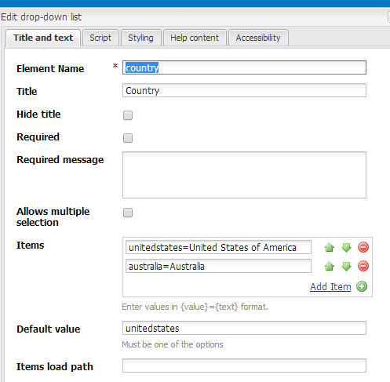
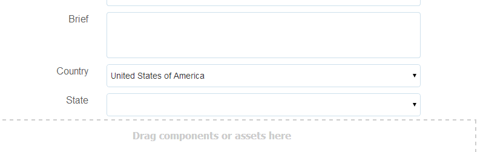

# Fylla i nedrullningsbara listor dynamiskt {#dynamically-populating-drop-down-lists}

## Förutsättningar {#prerequisites}

* [Skapa OSGI-paket](https://helpx.adobe.com/experience-manager/using/creating-osgi-bundles-digital-marketing.html)
* [Utveckla AEM](https://experienceleague.adobe.com/docs/experience-manager-cloud-service/implementing/developing/full-stack/components-templates/overview.html#developing)
* [Skapa anpassat formulär](creating-adaptive-form.md)
* [Skapa anpassat formulär](introduction-forms-authoring.md)

## Procedur för att dynamiskt fylla i nedrullningsbara listor {#procedure-to-dynamically-populate-drop-down-lists}

Tänk dig ett scenario där du vill fylla i **Läge** nedrullningsbar lista baserad på ett värde som du väljer i **Land** listruta. Om du väljer Australien i dialogrutan **Land** nedrullningsbar lista **Läge** i den nedrullningsbara listan visas lägena i Australien. I proceduren nedan beskrivs hur du utför den här uppgiften.

1. Skapa ett projekt med följande moduler:

   * Paketet som innehåller logiken för att fylla i listrutan, som i det här fallet är en servlet.
   * Innehållet, som bäddar in .jar-filen och har en nedrullningsbar resurs. Servern pekar på den här resursen.

1. Skriv en servlet baserat på parametern request Country, som returnerar en array som innehåller namnen på delstaterna i landet.

   ```java
   @Component(metatype = false)
   @Service(value = Servlet.class)
   @Properties({
           @Property(name = "sling.servlet.resourceTypes", value = "/apps/populatedropdown"),
           @Property(name = "sling.servlet.methods", value = {"GET", "POST"}),
           @Property(name = "service.description", value = "Populate states dropdown based on country value")
   })
   public class DropDownPopulator extends SlingAllMethodsServlet {
       private Logger logger = LoggerFactory.getLogger(DropDownPopulator.class);
   
       protected void doPost(SlingHttpServletRequest request,
                             final SlingHttpServletResponse response)
               throws ServletException, IOException {
           response.setHeader("Access-Control-Allow-Origin", "*");
           response.setContentType("application/json");
           response.setCharacterEncoding("UTF-8");
           try {
               String US_STATES[] = {"0=Alabama",
                       "1=Alaska",
                       "2=Arizona",
                       "3=Arkansas",
                       "4=California",
                       "5=Colorado",
                       "6=Connecticut",
                       "7=Delaware",
                       "8=Florida",
                       "9=Georgia",
                       "10=Hawaii",
                       "11=Idaho",
                       "12=Illinois",
                       "13=Indiana",
                       "14=Iowa",
                       "15=Kansas",
                       "16=Kentucky",
                       "17=Louisiana",
                       "18=Maine",
                       "19=Maryland",
                       "20=Massachusetts",
                       "21=Michigan",
                       "22=Minnesota",
                       "23=Mississippi",
                       "24=Missouri",
                       "25=Montana",
                       "26=Nebraska",
                       "27=Nevada",
                       "28=New Hampshire",
                       "29=New Jersey",
                       "30=New Mexico",
                       "31=New York",
                       "32=North Carolina",
                       "33=North Dakota",
                       "34=Ohio",
                       "35=Oklahoma",
                       "36=Oregon",
                       "37=Pennsylvania",
                       "38=Rhode Island",
                       "39=South Carolina",
                       "40=South Dakota",
                       "41=Tennessee",
                       "42=Texas",
                       "43=Utah",
                       "44=Vermont",
                       "45=Virginia",
                       "46=Washington",
                       "47=West Virginia",
                       "48=Wisconsin",
                       "49=Wyoming"};
               String AUSTRALIAN_STATES[] = {"0=Ashmore and Cartier Islands",
                       "1=Australian Antarctic Territory",
                       "2=Australian Capital Territory",
                       "3=Christmas Island",
                       "4=Cocos (Keeling) Islands",
                       "5=Coral Sea Islands",
                       "6=Heard Island and McDonald Islands",
                       "7=Jervis Bay Territory",
                       "8=New South Wales",
                       "9=Norfolk Island",
                       "10=Northern Territory",
                       "11=Queensland",
                       "12=South Australia",
                       "13=Tasmania",
                       "14=Victoria",
                       "15=Western Australia"};
               String country = request.getParameter("country");
               JSONArray stateJsonArray = new JSONArray();
               if (country.length() > 0) {
                   if ("australia".equalsIgnoreCase(country)) {
                       stateJsonArray = new JSONArray();
                       for (String state : AUSTRALIAN_STATES) {
                           stateJsonArray.put(state);
                       }
                   } else if ("unitedstates".equalsIgnoreCase(country)) {
                       stateJsonArray = new JSONArray();
                       for (String state : US_STATES) {
                           stateJsonArray.put(state);
                       }
                   }
                   response.setContentType("application/json");
                   response.getWriter().write(stateJsonArray.toString());
               }
   
           } catch ( Exception e) {
               logger.error(e.getMessage(), e);
           }
       }
   }
   ```

1. Skapa en nedrullningsbar nod under en viss mapphierarki i program (skapa till exempel en nod under /apps/myfolder/demo). Se till att `sling:resourceType` -parametern för noden är densamma som den som servleten pekar på (/apps/populatedDrop).

   

1. Paketera noden och bädda in .jar-filen på en viss plats (till exempel /apps/myfolder/demo/install/). Distribuera samma fil på servern.
1. Skapa ett anpassat formulär och lägg till två listrutor, Land och Delstat. Listan Land kan innehålla namn på länder. Tillståndslistan kan dynamiskt fylla i namn på lägen för det land du väljer i den första listan.

   Lägg till namnen på länderna som ska visas i listan Land. I listan Läge lägger du till ett skript som fyller i det baserat på namnet på landet i listan Land.

     

   ```javascript
   JSON.parse(
       $.ajax({
           url: "/apps/myfolder/demo/dropdown",
           type: "POST",
           async: false,
           data: {"country": country.value},
            success: function(res){},
            error : function (message) {
                 guideBridge._guide.logger().log(message);
                 successFlag = false;
                 }
              })
   .responseText);
   ```

Innehållspaketet som innehåller ett exempel på Adaptiv form (demo/AFdemo) med ovanstående kod implementerad.

[Hämta fil](assets/dropdown-demo-content-1.0.1-snapshot.zip)


>[!MORELIKETHIS]
>
>* [Förifyll adaptiva formulärfält](/help/forms/prepopulate-adaptive-form-fields.md)
