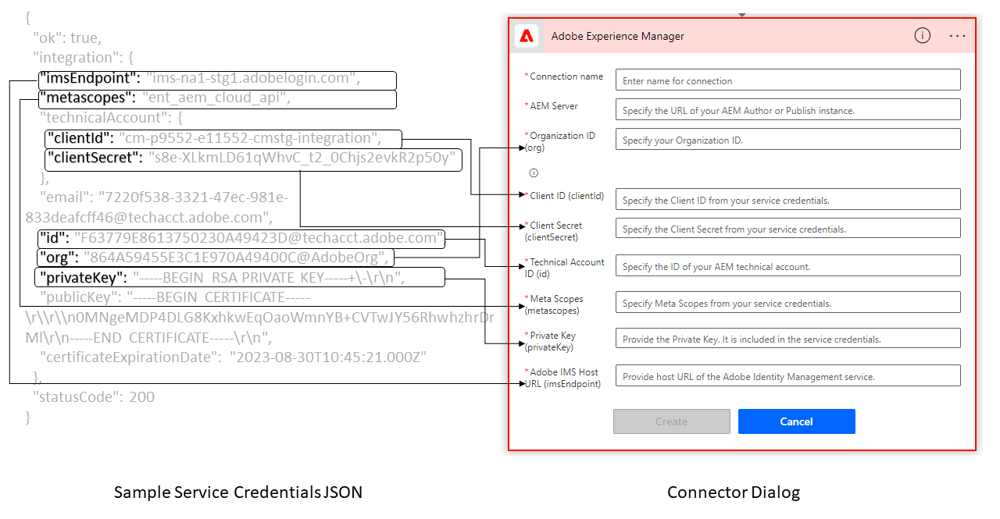

# Frågor och svar {#frequently-asked-questions}

* **Kan jag använda kodredigeraren för att skapa regler?**
Du kan använda den visuella redigeraren för att skapa reglerna. Kodredigeraren är inte tillgänglig på [!DNL Forms] as a Cloud Service. Om ditt adaptiva formulär använder regelskript som har utvecklats med kodredigeraren använder du [Migreringsverktyg](migrate-to-forms-as-a-cloud-service.md) för att konvertera kodskript till anpassade funktioner. Du kan använda anpassade funktioner med Visual Editor för att fortsätta hämta de resultat som du fått med kodredigeraren.

* **Kan jag skapa ett XFA-baserat adaptivt formulär på Cloud Service?**
Ja, du kan skapa ett XFA-baserat adaptivt formulär på Cloud Service-instansen. Stöd för XFA-baserad Adaptive Forms finns dock inte för AEM Forms as a Cloud Service SDK (lokal utvecklingsmiljö). Om du tänker använda XFA-baserad Adaptive Forms med AEM Forms as a Cloud Service SDK kontaktar du Adobe Support med information om ditt användningsfall och specifika krav.

<!-- * **Can I use an XDP as a Document of Record (DoR) template? Is Forms Designer included in AEM Forms as a Cloud Service license?** 

  Yes, you can use an XDP as a Document of Record template on Cloud Service instances. However, support to use XDP as a Document of Record template is not available for AEM Forms as a Cloud Service SDK (Local development environment). -->

* **Kan jag migrera innehåll från en lokal enhet eller [!DNL Adobe-Managed Services] miljöer till [!DNL Forms] as a Cloud Service miljö?**
Ja, du kan migrera din egen kod, ditt innehåll och dina resurser från On-Premise eller [!DNL Adobe-Managed Services] miljöer till [!DNL Forms] as a Cloud Service miljö. Detaljerade anvisningar finns i [Migrera till Forms as a Cloud Service](migrate-to-forms-as-a-cloud-service.md).

<!-- You can use package manager or Experience Manager UI to [export and import Forms and related assets](import-export-forms-templates.md), use the migration utility to make your existing assets compatible with [!DNL Forms] as a Cloud Service, use the [Best Practices Analyzer](https://experienceleague.adobe.com/docs/experience-manager-cloud-service/moving/cloud-migration/best-practices-analyzer/overview-best-practices-analyzer.html?lang=en#best-practices-analyzer) tool to find the features and APIs that require changes and updated before migration, and use the [Content Transfer Tools](https://docs.adobe.com/content/help/en/experience-manager-cloud-service/moving/home.html) to move your custom code without refactoring it. -->

* **Var kan jag få AEM? [!DNL Forms] as a Cloud Service [!DNL Java™] API-referensdokumentation?**
Du kan hämta Java™ API-referensdokumentation från [!DNL Maven Central Repository]. Så här hämtar du:
   1. Gå till [[!DNL Maven Central Repository]](https://mvnrepository.com/artifact/com.adobe.aem/aem-forms-sdk-api).
   1. Hitta och öppna sidor som innehåller den senaste versionen av [!DNL Experience Manager Forms] SDK.
   1. Klicka på alternativet Visa alla om du vill visa alla filer.
   1. Hämta och extrahera `aem-forms-sdk-api-<version>-javadocs`.jar.
   1. Öppna filen index.html för att visa API-referensdokumentationen.

* **Var kan jag få tag i [!DNL JavaScript™] API-referens för Adaptive Forms?**
Du kan ladda ned [!DNL JavaScript™] API-referensdokumentation från[!DNL  Maven Central Repository]. Så här hämtar du:
   1. Öppna [[!DNL Maven Central Repository]](https://mvnrepository.com/artifact/com.adobe.aem/aem-forms-sdk-api).
   1. Hitta och öppna sidor som innehåller den senaste versionen av [!DNL Experience Manager Forms] SDK.
   1. Klicka på alternativet Visa alla om du vill visa alla filer.
   1. Hämta och extrahera `aem-forms-sdk-api-<version>-jsdoc.jar`.
   1. Öppna filen index.html för att visa API-referensdokumentationen.

* **Kan jag fortsätta använda befintliga teman och mallar?**
Ja, du kan fortsätta använda teman som skapats med AEM 6.4 Forms och AEM 6.5 Forms när du har använt [Migreringsverktyg](migrate-to-forms-as-a-cloud-service.md) flytta dem till [!DNL AEM Forms] as a Cloud Service.

  Du kan också skapa ett projekt baserat på [!DNL AEM Forms] as a Cloud Service [Arketyp](setup-local-development-environment.md#forms-cloud-service-local-development-environment) och använd medföljande exempelteman och mallar.

* **Kan jag producera schemakompatibla data?**
Ja, du kan skapa Adaptiv Forms för att ta fram schemakompatibla data.

<!-- * **Can I pass custom parameters to the prefill service?**
Custom parameters are planned for an upcoming release. -->

* **Kan jag cachelagra skyddat innehåll?**
Cachelagring av funktioner för skyddat innehåll är inaktiverat som standard. Om du vill aktivera funktionen kan du följa instruktionerna på [Cachelagra skyddat innehåll](https://experienceleague.adobe.com/docs/experience-manager-dispatcher/using/configuring/permissions-cache.html).

* **Jag har en lokaliserad adaptiv form. Den återger inte en lokaliserad version? Vad kan vara orsaken och hur kan man lösa den?**

  URL-konventionen för lokaliserade adaptiva Forms har nu stöd för att ange nationella inställningar i URL:en. Ny URL-konvention möjliggör cachelagring av lokaliserade formulär på en Dispatcher eller CDN. I Cloud Service-miljön använder du URL-formatet `http://host:port/content/forms/af/<afName>.<locale>.html` begära en lokaliserad version av ett adaptivt formulär i stället för `http://host:port/content/forms/af/afName.html?afAcceptLang=<locale>`. Adobe rekommenderar att du använder Dispatcher eller CDN-cachning. Det förbättrar återgivningshastigheten för förfyllda formulär.

* **Jag har uppdaterat ett adaptivt formulär. Är den uppdaterade versionen inte tillgänglig för kunder?**
Som standard uppdaterar CDN cachen efter var femte minut, väntar i 5 minuter och söker sedan efter den uppdaterade versionen.

* **Kan jag använda signatursteget i ett adaptivt formulär för att skapa en signeringsupplevelse i webbläsaren?**
Nej, signatursteget är inte tillgängligt för [!DNL Forms] as a Cloud Service. Ta bort signatursteget i din adaptiva Forms. Låt användarna signera ett anpassat formulär efter att de har skickat in det i stället för signatursteget. Det hjälper dig att fortsätta tillhandahålla en signeringsupplevelse i webbläsaren.

* **Kan jag använda steget Verifiera i ett adaptivt formulär?**
Nej, det går inte att verifiera [!DNL Forms] as a Cloud Service. Ta bort verifieringssteget från din befintliga Adaptive Forms innan du flyttar sådana formulär till en Cloud Service-miljö.

* **Kan jag lägga till diagram i ett adaptivt formulär?**
Ja, du kan lägga till diagram i Adaptiv Forms. Adaptiv Forms tillhandahåller en diagramkomponent. Du kan använda den för att lägga till diagram i ett adaptivt formulär.

* **Kan jag ansluta en formulärdatamodell till en relationsdatabasmodell?**
Du kan ansluta en formulärdatamodell till [!DNL RESTful web services], [!DNL SOAP-based web services], [!DNL OData services]och användarprofilen Experience Manager som datakällor. Det finns inte stöd för att ansluta en formulärdatamodell till en relationsdatabas.

* **Kan jag använda anpassade certifikat med formulärdatamodell för autentisering?**
Formulärdatamodellen innehåller ingen metod för att använda anpassade certifikat för autentisering. Därför stöds inte anpassade certifikat som x509 och tvåvägsSSL.

* **Kan jag använda Forms Portal-åtgärden Adaptiv Forms?**

  Du kan ändra din befintliga adaptiva Forms så att du kan använda den [Skicka till REST-slutpunkt](configuring-submit-actions.md#submit-to-rest-endpoint), [Skicka e-post](configuring-submit-actions.md#send-email), [Skicka med formulärdatamodell](configuring-submit-actions.md#submit-using-form-data-model)och [Anropa ett AEM](configuring-submit-actions.md#invoke-an-aem-workflow) Skicka åtgärder. Forms Portal och Forms Portal har ännu inte släppts. Håll ett öga på månadsversionsinformationen om vilka funktioner som är tillgängliga.

* **Kan jag använda [!DNL AEM Forms] app med [!DNL AEM Forms] as a Cloud Service?**

  Adaptiv Forms har en responsiv design. Dessa formulär ändrar utseende, design och interaktivitet baserat på den underliggande enheten. Du kan fortsätta använda Adaptiv Forms på mobila enheter samtidigt som du håller ett öga på månadsversionsinformationen för att se om funktionerna är tillgängliga.

* **Vilka funktioner ingår inte i den ursprungliga GA-versionen?**
Forms Portal, [!DNL AEM Forms] app, integrering med Adobe Analytics och integrering med Adobe Target ingår inte i den första GA-versionen. Information om de nya funktionerna finns i månadsversionskommentarerna.

* **Jag har designat en [JSON-schema för att skapa ett anpassat formulär](adaptive-form-json-schema-form-model.md). JSON-schemat definierar händelser för vissa komponenter i adaptiva formulär. Har AEM Forms as a Cloud Service stöd för event?**
Skapa det adaptiva formuläret baserat på JSON-schemat i Forms-miljön Experience Manager 6.5 och använd [Migreringsverktyg](migrate-to-forms-as-a-cloud-service.md) för att migrera sådana adaptiva Forms till AEM Forms as a Cloud Service. Verktyget konverterar sådana händelser till klientbibliotek och du kan fortsätta använda Adaptive Forms med händelser i en Cloud Service-miljö.

<!-- 

* **Is there any AEM Forms as a Cloud Service connector for Microsoft Power Automate?**

  Yes, Adobe provides an Adobe Experience Manager connector to access [Adobe Experience Manager Forms - Communication capabilities](https://experienceleague.adobe.com/docs/experience-manager-cloud-service/content/forms/using-communications/aem-forms-cloud-service-communications-introduction.html) through Microsoft Power Automate. You can create a PDF document that is based on a form design and XML form data or create PostScript (PS), Printer Command Language (PCL), Zebra Printing Language (ZPL) and other Printer Definition Language documents. 

  You can get started with Adobe Experience Manager easily with just a few steps:

  1. Generate the Service credentials: Use Adobe Experience Manager Developer Console to [generate](https://experienceleague.adobe.com/docs/experience-manager-learn/getting-started-with-aem-headless/authentication/service-credentials.html?#generate-service-credentials) the service credentials.  
  
  1. Setup your connection: Add your service credentials to the Adobe Experience Manager Connector. You can get crdential from service credential JSON and copy these credential details to your one-time connection setup:

    * AEM Server
    * Organization ID 
    * Client ID
    * Client Secret
    * Technical Account ID
    * Meta Scopes
    * Private Key - base64 encoded keys are accepted
    * Adobe IMS Host URL

      
    
    

    A sample Service Credential JSON file fields mapped to Adobe Experience Manager connector for Microsoft Power Automate.

    -->

