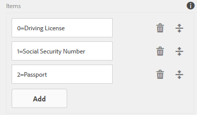

# Lägg till information från användardata i metadata för att skicka formulär {#adding-information-from-user-data-to-form-submission-metadata}

Du kan använda värden som anges i ett element i formuläret för att beräkna metadatafält för ett utkast eller en formulärsändning. Med metadata kan du filtrera innehåll baserat på användardata. En användare skriver till exempel John Doe i namnfältet i ditt formulär. Du kan använda den här informationen för att beräkna metadata som kan kategorisera överföringen under den initiala JD:n.

Om du vill beräkna metadatafält med värden som användaren anger lägger du till formulärelement i metadata. När en användare anger ett värde i det elementet används värdet för att beräkna information. Den här informationen läggs till i metadata. När du lägger till ett element som ett metadatafält anger du en nyckel för det. Nyckeln läggs till som ett fält i metadata och den beräknade informationen loggas mot det.

Ett sjukförsäkringsföretag publicerar t.ex. en blankett. I det här formuläret hämtar ett fält slutanvändarnas ålder. Kunden vill kontrollera alla inskickade data i ett visst åldersintervall efter att flera användare har skickat in formuläret. Istället för att gå igenom alla data som kompliceras av allt fler formulär, hjälper extra metadata kunden. Formulärets författare kan konfigurera vilka egenskaper/data som fylls i av slutanvändaren som lagras på den översta nivån så att sökningen blir så enkel som möjligt. Ytterligare metadata är användarfylld information som lagras på den översta nivån i metadatanoden, enligt författarens inställningar.

Ta ett exempel på ett formulär som innehåller e-post-ID och telefonnummer. När en användare besöker det här formuläret anonymt och överger formuläret kan författaren konfigurera formuläret så att e-post-ID och telefonnummer sparas automatiskt. Det här formuläret sparas automatiskt och telefonnumret och e-post-ID lagras i metadatanoden i utkastet. Ett användningsfall för den här konfigurationen är kontrollpanelen för lead-hantering.

## Lägga till formulärelement i metadata {#adding-form-elements-to-metadata}

Gör så här för att lägga till ett element i metadata:

1. Öppna det adaptiva formuläret i redigeringsläge.\
   Om du vill öppna formuläret i redigeringsläge markerar du formuläret i formulärhanteraren och trycker på **[!UICONTROL Open]**.
1. Markera en komponent i redigeringsläget och tryck på  > **[!DNL Adaptive Form Container]** och sedan trycka .
1. Klicka på **[!DNL Metadata]**.
1. Klicka på i avsnittet Metadata **[!DNL Add]**.
1. Använd fältet Värde på fliken Metadata för att lägga till skript. De skript du lägger till samlar in data från element i formuläret och beräknar värden som matas in i metadata.

   Till exempel: **[!DNL true]** loggas i metadata om den angivna åldern är större än 21, och **[!DNL false]** loggas om den är mindre än 21. Du anger följande skript på fliken Metadata:

   `(agebox.value >= 21) ? true : false`

   

   Skript som anges på fliken Metadata

1. Klicka på **[!DNL OK]**.

När en användare har angett data i elementet som har markerats som ett metadatafält loggas den beräknade informationen i metadata. Du kan se metadata i databasen som du konfigurerade för att lagra metadata.

## Se uppdaterade metadata för inlämning av formulär: {#seeing-updated-form-nbsp-submission-metadata}

I exemplet ovan lagras metadata i CRX-databasen. Metadata ser ut så här:

Om du lägger till ett kryssruteelement i metadata lagras markerade värden som en kommaavgränsad sträng. Du kan till exempel lägga till en kryssrutekomponent i formuläret och ange dess namn som `checkbox1`. I kryssrutans komponentegenskaper lägger du till objekten Körningslicens, Personnummer och Passport för värdena 0, 1 och 2.

Du väljer Adaptiv formulärbehållare och i formuläregenskaperna lägger du till en metadatanyckel `cb1` som lagrar `checkbox1.value`och publicera formuläret. När kunden fyller i formuläret väljer kunden passnummer och personnummer i kryssrutefältet. Värdena 1 och 2 lagras som 1 och 2 i fältet cb1 i metadata för överföringen.

>[!NOTE]
>
>Exemplet ovan är endast avsett för inlärning. Kontrollera att du söker efter metadata på rätt plats som konfigurerats i din [!DNL Experience Manager Forms] implementering.