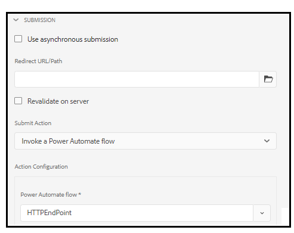

# Ansluta ett adaptivt formulär med Microsoft® Power Automate {#connect-adaptive-form-with-power-automate}

Du kan konfigurera ett adaptivt formulär så att det kör ett Microsoft® Power Automate Cloud-flöde när du skickar in det. Den konfigurerade adaptiva formen skickar inhämtade data, bilagor och arkivdokument till Power Automate Cloud Flow för bearbetning. Det hjälper er att bygga upp en anpassad datainhämtningsupplevelse och samtidigt utnyttja kraften i Microsoft® Power Automate för att skapa affärslogik kring insamlade data och automatisera kundarbetsflöden.

Adaptive Forms editor har **Anropa ett Microsoft® Power Automate-flöde** Skicka-åtgärd för att skicka adaptiva formulärdata, bilagor och arkivdokument till Power Automate Cloud Flow.

AEM as a Cloud Service erbjuder olika åtgärder för att skicka in formulär. Du kan läsa mer om de här alternativen i [Inlämningsåtgärd för anpassat formulär](/help/forms/configure-submit-actions-core-components.md)  artikel.


## Fördelar

Här är några exempel på vad du kan göra efter att ha integrerat ett adaptivt formulär med Microsoft® Power Automate:

* Använd adaptiva Forms-data i en Power Automate-affärsprocess
* Använd Power Automate för att skicka inhämtade data till fler än 500 datakällor eller till något offentligt tillgängligt API
* Utför komplexa beräkningar på inhämtade data
* Spara adaptiva Forms-data i lagringssystemen enligt ett fördefinierat schema

## Förutsättningar

Följande krävs för att ansluta ett adaptivt formulär med Microsoft® Power Automate:

* Microsoft® Power Automate Premium.
* Microsoft® [Power Automate-flöde](https://docs.microsoft.com/en-us/power-automate/create-flow-solution) med `When an HTTP request is received` utlösare för att acceptera data för sändning av adaptiva formulär.
* En Experience Manager-användare med [Forms Author](/help/forms/forms-groups-privileges-tasks.md) och [Forms Admin](/help/forms/forms-groups-privileges-tasks.md) behörigheter
* Det konto som används för att ansluta till Microsoft® Power Automate är ägare av det Power Automate-flöde som konfigurerats för att ta emot data från adaptiv form

## Koppla samman din as a Cloud Service Forms-instans med Microsoft® Power Automate {#connect-forms-server-with-power-automate}

Utför följande åtgärder för att ansluta din as a Cloud Service Forms-instans till Microsoft® Power Automate:

1. [Skapa en Microsoft](#ms-power-automate-application)
1. [Skapa Microsoft](#microsoft-power-automate-dataverse-cloud-configuration)
1. [Skapa Microsoft](#create-microsoft-power-automate-flow-cloud-configuration)
1. [Publicera Microsoft](#publish-microsoft-power-automate-dataverse-cloud-configuration)

### Skapa Microsoft® Azure Active Directory-program {#ms-power-automate-application}

1. Logga in på [Azure Portal](https://portal.azure.com/).
1. Välj [!UICONTROL Azure Active Directory] från vänster navigering.
1. Välj på sidan Standardkatalog [!UICONTROL App registrations] från den vänstra panelen.
1. Klicka på Nya registreringar på sidan Appregistreringar.
1. Ange namn, kontotyper som stöds och omdirigerings-URI på sidan. Ange följande i omdirigerings-URI och klicka på Spara.
   * `https://[Forms as a Cloud Service Server]/libs/fd/powerautomate/content/dataverse/config.html`
   * `https://[Forms as a Cloud Service Server]/libs/fd/powerautomate/content/flowservice/config.html`

   

   >[!NOTE]
   >Du kan även ange ytterligare omdirigerings-URI om det behövs från autentiseringssidan.
   > För kontotyper som stöds väljer du en innehavare, flera innehavare eller ett personligt Microsoft®-konto beroende på ditt användningssätt


1. Aktivera följande alternativ på autentiseringssidan och klicka på Spara.


   * Åtkomsttoken (används för implicita flöden)
   * ID-tokens (används för implicita och hybridflöden)

1. Klicka på Lägg till behörighet på sidan API-behörigheter.
1. Välj Flow Service under Microsoft® API:er och välj följande behörigheter.
   * Flows.Manage.All
   * Flows.Read.All

   Klicka på Lägg till behörigheter för att spara behörigheterna.
1. Klicka på Lägg till behörighet på sidan API-behörigheter. Välj API:er som min organisation använder och söker `DataVerse`.
1. Aktivera user_impersonation och klicka på Lägg till behörigheter.
1. (Valfritt) Klicka på Ny klienthemlighet på sidan Certifikat och hemligheter. På skärmen Lägg till en klienthemlighet anger du en beskrivning och en tidsperiod för när hemligheten ska upphöra och klickar på Lägg till. En hemlig sträng genereras.
1. Anteckna din organisationsspecifika [URL för Dynamics-miljö](https://docs.microsoft.com/en-us/power-automate/web-api#compose-http-requests).

### Skapa Microsoft® Power Automate Dataverse Cloud-konfiguration {#microsoft-power-automate-dataverse-cloud-configuration}

1. I AEM Forms-författarinstansen går du till **[!UICONTROL Tools]**  > **[!UICONTROL General]** > **[!UICONTROL Configuration Browser]**.
1. På **[!UICONTROL Configuration Browser]** sida, markera **[!UICONTROL Create]**.
1. I **[!UICONTROL Create Configuration]** dialogruta, ange **[!UICONTROL Title]** för konfigurationen, aktivera **[!UICONTROL Cloud Configurations]** och markera **[!UICONTROL Create]**. Den skapar en konfigurationsbehållare för lagring av Cloud Service. Kontrollera att mappnamnet inte innehåller något utrymme.
1. Navigera till **[!UICONTROL Tools]**  > **[!UICONTROL Cloud Services]** > **[!UICONTROL Microsoft®® Power Automate Dataverse]** och öppna konfigurationsbehållaren som du skapade i föregående steg.


   >[!NOTE]
   >
   När du skapar ett adaptivt formulär anger du behållarnamnet i dialogrutan **[!UICONTROL Configuration Container]** fält.

1. Välj på konfigurationssidan **[!UICONTROL Create]** att skapa [!DNL Microsoft®®® Power Automate Flow Service] i AEM Forms.
1. På **[!UICONTROL Configure Dataverse Service for Microsoft®®® Power Automate]** sida, ange **[!UICONTROL Client ID]** (kallas även program-ID), **[!UICONTROL Client Secret]**, **[!UICONTROL OAuth URL]** och **[!UICONTROL Dynamic Environment URL]**. Använd klient-ID, klienthemlighet, OAuth URL och Dynamic Environment-URL för [Microsoft® Azure Active Directory-program](#ms-power-automate-application) som du skapade i föregående avsnitt. Använd alternativet Endpoints i användargränssnittet i Microsoft® Azure Active Directory för att hitta OAuth-URL

   

1. Välj **[!UICONTROL Connect]** . Logga in på ditt Microsoft® Azure-konto om du blir tillfrågad. Välj **[!UICONTROL Save]**.

### Skapa Microsoft® Power Automate Flow Service Cloud-konfiguration {#create-microsoft-power-automate-flow-cloud-configuration}

1. Navigera till **[!UICONTROL Tools]**  > **[!UICONTROL Cloud Services]** > **[!UICONTROL Microsoft® Power Automate Flow Service]** och öppna konfigurationsbehållaren som du skapade i föregående avsnitt.


   >[!NOTE]
   >
   När du skapar ett adaptivt formulär anger du behållarnamnet i dialogrutan **[!UICONTROL Configuration Container]** fält.

1. Välj på konfigurationssidan **[!UICONTROL Create]** att skapa [!DNL Microsoft® Power Automate Flow Service] i AEM Forms.
1. På **[!UICONTROL Configure Dataverse for Microsoft® Power Automate]** sida, ange **[!UICONTROL Client ID]** (kallas även program-ID), **[!UICONTROL Client Secret]**, **[!UICONTROL OAuth URL]** och **[!UICONTROL Dynamic Environment URL]**. Använd klient-ID, Klienthemlighet, OAuth URL och Dynamics Environment-ID. Använd alternativet Endpoints i användargränssnittet i Microsoft® Azure Active Directory för att hitta OAuth-URL:en. Öppna [Mina flöden](https://us.flow.microsoft.com) och väljer Mina flöden använder det ID som anges i URL:en som Dynamics Environment ID.
1. Välj **[!UICONTROL Connect]**. Logga in på ditt Microsoft® Azure-konto om du blir tillfrågad. Välj **[!UICONTROL Save]**.

### Publicera både Microsoft® Power Automate Dataverse och Microsoft® Power Automate Flow Service Cloud-konfigurationer {#publish-microsoft-power-automate-dataverse-cloud-configuration}

1. Navigera till **[!UICONTROL Tools]**  > **[!UICONTROL Cloud Services]** > **[!UICONTROL Microsoft® Power Automate Dataverse]** och öppna konfigurationsbehållaren som du skapade i föregående [Skapa Microsoft® Power Automate Dataverse Cloud-konfiguration](#microsoft-power-automate-dataverse-cloud-configuration) -avsnitt.
1. Välj `dataverse` konfigurera och välja **[!UICONTROL Publish]**.
1. På sidan Publicera väljer du **[!UICONTROL All Configurations]** och markera **[!UICONTROL Publish]**. Publicera både Power Automate Dataverse och Power Automate Flow Service Cloud-konfigurationer.

Forms as a Cloud Service instans är nu ansluten till Microsoft® Power Automate. Nu kan du skicka adaptiva Forms-data till ett Power Automate-flöde.

## Skicka data till ett Power Automate-flöde med Anropa en Microsoft® Power Automate-åtgärd {#use-the-invoke-microsoft-power-automate-flow-submit-action}

Efter dig [Koppla samman din as a Cloud Service Forms-instans med Microsoft® Power Automate](#connect-forms-server-with-power-automate)utför du följande åtgärd för att konfigurera ditt adaptiva formulär så att inhämtade data skickas till ett Microsoft®-flöde när formulär skickas.

1. Logga in på din Author-instans, välj ditt adaptiva formulär och klicka på **[!UICONTROL Properties]**.
1. I konfigurationsbehållaren bläddrar du till och väljer den behållare som har skapats i avsnittet [Skapa Microsoft® Power Automate Dataverse Cloud-konfiguration](#microsoft-power-automate-dataverse-cloud-configuration)och markera **[!UICONTROL Save and Close]**.
1. Öppna det adaptiva formuläret för redigering och navigera till **[!UICONTROL Submission]** i egenskaperna för den adaptiva formulärbehållaren.
1. I egenskapsbehållaren, för **[!UICONTROL Submit Actions]** välj **[!UICONTROL Invoke a Power Automate flow]** och välja **[!UICONTROL Power Automate flow]**. Välj önskat flöde och adaptiva Forms-data skickas till det när de skickas.

   

>[!NOTE]
>
Innan du skickar in det adaptiva formuläret ska du kontrollera att `When an HTTP Request is received` utlösaren med JSON Schema nedan läggs till i Power Automate-flödet.

```
        {
            "type": "object",
            "properties": {
                "attachments": {
                    "type": "array",
                    "items": {
                        "type": "object",
                        "properties": {
                            "filename": {
                                "type": "string"
                            },
                            "data": {
                                "type": "string"
                            },
                            "contentType": {
                                "type": "string"
                            },
                            "size": {
                                "type": "integer"
                            }
                        },
                        "required": [
                            "filename",
                            "data",
                            "contentType",
                            "size"
                        ]
                    }
                },
                "templateId": {
                    "type": "string"
                },
                "templateType": {
                    "type": "string"
                },
                "data": {
                    "type": "string"
                },
                "document": {
                    "type": "object",
                    "properties": {
                        "filename": {
                            "type": "string"
                        },
                        "data": {
                            "type": "string"
                        },
                        "contentType": {
                            "type": "string"
                        },
                        "size": {
                            "type": "integer"
                        }
                    }
                }
            }
        }
```

<!--
## See also

* [Create an Adaptive Form](creating-adaptive-form-core-components.md)
* [Configure a Submit Action](configure-submit-actions-core-components.md)
* [Adobe Experience Manager Connector for Microsoft&reg; Power Automate](https://learn.microsoft.com/en-us/connectors/adobeexperiencemanag/)
* [Connect Adaptive Form to Microsoft® Power Automate](/help/forms/configure-submit-actions-core-components.md#microsoft-power-automate)
-->


## Relaterade artiklar

{{af-submit-action}}

<!--

>[!MORELIKETHIS]
>
>* [Connect Adaptive Form to Microsoft Power Automate](/help/forms/configure-submit-actions-core-components.md#microsoft-power-automate)

-->