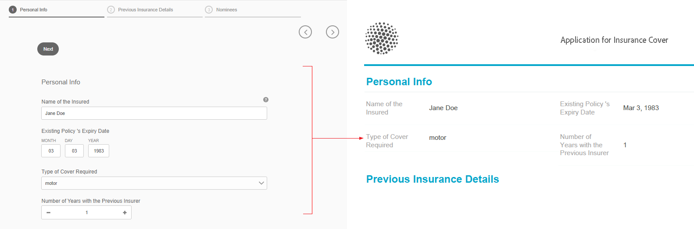

# Generera en inskickningsversion av PDF (f.d. arkivhandling) för adaptiv Forms (kärnkomponenter)

## Ökning {#overview}

När ett formulär fylls i eller skickas kan du spara en post med formuläret, i utskrift eller i dokumentformat. Den här posten kallas Submission PDF (tidigare Document of Record eller DoR). Det är en utskriftsvänlig PDF av det inskickade formuläret. Du kan även läsa PDF Submission för den information kunderna fyller i vid ett senare tillfälle eller använda PDF Submission för att arkivera blanketter och material tillsammans i PDF-format.

## Tillämplighet och användningsfall

### Försäkring

## Kan AEM Forms generera försäkringsdokument?

Ja. AEM Forms stöder generering av inskickningsbara PDF-filer (tidigare Document of Record), vilket gör att försäkringsbolagen kan skapa PDF-filer och poster baserade på inlämnade formulärdata.

## Är dokument som genererats av AEM Forms lämpliga för revision?

Ja. AEM Forms har stöd för enhetlig dokumentgenerering, kontrollerad åtkomst och spårbarhet, vilket är viktigt för revision och regelefterlevnad.

Om du vill skapa en Submission PDF sammanfogas en XFA- eller Acrobat-baserad mall med data som samlats in via ett adaptivt formulär. Du kan generera en inskickningsversion av PDF automatiskt eller on-demand. Med alternativet on-demand kan du ange en anpassad XFA- eller Acrobat-baserad mall som ger din Submission PDF ett anpassat utseende.

Du kan:

* [Generera en XFA-baserad PDF-inskickning](#generate-an-XFA-based-document-of-record)
* [Skapa en Acrobat-baserad (Acrobat Form PDF) inskickning av PDF](#generate-an-Acroform-based-document-of-record)
* [Generera en inskicknings-PDF automatiskt](#auto-generate-a-document-of-record)

## Innan du börjar {#components-to-automatically-generate-a-document-of-record}

Innan du börjar lära dig mer och förbereder de resurser som krävs för en inskickningsversion av PDF:

**Basmall:** En XFA-mall (XDP-fil) skapad i Forms Designer eller ett Acrobat-formulär (AcroForm). [Basmallen](#base-template-of-a-document-of-record) används för att ange formaterings- och varumärkesinformation för en Submission PDF. Överför din XFA-mall (XDP-fil) till din AEM Forms-instans tidigare.

**Adaptiv form:** Ett adaptivt formulär som skicka PDF ska genereras för.

## Generera en XFA-baserad PDF-inskickning {#generate-an-XFA-based-document-of-record}

Överför din XFA-mall (XDP-fil) till din AEM Forms-instans. Utför följande steg för att konfigurera ett adaptivt formulär så att XFA-mallen (XDP-fil) används som mall för Submission PDF:

1. I Experience Manager-författarinstans klickar du på **[!UICONTROL Forms]** > **[!UICONTROL Forms and Documents].**
1. Välj ett formulär eller Skapa ett anpassat formulär och klicka på **[!UICONTROL Properties]**.
1. Välj **[!UICONTROL Form Model]** i fönstret Egenskaper.
1. Välj **[!UICONTROL Form Model]**, **[!UICONTROL Select From]** eller **[!UICONTROL Form Data Model]** i listrutan **[!UICONTROL Schema]** på fliken **[!UICONTROL None]**. Du kan också välja en formulärmodell när du skapar ett formulär.
1. Välj **Associera formulärmall som postmall** i avsnittet Dokumentmall på fliken Formulärmodell. När du väljer det här alternativet visas alla XFA-mallar (XDP-filer) som är tillgängliga på datorn. Välj lämplig fil. Se även till att samma schema (dataschema) används för Adaptivt formulär och vald XFA-mall (XDP-fil).
1. Klicka på **[!UICONTROL Done]**

Ditt adaptiva formulär är nu konfigurerat att använda en XDP-fil som mall för att skicka PDF. Nästa steg är att [binda adaptiva formulärkomponenter till motsvarande mallfält](#bind-adaptive-form-components-with-template-fields).

## Generera en Acrobat-baserad inskickning av PDF {#generate-an-Acroform-based-document-of-record}

Överför din Adobe Acrobat PDF (Acrobat) till din AEM Forms-instans. Så här konfigurerar du ett anpassat formulär så att det använder Adobe Acrobat PDF (Acrobat) som mall för Submission PDF:

1. I Experience Manager-författarinstans klickar du på **[!UICONTROL Forms]** > **[!UICONTROL Forms and Documents].**
1. Välj ett formulär eller **[!UICONTROL Create an Adaptive Form]** och klicka på **[!UICONTROL Properties]**.
1. Välj **[!UICONTROL Form Model]** i fönstret Egenskaper.
1. Välj **[!UICONTROL Form Model]**, **[!UICONTROL Select From]** eller **[!UICONTROL Form Data Model]** i listrutan **[!UICONTROL Schema]** på fliken **[!UICONTROL None]**. Du kan också välja en formulärmodell när du skapar ett formulär.
1. Välj **Associera formulärmall som postmall** i avsnittet Dokumentmall på fliken Formulärmodell. När du väljer det här alternativet visas alla Acrobat PDF (Acrobat) som är tillgängliga på datorn. Markera den Acrobat som du vill använda.
1. Klicka på **[!UICONTROL Done]**

Ditt adaptiva formulär är nu konfigurerat att använda en Acrobat som mall för att skicka PDF. Nästa steg är att [binda adaptiva formulärkomponenter till motsvarande mallfält](#bind-adaptive-form-components-with-template-fields).

## Generera en inskickningsversion av PDF automatiskt {#auto-generate-a-document-of-record}

När ett anpassat formulär har konfigurerats för att automatiskt generera ett Submission PDF uppdateras dess Submission PDF omedelbart varje gång ett formulär ändras. Om ett fält till exempel tas bort från ett befintligt anpassat formulär tas även motsvarande fält bort och visas inte i PDF Submission. Det finns många andra fördelar med att automatiskt generera en Submission PDF:

* Formulärutvecklare behöver inte hantera databindningar manuellt. Automatiskt genererad överföring PDF tar hand om databindningsrelaterade uppdateringar.
* Formulärutvecklare behöver inte manuellt dölja fält som har markerats som exkluderade från Submission PDF. Automatiskt genererad överföring PDF är förkonfigurerad för att exkludera sådana fält.
* Med det automatiskt genererade Submission PDF-alternativet sparar du tid som krävs för att skapa en formulärmall för Submission PDF.
* Med det automatiskt genererade Submission PDF-alternativet kan du använda olika format och utseenden med olika basmallar. Det hjälper er att välja det bästa formatet och utseendet för Skicka PDF för er organisation. Om du inte anger någon formatering anges systemformaten som standard.
* Automatiskt genererad Submission PDF säkerställer att alla ändringar i blanketten omedelbart återspeglas i Submission PDF.

Så här konfigurerar du ett anpassat formulär så att det automatiskt genererar ett inskicknings-PDF:

1. I Experience Manager-författarinstans klickar du på **[!UICONTROL Forms]** > **[!UICONTROL Forms and Documents].**
1. Välj ett formulär eller Skapa ett anpassat formulär och klicka på **[!UICONTROL Properties]**.
1. Välj **[!UICONTROL Form Model]** i fönstret Egenskaper.
1. Välj **[!UICONTROL Form Model]**, **[!UICONTROL Select From]** eller **[!UICONTROL Form Data Model]** i listrutan **[!UICONTROL Schema]** på fliken **[!UICONTROL None]**. Du kan också välja en formulärmodell när du skapar ett formulär.
1. Välj **Generera postdokument** i avsnittet Dokumentmall på fliken Formulärmodell.
1. Klicka på **[!UICONTROL Done]**

## Bind adaptiva formulärkomponenter till mallfält {#bind-adaptive-form-components-with-template-fields}

Bind adaptiva formulärfält med mallfält för att visa hämtade formulärdata i motsvarande PDF-fält för överföring. Så här binder du adaptiva formulärkomponenter till motsvarande Skicka-PDF-mallfält:

1. Öppna det adaptiva formuläret, som är konfigurerat att använda en anpassad formulärmall för redigering.

1. Markera en adaptiv formulärkomponent och klicka på ikonen Konfigurera . Egenskapsläsaren öppnas.

1. Bläddra och markera ett fält i egenskapswebbläsaren.

   * (För AcroForm-mall) egenskapen **[!UICONTROL Document of Record Bind Reference field]**.
   * (För XFA-mall) egenskapen **[!UICONTROL Data Model Bind Reference]**.

1. Klicka på **[!UICONTROL Save]**.

<!-- 
In the following video, Adaptive Form components are bound with corresponding Acroform template fields and the Document of Record is sent as an email attachment.
-->

Du kan använda Skicka-åtgärder som&quot;Skicka e-post&quot;,&quot;Anropa ett AEM-arbetsflöde&quot;,&quot;Anropa ett Power Automate-flöde&quot; och andra [Skicka-åtgärder](configuring-submit-actions.md) för att få en Skicka-PDF.

>[!NOTE]
>
> Du kan spara Skicka-PDF för alla formulärdatamodeller med egenskapen **[!UICONTROL Document of Record Bind Reference field]**.

## Inkrementella uppdateringar av mallen Skicka PDF {#document-of-record-template-incremental-updates}

Anpassningsbara formulär och motsvarande inlämningsmallar för PDF kan utvecklas under en längre tid. Du kan välja att lägga till, ta bort eller ändra fält i ett adaptivt formulär eller en Skicka-PDF-mall.

När du ändrar en Skicka PDF-mall och överför den ändrade mallen till AEM Forms, identifierar den adaptiva Forms-redigeraren automatiskt de ändrade bindningarna och informerar dig om adaptiva formulärkomponenter som kräver nya bindningar. Här kan du göra inkrementella uppdateringar i en Skicka PDF-mall.

En organisation, *We.Retail*, har till exempel en AcroForm-baserad Submission PDF-mall, *we-retail-invoice.pdf*. Mallen ser ut så här:

Efter att ha använt mallen ett tag bestämmer sig organisationen för att byta namn på fältet `invoice-number` till fältet `bill-number` och hämta e-postadressen till köparna. En utvecklare uppdaterar namnet på fältet `invoice-number` och lägger till ett e-postfält i mallen. Han skapar också en ny version av mallen med namnet *we-retail-invoice-v2.pdf*.

<!--

The developer uploads and applies to the updated template to the adaptive form. The adaptive form automatically detects and displays list of fields where binding has changed.

The form developer binds Adaptive Forms fields with corresponding Document of Record template.

-->

>[!VIDEO](assets/we-retail-binding.mp4)

När det adaptiva formuläret skickas skapas nu en uppdaterad inskickningsversion av PDF.

## Viktiga saker att tänka på när du arbetar med Skicka PDF {#key-considerations-when-working-with-document-of-record}

Tänk på följande när du arbetar med Submission PDF for Adaptive Forms.

* PDF-mallar för insändning stöder inte RTF-text. All formaterad text i det statiska adaptiva formuläret eller i den information som användaren fyller i visas därför som oformaterad text i Submission PDF.
* Dokumentfragment i ett anpassat formulär visas inte i Submission PDF. Adaptiva formulärfragment stöds dock.
* Det finns inte stöd för innehållsbindning i den Submission PDF som genererats för XML-schemabaserade adaptiva formulär.
* Lokaliserad version av Submission PDF skapas vid behov för en språkinställning när användaren begär att få återgivningen av Submission PDF. Lokalisering av inskickande av PDF sker tillsammans med lokalisering av anpassat formulär. <!-- For more information on localization of Document of Record and Adaptive Forms see Using AEM translation workflow to localize Adaptive Forms and Document of Record.-->

<!-- ## Configure an adaptive form to generate  Document of Record {#adaptive-form-types-and-their-documents-of-record}

While creating an adaptive form, in the Form Model tab of Adaptive Form properties, select one the following option: 

* **None**
  Select the option to create an Adaptive Form without a form model. When the option is selected, the Document of Record is automatically generated for your Adaptive Form.

* **[Associate form template as a Document of Record template](creating-adaptive-form.md#create-an-adaptive-form-based-on-an-xfa-form-template)**
  
  Select the option to use an XFA Form as a template for Document of Record. 

* **[Generate Document of Record](creating-adaptive-form.md#create-an-adaptive-form-based-on-xml-or-json-schema)**
  Select the option to use an XFA Form as a template. When the option is selected, the Document of Record is automatically generated for your Adaptive Form. When you use an XML schema as a template for an Adaptive Form, ensure that the adaptive form and associated XFA Form use the same XML schema as your Adaptive Form
  

When you select a form model, configure Document of Record using options available under Document of Record Template Configuration. See [Document of Record Template Configuration](#document-of-record-template-configuration). -->

## Mappning av adaptiva formulärelement {#mapping-of-adaptive-form-elements}

I följande tabell beskrivs adaptiva formulärkomponenter och motsvarande XFA-komponenter och om de visas i en Submission PDF.

### Fält {#fields}

<table>
 <tbody>
  <tr>
   <th>Adaptiv Form-komponent</th>
   <th>Motsvarande XFA-komponent</th>
   <th>Ingår som standard i mallen Submission PDF?</th>
   <th>Anteckningar</th>
  </tr>
  <tr>
   <td>Knapp</td>
   <td>Knapp</td>
   <td>false</td>
   <td> </td>
  </tr>
  <tr>
   <td>Kryssruta</td>
   <td>Kryssruta</td>
   <td>true</td>
   <td> </td>
  </tr>
  <tr>
   <td>Datumväljaren</td>
   <td>Datum-/tidsfält</td>
   <td>true</td>
   <td> </td>
  </tr>
  <tr>
   <td>Nedrullningsbar lista</td>
   <td>Listruta</td>
   <td>true</td>
   <td> </td>
  </tr>
  <tr>
   <td>Numerisk ruta</td>
   <td>Numeriskt fält</td>
   <td>true</td>
   <td> </td>
  </tr>
  <tr>
   <td>Alternativknapp</td>
   <td>Alternativknapp</td>
   <td>true</td>
   <td> </td>
  </tr>
  <tr>
   <td>Textruta</td>
   <td>Textfält</td>
   <td>true</td>
   <td> </td>
  </tr>
  <tr>
   <td>Knappen Återställ</td>
   <td>Återställ knapp</td>
   <td>false</td>
   <td> </td>
  </tr>
  <tr>
   <td>Skicka-knapp</td>
   <td>
E-postknapp
 
HTTP-sändningsknapp
 </td>
   <td>false</td>
   <td> </td>
  </tr>
  <tr>
   <td>Bifogad fil</td>
   <td> </td>
   <td>false</td>
   <td>Inte tillgängligt i mallen Submission PDF. Endast tillgängligt i Skicka PDF via bilagor.</td>
  </tr>
 </tbody>
</table>

### Behållare {#containers}

<table>
 <tbody>
  <tr>
   <th>Adaptiv Form-komponent</th>
   <th>Motsvarande XFA-komponent</th>
   <th>Anteckningar</th>
  </tr>
  <tr>
   <td>Panel  </td>
   <td>Delformulär   </td>
   <td>Upprepningsbara panelmappar till repeterbara delformulär.</td>
  </tr>
 </tbody>
</table>

### Statiska komponenter {#static-components}

| Adaptiv Form-komponent | Motsvarande XFA-komponent | Anteckningar |
|---|---|---|
| Bild | Bild | TextDraw- och Image-komponenterna, oavsett om de är bundna eller obundna, visas alltid i Submission PDF för ett XSD-baserat anpassat formulär, såvida de inte utelämnas med inställningarna för Submission PDF. |
| Text | Text |  |

### Tabeller {#tables}

Tabellkomponenterna i Adaptiv Forms, t.ex. sidhuvud, sidfot och radmappning, till motsvarande XFA-komponenter. Du kan mappa upprepningsbara paneler till tabeller i Submission PDF.

## Basmall för en inskickning av PDF {#base-template-of-a-document-of-record}

Basmallen innehåller formaterings- och utseendeinformation till Submission PDF. Du kan anpassa standardutseendet för automatiskt genererade Submission PDF. Du kan till exempel använda en basmall för att lägga till företagets logotyp i sidhuvudet och copyrightinformationen i sidfoten i PDF Submission.

Mallsidan från en basmall används som mallsida för mallen Submission PDF. Huvudsidan kan innehålla information som sidhuvud, sidfot och sidnummer som du kan använda i PDF Submission. Du kan använda den informationen på Submission PDF med hjälp av basmallen för automatisk generering av Submission PDF. Om du använder en basmall kan du ändra standardegenskaperna för fält.

Följ alltid [Basmallskonventioner](#base-template-conventions) när du utformar basmallen.

## Grundmallskonventioner {#base-template-conventions}

En basmall används för att definiera sidhuvud, sidfot, format och utseende för en Submission PDF. Sidhuvudet och sidfoten kan innehålla information som företagets logotyp och copyrighttext. Den första mallsidan i basmallen kopieras och används som mallsida för Submission PDF, som innehåller ett sidhuvud, en sidfot, ett sidnummer eller annan information som ska visas på alla sidor i Submission PDF. Om du använder en basmall som inte överensstämmer med basmallskonventionerna används fortfarande den första mallsidan från basmallen i mallen Submission PDF. Vi rekommenderar att du utformar basmallen enligt dess konventioner och använder den för automatisk generering av Submission PDF.

**Konventioner för mallsidor**

* I basmallen ger du rotdelformuläret namnet `AF_METATEMPLATE` och huvudsidan namnet `AF_MASTERPAGE`.

* Huvudsidan med namnet `AF_MASTERPAGE` som finns under rotdelformuläret `AF_METATEMPLATE` är att föredra om du vill extrahera sidhuvud, sidfot och formatinformation.

* Om `AF_MASTERPAGE` saknas används den första mallsidan i basmallen.

**Formateringskonventioner för fält**

* Om du vill använda format på fälten i Submission PDF innehåller basmallen fält som finns i delformuläret `AF_FIELDSSUBFORM` under rotdelformuläret `AF_METATEMPLATE`.

* Egenskaperna för dessa fält tillämpas på fälten i Submission PDF. Dessa fält bör följa namnkonventionen för `AF_<name of field in all caps>_XFO`. Fältnamnet för kryssrutan bör till exempel vara `AF_CHECKBOX_XFO`.

Så här skapar du en basmall: Forms Designer.

1. Klicka på **[!UICONTROL File]** > **[!UICONTROL New]**.
1. Välj alternativet **[!UICONTROL Based on a template]**.

1. Välj kategorin **[!UICONTROL Forms - Document of Record]**.
1. Välj **[!UICONTROL DoR Base Template]**.
1. Klicka på **[!UICONTROL Next]** och ange nödvändig information.

1. (Valfritt) Ändra format och utseende på fält som du vill använda i fälten i Skicka-PDF.
1. Spara formuläret.
   

Nu kan du använda det sparade formuläret som en basmall för en Skicka PDF. Ändra eller ta inte bort några skript i basmallen.

**Ändrar basmall**

* Använd ingen formatering över fält i basmallen. Du bör ta bort dessa fält från basmallen så att eventuella uppgraderingar av basmallen automatiskt hämtas.
* När du ändrar basmallen ska du inte ta bort, lägga till eller ändra skript.

Följ noga de konventioner och instruktioner som nämns ovan för att utforma en basmall.

## Anpassa varumärkesinformationen i Submission PDF {#customize-the-branding-information-in-document-of-record}

När du genererar en inskickningsversion av PDF kan du ändra profileringsinformationen för inskickningsversionen av PDF på fliken Dokumentdokument. Fliken Dokument för post innehåller alternativ som logotyp, utseende, layout, sidhuvud och sidfot, ansvarsfriskrivning och huruvida du vill ta med omarkerade kryssrutor och alternativknappar eller inte.

Om du vill lokalisera den varumärkesinformation som du anger på fliken Dokument av post kontrollerar du att webbläsarens språkområde är korrekt inställt. Så här anpassar du varumärkningsinformationen i Submission PDF:

1. Markera en panel (rotpanelen) i Submission PDF och välj sedan .
1. Välj . Fliken Dokument för post visas.
1. Välj antingen standardmallen eller en anpassad mall för återgivning av Submission PDF. Om du väljer standardmallen visas en miniatyrförhandsvisning av PDF Submission (Skicka) under listrutan Template (Mall).
1. Beroende på om du väljer en standardmall eller en anpassad mall visas några av följande egenskaper, eller alla egenskaper, på fliken Dokument för post. Ange nedanstående egenskaper för att definiera utseendet på Submission PDF:

   1. **Grundläggande egenskaper**:
      * **Mall**: Om du vill välja en anpassad mall bläddrar du och väljer en XDP-fil på [!DNL AEM Forms]-servern. Om du vill använda en mall som inte är tillgänglig på din [!DNL AEM Forms]-server bör du först överföra XDP-filen till din [!DNL AEM Forms]-server.
      * **Dekorfärg**: Den färg i vilken rubriktext och avgränsningslinjer återges i PDF Submission.
      * **Teckensnittsfamilj**: Teckensnittsfamilj för texten i Submission PDF.

        >[!NOTE]
        >
        > AEM Forms har en mängd inbyggda teckensnitt som är sömlöst integrerade med PDF-filer. [Klicka här](/help/forms/supported-out-of-the-box-fonts.md) om du vill visa en lista över teckensnitt som stöds.

      * **Inkludera formulärobjekt som inte är bundna till datamodell**: Om du anger egenskapen inkluderas obundna fält från schemabaserat anpassat formulär i Submission PDF.

        <!-- **Exclude hidden fields from the Document of Record**: Setting the property identifies the hidden fields for exclusion from Document of Record.-->

      * **Dölj beskrivning av paneler**: Om egenskapen anges utesluts beskrivning av panelen/tabellen från PDF Submission. Gäller för panel och tabell.

   1. **Egenskaper för formulärfält**:

      * **Visa endast de markerade värdena för komponenterna Kryssruta och Alternativknapp**: Om du anger egenskapen visas endast markerade värden för kryssrutor och alternativknappar i [!UICONTROL Document of Record].
      * **Avgränsare för flera värden**: Du kan välja en avgränsare, till exempel komma eller radbrytning, om du vill visa flera värden.
      * **Alternativ Justering**: Du kan välja önskad justering (Vågrät, Lodrät, Samma som adaptiv form) för att ange justeringen för fält som kryssruta eller alternativknapp som ska visas i [!UICONTROL Document of Record]. Som standard är den lodräta justeringen inställd för fälten i [!UICONTROL Document of Record]. Om du ställer in egenskaperna från [!UICONTROL Form Field Properties] i DoR skrivs egenskaperna som angetts i [!UICONTROL Item Alignment] för fälten i ett adaptivt formulär över. Om du väljer alternativet [!UICONTROL Same as Aaptive form] används justeringen som konfigurerats i en författarinstans för adaptiva formulär för [!UICONTROL Document of Record]-fält.
      * **Antal alternativ för vågrät justering**:You kan ange hur många alternativ som ska visas på Skicka-PDF för den vågräta justeringen.

   1. **Egenskaper för mallsida**:

      * **Logotypbild**: Du kan antingen välja att använda logotypbilden från det adaptiva formuläret, välja en från DAM eller överföra en från datorn.
      * **Formulärtitel**: Titel på DoR.
* **Sidhuvudstext**: Text som visas i sidhuvudsavsnittet i PDF Submission.
* **Ansvarsfriskrivning**: Etikett för friskrivning.
* **Ansvarsfriskrivning**: Text som anger omfattningen av rättigheter och skyldigheter i PDF Submission.
* **Ansvarsfriskrivning**: Ansvarsfriskrivning.

      &lt;!——>
     
     >[!NOTE]
     >
     >Om du använder en mall för anpassat formulär som har skapats med en tidigare version av Designer än 6.3 måste du kontrollera att följande finns i mallen för anpassat formulär under rotdelformuläret:
     
      xml
     &lt;proto>
     &lt;font typeface=&quot;Arial&quot;/>
     &lt;fill>
     &lt;color value=&quot;4,166,203&quot;/>
     &lt;/fill>
      
&lt;edge>      &lt;color value=&quot;4,166,203&quot;/>
     &lt;/edge>
     &lt;/proto>
     &quot;
  
1. Välj **[!UICONTROL Done]** om du vill spara profileringsändringarna.

>[!NOTE]
> 
> Om du vill visa en anpassad formulärtitel i din Submission PDF redigerar du den **anpassade formulärtiteln** i **Dokumentegenskaper** > **Mallsidesegenskaper**. Den här anpassade titeln:
> 
> * Visas i rubriken för den genererade PDF
> * Visas som rubriken i PDF-dokumentegenskaperna
> * Visas som rubrik för den inledande vyn när PDF öppnas

## Tabell- och kolumnlayouter för paneler i Submit PDF {#table-and-column-layouts-for-panels-in-document-of-record}

Det anpassade formuläret kan vara långt och innehålla flera formulärfält. Du kanske inte vill spara en inskickningsversion av PDF som en exakt kopia av det anpassade formuläret. Nu kan du välja en tabell- eller kolumnlayout för att spara en eller flera adaptiva formulärpaneler i Submission PDF.

Innan du genererar en Submission PDF-fil ska du i inställningarna för en panel välja Layout för postdokumentet för den panelen som Tabell eller Kolumn. Fälten i panelen ordnas därefter i PDF Submission.

Fält i en panel återges i en tabellayout i PDF Submit

Fält i en panel återges i en kolumnlayout i PDF Submit

## Skicka in PDF-inställningar {#document-of-record-settings}

Inställningarna för Skicka till PDF gör att du kan välja vilka alternativ du vill inkludera i PDF Skicka. En bank godkänner till exempel namn, ålder, personnummer och telefonnummer i ett formulär. Formuläret genererar ett bankkontonummer och filialinformation. Du kan välja att bara visa namn, personnummer, bankkonto och filialinformation i Submission PDF.

Inställningen för dokumentkomponenten är tillgänglig under dess egenskaper. Om du vill komma åt egenskaperna för en komponent markerar du komponenten och klickar på  i övertäckningen. Egenskaperna listas i sidlisten och du hittar följande inställningar i den.

**Fältnivåinställningar**

* **Exkludera från postdokument**: Om egenskapen true anges exkluderas fältet från Submission PDF. Det här är en skriptbar egenskap med namnet `excludeFromDoR`. Dess beteende beror på **Uteslut fält från DoR om egenskapen** för dold formulärnivå är aktiv.

* **Visa panelen som tabell:** Om egenskapen anges visas panelen som tabell i Submission PDF om det finns färre än 6 fält på panelen. Gäller endast för panelen.
* **Exkludera rubrik från postdokument:** Om egenskapen anges exkluderas panelens/tabellens rubrik från Submission PDF. Gäller endast för panel och tabell.
* **Uteslut beskrivning från postdokument:** Om egenskapen anges exkluderas beskrivning av panelen/tabellen från Submission PDF. Gäller endast för panel och tabell.
* **Uteslut dolda fält från postdokument**: Om du väljer den här egenskapen exkluderas dolda fält från PDF Submission. Det gäller alla formulärfält. Som standard är alternativet **Uteslut dolda fält från postdokument** inte markerat.

**Inställningar på formulärnivå**

* **Inkludera obundna fält i DoR:** Inställning av egenskapen inkluderar obundna fält från schemabaserat anpassat formulär i Submission PDF. Som standard är det sant.

## Se även {#see-also}

{{see-also}}

<!-- 

**Exclude fields from DoR if hidden:** Set the property to exclude the hidden fields from Document of Record at form submission. When you enable [Revalidate on server](/help/forms/configuring-submit-actions.md#server-side-revalidation-in-adaptive-form-server-side-revalidation-in-adaptive-form), the server recomputes the hidden fields before excluding those fields from the Document of Record.

!->>
