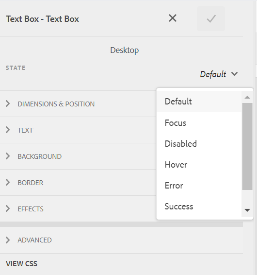
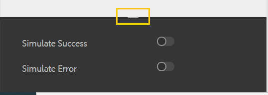

# Textbunden formatering av adaptiva formulärkomponenter {#inline-styling-of-adaptive-form-components}

 Adobe rekommenderar att man använder modern och utbyggbar datainhämtning [Kärnkomponenter](https://experienceleague.adobe.com/docs/experience-manager-core-components/using/adaptive-forms/introduction.html) for [skapa ny Adaptive Forms](/help/forms/creating-adaptive-form-core-components.md) eller [lägga till adaptiv Forms på AEM Sites-sidor](/help/forms/create-or-add-an-adaptive-form-to-aem-sites-page.md). De här komponenterna utgör ett betydande framsteg när det gäller att skapa adaptiva Forms-filer, vilket ger imponerande användarupplevelser. I den här artikeln beskrivs det äldre sättet att skapa Adaptiv Forms med baskomponenter. 

| Version | Artikellänk |
| -------- | ---------------------------- |
| AEM 6.5 | [Klicka här](https://experienceleague.adobe.com/docs/experience-manager-65/forms/adaptive-forms-basic-authoring/inline-style-adaptive-forms.html) |
| AEM as a Cloud Service | Den här artikeln |

Du kan definiera det övergripande utseendet och formatet för ett anpassat formulär genom att ange format med [temaredigerare](themes.md). Du kan också använda infogade CSS-format på enskilda adaptiva formulärkomponenter och förhandsgranska ändringarna direkt. Inline-format åsidosätter format som finns i temat.

## Använda infogade CSS-egenskaper {#apply-inline-css-properties}

Så här lägger du till infogade format i en komponent:

1. Öppna formuläret i formulärredigeraren och ändra läget till formateringsläge. Om du vill ändra läge till formateringsläge trycker du på  > **[!UICONTROL Style]**.
1. Markera en komponent på sidan och tryck på knappen Redigera . Stilegenskaper öppnas i sidofältet.

   Du kan också välja komponenter från formulärhierarkiträdet i sidlisten. Formulärhierarkiträdet är tillgängligt som formulärobjekt i sidlisten.

   I [!UICONTROL Style] I visas komponenterna under Formulärobjekt. Formulärobjektslistan i sidofältet visar dock komponenter som fält och paneler. Fält och paneler är generiska komponenter som kan innehålla komponenter som textrutor och alternativknappar.

   När du väljer en komponent från sidofältet visas alla underkomponenter i listan och egenskaperna för den markerade komponenten. Du kan markera en viss underkomponent och formatera den.

1. Klicka på en flik i sidofältet för att ange CSS-egenskaper. Du kan ange egenskaper som:

   * [!UICONTROL Dimensions & Position] (Visningsinställning, utfyllnad, höjd, bredd, marginal, position, z-index, flyttal, klar, spill)
   * [!UICONTROL Text] (Teckensnittsfamilj, vikt, färg, storlek, radhöjd och justering)
   * [!UICONTROL Background] (Bild och övertoning, bakgrundsfärg)
   * [!UICONTROL Border] (Bredd, stil, färg, radie)
   * [!UICONTROL Effects] (Skugga, Opacitet)
   * [!UICONTROL Advanced] (Gör att du kan skriva anpassad CSS för komponenten)

1. På samma sätt kan du använda format för andra delar av en komponent, som [!UICONTROL Widget], [!UICONTROL Caption]och [!UICONTROL Help].
1. Tryck **[!UICONTROL Done]** för att bekräfta ändringarna eller **[!UICONTROL Cancel]** för att ignorera ändringarna.

## Exempel: textbundna format för en fältkomponent {#example-inline-styles-for-a-field-component}

Följande bilder visar ett textfält före och efter att infogade format har använts på det.

Textrutekomponent innan infogade formategenskaper används

Lägg märke till ändringen i textrutans format, så som visas i följande bild, när du har använt följande CSS-egenskaper.

<table>
 <tbody>
  <tr>
   <td>
Väljare
 </td>
   <td>
CSS-egenskap
 </td>
   <td>
Värde
 </td>
   <td>
Effekt
 </td>
  </tr>
  <tr>
   <td>
Fält
 </td>
   <td>
border
 </td>
   <td>
Kantbredd =2px
 
Kantstil=Heldragen
 
Kantfärg=#1111
 </td>
   <td>
Skapar en svart, 2 pixlar bred kant runt fältet
 </td>
  </tr>
  <tr>
   <td>
Textruta
 </td>
   <td>
background-color
 </td>
   <td>
#6495ED
 </td>
   <td>
Ändrar bakgrundsfärgen till CornflowerBlue (#6495ED)
 
Obs! Du kan ange ett färgnamn eller dess hexadecimala kod i värdefältet.
 </td>
  </tr>
  <tr>
   <td>
Etikett
 </td>
   <td>
Dimensioner och position &gt; bredd
 </td>
   <td>
100px
 </td>
   <td>
Fastställer bredden som 100px för etiketten
 </td>
  </tr>
  <tr>
   <td>Ikon för fälthjälp</td>
   <td>Text &gt; Teckenfärg</td>
   <td>#2ECC40</td>
   <td>Ändrar färgen på hjälpikonens ansikte.</td>
  </tr>
  <tr>
   <td>
Lång beskrivning
 </td>
   <td>
textjustering
 </td>
   <td>
centrera
 </td>
   <td>
Justerar den långa beskrivningen för att få hjälp att centrera
 </td>
  </tr>
 </tbody>
</table>

Textrutekomponent efter användning av egenskaper för infogat format

Följ stegen ovan för att markera och formatera andra komponenter, till exempel paneler, skicka-knappar och alternativknappar.

>[!NOTE]
>
>Stilegenskaperna varierar beroende på vilken komponent du väljer.

## Kopiera och klistra in format {#copy-paste-styles}

Du kan också kopiera och klistra in en stil från en komponent till en annan i ett adaptivt formulär. I **[!UICONTROL Style]** trycker du på komponenten och trycker på ikonen Kopiera .

Tryck på den andra komponenten av samma typ och tryck på ikonen Klistra in  om du vill klistra in det kopierade formatet. Du kan också trycka på ikonen Rensa stil  om du vill ta bort det använda formatet.

## Ange format för olika lägen i en komponent {#set-styles-for-states}

Du kan ange format för olika lägen för en komponenttyp. De olika lägena är: [!UICONTROL Focus], [!UICONTROL Disabled], [!UICONTROL Hover], [!UICONTROL Error], [!UICONTROL Success]och [!UICONTROL Mandatory].

Så här definierar du format för ett läge för en komponent:

1. I **[!UICONTROL Style]** läge, tryck på komponenten och tryck på ikonen Redigera .

1. Välj läge för komponenten med **[!UICONTROL State]** listruta.

   

1. Definiera formatet för komponentens valda läge och tryck på  för att spara egenskaperna.

Du kan också simulera status för lyckade och fel. Tryck på ikonen Expandera för att visa **[!UICONTROL Simulate Success]** och **[!UICONTROL Simulate Error]** alternativ.

## Se även {#see-also}

{{see-also}}

>[!MORELIKETHIS]
>
>* [Använd teman i komponenter med adaptiv form](/help/forms/using-themes-in-core-components.md)