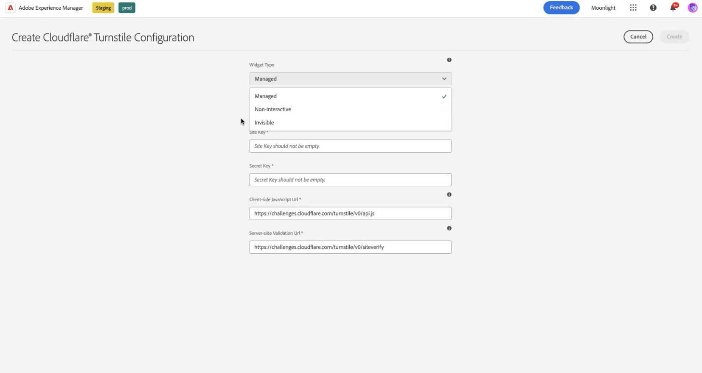

# Koppla samman din AEM Forms-miljö med Turnstile {#connect-your-forms-environment-with-turnstile-service}

 Den här funktionen är under Tidiga Adobe-program. Du kan skriva till aem-forms-ea@adobe.com från ditt officiella e-post-id för att gå med i det tidiga adopterprogrammet och begära åtkomst till funktionen. 

CAPTCHA (Completely Automated Public Turing test to tell Computers and Humans Apart) är ett program som ofta används vid onlinetransaktioner för att skilja mellan människor och automatiserade program eller organ. Det utgör en utmaning och utvärderar användarens svar för att avgöra om det är en människa eller en robot som interagerar med webbplatsen. Det förhindrar användaren att fortsätta om testet misslyckas och gör onlinetransaktionerna säkra genom att förhindra att skräppost eller skadliga syften publiceras.

AEM Forms as a Cloud Service stöder följande CAPTCHA-lösningar:

* [Turnstile](/help/forms/integrate-adaptive-forms-turnstile-core-components.md)
* [Google reCAPTCHA](/help/forms/captcha-adaptive-forms-core-components.md)
* [hCaptcha](/help/forms/integrate-adaptive-forms-hcaptcha-core-components.md)

<!-- -->

## Integrera AEM Forms med Turnstile Captcha

Cloudflare&#39;s Turnstile Captcha är en säkerhetsåtgärd som syftar till att skydda formulär och webbplatser från automatiserade robotar, skadliga attacker, spam och oönskad automatiserad trafik. Den visar en kryssruta när formuläret skickas in för att verifiera att det är humant, innan det går att skicka in formuläret. AEM Forms as a Cloud Service stöder Turnstile Captcha i adaptiva Forms Core-komponenter.

### Förutsättningar för att integrera AEM Forms-miljön med Turnstile Captcha {#prerequisite}

Om du vill konfigurera Turnstile för AEM Forms Core Components måste du hämta [Turnstile sitekey och hemlig nyckel](https://developers.cloudflare.com/turnstile/get-started/) från Turnstile-webbplatsen.

### Konfigurera vändning {#steps-to-configure-hcaptcha}

Så här integrerar du AEM Forms med den färdiga tjänsten:

1. Skapa en konfigurationsbehållare i din AEM Forms as a Cloud Service-miljö. En konfigurationsbehållare innehåller molnkonfigurationer som används för att ansluta AEM till externa tjänster. Följ stegen nedan om du vill skapa och konfigurera en konfigurationsbehållare för att ansluta AEM Forms-miljön med Turnstile:
   1. Öppna din AEM Forms as a Cloud Service-instans.
   1. Gå till **[!UICONTROL Tools > General > Configuration Browser]**.
   1. Skapa en ny mapp i Configuration Browser och aktivera molnkonfigurationer för den eller aktivera molnkonfigurationer för en befintlig mapp enligt anvisningarna nedan:

      * Så här skapar du en **ny mapp** och aktiverar molnkonfigurationer för den:
         1. Klicka på **[!UICONTROL Create]** i konfigurationsläsaren.
         1. Ange ett namn, en titel och välj alternativet **[!UICONTROL Cloud Configurations]** i dialogrutan Skapa konfiguration.
         1. Klicka på **[!UICONTROL Create]**.
      * Så här aktiverar du alternativet Cloud Configurations för en **befintlig mapp**:
         1. Markera din befintliga mapp i Configuration Browser och klicka på **[!UICONTROL Properties]**.
         1. Aktivera **[!UICONTROL Cloud Configurations]** i dialogrutan Konfiguration.
         1. Klicka på **[!UICONTROL Save & Close]** för att spara konfigurationen och avsluta.

1. Konfigurera Cloud Servicen:
   1. Gå till  > **[!UICONTROL Cloud Services]** på AEM författarinstans och klicka på **[!UICONTROL Turnstile]**.
      
   1. Välj en konfigurationsbehållare, skapad eller uppdaterad, enligt beskrivningen i föregående avsnitt. Välj **[!UICONTROL Create]**.
      
   1. Ange **[!UICONTROL Widget Type]** som hanterad, icke-interaktiv eller osynlig. Mer information om widgettyp finns på [Turnstile Widget](https://developers.cloudflare.com/turnstile/concepts/widget/).
   1. Ange **[!UICONTROL Title]**, **[!UICONTROL Name]**, **[!UICONTROL Site Key]** och **[!UICONTROL Secret Key]** för den färdiga tjänsten [ som hämtats i förutsättningen ](#prerequisite).
   1. Klicka på **[!UICONTROL Create]**.

      

   >[!NOTE]
   > Användare behöver inte ändra validerings-URL:en på klientsidan och validerings-URL:en på serversidan eftersom de redan är förifyllda för aktiveringsvalidering.

   När Turnstile Captcha-tjänsten har konfigurerats är den tillgänglig för användning i ett [adaptivt formulär baserat på kärnkomponenter](https://experienceleague.adobe.com/en/docs/experience-manager-core-components/using/adaptive-forms/introduction).

## Använd Turnstile i anpassad form {#using-turnstile-core-components}

1. Öppna din AEM Forms as a Cloud Service-instans.
1. Gå till **[!UICONTROL Forms]** > **[!UICONTROL Forms and Documents]**.
1. Välj ditt adaptiva formulär och klicka på **[!UICONTROL Properties]**. I avsnittet **[!UICONTROL Configuration Container]** väljer du den konfigurationsbehållare som innehåller den molnkonfiguration som ansluter AEM Forms med Turnstile.
1. Klicka på **[!UICONTROL Save & Close]**.

   Om du inte har någon konfigurationsbehållare kan du läsa avsnittet [Konfigurera turordning](#steps-to-configure-hcaptcha) för att lära dig hur du skapar en konfigurationsbehållare.

   

1. Välj ett anpassat formulär och klicka på **[!UICONTROL Edit]** för att öppna ett formulär i redigeraren.
1. Dra och släpp eller lägg till komponenten **[!UICONTROL Adaptive Form Turnstile]** i det adaptiva formuläret från komponentwebbläsaren.
   
1. Markera komponenten **[!UICONTROL Adaptive Form Turnstile]** och klicka på egenskapsikonen  . Dialogrutan Egenskaper öppnas. Ange följande egenskaper:

   

   * **[!UICONTROL Name]:** Ange namnet på Captcha-komponenten. Du kan enkelt identifiera en formulärkomponent med dess unika namn både i formuläret och i regelredigeraren.
   * **[!UICONTROL Title]:** Ange titeln för Captcha-komponenten. Du kan tillåta RTF för titeln och även dölja titeln genom att markera kryssrutorna.
   * **[!UICONTROL Configuration Settings]:** Välj en molnkonfiguration som har konfigurerats för tjänsten Turnstile Captcha.
     >[!NOTE]
     >* Du kan ha flera molnkonfigurationer i din miljö i liknande syfte. Välj tjänsten noggrant. Om ingen tjänst visas läser du avsnittet [Konfigurera viloläge](#steps-to-configure-hcaptcha) om du vill veta hur du skapar en konfigurationsbehållare för att ansluta AEM Forms-miljön till den körbara tjänsten.

   * **[!UICONTROL Validation]:** Ange Captcha-validering i form av ett felmeddelande:

      * **Felmeddelande:** Ange felmeddelandet som ska visas för användaren när Captcha-överföringen misslyckas.
        >[!NOTE]
        >* Ett felmeddelande visas bara om CAPTCHA fylls i på klientsidan.
1. Klicka på **[!UICONTROL Done]**.

Nu är det bara berättigade formulär, där formuläranvändaren kan ta bort den utmaning som Turnstile-tjänsten utgör, som kan användas för att skicka in formuläret.

## Vanliga frågor

* **F: Kan jag använda mer än en Captcha-komponent i ett adaptivt formulär?**
* **Ans:** Det går inte att använda fler än en Captcha-komponent i ett adaptivt formulär. Du bör inte heller använda en Captcha-komponent i ett fragment eller en panel som är markerad för lazy loading.

## Se även {#see-also}

{{see-also}}
