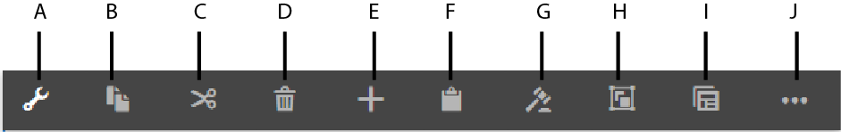

# Adaptiv Forms-redigerare {#introduction-to-authoring-adaptive-forms}

## Översikt {#overview}

Med adaptiva Forms kan du skapa engagerande, responsiva, dynamiska och anpassningsbara formulär. [!DNL AEM Forms] har ett intuitivt användargränssnitt och färdiga komponenter för att skapa och arbeta med Adaptive Forms. Du kan välja att skapa ett adaptivt formulär baserat på en formulärmodell eller ett schema eller utan en formulärmodell. Det är viktigt att du noga väljer den formulärmodell som inte bara passar dina behov, utan som utökar dina befintliga infrastrukturinvesteringar och resurser. Du kan välja mellan följande alternativ för att skapa ett adaptivt formulär:

<!-- * **Using a form data model**
  [Data integration](data-integration.md) lets you integrate entities and services from disparate data sources in to a Form Data Model that you can use to create Adaptive Forms. Choose Form Data Model if the Adaptive Form you are creating involves fetching and write data from and to multiple data source. -->

* **Använda en XDP-formulärmall**
Det är en idealisk formulärmodell om du har investeringar i XFA- eller XDP-formulär. Det är ett direkt sätt att konvertera XFA-baserade formulär till Adaptive Forms. Alla befintliga XFA-regler behålls i tillhörande Adaptive Forms. Det adaptiva Forms-formatet stöder XFA-konstruktioner, t.ex. valideringar, händelser, egenskaper och mönster.

* **Använda en XSD (XML Schema Definition) eller ett JSON-schema**
XML- och JSON-scheman representerar den struktur i vilken data produceras eller förbrukas av organisationens serversystem. Du kan koppla schemat till ett adaptivt formulär och använda dess element för att lägga till dynamiskt innehåll i det adaptiva formuläret. Elementen i schemat kommer att vara tillgängliga för användning på fliken Datamodellobjekt i innehållsläsaren när du redigerar Adaptiv Forms.

* **Använda ingen eller utan en formulärmodell**
Adaptiv Forms som skapats med det här alternativet använder ingen formulärmodell. Data-XML som genereras från sådana formulär har en platt struktur med fält och motsvarande värden.

<!--  For more information about creating an Adaptive Form, see [Creating an Adaptive Form](creating-adaptive-form.md). -->

## Gränssnitt för redigering av adaptiva formulär {#adaptive-form-authoring-ui}

Det pekoptimerade användargränssnittet för att skapa Adaptive Forms är intuitivt och ger:

* Dra-och-släpp-funktioner
* Standardformulärkomponenter
* Integrerad databas för resurser

När du skapar ett nytt eller redigerar ett befintligt adaptivt formulär använder du följande gränssnittselement:

* [Sidebar](#sidebar)
* [Verktygsfältet Sida](#page-toolbar)
* [Komponentverktygsfältet](#component-toolbar)
* [Adaptiv formulärsida](#af-page)

<!-- 

**A.** Sidebar **B.** Page toolbar **C.** Adaptive Form page -->

### Sidebar {#sidebar}

Med sidofältet kan du

* Sök, visa och använd resurser i din AEM DAM-databas (Digital Asset Management).
* Se formulärinnehåll som paneler, komponenter, fält och layout.
* Lägg till komponenter i formuläret.
* Redigera komponentegenskaper.

**S.** Innehållsläsare **B.** Egenskapswebbläsaren **C.** Resursläsaren **D.** Komponentwebbläsare

<!--Click to enlarge

](assets/sidebar-comps-1.png) -->

Sidlisten innehåller följande webbläsare:

* **Innehållsläsare**
I innehållsläsaren kan du se:

   * **Formulärobjekt**
Visar formulärets objekthierarki. Författaren kan navigera till en viss formulärkomponent genom att trycka på det elementet i formulärobjektträdet. Författaren kan söka efter objekt och ordna om dem från det här trädet.

   * **Datamodellsobjekt**
Här kan du se formulärmodellens hierarki.
Du kan dra och släppa formulärmodellelement i det anpassade formuläret. De tillagda elementen konverteras automatiskt till formulärkomponenter samtidigt som deras ursprungliga egenskaper behålls. Du kan se datamodellsobjekt när formuläret använder XML-schema, JSON-schema eller XDP-mall.

* **Egenskapswebbläsaren**

   Gör att du kan redigera egenskaperna för en komponent. Egenskaperna ändras enligt en komponent. Så här visar du egenskaper för behållaren för adaptiva formulär:

   Markera en komponent och tryck sedan på  > **[!UICONTROL Adaptive Form Container]** och sedan trycka .

* **Resursläsaren**

   Segmenterar olika typer av innehåll, t.ex. bilder, dokument, sidor, filmer och så vidare.

* **Komponentwebbläsare**

   Innehåller komponenter som du kan använda för att skapa ett adaptivt formulär. Du kan dra komponenter från till det adaptiva formuläret för att lägga till formulärelement och konfigurera tillagda element enligt kraven. I följande tabell beskrivs komponenterna i komponentwebbläsaren.

<table>
 <tbody>
  <tr>
   <th><strong>Komponent</strong></th>
   <th><strong>Funktionalitet</strong></th>
  </tr>
  <tr>
   <td>Adobe Sign Block</td>
   <td>Lägger till ett textblock med platshållare för fält som ska fyllas i när du signerar med Adobe Sign.</td>
  </tr>
  <tr>
   <td>Knapp</td>
   <td>Lägger till en knapp som du kan konfigurera för att utföra åtgärder som att spara, återställa, gå vidare, gå till föregående och så vidare.</td>
  </tr>
  <tr>
   <td>Captcha</td>
   <td>Lägger till CAPTCHA-validering med tjänsten Google reCAPTCHA.</td>
  </tr>
  <tr>
   <td>Diagram</td>
   <td>Lägger till ett diagram som du kan använda i adaptiva Forms och dokument för visuell representation av tvådimensionella data i repeterbara paneler och tabellrader.</td>
  </tr>
  <tr>
   <td>Kryssruta</td>
   <td>Lägger till en kryssruta.</td>
  </tr>
  <tr>
   <td>Datumindatafält</td>
   <td>Använd datumindatafält i formuläret för att låta kunderna fylla i dag, månad och år separat i tre rutor. Du kan anpassa komponentens utseende och känsla och ändra datumformatet. Du kan till exempel låta kunderna ange datum i formaten MM/DD/ÅÅÅÅ eller DD/MM/ÅÅÅÅ.</td>
  </tr>
  <tr>
   <td>Datumväljaren</td>
   <td>Lägger till ett kalenderfält för att välja ett datum.</td>
  </tr>
  <tr>
   <td>Dokumentfragment</td>
   <td>Gör att du kan lägga till återanvändbara komponenter i en korrespondens.</td>
  </tr>
  <tr>
   <td>Dokumentfragmentgrupp</td>
   <td>Gör att du kan lägga till en grupp med relaterade dokumentfragment som du kan använda i en brevmall som en enskild enhet.</td>
  </tr>
  <tr>
   <td>Nedrullningsbar lista</td>
   <td>Lägger till en nedrullningsbar lista - en eller flera markeringar</td>
  </tr>
  <tr>
   <td>E-post</td>
   <td>
Lägger till ett fält för att hämta e-postadressen. E-postkomponenten validerar som standard e-postadresser med följande reguljära uttryck.
 
<code>^[a-zA-Z0-9.!#$%&amp;’*+/=?^_`{|}~-]+@[a-zA-Z0-9-]+(?:.[a-zA-Z0-9-]+)*$</code>
 </td>
  </tr>
  <tr>
   <td>Bifogad fil</td>
   <td>
Lägger till en knapp som gör att användare kan bläddra bland och bifoga stöddokument till ett formulär.
 
<strong>Obs! </strong>Komponenten Bifogad fil stöder en fördefinierad uppsättning filformat i Adaptive Forms aktiverat för Adobe Sign. Mer information finns i <a href="https://helpx.adobe.com/document-cloud/help/supported-file-formats-fill-sign.html#main-pars_text">Filformat som stöds</a>.
 </td>
  </tr>
  <tr>
   <td>Lista över bifogade filer</td>
   <td>Lägger till ett fält som visar alla bifogade filer som har överförts med komponenten Bifogad fil.</td>
  </tr>
  <tr>
   <td>Sidfot  </td>
   <td>Lägger till sidhuvudet som vanligtvis innehåller en företagslogotyp, formulärets rubrik och sammanfattning.  </td>
  </tr>
  <tr>
   <td>Sidhuvud</td>
   <td>Lägger till sidfoten som vanligtvis innehåller copyrightinformation och länkar till andra sidor. </td>
  </tr>
  <tr>
   <td>Bild</td>
   <td>Gör att du kan infoga en bild.</td>
  </tr>
  <tr>
   <td>Bildval</td>
   <td>Gör att kunderna kan välja en bild som ger information. Ni kan använda informationen för att tillhandahålla personaliserade tjänster till era kunder.</td>
  </tr>
  <tr>
   <td>Knappen Nästa</td>
   <td>Lägger till en knapp för att navigera till nästa panel i ett formulär.</td>
  </tr>
  <tr>
   <td>Numerisk ruta</td>
   <td>Lägger till ett fält för att hämta numeriska värden</td>
  </tr>
  <tr>
   <td>Numerisk stege</td>
   <td>Använd Numeric Stepper i formuläret för att låta kunderna ange ett numeriskt värde som de kan öka eller minska baserat på ett fördefinierat steg.</td>
  </tr>
  <tr>
   <td>Panel</td>
   <td>
Lägger till en panel eller underpanel.
 
Du kan också lägga till en panelkomponent från den överordnade panelens verktygsfält med hjälp av Lägg till underordnad panel</code> -knappen. På samma sätt kan du lägga till ett panelspecifikt verktygsfält med Verktygsfältet Lägg till panel</code> -knappen. Du kan konfigurera placeringen av panelens verktygsfält med hjälp av dialogrutan Redigera panel.</code></code>
 </td>
  </tr>
  <tr>
   <td>Lösenordsruta</td>
   <td>Lägger till ett fält för att hämta ett lösenord.</td>
  </tr>
  <tr>
   <td>Knappen Föregående</td>
   <td>Lägger till en knapp som användare behöver för att gå tillbaka till föregående sida eller panel.</td>
  </tr>
  <tr>
   <td>Alternativknapp</td>
   <td>Lägger till alternativknappar.</td>
  </tr>
  <tr>
   <td>Knappen Återställ</td>
   <td>Lägger till en knapp för att återställa formulärfält.</td>
  </tr>
  <tr>
   <td>Spara-knapp</td>
   <td>Lägger till en knapp för att spara formulärdata.</td>
  </tr>
  <tr>
   <td>Klottra signaturer</td>
   <td>Lägger till ett fält för att hämta skriptsignaturer.</td>
  </tr>
  <tr>
   <td>Avgränsare</td>
   <td>Gör att panelerna i formuläret kan delas upp visuellt.</td>
  </tr>
  <tr>
   <td>Signatursteg</td>
   <td>Visar informationen i formuläret och signaturfälten som användaren kan använda för att verifiera och signera formuläret.</td>
  </tr>
  <tr>
   <td>Text</td>
   <td>Gör att du kan ange statisk text.</td>
  </tr>
  <tr>
   <td>Skicka-knapp</td>
   <td>Lägger till en Skicka-knapp för att skicka formuläret till den konfigurerade Skicka-åtgärden.</td>
  </tr>
  <tr>
   <td>Sammanfattningssteg</td>
   <td>Skickar formuläret och visar en sammanfattning som författarna anger när formuläret har skickats. </td>
  </tr>
  <tr>
   <td>Byt</td>
   <td>Lägger till en växel som utför en åtgärd för att växla eller aktivera/inaktivera. Du kan inte lägga till fler än två alternativ i komponenten Switch. Eftersom en switch bara kan ha två värden: På eller av är obligatoriskt inte tillämpligt. Minst ett värde sparas oavsett användarens indata.   </td>
  </tr>
  <tr>
   <td>Tabell</td>
   <td>Lägger till en tabell där du kan ordna data i rader och kolumner. </td>
  </tr>
  <tr>
   <td>Telefonnummer</td>
   <td>
Lägger till ett fält för att hämta telefonnummer. Med telefonkomponenten kan författare konfigurera någon av följande telefonnummertyper. Varje typ är associerad med ett reguljärt standarduttryck för validering.

    <ul>
     <li>Type International valideras av <code>^[+][0-9]{0,14}$</code>.</li>
     <li>Type USPhoneNumber valideras av <code>{'+1 ('999') '999-9999}</code>.</li>
     <li>Typen UKPhoneNumber valideras av <code>text{'+'99 999 999 9999}</code>.</li>
     <li>Typen Anpassad innehåller inget standardvalideringsmönster. Den får värdet för den senast valda telefonnummertypen. Du kan också ange ett eget valideringsmönster.</li>
    </ul> </td>
  </tr>
  <tr>
   <td>Villkor  </td>
   <td>Lägger till ett fält som författare kan använda för att ange villkoren som användare ska granska innan formuläret fylls i.</td>
  </tr>
  <tr>
   <td>Textruta </td>
   <td>
Lägger till en textruta där en användare kan ange nödvändig information. 
 
Komponenten Textruta accepterar som standard bara oformaterad text. Du kan aktivera en textrutekomponent för att acceptera RTF. En RTF-aktiverad textkomponent innehåller alternativ för att lägga till rubriker, ändra teckenformat (fet, kursiv, stryka under tecknen), skapa sorterade och osorterade listor, ändra textbakgrund och textfärg samt lägga till hyperlänkar. Aktivera alternativet<strong> Tillåt RTF</strong> i komponentegenskaperna.
 </td>
  </tr>
  <tr>
   <td>Titel</td>
   <td>Anger en rubrik för det adaptiva formuläret.</td>
  </tr>
  <tr>
   <td>Verifiera steg</td>
   <td>
Lägger till en platshållare som visar det ifyllda formuläret för verifiering av användaren.
 
<strong>Anteckning</strong>: Adaptiv form som innehåller Verifiera-komponenten stöder inte anonyma användare. Du bör inte heller använda komponenten Verify i ett adaptivt formulärfragment.
 </td>
  </tr>
 </tbody>
</table>

### Verktygsfältet Sida {#page-toolbar}

Verktygsfältet längst upp på sidan innehåller alternativ som gör att du kan förhandsgranska formuläret, ändra formuläregenskaper och redigera formulärlayouten. Du kan förhandsgranska formuläret när du redigerar det och göra ändringar i det. I verktygsfältet visas:

* **Växla sidopanel** : Här kan du visa eller dölja sidofältet.

* **Sidinformation** : Gör att du kan visa sidegenskaper, publicera/avpublicera ett formulär, starta ett formulärarbetsflöde och öppna formuläret i klassiskt gränssnitt.

* **Emulator** : Gör att du kan emulera formulärutseendet för olika visningsstorlekar, till exempel surfplattor och telefoner.

* **Redigera**: Här kan du välja andra lägen, till exempel: **[!UICONTROL Edit]**, **[!UICONTROL Style]**, **[!UICONTROL Developer]** och **[!UICONTROL Design]**.

   * **Redigera**: Här kan du redigera egenskaperna för formuläret och dess komponenter. Du kan till exempel lägga till en komponent, släppa en bild och ange obligatoriska fält.
   * **Stil**: Gör att du kan formatera utseendet på komponenter i formuläret. I stilläge kan du till exempel markera en panel och ange dess bakgrundsfärg.

   * **Utvecklare**: Låter en utvecklare:

      * Upptäck vad formulären består av.
      * Felsök vad som händer var och när, vilket i sin tur hjälper till att lösa problem.

      * **Design**. Gör att du kan aktivera eller inaktivera anpassade komponenter eller komponenter som inte finns med i sidofältet.

* **Förhandsgranska**: Gör att du kan förhandsgranska hur formuläret ser ut när du publicerar det.

### Komponentverktygsfältet {#component-toolbar}

När du markerar en komponent visas ett verktygsfält där du kan arbeta med den. Du får alternativ för att klippa ut, klistra in, flytta och ange egenskaper för komponenterna. Dina alternativ är:

S.**Konfigurera**: När du trycker **[!UICONTROL Configure]** visas komponentegenskaperna i sidlisten. Om du konfigurerar dessa egenskaper kan du anpassa datainhämtningen. Du kan ändra komponentens elementnamn och ange etikettexten i komponentens rubrikfält. Med elementnamnet kan du hämta värden som användarna anger med komponenten. I komponentegenskaperna anger du komponentens beteende och hanterar användarindata. Konfigurera egenskaperna i sidofältet för att hämta användardata och använda dem för vidare bearbetning. Med egenskaper för behållare för adaptiva formulär kan du ange klientbibliotek, layouter, teman, inställningar för dokumentdokument, inställningar för att spara, inställningar för överföring och metadatainställningar.

B.**Kopiera**: Du kan använda kopieringsalternativet för att kopiera en komponent och klistra in den på andra platser i formuläret. När du klistrar in en komponent får den inklistrade komponenten ett nytt elementnamn men behåller den kopierade komponentens egenskaper.

C.**Klipp ut**: Du kan använda alternativet Klipp ut för att flytta en komponent från en plats till en annan i det adaptiva formuläret.

D. **Ta bort**: Gör att du kan ta bort komponenten från formuläret.

E. **Infoga**: Gör att du kan infoga en komponent ovanför den markerade komponenten.

F. **Klistra in**: Gör att du kan klistra in komponenten som du klipper ut eller kopierar med alternativen som beskrivs ovan.

G. **Redigera regler**: Gör att du kan öppna regelredigeraren. Mer information, <!-- see [Rule Editor](rule-editor.md). -->

H. **Grupp**: Gör att du kan markera flera komponenter om du vill klippa ut, kopiera eller klistra in mer än en komponent tillsammans.

Jag. **Överordnad**: Gör att du kan välja en komponents överordnade. Ett textfält ligger till exempel i ett underavsnitt som finns i ett avsnitt. Avsnittet finns i stödlinjens rotpanel och behållaren för adaptiv form är överordnad en stödlinjens rotpanel. För en komponent kan du se alla alternativ med hierarkin sorterad längst ned.

Om du till exempel trycker **[!UICONTROL Parent]** för en textruta ser du:

* Underavsnitt
* Avsnitt
* guideRootPanel
* Adaptiv formulärbehållare

J. **Övriga**: Innehåller fler alternativ för att arbeta med den markerade komponenten.

* Visa SOM-uttryck
* Spara en panel som fragment (endast för paneler)
* Lägg till underordnad panel (endast för paneler)
* Verktygsfältet Lägg till panel (endast för paneler)
* Ersätt (inte för paneler)

### Adaptiv formulärsida {#af-page}

Sidan Adaptiv form är den faktiska formen. Det är som vilken annan WCM-sida som helst som är WCM-baserad `cq:Page` -komponenten. Följande bild visar innehållsstrukturen i ett typiskt adaptivt formulär.

Innehållsstrukturen innehåller vanligtvis följande primära komponenter:

* **guideContainer**: Roten i ett adaptivt formulär, som markerats som **[!UICONTROL Start of Adaptive Form]** i gränssnittet för adaptiv form. I den här komponenten kan du ange:

   * *Mobil layout för det adaptiva formuläret*: Definierar formulärets utseende på mobila enheter.
   * *Tack*: Definierar sidan där användaren omdirigeras efter att formuläret har skickats.
   * *Skicka åtgärd*: Definierar hur formuläret ska bearbetas på servern när användaren skickar formuläret.
   * *Stilar*: Anger sökvägen till CSS-filen som används för att anpassa formulärets utseende.

* **rootPanel:** Rotpanelen i ett adaptivt formulär. Den kan innehålla underpaneler under objektnoden. Varje panel, inklusive rotpanelen, kan ha en tillhörande layout. Panelens layout bestämmer hur formuläret placeras. I dragspelslayouten placeras till exempel objekten som dragspelssteg.

* **verktygsfält:** En behållare för anpassat formulär har ett associerat globalt verktygsfält som är globalt för formuläret. Det här verktygsfältet kan läggas till med **[!UICONTROL Add Toolbar]** i redigeringsfältet där författare kan lägga till åtgärder som Skicka, Spara, Återställ och så vidare.

* **resurser:** Den här noden innehåller ytterligare information som används för formulärredigering. Exempel: formulärmodellinformation, lokaliseringsinformation osv.
