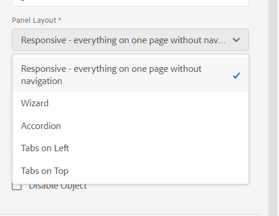
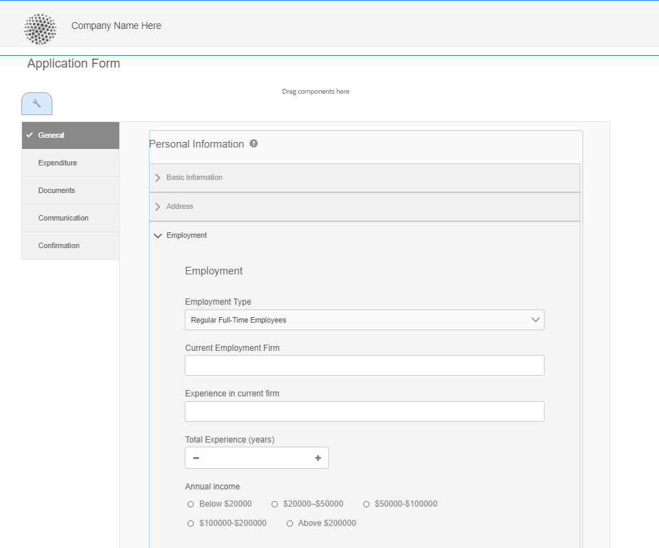

# Layoutfunktioner i Adaptive Forms {#layout-capabilities-of-adaptive-forms}

<span class="preview"> Adobe rekommenderar att man använder modern och utbyggbar datainhämtning [Kärnkomponenter](https://experienceleague.adobe.com/docs/experience-manager-core-components/using/adaptive-forms/introduction.html) for [skapa ny Adaptive Forms](/help/forms/creating-adaptive-form-core-components.md) eller [lägga till adaptiv Forms på AEM Sites-sidor](/help/forms/create-or-add-an-adaptive-form-to-aem-sites-page.md). De här komponenterna utgör ett betydande framsteg när det gäller att skapa adaptiva Forms-filer, vilket ger imponerande användarupplevelser. I den här artikeln beskrivs det äldre sättet att skapa Adaptiv Forms med baskomponenter. </span>


| Version | Artikellänk |
| -------- | ---------------------------- |
| AEM 6.5 | [Klicka här](https://experienceleague.adobe.com/docs/experience-manager-65/forms/adaptive-forms-basic-authoring/layout-capabilities-adaptive-forms.html) |
| AEM as a Cloud Service | Den här artikeln |

[!DNL Adobe Experience Manager] Med kan ni skapa lättanvända, adaptiva Forms som ger användarna dynamiska upplevelser. Formulärlayouten styr hur objekt och komponenter visas i ett adaptivt formulär.

<!-- ## Prerequisite knowledge {#prerequisite-knowledge}

Before learning about the different layout capabilities of Adaptive Forms, read [Introduction to authoring forms](introduction-forms-authoring.md) to know more about Adaptive Forms. -->

## Typ av layout {#types-of-layouts}

Med ett adaptivt formulär får du följande typer av layouter:

**[!UICONTROL Panel Layout]** Styr hur objekt eller komponenter i en panel visas på en enhet.

**[!UICONTROL Mobile Layout]** Styr navigeringen i ett formulär på en mobil enhet. Om enhetens bredd är minst 768 pixlar betraktas layouten som en mobillayout och optimerad för en mobil enhet.

**[!UICONTROL Toolbar Layout]** Styr placeringen av åtgärdsknappar i verktygsfältet eller panelverktygsfältet i ett formulär.

Alla dessa panellayouter definieras i `/libs/fd/af/layouts` plats.

Använd redigeringsläget i [!DNL Experience Manager].

## [!UICONTROL Panel layout] {#panel-layout}

En formulärförfattare kan koppla en layout till varje panel i ett adaptivt formulär, inklusive rotpanelen.

Panellayouterna finns på `/libs/fd/af/layouts/panel` plats. Tryck på panelen och välj  om du vill visa panelegenskaperna.



### [!UICONTROL Responsive - everything on one page without navigation] {#responsive-everything-on-one-page-without-navigation-br}

Använd den här panellayouten för att skapa en responsiv layout som anpassar sig till enhetens skärmstorlek utan att behöva använda någon särskild navigering.

Med den här layouten kan du montera flera **[!UICONTROL Panel Adaptive Form]** -komponenter efter varandra i panelen.


### [!UICONTROL Wizard] {#wizard}

Använd den här panellayouten för guidad navigering i ett formulär. Använd till exempel den här layouten när du vill hämta in obligatorisk information i ett formulär och vägleda användarna steg för steg.

Använd **[!UICONTROL Panel Adaptive Form]** -komponent för stegvis navigering i en panel. När du använder den här layouten flyttas användaren till nästa steg först när det aktuella steget är klart

```javascript
window.guideBridge.validate([], this.panel.navigationContext.currentItem.somExpression)
```


### [!UICONTROL Accordion] {#layout-for-accordion-design}

Med den här layouten kan du montera **[!UICONTROL Panel Adaptive Form]** i en panel med navigering i dragspelsstil. Med den här layouten kan du även skapa upprepningsbara paneler. Med upprepningsbara paneler kan du lägga till eller ta bort paneler dynamiskt efter behov. Du kan definiera minsta och högsta antal gånger en panel upprepas. Panelens namn kan också bestämmas dynamiskt utifrån informationen som finns i panelobjekten.

Sammanfattningsuttryck kan användas för att visa de värden som slutanvändaren anger i titeln på den minimerade panelen.



### [!UICONTROL Tabbed layout - tabs appear on the left]{#tabbed-layout-tabs-appear-on-the-left}

Med den här layouten kan du montera **[!UICONTROL Panel Adaptive Form]** i en panel med tabbnavigering. Flikarna placeras till vänster om panelinnehållet.


Tabbar till vänster om en panel

### [!UICONTROL Tabbed layout - tabs appear on the top] {#tabbed-layout-tabs-appear-on-the-top}

Med den här layouten kan du montera **[!UICONTROL Panel Adaptive Form]** Komponent i en panel med tabbnavigering. Flikarna placeras ovanpå panelinnehållet.


## Mobillayouter {#mobile-layouts}

Mobillayouter möjliggör användarvänlig navigering på mobila enheter med relativt mindre skärmar. I mobila layouter används antingen flikformat eller guideformat för formulärnavigering. När du använder en Mobile-layout får du en layout för hela formuläret.

Den här layouten styr navigeringen med ett navigeringsfält och en navigeringsmeny. Navigeringsfältet visas **&lt;** och **>** ikon som anger **[!UICONTROL next]** och **[!UICONTROL previous]** navigeringssteg i formuläret.

Mobillayouterna finns på `/libs/fd/af/layouts/mobile/` plats. Följande mobila layouter är som standard tillgängliga i Adaptive Forms.


Välj **[!UICONTROL Add navigable items of responsive layout to mobile menu]** om du vill visa de navigeringsbara alternativ som är tillgängliga för en panel i Mobile-layouten. De navigeringsbara alternativen visas bara om du väljer **[!UICONTROL Responsive]** layout för en panel.

När du använder en Mobile-layout är formulärmenyn tillgänglig genom att trycka på  -ikon.

### [!UICONTROL Layout with panel titles in the form header] {#layout-with-panel-titles-in-the-form-header}

I den här layouten, som namnet föreslår, visas panelrubriker tillsammans med navigeringsmenyn och navigeringsfältet. Den här layouten innehåller även ikoner för Nästa och Föregående för navigering.


### [!UICONTROL Layout without panel titles in the form header]{#layout-without-panel-titles-in-the-form-header}

Den här layouten, som namnet föreslår, visar bara navigeringsmenyn och navigeringsfältet utan panelrubriker. Den här layouten innehåller även ikoner för Nästa och Föregående för navigering.


## Se även {#see-also}

{{see-also}}


<!-- ## Toolbar layouts {#toolbar-layouts}

A Toolbar Layout controls positioning and display of any action buttons that you add to your Adaptive Forms. The layout can be added at a form level or at a panel level.


A list of Toolbar Layouts in Adaptive Forms

Toolbar layouts are available at `/libs/fd/af/layouts/toolbar` location. Adaptive Forms provide the following Toolbar Layouts, by default.

### [!UICONTROL Default layout for toolbar] {#default-layout-for-toolbar}

This layout is selected as the default layout when you add any action buttons in an Adaptive Form. Selecting this layout displays the same layout for both, desktop and mobile devices.

Also, you can add multiple toolbars containing action buttons configured with this layout. An action button is associated with a form control. You can configure the toolbars to be before or after a panel.


Default view for toolbar

### [!UICONTROL Mobile fixed layout for toolbar] {#mobile-fixed-layout-for-toolbar}

Select this layout to provide alternate layouts for desktop and mobile devices.

For the desktop layout, you can add Action buttons using some specific labels. Only one toolbar can be configured with this layout. If more than one toolbar is configured with this layout, there is an overlap for mobile devices and only one toolbar is visible. For example, you can have a toolbar at the bottom or the top of the form, or, after or before panels in the form.

For the Mobile layout, you can add action buttons using icons.


Mobile fixed layout for toolbar-->


