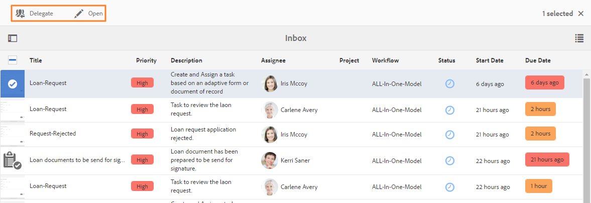

# Hantera Forms-program och -uppgifter i AEM Inkorg{#manage-forms-applications-and-tasks-in-aem-inbox}

Ett av många sätt att starta eller utlösa ett Forms-centrerat arbetsflöde är genom program i AEM Inbox. Du måste skapa ett arbetsflödesprogram för att göra ett Forms-arbetsflöde tillgängligt som program i Inbox. Mer information om arbetsflödesprogram och andra sätt att starta Forms-arbetsflöden finns i [Starta ett Forms-orienterat arbetsflöde i OSGi](aem-forms-workflow.md#launch).

Dessutom konsoliderar AEM Inkorg meddelanden och uppgifter från olika AEM komponenter, inklusive Forms-arbetsflöden. När ett formulärarbetsflöde som innehåller ett tilldelningssteg aktiveras, visas det associerade programmet som en uppgift i den tilldelades inkorg. Om den som tilldelats är en grupp visas uppgiften i Inkorgen för alla gruppmedlemmar tills en enskild person gör anspråk på eller delegerar uppgiften.

Användargränssnittet i Inkorgen innehåller lista- och kalendervyer för att visa uppgifter. Du kan också konfigurera visningsinställningarna. Du kan filtrera uppgifter baserat på olika parametrar. Mer information om visning och filter finns i [Din inkorg](https://experienceleague.adobe.com/docs/experience-manager-cloud-service/sites/authoring/getting-started/inbox.html#inbox-in-the-header).

Sammanfattningsvis kan du i Inkorgen skapa ett nytt program och hantera tilldelade uppgifter.

>[!NOTE]
>
>Du måste vara medlem i [!DNL workflow-users] för att kunna använda AEM Inkorg.

## Skapa program {#create-application}

1. Gå till AEM Inkorg på https://&#39;[server]:[port]/aem/inbox.
1. Tryck på i Inkorgen **[!UICONTROL Create > Application]**. Sidan Välj program visas.
1. Välj ett program och klicka på **[!UICONTROL Create]**. Det adaptiva formulär som är associerat med programmet öppnas. Fyll i informationen i det adaptiva formuläret och tryck på **[!UICONTROL Submit]**. Det startar det associerade arbetsflödet och skapar en uppgift i den tilldelades inkorg.

## Hantera uppgifter {#manage-tasks}

När ett Forms-arbetsflöde utlöses och du är tilldelad eller en del av den tilldelade gruppen, visas en uppgift i Inkorgen. Du kan visa uppgiftsinformation och utföra tillgängliga åtgärder för uppgiften inifrån Inkorgen.

### Anspråk eller delegera uppgifter {#claim-or-delegate-tasks}

Uppgifter som tilldelas en grupp visas i Inkorgen för alla gruppmedlemmar. Alla gruppmedlemmar kan göra anspråk på den uppgiften eller delegera den till en annan gruppmedlem. Så här gör du:

1. Tryck för att markera aktivitetens miniatyrbild. Alternativ för att öppna eller delegera uppgiften visas högst upp.

   

1. Gör något av följande:

   * Om du vill delegera uppgiften trycker du **[!UICONTROL Delegate]**. Dialogrutan Delegera objekt öppnas. Välj en användare, lägg till en kommentar och tryck på **[!UICONTROL OK]**.

   

   * Om du vill göra anspråk på uppgiften trycker du **[!UICONTROL Open]**. Dialogrutan Tilldela till mig själv öppnas. Tryck **[!UICONTROL Proceed]** för att göra anspråk på uppgiften. Uppgiften visas med dig som tilldelad i din inkorg.

   

### Visa information och utför åtgärder på uppgifter {#view-details-and-perform-actions-on-tasks}

När du öppnar en uppgift kan du visa uppgiftsinformation och utföra tillgängliga åtgärder. Vilka åtgärder som är tillgängliga för en uppgift definieras i steget Tilldela uppgift i det associerade Forms-arbetsflödet.

1. Tryck för att markera aktivitetens miniatyrbild. Alternativ för att öppna eller delegera den valda uppgiften visas högst upp.
1. Tryck **Öppna** för att visa information om uppgifter och vidta åtgärder. Den detaljerade uppgiftsvyn öppnas. I den här vyn kan du visa aktivitetsinformation och vidta åtgärder för uppgiften.

   >[!NOTE]
   >
   >Om en uppgift har tilldelats en grupp måste du göra anspråk på den för att den ska kunna öppnas i detaljerad vy.


Den detaljerade uppgiftsvyn innehåller följande avsnitt:

* Uppgiftsinformation
* Formulär
* Information om arbetsflöde
* Verktygsfältet Åtgärder

#### Uppgiftsinformation {#task-details}

I avsnittet Uppgiftsinformation visas information om uppgiften. Vilken information som visas beror på konfigurationsinställningarna för [Tilldela aktivitetssteg](https://experienceleague.adobe.com/docs/experience-manager-65/developing/extending-aem/extending-workflows/workflows-step-ref.html#extending-aem) i arbetsflödet. I exemplet ovan visas beskrivning, status, startdatum och arbetsflöde som används för uppgiften. Det gör det även möjligt att bifoga en fil till uppgiften.

#### Formulär {#form}

Fliken Formulär i området för huvudinnehållet visar eventuella bifogade formulär och fältnivåbilagor.

#### Information om arbetsflöde {#workflow-details}

Fliken Arbetsflödesinformation överst visar förloppet för uppgiften genom olika steg i arbetsflödet. Här visas slutförda, aktuella och väntande faser för uppgiften. Stegen för ett arbetsflöde definieras i [Tilldela aktivitetssteg](https://experienceleague.adobe.com/docs/experience-manager-65/developing/extending-aem/extending-workflows/workflows-step-ref.html#extending-aem) för det associerade arbetsflödet.

Fliken visar också aktivitetshistorik för varje slutförd fas i arbetsflödet. Du kan trycka **[!UICONTROL View Details]** för att få information om det stadiet. Här visas kommentarer, formulär och uppgiftsbilagor, status, start- och slutdatum och så vidare om uppgiften.


#### Verktygsfältet Åtgärder {#actions-toolbar}

Verktygsfältet Åtgärder visar alla tillgängliga alternativ för uppgiften. Medan Spara, Återställ och Delegera är standardåtgärder konfigureras andra tillgängliga åtgärder i [Tilldela aktivitetssteg](https://experienceleague.adobe.com/docs/experience-manager-65/developing/extending-aem/extending-workflows/workflows-step-ref.html#extending-aem). I exemplet ovan har Godkänn och Avvisa konfigurerats i arbetsflödet.

När du utför en åtgärd fortsätter den i arbetsflödet.

### Visa slutförda uppgifter {#view-completed-tasks}

AEM Inkorg visar bara aktiva uppgifter. Slutförda uppgifter visas inte i listan. Du kan emellertid använda inkorgsfilter för att filtrera uppgifter baserat på flera parametrar, t.ex. uppgiftstyp, status, start- och slutdatum. Så här visar du slutförda uppgifter:

1. I AEM Inkorg trycker du  för att öppna filterväljaren.
1. Tryck **[!UICONTROL Task Status]** dragspelspanel och markera **[!UICONTROL Complete]**. Alla slutförda uppgifter visas.

   

1. Tryck för att markera en uppgift och klicka på **[!UICONTROL Open]**.

Aktiviteten öppnas och dokumentet eller det adaptiva formuläret som är kopplat till uppgiften visas. För adaptiv form visar uppgiften det skrivskyddade adaptiva formuläret eller dess PDF-dokument för post som konfigurerats på fliken Formulär/dokument i [Tilldela arbetsflödessteg för uppgift](https://experienceleague.adobe.com/docs/experience-manager-65/developing/extending-aem/extending-workflows/workflows-step-ref.html#extending-aem).

I avsnittet med aktivitetsinformation visas information om till exempel åtgärd, aktivitetsstatus, startdatum och slutdatum.


The **[!UICONTROL Workflow Details]** -fliken visar varje steg i arbetsflödet. Tryck **[!UICONTROL View details]** om du vill få detaljerad information.


## Felsökning {#troubleshooting-workflows}

### Det går inte att visa objekt som är relaterade till AEM arbetsflöde i AEM {#unable-to-see-aem-worklow-items}

En arbetsflödesmodellägare kan inte visa objekt som är relaterade till AEM i AEM. Lös problemet genom att lägga till indexen nedan i din AEM och återskapa indexet.

1. Använd någon av följande metoder för att lägga till index:

   * Skapa följande noder i CRX DE på `/oak:index/workflowDataLucene/indexRules/granite:InboxItem/properties` med respektive egenskaper enligt följande tabell:

     | Nod | Egenskap | Typ |
     |---|---|---|
     | sharedWith | sharedWith | STRÄNG |
     | låst | låst | BOOLEAN |
     | returnerade | returnerade | BOOLEAN |
     | allowInboxSharing | allowInboxSharing | BOOLEAN |
     | allowExplicitSharing | allowExplicitSharing | BOOLEAN |


   * Distribuera indexen via ett AEM. Du kan använda en [AEM](https://experienceleague.adobe.com/docs/experience-manager-core-components/using/developing/archetype/overview.html?lang=en) för att skapa ett AEM som kan distribueras. Använd följande exempelkod för att lägga till index i ett AEM Archetype-projekt:

   ```Java
      .property("sharedWith", "sharedWith").type(TYPENAME_STRING).propertyIndex()
      .property("locked", "locked").type(TYPENAME_BOOLEAN).propertyIndex()
      .property("returned", "returned").type(TYPENAME_BOOLEAN).propertyIndex()
      .property("allowInboxSharing", "allowInboxSharing").type(TYPENAME_BOOLEAN).propertyIndex()
      .property("allowExplicitSharing", "allowExplicitSharing").type(TYPENAME_BOOLEAN).propertyIndex()
   ```

1. [Skapa ett egenskapsindex och ange det som true](https://experienceleague.adobe.com/docs/experience-manager-65/deploying/deploying/queries-and-indexing.html?lang=en#the-property-index).

1. När index i CRX DE har konfigurerats eller distribuerats via ett paket [indexera om databasen](https://helpx.adobe.com/in/experience-manager/kb/HowToCheckLuceneIndex.html#Completelyrebuildtheindex).

