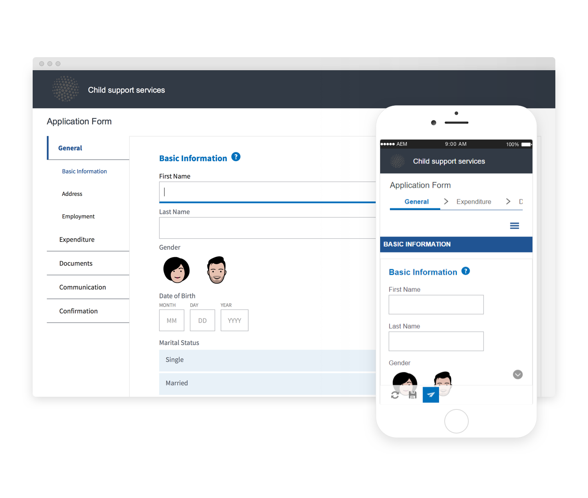
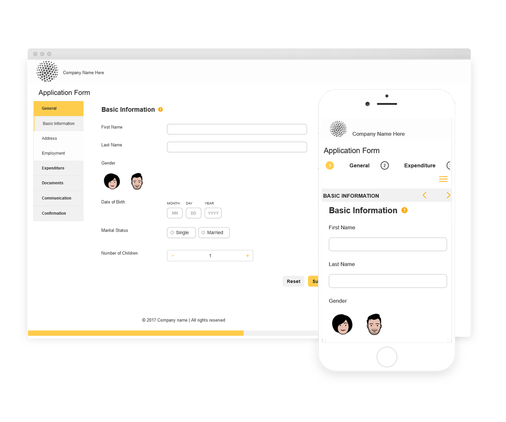

# Referensteman, mallar och formulärdatamodeller {#reference-themes-templates-and-data-models}

 Adobe rekommenderar att man använder modern och utbyggbar datainhämtning [Kärnkomponenter](https://experienceleague.adobe.com/docs/experience-manager-core-components/using/adaptive-forms/introduction.html) for [skapa ny Adaptive Forms](/help/forms/creating-adaptive-form-core-components.md) eller [lägga till adaptiv Forms på AEM Sites-sidor](/help/forms/create-or-add-an-adaptive-form-to-aem-sites-page.md). De här komponenterna utgör ett betydande framsteg när det gäller att skapa adaptiva Forms-filer, vilket ger imponerande användarupplevelser. I den här artikeln beskrivs det äldre sättet att skapa Adaptiv Forms med baskomponenter. 

AEM Forms as a Cloud Service innehåller flera referensteman, mallar och formulärdatamodeller som hjälper dig att snabbt komma igång med att skapa Adaptiv Forms. Du kan ladda ned [referera till innehållspaket från programdistributionsportalen](https://experience.adobe.com/#/downloads/content/software-distribution/en/aemcloud.html?package=/content/software-distribution/en/details.html/content/dam/aemcloud/public/aem-forms-reference-content.ui.content-2.1.0.zip) och använder [Pakethanteraren](/help/implementing/developing/tools/package-manager.md) för att installera [referensinnehållspaket](https://experience.adobe.com/#/downloads/content/software-distribution/en/aemcloud.html?package=/content/software-distribution/en/details.html/content/dam/aemcloud/public/aem-forms-reference-content.ui.content-2.1.0.zip) i din produktions-, utvecklings- eller lokala utvecklingsmiljö för att få dessa referensresurser till din miljö.

De teman, mallar och formulärdatamodeller som ingår i referensinnehållspaketet är:

| Teman | Mallar | Formulärdatamodeller |
---------|----------|---------
| Arbetsyta 3.0 | Grundläggande | Microsoft Dynamics 365 |
| Tranquil | Tom | Salesforce |
| Urbane |   |  |
| Ultramarin |  |  |
| Beryl |  |  |
| Sjukvård |  |   |
| FSI |   |   |

## Referensteman {#reference-themes}

[Teman](/help/forms/themes.md) gör att du kan formatera formulär utan djupare kunskaper om CSS. Du kan hämta följande teman genom att installera [Referensinnehållspaket](https://experience.adobe.com/#/downloads/content/software-distribution/en/aemcloud.html?package=/content/software-distribution/en/details.html/content/dam/aemcloud/public/aem-forms-reference-content.ui.content-2.1.0.zip):

* Beryl
* Arbetsyta 3.0
* Tranquil
* Urbane
* Ultramarin
* Sjukvård
* FSI (Finansiella tjänster och försäkringar)

Varje tema innehåller en unik och elegant stil som du kan använda för att skapa snygga, anpassningsbara formulär för användarna. Den innehåller en unik formatering för väljare som panel, textruta, numerisk ruta, alternativknapp, tabell och switch. Stilar i dessa teman baseras på krav. I ett visst scenario behöver du till exempel ett minimalistiskt tema med rena teckensnitt. Med Frihetstemat kan du få den där looken.

Teman som ingår i det här paketet är responsiva, och format i dessa teman definieras för mobilskärmar och datorskärmar. De flesta moderna webbläsare på en mängd olika enheter kan återge formulär som används med något av dessa teman utan krångel.

Mer information om hur du installerar paketet finns i [Så här arbetar du med paket](/help/implementing/developing/tools/package-manager.md).

## Beryl {#beryl}

Beryl-temat betonar användningen av bakgrundsbilder, genomskinlighet och stora, platta ikoner. På skärmbilden nedan ser du hur Beryl-temat ser ut och hur det kan förbättra formateringen av ditt formulär.

## Arbetsyta 3.0 {#canvas}

Canvas 3.0 är standardtemat för Adaptive Forms och betonar användningen av grundläggande färger, genomskinlighet och platta ikoner. På skärmbilden nedan ser du hur temat Canvas 3.0 ser ut.

## Tranquil {#tranquil}

Med det tillfälliga temat får du ljusa och mörka nyanser av det Tranquil-färgschemat för att framhäva olika komponenter i ett formulär. Alternativknappar, paneler och flikar får till exempel en annan grön ton.

## Urbane {#urbane}

Urbane-temat betonar ett minimalistiskt och funktionellt utseende på ditt formulär. När du använder Urbane-temat i ditt formulär ser du att komponenterna är platta. Panelerna får tunna konturer för att skapa ett modernt utseende.

## Ultramarin {#ultramarine}

Ultramarintemat använder djupa blå skuggor för att framhäva komponenter som tabbar, paneler, textrutor och knappar.

## Sjukvård {#healthcare}

Hälsotemat använder djupa gröna skuggor för att framhäva komponenter som tabbar, paneler, textrutor och knappar.

## FSI (Finansiella tjänster och försäkringar)

FSI-temat betonar ett minimalistiskt och funktionellt utseende på ditt formulär. När du använder FSI-temat i ditt formulär ser du att panelkomponenterna är gula.

## Referensmallar {#reference-templates}

[Mallar](/help/forms/themes.md) gör att du kan definiera den inledande formulärstrukturen, innehållet och åtgärderna för dina formulär. Du kan hämta följande mallar genom att installera [Referensinnehållspaket](https://experience.adobe.com/#/downloads/content/software-distribution/en/aemcloud.html?package=/content/software-distribution/en/details.html/content/dam/aemcloud/public/aem-forms-reference-content.ui.content-2.1.0.zip):

* Grundläggande
* Tom

Med den grundläggande mallen kan du snabbt skapa ett registreringsformulär. Du kan också använda den för att förhandsgranska funktionaliteten i adaptiva Forms Foundation-komponenter. Den innehåller en guidelayout för avsnitt-för-avsnitt-presentation av data. Använd mallen Tom för att börja skapa ett adaptivt formulär från en tom arbetsyta.

## Referensformulärdatamodeller {#reference-models}

Den adaptiva Forms kan sedan interagera med Microsoft Dynamics 365- och Salesforce-servrar för att möjliggöra affärsarbetsflöden. Till exempel:

* Skriv in data i Microsoft Dynamics 365 och Salesforce när ni skickar adaptiva formulär.
* Skriv data i Microsoft Dynamics 365 och Salesforce via anpassade entiteter som definierats i formulärdatamodellen och vice versa.
* Fråga Microsoft Dynamics 365- och Salesforce-servern efter data och fyll i adaptiva Forms i förväg.
* Läs data från Microsoft Dynamics 365- och Salesforce-servern.

Du kan hämta följande formulärdatamodeller genom att installera [Referensinnehållspaket](https://experience.adobe.com/#/downloads/content/software-distribution/en/aemcloud.html?package=/content/software-distribution/en/details.html/content/dam/aemcloud/public/aem-forms-reference-content.ui.content-2.1.0.zip):

* Microsoft® Dynamics 365
* Salesforce

Mer information om hur du använder dessa modeller finns i [Konfigurera molntjänsterna Microsoft Dynamics 365 och Salesforce](https://experienceleague.adobe.com/docs/experience-manager-cloud-service/content/forms/integrate/use-form-data-model/configure-msdynamics-salesforce.html?lang=en#configure-dynamics-cloud-service)
