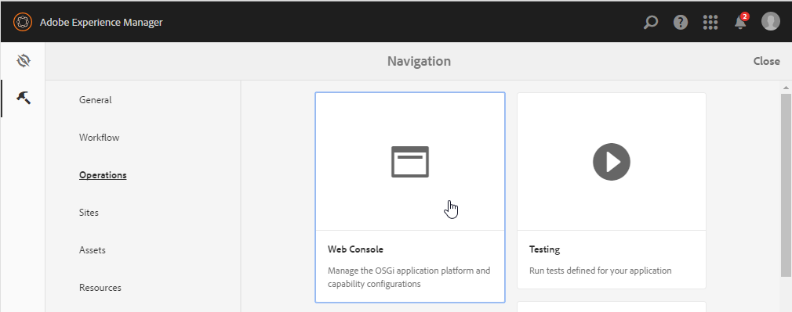

# Bevilja regelredigeraråtkomst för valda användargrupper {#grant-rule-editor-access-to-select-user-groups}

## Ökning {#overview}

Det finns olika typer av användare med olika kunskaper som fungerar med Adaptive Forms. Expertanvändare kan ha rätt kunskaper för att arbeta med skript och komplexa regler, men det kan finnas grundläggande användare som bara behöver arbeta med layout och grundläggande egenskaper i Adaptive Forms.

Med [!DNL Experience Manager Forms] kan du begränsa regelredigeringsåtkomst för användare baserat på deras roll eller funktion. I inställningarna för den adaptiva Forms-konfigurationstjänsten kan du ange de [användargrupper](forms-groups-privileges-tasks.md) som kan visa och komma åt regelredigeraren.

## Ange användargrupper som kan komma åt regelredigeraren {#specify-user-groups-that-can-access-rule-editor}

1. Logga in på [!DNL Experience Manager Forms] som administratör.
1. Klicka på Adobe Experience Manager > Verktyg  > **[!UICONTROL Operations]** > **[!UICONTROL Web Console]** i författarinstansen. Webbkonsolen öppnas i ett nytt fönster.

   

1. Leta upp och klicka på **[!UICONTROL Adaptive Form Configuration Service]** i fönstret [!UICONTROL Web Console]. Dialogrutan **[!UICONTROL Adaptive Form Configuration Service]** visas. Ändra inga värden och klicka på **[!UICONTROL Save]**.

   Den skapar filen `/apps/system/config/com.adobe.aemds.guide.service.impl.AdaptiveFormConfigurationServiceImpl.config` i CRX-databasen.

1. Logga in på CRXDE som administratör. Öppna filen `/apps/system/config/com.adobe.aemds.guide.service.impl.AdaptiveFormConfigurationServiceImpl.config` för redigering.
1. Använd följande egenskap för att ange namnet på en grupp som kan komma åt regelredigeraren (till exempel RuleEditorsUserGroup) och klicka på **[!UICONTROL Save All]**.

   `af.ruleeditor.custom.groups=["RuleEditorsUserGroup"]`

   Om du vill aktivera åtkomst för flera grupper anger du en lista med kommaseparerade värden:

   `af.ruleeditor.custom.groups=["RuleEditorsUserGroup", "PermittedUserGroup"]`

   

   När nu en användare som inte är en del av den angivna användargruppen (här    `RuleEditorsUserGroup`) trycker på ett fält och ikonen Redigera regel ( ) är inte tillgänglig i komponentverktygsfältet:

   

   Komponentverktygsfältet så som det visas för en användare med åtkomst till regelredigeraren:

   

   Komponentverktygsfältet så synligt som det är för en användare utan regelredigeringsåtkomst

   Instruktioner om hur du lägger till användare i grupper finns i [Användaradministration och -säkerhet](https://experienceleague.adobe.com/docs/experience-manager-65/administering/security/security.html).

