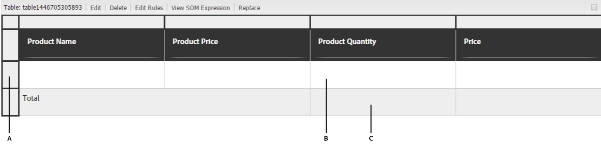

# Olika användningsområden för regelredigeraren

Artikeln innehåller detaljerade exempel på en regelredigerare för ett adaptivt formulär baserat på kärnkomponenter och ger insikter i hur det implementeras för olika scenarier. Regelredigeraren låter utvecklare definiera och hantera logiken som styr formulärens beteende.
Låt oss nu diskutera olika implementeringar för en regelredigerare.

## Ange fokus till en annan panel vid knappklickning om den första panelen är giltig

 Den här funktionen är en förhandsversion och kan nås via vår [förhandsutgåva](https://experienceleague.adobe.com/docs/experience-manager-cloud-service/content/release-notes/prerelease.html#new-features). 

Med regelredigeraren kan du validera en panellayout, t.ex. Vågräta flikar, Lodräta flikar, Dragspel eller Guiden när du klickar på en knapp och ställer in fokus på ett formulärobjekt i en annan panel. Du kan använda den här funktionen för att förbättra formulärnavigeringen och användarupplevelsen.

Föreställ dig ett flerstegsansökningsformulär med en guidelayout. Du måste slutföra panelen `Personal Information` innan du går till `Employment Details`. När du klickar på knappen `Next` validerar regelredigeraren panelen `Personal Information`. Om alla obligatoriska fält är korrekt ifyllda flyttas fokus automatiskt till panelen `Employment Details`. I annat fall visas ett felmeddelande där användaren uppmanas att fylla i de saknade fälten.

Du kan skapa en regel på knappen `Next` för att validera den första panelen:

{width=50%}

När du klickar på knappen **Nästa** valideras panelen **Personlig information** . Om den angivna informationen är korrekt flyttas fokus till panelen **Kontosäkerhet**. I annat fall uppmanas du att fylla i den saknade informationen i ett felmeddelande.

<!---->

## Navigera mellan paneler med knappen

Med regelredigeraren kan du lägga till navigeringsknappar i panellayouterna, till exempel Vågräta flikar, Lodräta flikar, Dragspel eller Guide. De här knapparna förbättrar användarupplevelsen genom att förenkla övergångar mellan olika paneler i ett formulär och växlar fokus till den valda panelen.

Tänk dig att du interagerar med profilinställningsavsnittet i ett program, där navigeringen underlättas av knappar i stället för flikar. När du anger profilinställningarna från huvudinstrumentpanelen visas en serie paneler som är dedikerade till olika aspekter av deras profil: **Personlig information**, **Kontosäkerhet** och **Meddelandeinställningar**.

Varje panel innehåller relevanta fält och alternativ för att uppdatera specifik information. Navigeringsknappar, som `Next` och `Back`, är väl placerade så att du kan flytta mellan de här panelerna. Klicka på `Next` om du vill flytta användaren till panelen **Kontosäkerhet** och klicka på `Back` om du vill gå tillbaka till panelen **Personlig information**. Den här navigeringsmetoden ger en smidig övergång mellan sektioner utan att tappa sammanhanget, vilket ger en smidig och intuitiv användarupplevelse. Med navigeringsknappar blir det enklare att hantera profilinställningar, vilket gör interaktionen mer organiserad och användarvänlig.

Du kan använda regeln `Navigate among the panels` för att skapa navigeringsregler för knappar som tillåter växling mellan olika paneler.  Markera attributet `Shift focus to the next item` om du vill flytta fokus till nästa panel i layouten.

{width=50%}

När du klickar på knappen `Next` flyttas fokus till efterföljande panel i layouten.

På samma sätt kan du skapa en regel för knappen `Previous` så att fokus flyttas till föregående panel.

{width=50%}

## Effektivisera komplexa beräkningar i repeterbara paneler med funktioner

Med regelredigeraren kan du använda färdiga funktioner som Summa, Min, Max och Förena direkt i fält i upprepningsbara paneler. Du kan också skicka ett upprepningsbart panelfältvärde till funktionen som accepterar talmatris, strängmatris, boolesk matris osv. Detta frigör kraftfull automatisering så att ni kan implementera komplex affärslogik utan anpassad kod.

Tänk dig ett formulär med en upprepningsbar panel där varje panelinstans samlar in information om det deklarerade värdet för resurser.

Du kan använda funktionen `Sum` för att automatiskt beräkna det totala tillgångsvärdet för alla paneler, vilket eliminerar behovet av manuella beräkningar och minskar risken för fel.

När du fyller i ett formulär och lägger till instanser för att deklarera resursvärdena, beräknar knappen `Calculate Asset Value` den totala summan av alla deklarerade resursvärden och visar resultatet i textrutan `assetvalue`.

>[!NOTE]
>
> Om värdet för det repeterbara panelfältet skickas till en funktion som inte accepterar en array, skickas fältvärdet från den sista instansen av den repeterbara panelen till funktionen.

Detta är bara ett exempel! Utforska de tillgängliga [funktionerna](#b-form-objects-and-functions-br) för att förenkla arbetsflöden och förbättra datakvaliteten i formulären.

## Kapslade uttryck {#nestedexpressions}

Med regelredigeraren kan du använda flera AND- och OR-operatorer för att skapa kapslade regler. Du kan blanda flera AND- och OR-operatorer i reglerna.

Följande är ett exempel på en kapslad regel som visar ett meddelande till användaren om rätt till vårdnad om ett barn när de obligatoriska villkoren är uppfyllda.

Du kan också redigera genom att dra och släppa villkor i en regel. Markera och hovra över handtaget ( ) före ett villkor. När pekaren ändras till en handsymbol enligt nedan drar och släpper du villkoret någonstans i linjen. Regelstrukturen ändras.

## Villkor för datumuttryck {#dateexpression}

Med regelredigeraren kan du använda datumjämförelser för att skapa villkor.

Följande är ett exempelvillkor som visar ett statiskt textobjekt om inteckningen på huset redan har tagits, vilket användaren anger genom att fylla i datumfältet.

När datumet för inteckningen av egendomen som fyllts i av användaren har inträffat visas en anteckning om inkomstberäkningen i det adaptiva formuläret. I följande regel jämförs det datum som användaren fyller i med det aktuella datumet och om det datum som användaren fyller i är tidigare än det aktuella datumet visas textmeddelandet (Inkommande) i formuläret.

När det ifyllda datumet infaller tidigare än det aktuella datumet visas textmeddelandet (intäkt) enligt följande:

## Nummerjämförelsevillkor {#number-comparison-conditions}

Med regelredigeraren kan du skapa villkor som jämför två tal.

Följande är ett exempelvillkor som visar ett statiskt textobjekt om antalet månader en sökande stannar på den aktuella adressen är mindre än 36.

När användaren anger att han/hon bor på den aktuella bostadsadressen i mindre än 36 månader visas ett meddelande i formuläret om att det går att begära fler bosättningsbevis.

<!-- ## Impact of rule editor on existing scripts {#impact-of-rule-editor-on-existing-scripts}

In [!DNL Experience Manager Forms] versions prior to [!DNL Experience Manager 6.1 Forms] feature pack 1, form authors and developers used to write expressions in the Scripts tab of the Edit component dialog to add dynamic behavior to Adaptive Forms. The Scripts tab is now replaced by the rule editor.

Any scripts or expressions that you must have written in the Scripts tab are available in the rule editor. While you cannot view or edit them in visual editor, if you are a part of the forms-power-users group you can edit scripts in code editor. -->

### Anropa tjänsten Formulärdatamodell {#invoke}

Överväg en webbtjänst `GetInterestRates` som tar lånebelopp, löptid och sökandens kreditpoäng som indata och returnerar en låneplan som inkluderar EMI-belopp och ränta. Du skapar en formulärdatamodell (FDM) med webbtjänsten som datakälla. Du lägger till datamodellsobjekt och en `get`-tjänst i formulärmodellen. Tjänsten visas på fliken Tjänster i formulärdatamodellen (FDM). Skapa sedan ett adaptivt formulär som innehåller fält från datamodellsobjekt för att samla in användarindata för lånebelopp, löptid och kreditpoäng. Lägg till en knapp som utlöser webbtjänsten för att hämta planinformation. Utdata fylls i i lämpliga fält.

Följande regel visar hur du konfigurerar åtgärden Anropa tjänst för att slutföra exempelscenariot.

>[!NOTE]
>
>Om indata är av arraytyp visas fälten som stöder arrayer i den nedrullningsbara utdatafältet.

### Utlösa flera åtgärder med hjälp av regeln När {#triggering-multiple-actions-using-the-when-rule}

I en låneansökan vill du ta reda på om lånesökanden är en befintlig kund eller inte. Utifrån informationen som användaren anger bör fältet för kund-ID visas eller döljas. Du vill också fokusera på fältet för kund-ID om användaren är en befintlig kund. Formuläret för låneansökan innehåller följande komponenter:

* En alternativknapp, **[!UICONTROL Are you an existing Geometrixx customer?]**, som innehåller alternativ för [!UICONTROL Yes] och [!UICONTROL No]. Värdet för Ja är **0** och Nej är **1**.

* Ett textfält, **[!UICONTROL Geometrixx customer ID]**, som anger kund-ID:t.

När du skriver en When-regel på alternativknappen för att implementera det här beteendet, visas regeln på följande sätt i den visuella regelredigeraren.

I exempelregeln är programsatsen i avsnittet När villkoret, som när returnerar True, utför de åtgärder som anges i avsnittet Sedan.

<!-- The rule appears as follows in the code editor.

 

Rule in the code editor -->

### Använda ett funktionsutdata i en regel {#using-a-function-output-in-a-rule}

I ett inköpsorderformulär har du följande tabell där användarna fyller i sina order. I denna tabell:

* Den första raden är upprepningsbar, så användarna kan beställa flera produkter och ange olika kvantiteter. Dess elementnamn är `Row1`.
* Titeln på cellen i kolumnen Produktkvantitet på den repeterbara raden är Kvantitet. Elementnamnet för cellen är `productquantity`.
* Den andra raden i tabellen är inte repeterbar och cellens rubrik i kolumnen Produktkvantitet i den här raden är Total Quantity.

**A.** Rad1 **B.** Kvantitet **C.** Totalt antal

Nu vill du lägga till angivna kvantiteter i kolumnen Produktkvantitet för alla produkter och visa summan i cellen Total kvantitet. Du kan uppnå den här summan genom att skriva en Set Value Of-regel i cellen Total Quantity enligt nedan.

### Validera ett fältvärde med uttryck {#validating-a-field-value-using-expression}

I inköpsorderformuläret som förklaras i föregående exempel vill du hindra användaren från att beställa mer än en kvantitet av en produkt till ett pris som överstiger 10000. Du kan skriva en valideringsregel enligt nedan.

## Se även

{{see-also-rule-editor}}
