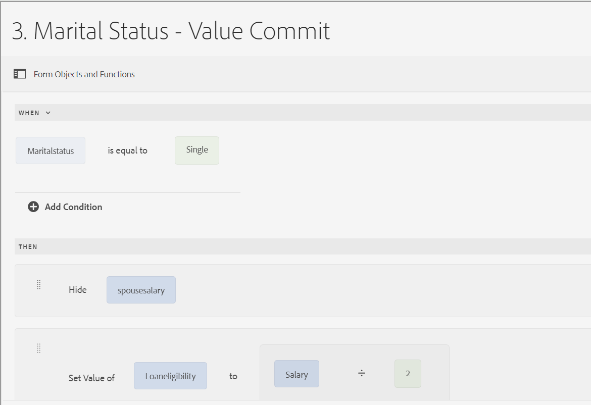
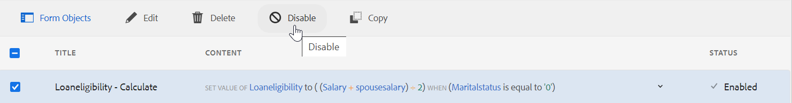

# Regelredigerarens användargränssnitt för adaptiv Forms baserat på kärnkomponenter

Regelredigerarens användargränssnitt för Adaptiv Forms baserat på kärnkomponenter förbättrar formulärskapandet i Adobe Experience Manager (AEM). Det ger både företagsanvändare och utvecklare möjlighet att implementera dynamiskt beteende och komplex logik i formulär genom att skriva regler som utlöser åtgärder baserat på fördefinierade villkor, användarindata och interaktioner. Den här funktionen stöder moderna JavaScript-funktioner upp till ES2022 och erbjuder en intuitiv visuell redigerare som förenklar skrivprocessen.
Regelredigeraren effektiviserar ifyllandet av formulär och ser till att det är både korrekt och effektivt. Det gör det möjligt att validera eller återställa paneler och formulär och att köra anpassade funktioner för att beräkna värden för formulärobjekt. Regelredigerarens användargränssnitt, som har stöd för kapslade villkor och möjlighet att anropa Form Data Model-tjänster, är en central komponent för att skapa responsiva, användarvänliga och anpassningsbara formulär.

## Förstå användargränssnittet för regelredigeraren {#understanding-the-rule-editor-user-interface}

Regelredigeraren har ett omfattande men ändå enkelt användargränssnitt för att skriva och hantera regler. Du kan starta regelredigerarens användargränssnitt i ett adaptivt formulär i redigeringsläge.

Så här startar du användargränssnittet för regelredigeraren:

1. Öppna ett adaptivt formulär i redigeringsläge.
1. Markera det formulärobjekt som du vill skriva en regel för och välj  i komponentverktygsfältet. Användargränssnittet för regelredigeraren visas.

   

   Alla befintliga regler för de markerade formulärobjekten visas i den här vyn. Mer information om hur du hanterar befintliga regler finns i [Hantera regler](rule-editor.md#p-manage-rules-p).

1. Välj **[!UICONTROL Create]** om du vill skriva en ny regel. Den visuella redigeraren för regelredigerarens användargränssnitt öppnas som standard när du startar regelredigeraren första gången.

   

Vi tittar närmare på varje komponent i regelredigeringsgränssnittet.

### A. Visning av komponentregel {#a-component-rule-display}

Visar titeln på det adaptiva formulärobjektet genom vilket du startade regelredigeraren och den regeltyp som är vald. I ovanstående exempel startas regelredigeraren från ett adaptivt formulärobjekt med namnet Fråga 1 och den valda regeltypen är När.

### B. Formulärobjekt och -funktioner {#b-form-objects-and-functions-br}

Panelen till vänster i regelredigerarens användargränssnitt innehåller två flikar - **[!UICONTROL Forms Objects]** och **[!UICONTROL Functions]**.

På fliken Formulärobjekt visas en hierarkisk vy över alla objekt som finns i det adaptiva formuläret. Där visas objektens namn och typ. När du skriver en regel kan du dra och släppa formulärobjekt till regelredigeraren. När du skapar eller redigerar en regel när du drar och släpper ett objekt eller en funktion till en platshållare, får platshållaren automatiskt rätt värdetyp.

De formulärobjekt som har en eller flera giltiga regler markerade med en grön punkt. Om någon av reglerna som tillämpas på ett formulärobjekt är ogiltig markeras formulärobjektet med en gul punkt.

Fliken Funktioner innehåller en uppsättning inbyggda funktioner, till exempel summan av, Min av, Max av, Medel av, Antal, och Validera formulär. Du kan använda de här funktionerna för att beräkna värden i repeterbara paneler och tabellrader och använda dem i action- och condition-satser när du skriver regler. Du kan emellertid också skapa anpassade funktioner.

En del av listan med funktioner visas i figuren:


>[!NOTE]
>
>Du kan utföra textsökning på objekt och funktionsnamn och titlar på flikarna Forms Objekt och Funktioner.

I det vänstra trädet för formulärobjekten kan du markera de formulärobjekt som ska visa de regler som tillämpas på vart och ett av objekten. Du kan inte bara navigera bland reglerna för de olika formulärobjekten, du kan även kopiera och klistra in regler mellan formulärobjekten. Mer information finns i [Kopiera och klistra in regler](rule-editor.md#p-copy-paste-rules-p).

### C. Växla mellan formulärobjekt och funktioner {#c-form-objects-and-functions-toggle-br}

När användaren knackar på knappen växlar knappen formulärobjekt och funktionsruta.

### D. Visuell regelredigerare {#visual-rule-editor}

Visuell regelredigerare är det område i det visuella redigeringsläget i regelredigerarens användargränssnitt där du skriver regler. Här kan du välja en regeltyp och definiera villkor och åtgärder. När du definierar villkor och åtgärder i en regel kan du dra och släppa formulärobjekt och funktioner från rutan Formulärobjekt och funktioner.

Mer information om hur du använder en visuell regelredigerare finns i [Skriv regler](rule-editor.md#p-write-rules-p).
<!-- 
### E. Visual-code editors switcher {#e-visual-code-editors-switcher}

Users in the forms-power-users group can access code editor. For other users, code editor is not available. If you have the rights, you can switch from visual editor mode to code editor mode of the rule editor, and conversely, using the switcher right above the rule editor. When you launch rule editor the first time, it opens in the visual editor mode. You can write rules in the visual editor mode or switch to the code editor mode to write a rule script. However, note that if you modify a rule or write a rule in code editor, you cannot switch back to the visual editor for that rule unless you clear the code editor.

[!DNL Experience Manager Forms] tracks the rule editor mode you used last to write a rule. When you launch the rule editor next time, it opens in that mode. However, you can also configure a default mode to open the rule editor in the specified mode. To do so:

1. Go to [!DNL Experience Manager] web console at `https://[host]:[port]/system/console/configMgr`.
1. Click to edit **[!UICONTROL Adaptive Form Configuration Service]**.
1. choose **[!UICONTROL Visual Editor]** or **[!UICONTROL Code Editor]** from the **[!UICONTROL Default Mode for Rule Editor]** drop-down

1. Click **[!UICONTROL Save]**.
-->

### E. Knapparna Klar och Avbryt {#done-and-cancel-buttons}

Knappen **[!UICONTROL Done]** används för att spara en regel. Du kan spara en ofullständig regel. Ofullständiga är dock ogiltiga och kan inte köras. Sparade regler för ett formulärobjekt visas nästa gång du startar regelredigeraren från samma formulärobjekt. Du kan hantera befintliga regler i den vyn. Mer information finns i [Hantera regler](rule-editor.md#p-manage-rules-p).

Knappen **[!UICONTROL Cancel]** ignorerar alla ändringar som du har gjort i en regel och stänger regelredigeraren.

## Skriv regler {#write-rules}

Du kan skriva regler med den visuella regelredigeraren <!-- or the code editor. When you launch the rule editor the first time, it opens in the visual editor mode. You can switch to the code editor mode and write rules. However, if you write or modify a rule in code editor, you cannot switch to the visual editor for that rule unless you clear the code editor. When you launch the rule editor next time, it opens in the mode that you used last to create rule. -->

Låt oss först se hur man skriver regler med en visuell redigerare.

+++ Använder den visuella redigeraren {#using-visual-editor}

Låt oss förstå hur du skapar en regel i en visuell redigerare med hjälp av följande exempelformulär.


I avsnittet Krav för lån i exempelformuläret för låneansökan måste de sökande ange sin äktenskapsstatus, lön och, om de är gifta, sin makas lön. Baserat på användarens indata beräknar regeln beloppet för rätt till lån och visas i fältet Låneberättigande. Använd följande regler för att implementera scenariot:

* Fältet för makens lön visas endast när äktenskapsstatus är gift.
* Låneberättigandebeloppet är 50 % av den totala lönen.

Så här skriver du regler:

1. Först skriver du regeln för att styra synligheten för fältet för makslön baserat på det alternativ som användaren väljer för alternativknappen för civilstånd.

   Öppna låneansökningsformuläret i redigeringsläge. Markera komponenten **[!UICONTROL Marital Status]** och välj . Välj sedan **[!UICONTROL Create]** för att starta regelredigeraren.

   

   När du startar regelredigeraren markeras regeln När som standard. Dessutom anges formulärobjektet (i det här fallet Marital status) från vilket du startade regelredigeraren i programsatsen When.

   Du kan inte ändra eller ändra det markerade objektet, men du kan välja en annan regeltyp med hjälp av den nedrullningsbara menyn. Om du vill skapa en regel för ett annat objekt väljer du Avbryt om du vill avsluta regelredigeraren och starta den igen från det önskade formulärobjektet.

1. Välj listrutan **[!UICONTROL Select State]** och välj **[!UICONTROL is equal to]**. Fältet **[!UICONTROL Enter a String]** visas.

   

1. I fältet **[!UICONTROL Enter a String]** i regeln väljer du **Gift** i listrutan.

   

   Du har definierat villkoret som `When Marital Status is equal to Married`. Definiera sedan åtgärden som ska utföras om villkoret är sant.

1. Välj **[!UICONTROL Show]** i listrutan **[!UICONTROL Select Action]** i programsatsen then.

   

1. Dra och släpp fältet **[!UICONTROL Spouse Salary]** från fliken Formulärobjekt i fältet **[!UICONTROL Drop object or select here]**. Du kan också markera fältet **[!UICONTROL Drop object or select here]** och välja fältet **[!UICONTROL Spouse Salary]** på snabbmenyn, där alla formulärobjekt i formuläret listas.

   

   Definiera sedan åtgärden som ska utföras om villkoret är Falskt.
1. Klicka på **[!UICONTROL Add Else Section]** om du vill lägga till ytterligare ett villkor för fältet **[!UICONTROL Spouse Salary]** om du väljer Marital status som enskilt.

   


1. Välj **[!UICONTROL Hide]** i listrutan **[!UICONTROL Select Action]** i Else-satsen.
   

1. Dra och släpp fältet **[!UICONTROL Spouse Salary]** från fliken Formulärobjekt i fältet **[!UICONTROL Drop object or select here]**. Du kan också markera fältet **[!UICONTROL Drop object or select here]** och välja fältet **[!UICONTROL Spouse Salary]** på snabbmenyn, där alla formulärobjekt i formuläret listas.
   

   Regeln visas så här i regelredigeraren.

   

1. Välj **[!UICONTROL Done]** om du vill spara regeln.

<!--
1. Repeat steps 1 through 5 to define another rule to hide the Spouse Salary field if the marital Status is Single. The rule appears as follows in the rule editor.

    -->

>[!NOTE]
>
> Du kan också skriva en Visa-regel i fältet för makarens lön, i stället för en När-regel i fältet för civilstånd, för att implementera samma beteende.


1. Skriv sedan en regel för att beräkna lånebeloppet, som är 50 % av den totala lönen, och visa det i fältet Låneberättigande. För att uppnå det här resultatet skapar du **[!UICONTROL Set value Of]** regler för fältet Lånekvalificering.

   I redigeringsläget markerar du fältet **[!UICONTROL Loan Eligibility]** och väljer . Välj sedan **[!UICONTROL Create]** för att starta regelredigeraren.

1. Välj **[!UICONTROL Set Value Of]**-regel i listrutan Regel.

   

1. Välj **[!UICONTROL Select Option]** och välj **[!UICONTROL Mathematical Expression]**. Ett fält som skriver matematiskt uttryck öppnas.

   

1. I uttrycksfältet:

   * Markera eller dra och släpp fältet **[!UICONTROL Salary]** i det första **[!UICONTROL Drop object or select here]**-fältet på fliken Forms-objekt.

   * Välj **[!UICONTROL Plus]** i fältet **[!UICONTROL Select Operator]**.

   * Markera eller dra och släpp fältet **[!UICONTROL Spouse Salary]** i det andra **[!UICONTROL Drop object or select here]**-fältet på fliken Forms-objekt.

   

1. Välj sedan **[!UICONTROL Extend Expression]** i det markerade området runt uttrycksfältet.

   

   I fältet för utökat uttryck väljer du **[!UICONTROL divided by]** i fältet **[!UICONTROL Select Operator]** och **[!UICONTROL Number]** i fältet **[!UICONTROL Select Option]**. Ange sedan **[!UICONTROL 2]** i nummerfältet.

   

   >[!NOTE]
   >
   >Du kan skapa komplexa uttryck med hjälp av komponenter, funktioner, matematiska uttryck och egenskapsvärden i fältet Välj alternativ.

   Skapa sedan ett villkor som körs när true returneras.

1. Välj **[!UICONTROL Add Condition]** om du vill lägga till en When-sats.

   

   I programsatsen When:

   * Markera eller dra och släpp fältet **[!UICONTROL Marital Status]** i det första **[!UICONTROL Drop object or select here]**-fältet på fliken Forms-objekt.

   * Välj **[!UICONTROL is equal to]** i fältet **[!UICONTROL Select Operator]**.

   * Välj String i det andra **[!UICONTROL Drop object or select here]**-fältet och ange **[!UICONTROL Married]** i **[!UICONTROL Enter a String]**-fältet.

   Regeln visas slutligen så här i regelredigeraren.  

1. Välj **[!UICONTROL Done]**. Den sparar regeln.

1. Upprepa steg 7 till 14 för att definiera en annan regel som beräknar låneberättigandet om civilstånd är enkel. Regeln visas så här i regelredigeraren.

   

Du kan också använda regeln Ange värde för för för att beräkna låneberättigandet i regeln När som du skapade för att visa och dölja fältet Makslön. Den resulterande kombinerade regeln när Marital status är enkel visas så här i regelredigeraren.



Du kan skriva en kombinerad regel för att kontrollera synligheten för fältet för makarnas lön och beräkna rätten till lån när civilstånd gifta sig med villkoret Annars.


+++

### Hantera trasiga regler

Regler kan ibland brytas om ett refererat fält flyttas eller tas bort. När detta inträffar markerar Regelredigeraren den påverkade regeln med en röd punktindikator.

* När ett fält flyttas (till exempel från en panel till en annan) kan den kopplade regeln brytas. I det här fallet öppnar du regeln och sparar den igen. Regeln återställs automatiskt.

* När ett fält tas bort kan regeln inte repareras.

  För att förstå problemet, för muspekaren över regelstatusen i regelredigeraren för att visa felmeddelandet.

  

<!-- ### Using code editor {#using-code-editor}

Users added to the forms-power-users group can use code editor. The rule editor auto generates the JavaScript code for any rule you create using visual editor. You can switch from visual editor to the code editor to view the generated code. However, if you modify the rule code in the code editor, you cannot switch back to the visual editor. If you prefer writing rules in code editor rather than visual editor, you can write rules afresh in the code editor. The visual-code editors switcher helps you switch between the two modes.

The code editor JavaScript is the expression language of Adaptive Forms. All the expressions are valid JavaScript expressions and use Adaptive Forms scripting model APIs. These expressions return values of certain types. For the complete list of Adaptive Forms classes, events, objects, and public APIs, see [JavaScript Library API reference for Adaptive Forms](https://helpx.adobe.com/experience-manager/6-5/forms/javascript-api/index.html).

For more information about guidelines to write rules in the code editor, see [Adaptive Form Expressions](adaptive-form-expressions.md).

While writing JavaScript code in the rule editor, the following visual cues help you with the structure and syntax:

* Syntax highlights

* Auto Indentation

* Hints and suggestions for Form objects, functions, and their properties

* Auto completion of form component names and common JavaScript functions


-->

### Anpassade funktioner i regelredigeraren {#custom-functions}

Förutom de användningsklara funktionerna, som *Summan av*, som listas under **Funktioner, utdata**, kan du även använda anpassade funktioner i regelredigeraren. Regelredigeraren stöder JavaScript ECMAScript 2019-syntax för skript och anpassade funktioner. Instruktioner om hur du skapar anpassade funktioner finns i artikeln [Anpassade funktioner i Adaptiv Forms](/help/forms/create-and-use-custom-functions.md).

<!--

Ensure that the function you write is accompanied by the `jsdoc` above it. Adaptive Form supports the various [JavaScript annotations for custom functions](/help/forms/create-and-use-custom-functions.md#js-annotations).

For more information, see [jsdoc.app](https://jsdoc.app/).

Accompanying `jsdoc` is required:

* If you want custom configuration and description
* Because there are multiple ways to declare a function in `JavaScript,` and comments let you keep a track of the functions.

Supported `jsdoc` tags:

* **Private**
  Syntax: `@private`
  A private function is not included as a custom function.

* **Name**
  Syntax: `@name funcName <Function Name>`
  Alternatively `,` you can use: `@function funcName <Function Name>` **or** `@func` `funcName <Function Name>`.
  `funcName` is the name of the function (no spaces allowed).
  `<Function Name>` is the display name of the function.

* **Parameter**
  Syntax: `@param {type} name <Parameter Description>`
  Alternatively, you can use: `@argument` `{type} name <Parameter Description>` **or** `@arg` `{type}` `name <Parameter Description>`.
  Shows parameters used by the function. A function can have multiple parameter tags, one tag for each parameter in the order of occurrence.
  `{type}` represents parameter type. Allowed parameter types are:

    1. string
    2. number
    3. boolean
    4. scope
    5. string[]
    6. number[]
    7. boolean[]
    8. date
    9. date[]
    10. array
    11. object

   `scope` refers to a special globals object which is provided by forms runtime. It must be the last parameter and is not be visible to the user in the rule editor. You can use scope to access readable form and field proxy object to read properties, event which triggered the rule and a set of functions to manipulate the form.

   `object` type is used to pass readable field object in parameter to a custom function instead of passing the value.

   All parameter types are categorized under one of the above. None is not supported. Ensure that you select one of the types above. Types are not case-sensitive. Spaces are not allowed in the parameter name.  Parameter description can have multiple words.

* **Optional Parameter**
Syntax: `@param {type=} name <Parameter Description>` 
Alternatively, you can use: `@param {type} [name] <Parameter Description>`
By default all parameters are mandatory. You can mark a parameter optional by adding `=` in type of the parameter or by putting param name in square brackets.
   
   For example, let us declare `Input1` as optional parameter:
    * `@param {type=} Input1`
    * `@param {type} [Input1]`

* **Return Type**
  Syntax: `@return {type}`
  Alternatively, you can use `@returns {type}`.
  Adds information about the function, such as its objective.
  {type} represents the return type of the function. Allowed return types are:

    1. string
    2. number
    3. boolean
    4. string[]
    5. number[]
    6. boolean[]
    7. date
    8. date[]
    9. array
    10. object

  All other return types are categorized under one of the above. None is not supported. Ensure that you select one of the types above. Return types are not case-sensitive.

**Adding a custom function**

For example, you want to add a custom function which calculates area of a square. Side length is the user input to the custom function, which is accepted using a numeric box in your form. The calculated output is displayed in another numeric box in your form. To add a custom function, you have to first create a client library, and then add it to the CRX repository.

To create a client library and add it in the CRX repository, perform the following steps:

1. Create a client library. For more information, see [Using Client-Side Libraries](https://experienceleague.adobe.com/docs/experience-manager-cloud-service/implementing/developing/full-stack/clientlibs.html#developing).
2. In CRXDE, add a property `categories`with string type value as `customfunction` to the `clientlib` folder.

   >[!NOTE]
   >
   >`customfunction`is an example category. You can choose any name for the category you create in the `clientlib`folder.

After you have added your client library in the CRX repository, use it in your Adaptive Form. It lets you use your custom function as a rule in your form. To add the client library in your Adaptive Form, perform the following steps:

1. Open your form in edit mode.
   To open a form in edit mode, select a form and select **[!UICONTROL Open]**.
1. In the edit mode, select a component, then select  &gt; **[!UICONTROL Adaptive Form Container]**, and then select .
1. In the sidebar, under Name of Client Library, add your client library. ( `customfunction` in the example.)

   

1. Select the input numeric box, and select  to open the rule editor.
1. Select **[!UICONTROL Create Rule]**. Using options shown below, create a rule to save the squared value of the input in the Output field of your form.

   [](assets/add-custom-rule.png)
  
1. Select **[!UICONTROL Done]**. Your custom function is added.

   >[!NOTE]
   >
   > To invoke a form data model from rule editor using custom functions, [see here](/help/forms/using-form-data-model.md#invoke-services-in-adaptive-forms-using-rules-invoke-services). 

#### Function declaration supported types {#function-declaration-supported-types}

**Function Statement**

```javascript
function area(len) {
    return len*len;
}
```

This function is included without `jsdoc` comments.

**Function Expression**

```javascript
var area;
//Some codes later
/** */
area = function(len) {
    return len*len;
};
```

**Function Expression and Statement**

```javascript
var b={};
/** */
b.area = function(len) {
    return len*len;
}
```

**Function Declaration as Variable**

```javascript
/** */
var x1,
    area = function(len) {
        return len*len;
    },
    x2 =5, x3 =true;
```

Limitation: custom function picks only the first function declaration from the variable list, if together. You can use function expression for every function declared.

**Function Declaration as Object**

```javascript
var c = {
    b : {
        /** */
        area : function(len) {
            return len*len;
        }
    }
};
```

>[!NOTE]
>
>Ensure that you use `jsdoc` for every custom function. Although `jsdoc`comments are encouraged, include an empty `jsdoc`comment to mark your function as custom function. It enables default handling of your custom function.
-->

## Hantera regler {#manage-rules}

Alla befintliga regler för ett formulärobjekt visas när du markerar objektet och väljer . Du kan visa titeln och förhandsgranska regelsammanfattningen. I användargränssnittet kan du dessutom expandera och visa hela regelsammanfattningen, ändra ordningen på regler, redigera regler och ta bort regler.


Du kan utföra följande åtgärder på reglerna:

* **Utöka/komprimera**: Innehållskolumnen i regellistan visar regelinnehållet. Om hela regelinnehållet inte visas i standardvyn kan du expandera innehållet  genom att markera det.

* **Ändra ordning**: Alla nya regler som du skapar staplas längst ned i regellistan. Reglerna körs uppifrån och ned. Regeln längst upp körs först följt av andra regler av samma typ. Om du till exempel har reglerna When, Show, Enable och When vid den första, andra, tredje respektive fjärde positionen uppifrån, kommer regeln When överst att köras först följt av regeln When vid den fjärde positionen. Sedan körs reglerna Visa och Aktivera.
Du kan ändra ordningen på en regel genom att trycka på  mot den eller dra och släppa den i önskad ordning i listan.

* **Redigera**: Om du vill redigera en regel markerar du kryssrutan bredvid regeltiteln. Alternativ för att redigera och ta bort regeln visas. Välj **[!UICONTROL Edit]** om du vill öppna den valda regeln i regelredigeraren.

* **Ta bort**: Om du vill ta bort en regel markerar du regeln och väljer **[!UICONTROL Delete]**.

* **Aktivera/inaktivera**: När du tillfälligt måste inaktivera användningen av en regel kan du välja en eller flera regler och välja **[!UICONTROL Disable]** i verktygsfältet Åtgärder för att inaktivera dem. Om en regel är inaktiverad körs den inte vid körningen. Om du vill aktivera en inaktiverad regel kan du markera den och välja Aktivera i verktygsfältet Åtgärder. Statuskolumnen för regeln visar om regeln är aktiverad eller inaktiverad.



## Kopiera och klistra in regler {#copy-paste-rules}

Du kan kopiera och klistra in en regel från ett fält till andra liknande fält för att spara tid.

Så här kopierar och klistrar du in regler:

1. Markera det formulärobjekt som du vill kopiera en regel från och välj  i komponentverktygsfältet. Användargränssnittet för regelredigeraren visas med formulärobjektet markerat och de befintliga reglerna visas.

   

   Mer information om hur du hanterar befintliga regler finns i [Hantera regler](rule-editor.md#p-manage-rules-p).

1. Markera kryssrutan bredvid regeltiteln. Då visas alternativ för att hantera regeln. Välj **[!UICONTROL Copy]**.

   

1. Markera ett annat formulärobjekt som du vill klistra in regeln i och välj **[!UICONTROL Paste]**. Dessutom kan du redigera regeln för att göra ändringar i den.

   >[!NOTE]
   >
   >Du kan bara klistra in en regel i ett annat formulärobjekt om det formulärobjektet har stöd för den kopierade regelns händelse. En knapp stöder till exempel händelsen click. Du kan klistra in en regel med en klickningshändelse på en knapp, men inte i en kryssruta.

1. Välj **[!UICONTROL Done]** om du vill spara regeln.

## Nästa steg

Mer information om de olika operatortyperna och händelserna i regelredigeraren för ett adaptivt formulär finns i artikeln [Tillgängliga operatortyper och händelser i regelredigeraren för ett adaptivt formulär](/help/forms/rule-editor-core-components-events-operators.md) .


## Se även

{{see-also-rule-editor}}
