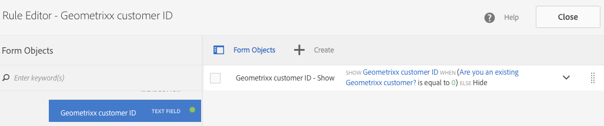
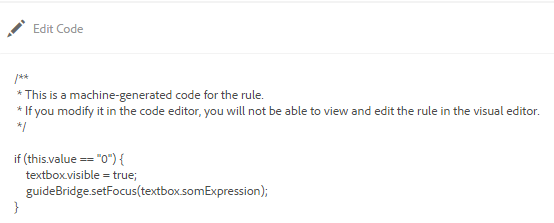

# Lägga till regler i ett adaptivt formulär (kärnkomponenter) {#adaptive-forms-rule-editor}

Regelredigerarfunktionen ger formuläranvändare och utvecklare möjlighet att skriva regler på adaptiva formulärobjekt. Dessa regler definierar åtgärder som ska utlösas av formulärobjekt baserat på förinställda villkor, användarindata och användaråtgärder i formuläret. Det effektiviserar formulärifyllningen ytterligare och ger större precision och snabbhet.

Regelredigeraren har ett intuitivt och förenklat användargränssnitt för att skriva regler. Regelredigeraren erbjuder en visuell redigerare för alla användare.<!-- In addition, only for forms power users, rule editor provides a code editor to write rules and scripts. --> Några av de viktigaste åtgärderna som du kan utföra på adaptiva formulärobjekt med hjälp av regler är:

* Visa eller dölja ett objekt
* Aktivera eller inaktivera ett objekt
* Ange ett värde för ett objekt
* Validera ett objekts värde
* Utför funktioner för att beräkna värdet för ett objekt
* Anropa en tjänst för formulärdatamodell och utföra en åtgärd
* Ange ett objekts egenskap

<!-- Rule editor replaces the scripting capabilities in [!DNL Experience Manager 6.1 Forms] and earlier releases. However, your existing scripts are preserved in the new rule editor. For more information about working with existing scripts in the rule editor, see [Impact of rule editor on existing scripts](rule-editor.md#p-impact-of-rule-editor-on-existing-scripts-p). -->

Användare som läggs till i användargruppen för formulär kan skapa skript och redigera befintliga. Användare i [!DNL forms-users] kan använda skript men inte skapa eller redigera skript.

## Förstå en regel {#understanding-a-rule}

En regel är en kombination av åtgärder och villkor. I regelredigeraren omfattar åtgärderna aktiviteter som att dölja, visa, aktivera, inaktivera eller beräkna värdet för ett objekt i ett formulär. Villkor är booleska uttryck som utvärderas genom att kontroller och åtgärder utförs på ett formulärobjekts status, värde eller egenskap. Åtgärder utförs baserat på värdet ( `True` eller `False`) returneras genom att ett villkor utvärderas.

Regelredigeraren innehåller en uppsättning fördefinierade regeltyper, till exempel När, Visa, Dölj, Aktivera, Inaktivera, Ange värde för och Validera, som hjälper dig att skriva regler. Med varje regeltyp kan du definiera villkor och åtgärder i en regel. I dokumentet förklaras dessutom varje regeltyp i detalj.

En regel följer vanligtvis någon av följande konstruktioner:

**Condition-Action** I den här konstruktionen definierar en regel först ett villkor följt av en åtgärd som ska utlösas. Konstruktionen är jämförbar med if-then-programsatsen i programmeringsspråk.

I regelredigeraren **När** regeltypen framtvingar konstruktorn för villkorsåtgärd.

**Åtgärdsvillkor** I den här konstruktionen definierar en regel först en åtgärd som ska utlösas följt av villkor för utvärdering. En annan variant av den här konstruktionen är action-condition-alternate action, som också definierar en alternativ åtgärd som ska utlösas om villkoret returnerar False.

Regeltyperna Visa, Dölj, Aktivera, Inaktivera, Ange värde för och Validera i regelredigeraren framtvingar regelkonstruktionen för åtgärdsvillkor. Som standard är den alternativa åtgärden för Visa Dölj och Aktivera Inaktivera, och tvärtom. Du kan inte ändra den alternativa standardåtgärden.

>[!NOTE]
>
>De tillgängliga regeltyperna, inklusive villkor och åtgärder som du definierar i regelredigeraren, beror också på vilken typ av formulärobjekt du skapar en regel på. Regelredigeraren visar endast giltiga regeltyper och alternativ för att skriva villkor och åtgärdssatser för en viss formulärobjekttyp. Du kan till exempel inte se Validera och Ange typvärde för ett panelobjekt.

Mer information om vilka regeltyper som finns i regelredigeraren finns i [Tillgängliga regeltyper i regelredigeraren](rule-editor.md#p-available-rule-types-in-rule-editor-p).

### Riktlinjer för val av regelkonstruktion {#guidelines-for-choosing-a-rule-construct}

Även om du kan uppnå de flesta användningsexemplen genom att använda valfri regelkonstruktion finns det några riktlinjer för att välja en konstruktion framför en annan. Mer information om tillgängliga regler i regelredigeraren finns i [Tillgängliga regeltyper i regelredigeraren](rule-editor.md#p-available-rule-types-in-rule-editor-p).

* En typisk tumregel när du skapar en regel är att tänka på den i kontexten för det objekt som du skriver en regel för. Tänk på att du vill dölja eller visa fältet B baserat på det värde som användaren anger i fältet A. I det här fallet utvärderar du ett villkor i fält A och baserat på det värde som returneras utlöser du en åtgärd i fält B.

  Om du skriver en regel i fält B (det objekt som du utvärderar ett villkor för) ska du därför använda konstruktorn condition-action eller regeltypen When. Använd på samma sätt konstruktionen action-condition eller Visa eller Dölj regel i fält A.

* Ibland måste du utföra flera åtgärder baserat på ett villkor. I sådana fall bör du använda konstruktorn condition-action. I den här konstruktionen kan du utvärdera ett villkor en gång och ange flera åtgärdssatser.

  Om du till exempel vill dölja fält B, C och D baserat på villkoret som kontrollerar värdet som användaren anger i fält A, skriver du en regel med villkorsstyrd konstruktion eller Regeltyp för När i fält A och anger åtgärder som styr synligheten för fält B, C och D. I annat fall behöver du tre separata regler för fälten B, C och D, där varje regel kontrollerar villkoret och visar eller döljer respektive fält. I det här exemplet är det effektivare att skriva Regeltypen När för ett objekt i stället för att visa eller dölja regeltypen för tre objekt.

* Om du vill aktivera en åtgärd baserat på flera villkor bör du använda konstruktorn action-condition. Om du till exempel vill visa och dölja fält A genom att utvärdera villkor i fält B, C och D, använder du Visa eller Dölj regeltyp i fält A.
* Använd villkorskonstruktion för villkorsåtgärd eller åtgärd om regeln innehåller en åtgärd för ett villkor.
* Om en regel söker efter ett villkor och utför en åtgärd omedelbart när ett värde anges i ett fält eller när ett fält avslutas, rekommenderar vi att du skriver en regel med villkorsstyrd åtgärd eller med regeltypen När i fältet som villkoret utvärderas i.
* Villkoret i regeln När utvärderas när en användare ändrar värdet på objektet som regeln När används på. Men om du vill att åtgärden ska utlösas när värdet ändras på serversidan, till exempel för förifyllning av värdet, rekommenderar vi att du skriver en When-regel som utlöser åtgärden när fältet initieras.
* När du skriver regler för nedrullningsbara listor, alternativknappar eller kryssruteobjekt fylls alternativen eller värdena för dessa formulärobjekt i förväg i regelredigeraren.

## Tillgängliga operatortyper och händelser i regelredigeraren {#available-operator-types-and-events-in-rule-editor}

Regelredigeraren innehåller följande logiska operatorer och händelser som du kan använda för att skapa regler.

* **Är lika med**
* **Är inte lika med**
* **Börjar med**
* **Slutar med**
* **Innehåller**
* **Innehåller inte**
* **Är tom**
* **Är inte tom**
* **Har markerat:** Returnerar true när användaren väljer ett visst alternativ för en kryssruta, listruta eller alternativknapp.
* **Har initierats (händelse):** Returnerar true när ett formulärobjekt återges i webbläsaren.
* **Har ändrats (händelse):** Returnerar true när användaren ändrar det angivna värdet eller det valda alternativet för ett formulärobjekt.

<!--
* **Navigation(event):** Returns true when the user clicks a navigation object. Navigation objects are used to move between panels. 
* **Step Completion(event):** Returns true when a step of a rule completes.
* **Successful Submission(event):** Returns true on successful submission of data to a form data model.
* **Error in Submission(event):**  Returns true on unsuccessful submission of data to a form data model. -->

## Tillgängliga regeltyper i regelredigeraren {#available-rule-types-in-rule-editor}

Regelredigeraren innehåller en uppsättning fördefinierade regeltyper som du kan använda för att skriva regler. Vi tittar närmare på varje regeltyp. Mer information om hur du skriver regler i regelredigeraren finns i [Skriva regler](rule-editor.md#p-write-rules-p).

### [!UICONTROL When] {#whenruletype}

The **[!UICONTROL When]** regeltypen följer efter **condition-action-alternate action** regelkonstruktion, eller ibland bara **villkorsåtgärd** konstruera. I den här regeltypen anger du först ett villkor för utvärdering följt av en åtgärd som ska utlösas om villkoret är uppfyllt ( `True`). När du använder regeltypen När kan du använda flera operatorer för AND och OR för att skapa [kapslade uttryck](#nestedexpressions).

Med regeltypen När kan du utvärdera ett villkor i ett formulärobjekt och utföra åtgärder på ett eller flera objekt.

Med enkla ord är en vanlig When-regel strukturerad enligt följande:

`When on Object A:`

`(Condition 1 AND Condition 2 OR Condition 3) is TRUE;`

`Then, do the following:`

Åtgärd 2 om mål B.
OCH
Åtgärd 3 om mål C.

`Else, do the following:`

Åtgärd 2 om mål C.
_

När du har en komponent med flera värden, till exempel alternativknappar eller lista, hämtas alternativen automatiskt när du skapar en regel för den komponenten och görs tillgängliga för regelskaparen. Du behöver inte ange alternativvärdena igen.

En lista har till exempel fyra alternativ: Röd, Blå, Grön och Gul. När regeln skapas hämtas alternativen (alternativknappar) automatiskt och görs tillgängliga för regelskaparen enligt följande:


När du skriver en When-regel kan du utlösa åtgärden Clear Value Of. Med åtgärden Clear Value Of rensas det angivna objektets värde. Med alternativet Radera värde för i programsatsen When kan du skapa komplexa villkor med flera fält. Du kan lägga till Else-satsen för att lägga till ytterligare villkor


>[!NOTE]
>
> När regeltypen bara har stöd för enkla then-else-satser.

**[!UICONTROL Hide]** Döljer det angivna objektet.

**[!UICONTROL Show]** Visar det angivna objektet.

**[!UICONTROL Enable]** Aktiverar det angivna objektet.

**[!UICONTROL Disable]** Inaktiverar det angivna objektet.

**[!UICONTROL Invoke service]** Anropar en tjänst som konfigurerats i en formulärdatamodell. När du väljer åtgärden Anropa tjänst visas ett fält. När användaren knackar på fältet visas alla tjänster som konfigurerats i alla formulärdatamodeller på [!DNL Experience Manager] -instans. När du väljer en tjänst för formulärdatamodell visas fler fält där du kan mappa formulärobjekt med in- och utdataparametrar för den angivna tjänsten. Se exempelregel för anrop av Form Data Model-tjänster.

Utöver Form Data Model-tjänsten kan du ange en direkt WSDL-URL för att anropa en webbtjänst. En Form Data Model-tjänst har dock många fördelar och det rekommenderade sättet att anropa en tjänst.

Mer information om hur du konfigurerar tjänster i formulärdatamodellen finns i [[!DNL Experience Manager Forms] Dataintegrering](data-integration.md).

**[!UICONTROL Set value of]** Beräknar och ställer in värdet för det angivna objektet. Du kan ställa in objektvärdet på en sträng, värdet för ett annat objekt, det beräknade värdet med hjälp av matematiska uttryck eller funktioner, värdet för ett objekts egenskap eller utdatavärdet från en konfigurerad Form Data Model-tjänst. När du väljer webbtjänstalternativet visas alla tjänster som konfigurerats i alla formulärdatamodeller på din [!DNL Experience Manager] -instans. När du väljer en tjänst för formulärdatamodell visas fler fält där du kan mappa formulärobjekt med in- och utdataparametrar för den angivna tjänsten.

Mer information om hur du konfigurerar tjänster i formulärdatamodellen finns i [[!DNL Experience Manager Forms] Dataintegrering](data-integration.md).

The **[!UICONTROL Set Property]** Med regeltypen kan du ange värdet för en egenskap för det angivna objektet baserat på en villkorsåtgärd. Du kan ställa in egenskapen på något av följande:
* visible (Boolean)
* label.value (String)
* label.visible (Boolean)
* description (String)
* enabled (Boolean)
* readOnly (Boolean)
* required (Boolean)
* screenReaderText (String)
* valid (Boolean)
* errorMessage (String)
* default (Number, String, Date)
* enumNames (String[])
* chartType (String)

Du kan till exempel definiera regler som visar textruta när du klickar på en knapp. Du kan använda en anpassad funktion, ett formulärobjekt, en objektegenskap eller en tjänstutdata för att definiera en regel.


Om du vill definiera en regel baserat på en anpassad funktion väljer du **[!UICONTROL Function Output]** från listrutan och dra och släpp en anpassad funktion från **[!UICONTROL Functions]** -fliken. Om villkorsåtgärden uppfylls visas textrutan.

Om du vill definiera en regel baserat på ett formulärobjekt väljer du **[!UICONTROL Form Object]** från listrutan och dra ett formulärobjekt från **[!UICONTROL Form Objects]** -fliken. Om villkorsåtgärden uppfylls visas textrutan i det adaptiva formuläret.

Med en regel för att ange egenskap som baseras på en objektegenskap kan du göra textrutan synlig i ett adaptivt formulär baserat på en annan objektegenskap som ingår i det adaptiva formuläret.

I följande bild visas ett exempel på hur du aktiverar kryssrutan dynamiskt baserat på hur du döljer eller visar en textruta i ett anpassat formulär:


**[!UICONTROL Clear Value Of]** Rensar värdet för det angivna objektet.

**[!UICONTROL Set Focus]** Ställer in fokus på det angivna objektet.

**[!UICONTROL Submit Form]** Skickar formuläret.

**[!UICONTROL Reset]** Återställer formuläret eller det angivna objektet.

**[!UICONTROL Validate]** Validerar formuläret eller det angivna objektet.

**[!UICONTROL Add Instance]** Lägger till en instans av den angivna repeterbara panelen eller tabellraden.

**[!UICONTROL Remove Instance]** Tar bort en instans av den angivna repeterbara panelen eller tabellraden.

**[!UICONTROL Function Output]** Definierar en regel baserat på fördefinierade funktioner eller anpassade funktioner.

**[!UICONTROL Navigate to]** Navigerar till andra <!--Interactive Communications,--> adaptiva Forms, andra resurser som bilder eller dokumentfragment eller en extern URL. <!-- For more information, see [Add button to the Interactive Communication](create-interactive-communication.md#addbuttontothewebchannel). -->

**[!UICONTROL Dispatch Event]** Startar specifika åtgärder eller beteenden baserat på fördefinierade villkor eller händelser.


### [!UICONTROL Set Value of] {#set-value-of}

The **[!UICONTROL Set Value of]** kan du ange värdet för ett formulärobjekt beroende på om det angivna villkoret är uppfyllt eller inte. Värdet kan anges till ett värde för ett annat objekt, en stränglitteral, ett värde som härleds från ett matematiskt uttryck eller en funktion, ett värde för en egenskap för ett annat objekt eller utdata från en Form Data Model-tjänst. På samma sätt kan du söka efter ett villkor för en komponent, en sträng, en egenskap eller värden som härletts från en funktion eller ett matematiskt uttryck.

The **Ange värdet för** regeltypen är inte tillgänglig för alla formulärobjekt, t.ex. paneler och knappar i verktygsfält. En standarduppsättningsvärde för regel har följande struktur:

Ange värdet för objekt A till:

(sträng ABC) ELLER
(objektegenskap X för objekt C) ELLER
(värde från en funktion) ELLER
(värde från ett matematiskt uttryck) ELLER
(utdatavärde för en datamodelltjänst).

När (valfritt):

(Villkor 1 OCH Villkor 2 OCH Villkor 3) är SANT;

I följande exempel väljs värdet för `Question2` as `True` och anger värdet för `Result` as `correct`.


Exempel på Set Value-regel med tjänsten Form Data Model.

### [!UICONTROL Show] {#show}

Använda **[!UICONTROL Show]** regeltyp kan du skriva en regel som visar eller döljer ett formulärobjekt baserat på om ett villkor är uppfyllt eller inte. Regeltypen Visa utlöser även åtgärden Dölj om villkoret inte uppfylls eller returneras `False`.

En vanlig Visa-regel är strukturerad på följande sätt:

`Show Object A;`

`When:`

`(Condition 1 OR Condition 2 OR Condition 3) is TRUE;`

`Else:`

`Hide Object A;`

### [!UICONTROL Hide] {#hide}

På liknande sätt som för regeltypen Visa kan du använda kommandot **[!UICONTROL Hide]** regeltyp för att visa eller dölja ett formulärobjekt baserat på om ett villkor är uppfyllt eller inte. Dölj-regeltypen aktiverar även åtgärden Visa om villkoret inte uppfylls eller returneras `False`.

En vanlig Dölj-regel är strukturerad på följande sätt:

`Hide Object A;`

`When:`

`(Condition 1 AND Condition 2 AND Condition 3) is TRUE;`

`Else:`

`Show Object A;`

### [!UICONTROL Enable] {#enable}

The **[!UICONTROL Enable]** kan du aktivera eller inaktivera ett formulärobjekt baserat på om ett villkor är uppfyllt eller inte. Regeltypen Aktivera utlöser även åtgärden Inaktivera om villkoret inte uppfylls eller returneras `False`.

En vanlig Aktivera-regel är strukturerad på följande sätt:

`Enable Object A;`

`When:`

`(Condition 1 AND Condition 2 AND Condition 3) is TRUE;`

`Else:`

`Disable Object A;`

### [!UICONTROL Disable] {#disable}

På samma sätt som för regeltypen Aktivera **[!UICONTROL Disable]** kan du aktivera eller inaktivera ett formulärobjekt baserat på om ett villkor är uppfyllt eller inte. Regeltypen Inaktivera utlöser även åtgärden Aktivera om villkoret inte uppfylls eller returneras `False`.

En vanlig inaktiveringsregel är strukturerad på följande sätt:

`Disable Object A;`

`When:`

`(Condition 1 OR Condition 2 OR Condition 3) is TRUE;`

`Else:`

`Enable Object A;`

### [!UICONTROL Validate] {#validate}

The **[!UICONTROL Validate]** regeltypen validerar värdet i ett fält med hjälp av ett uttryck. Du kan till exempel skriva ett uttryck för att kontrollera att textrutan för att ange namn inte innehåller specialtecken eller siffror.

En vanlig valideringsregel är strukturerad enligt följande:

`Validate Object A;`

`Using:`

`(Expression 1 AND Expression 2 AND Expression 3) is TRUE;`

>[!NOTE]
>
>Om det angivna värdet inte överensstämmer med regeln Validera kan du visa ett valideringsmeddelande för användaren. Du kan ange meddelandet i **[!UICONTROL Script validation message]** i komponentegenskaperna i sidlisten.


<!--
### [!UICONTROL Set Options Of] {#setoptionsof}

The **[!UICONTROL Set Options Of]** rule type enables you to define rules to add check boxes dynamically to the Adaptive Form. You can use a Form Data Model or a custom function to define the rule.

To define a rule based on a custom function, select **[!UICONTROL Function Output]** from the drop-down list, and drag-and-drop a custom function from the **[!UICONTROL Functions]** tab. The number of checkboxes defined in the custom function are added to the Adaptive Form.


To create a custom function, see [custom functions in rule editor](#custom-functions).

To define a rule based on a form data model:

1. Select **[!UICONTROL Service Output]** from the drop-down list.
1. Select the data model object.
1. Select a data model object property from the **[!UICONTROL Display Value]** drop-down list. The number of checkboxes in the Adaptive Form is derived from the number of instances defined for that property in the database.
1. Select a data model object property from the **[!UICONTROL Save Value]** drop-down list.

 -->

## Förstå användargränssnittet för regelredigeraren {#understanding-the-rule-editor-user-interface}

Regelredigeraren har ett omfattande men ändå enkelt användargränssnitt för att skriva och hantera regler. Du kan starta regelredigerarens användargränssnitt i ett adaptivt formulär i redigeringsläge.

Så här startar du användargränssnittet för regelredigeraren:

1. Öppna ett adaptivt formulär i redigeringsläge.
1. Markera det formulärobjekt som du vill skriva en regel för och välj Komponentverktygsfältet . Användargränssnittet för regelredigeraren visas.

   

   Alla befintliga regler för de markerade formulärobjekten visas i den här vyn. Mer information om hur du hanterar befintliga regler finns i [Hantera regler](rule-editor.md#p-manage-rules-p).

1. Välj **[!UICONTROL Create]** för att skriva en ny regel. Den visuella redigeraren för regelredigerarens användargränssnitt öppnas som standard när du startar regelredigeraren första gången.

   

Vi tittar närmare på varje komponent i regelredigeringsgränssnittet.

### A. Visning av komponentregel {#a-component-rule-display}

Visar titeln på det adaptiva formulärobjektet genom vilket du startade regelredigeraren och den regeltyp som är vald. I ovanstående exempel startas regelredigeraren från ett adaptivt formulärobjekt med namnet Fråga 1 och den valda regeltypen är När.

### B. Formulärobjekt och -funktioner {#b-form-objects-and-functions-br}

Panelen till vänster i regelredigerarens användargränssnitt innehåller två flikar - **[!UICONTROL Forms Objects]** och **[!UICONTROL Functions]**.

På fliken Formulärobjekt visas en hierarkisk vy över alla objekt som finns i det adaptiva formuläret. Där visas objektens namn och typ. När du skriver en regel kan du dra och släppa formulärobjekt till regelredigeraren. När du skapar eller redigerar en regel när du drar och släpper ett objekt eller en funktion till en platshållare, får platshållaren automatiskt rätt värdetyp.

De formulärobjekt som har en eller flera giltiga regler markerade med en grön punkt. Om någon av reglerna som tillämpas på ett formulärobjekt är ogiltig markeras formulärobjektet med en gul punkt.

Fliken Funktioner innehåller en uppsättning inbyggda funktioner, till exempel summan av, Min av, Max av, Medel av, Antal, och Validera formulär. Du kan använda de här funktionerna för att beräkna värden i repeterbara paneler och tabellrader och använda dem i action- och condition-satser när du skriver regler. Du kan emellertid också skapa anpassade funktioner.

En del av listan med funktioner visas i figuren:


>[!NOTE]
>
>Du kan utföra textsökning på objekt och funktionsnamn och titlar på flikarna Forms Objekt och Funktioner.

I det vänstra trädet för formulärobjekten kan du markera de formulärobjekt som ska visa de regler som tillämpas på vart och ett av objekten. Du kan inte bara navigera bland reglerna för de olika formulärobjekten, du kan även kopiera och klistra in regler mellan formulärobjekten. Mer information finns i [Kopiera och klistra in regler](rule-editor.md#p-copy-paste-rules-p).

### C. Växla mellan formulärobjekt och funktioner {#c-form-objects-and-functions-toggle-br}

När användaren knackar på knappen växlar knappen formulärobjekt och funktionsruta.

### D. Visuell regelredigerare {#visual-rule-editor}

Visuell regelredigerare är det område i det visuella redigeringsläget i regelredigerarens användargränssnitt där du skriver regler. Här kan du välja en regeltyp och definiera villkor och åtgärder. När du definierar villkor och åtgärder i en regel kan du dra och släppa formulärobjekt och funktioner från rutan Formulärobjekt och funktioner.

Mer information om hur du använder redigeraren för visuella regler finns i [Skriva regler](rule-editor.md#p-write-rules-p).
<!-- 
### E. Visual-code editors switcher {#e-visual-code-editors-switcher}

Users in the forms-power-users group can access code editor. For other users, code editor is not available. If you have the rights, you can switch from visual editor mode to code editor mode of the rule editor, and conversely, using the switcher right above the rule editor. When you launch rule editor the first time, it opens in the visual editor mode. You can write rules in the visual editor mode or switch to the code editor mode to write a rule script. However, note that if you modify a rule or write a rule in code editor, you cannot switch back to the visual editor for that rule unless you clear the code editor.

[!DNL Experience Manager Forms] tracks the rule editor mode you used last to write a rule. When you launch the rule editor next time, it opens in that mode. However, you can also configure a default mode to open the rule editor in the specified mode. To do so:

1. Go to [!DNL Experience Manager] web console at `https://[host]:[port]/system/console/configMgr`.
1. Click to edit **[!UICONTROL Adaptive Form Configuration Service]**.
1. choose **[!UICONTROL Visual Editor]** or **[!UICONTROL Code Editor]** from the **[!UICONTROL Default Mode for Rule Editor]** drop-down

1. Click **[!UICONTROL Save]**.
-->

### E. Knapparna Klar och Avbryt {#done-and-cancel-buttons}

The **[!UICONTROL Done]** -knappen används för att spara en regel. Du kan spara en ofullständig regel. Ofullständiga är dock ogiltiga och kan inte köras. Sparade regler för ett formulärobjekt visas nästa gång du startar regelredigeraren från samma formulärobjekt. Du kan hantera befintliga regler i den vyn. Mer information finns i [Hantera regler](rule-editor.md#p-manage-rules-p).

Knappen **[!UICONTROL Cancel]** ignorerar alla ändringar som du har gjort i en regel och stänger regelredigeraren.

## Skriva regler {#write-rules}

Du kan skriva regler med hjälp av den visuella regelredigeraren <!-- or the code editor. When you launch the rule editor the first time, it opens in the visual editor mode. You can switch to the code editor mode and write rules. However, if you write or modify a rule in code editor, you cannot switch to the visual editor for that rule unless you clear the code editor. When you launch the rule editor next time, it opens in the mode that you used last to create rule. -->

Låt oss först titta på hur man skriver regler med hjälp av VisualEditor.

### Använda VisualEditor {#using-visual-editor}

Låt oss förstå hur du skapar en regel i den visuella redigeraren med hjälp av följande exempelformulär.


I avsnittet Krav för lån i exempelformuläret för låneansökan måste de sökande ange sin äktenskapsstatus, lön och, om de är gifta, sin makas lön. Baserat på användarens indata beräknar regeln beloppet för rätt till lån och visas i fältet Låneberättigande. Använd följande regler för att implementera scenariot:

* Fältet för makens lön visas endast när äktenskapsstatus är gift.
* Låneberättigandebeloppet är 50 % av den totala lönen.

Så här skriver du regler:

1. Först skriver du regeln för att styra synligheten för fältet för makslön baserat på det alternativ som användaren väljer för alternativknappen för civilstånd.

   Öppna låneansökningsformuläret i redigeringsläge. Välj **[!UICONTROL Marital Status]** -komponent och markera . Nästa, välj **[!UICONTROL Create]** för att starta regelredigeraren.

   

   När du startar regelredigeraren markeras regeln När som standard. Dessutom anges formulärobjektet (i det här fallet Marital status) från vilket du startade regelredigeraren i programsatsen When.

   Du kan inte ändra eller ändra det markerade objektet, men du kan välja en annan regeltyp med hjälp av den nedrullningsbara menyn. Om du vill skapa en regel för ett annat objekt väljer du Avbryt om du vill avsluta regelredigeraren och starta den igen från det önskade formulärobjektet.

1. Välj **[!UICONTROL Select State]** nedrullningsbar meny och välj **[!UICONTROL is equal to]**. The **[!UICONTROL Enter a String]** visas.

   

<!--  In the Marital Status radio button, **[!UICONTROL Married]** and **[!UICONTROL Single]** options are assigned **0** and **1** values, respectively. You can verify assigned values in the Title tab of the Edit radio button dialog as shown below.

   -->

1. I **[!UICONTROL Enter a String]** markera i regeln **Gift** i listrutan.

   

   Du har definierat villkoret som `When Marital Status is equal to Married`. Definiera sedan åtgärden som ska utföras om villkoret är sant.

1. I programsatsen then väljer du **[!UICONTROL Show]** från **[!UICONTROL Select Action]** nedrullningsbar meny.

   

1. Dra och släpp **[!UICONTROL Spouse Salary]** från fliken Formulärobjekt på fliken **[!UICONTROL Drop object or select here]** fält. Du kan även välja **[!UICONTROL Drop object or select here]** och välj **[!UICONTROL Spouse Salary]** på popup-menyn som visar alla formulärobjekt i formuläret.

   

   Definiera sedan åtgärden som ska utföras om villkoret är Falskt.
1. Klicka **[!UICONTROL Add Else Section]** för att lägga till ytterligare ett villkor för **[!UICONTROL Spouse Salary]** om du väljer Marital status som enskilt.

   


1. I satsen Else väljer du **[!UICONTROL Hide]** från **[!UICONTROL Select Action]** nedrullningsbar meny.
   

1. Dra och släpp **[!UICONTROL Spouse Salary]** från fliken Formulärobjekt på fliken **[!UICONTROL Drop object or select here]** fält. Du kan även välja **[!UICONTROL Drop object or select here]** och välj **[!UICONTROL Spouse Salary]** på popup-menyn som visar alla formulärobjekt i formuläret.
   

   Regeln visas så här i regelredigeraren.

   


1. Välj **[!UICONTROL Done]** för att spara regeln.

<!--
1. Repeat steps 1 through 5 to define another rule to hide the Spouse Salary field if the marital Status is Single. The rule appears as follows in the rule editor.

    -->

>[!NOTE]
>
> Du kan också skriva en Visa-regel i fältet för makarens lön, i stället för en När-regel i fältet för civilstånd, för att implementera samma beteende.


1. Skriv sedan en regel för att beräkna lånebeloppet, som är 50 % av den totala lönen, och visa det i fältet Låneberättigande. För att uppnå detta skapar du **[!UICONTROL Set value Of]** regler för fältet Lånekvalificering.

   I redigeringsläget väljer du **[!UICONTROL Loan Eligibility]** fält och markera . Nästa, välj **[!UICONTROL Create]** för att starta regelredigeraren.

1. Välj **[!UICONTROL Set Value Of]** regel från listrutan Regel.

   

1. Välj **[!UICONTROL Select Option]** och markera **[!UICONTROL Mathematical Expression]**. Ett fält som skriver matematiskt uttryck öppnas.

   

1. I uttrycksfältet:

   * Markera eller dra-och-släpp på fliken Forms-objekt på fliken **[!UICONTROL Salary]** fält i det första **[!UICONTROL Drop object or select here]** fält.

   * Välj **[!UICONTROL Plus]** från **[!UICONTROL Select Operator]** fält.

   * Markera eller dra-och-släpp på fliken Forms-objekt på fliken **[!UICONTROL Spouse Salary]** fält i det andra **[!UICONTROL Drop object or select here]** fält.

   

1. Välj sedan i det markerade området runt uttrycksfältet och välj **[!UICONTROL Extend Expression]**.

   

   I fältet för utökat uttryck väljer du **[!UICONTROL divided by]** från **[!UICONTROL Select Operator]** fält och **[!UICONTROL Number]** från **[!UICONTROL Select Option]** fält. Ange sedan **[!UICONTROL 2]** i nummerfältet.

   

   >[!NOTE]
   >
   >Du kan skapa komplexa uttryck med hjälp av komponenter, funktioner, matematiska uttryck och egenskapsvärden i fältet Välj alternativ.

   Skapa sedan ett villkor som körs när true returneras.

1. Välj **[!UICONTROL Add Condition]** om du vill lägga till en When-programsats.

   

   I programsatsen When:

   * Markera eller dra-och-släpp på fliken Forms-objekt på fliken **[!UICONTROL Marital Status]** fält i det första **[!UICONTROL Drop object or select here]** fält.

   * Välj **[!UICONTROL is equal to]** från **[!UICONTROL Select Operator]** fält.

   * Välj String i den andra **[!UICONTROL Drop object or select here]** fält och ange **[!UICONTROL Married]** i **[!UICONTROL Enter a String]** fält.

   Regeln visas slutligen så här i regelredigeraren.  

1. Välj **[!UICONTROL Done]**. Den sparar regeln.

1. Upprepa steg 7 till 14 för att definiera en annan regel som beräknar låneberättigandet om civilstånd är enkel. Regeln visas så här i regelredigeraren.

   

Du kan också använda regeln Ange värde för för för att beräkna låneberättigandet i regeln När som du skapade för att visa och dölja fältet Makslön. Den resulterande kombinerade regeln när Marital status är enkel visas så här i regelredigeraren.


Du kan skriva en kombinerad regel för att kontrollera synligheten för fältet för makarnas lön och beräkna rätten till lån när civilstånd gifta sig med villkoret Annars.


<!-- ### Using code editor {#using-code-editor}

Users added to the forms-power-users group can use code editor. The rule editor auto generates the JavaScript code for any rule you create using visual editor. You can switch from visual editor to the code editor to view the generated code. However, if you modify the rule code in the code editor, you cannot switch back to the visual editor. If you prefer writing rules in code editor rather than visual editor, you can write rules afresh in the code editor. The visual-code editors switcher helps you switch between the two modes.

The code editor JavaScript is the expression language of Adaptive Forms. All the expressions are valid JavaScript expressions and use Adaptive Forms scripting model APIs. These expressions return values of certain types. For the complete list of Adaptive Forms classes, events, objects, and public APIs, see [JavaScript Library API reference for Adaptive Forms](https://helpx.adobe.com/experience-manager/6-5/forms/javascript-api/index.html).

For more information about guidelines to write rules in the code editor, see [Adaptive Form Expressions](adaptive-form-expressions.md).

While writing JavaScript code in the rule editor, the following visual cues help you with the structure and syntax:

* Syntax highlights

* Auto Indentation

* Hints and suggestions for Form objects, functions, and their properties

* Auto completion of form component names and common JavaScript functions


-->

#### Anpassade funktioner i regelredigeraren {#custom-functions}

Du kan också använda anpassade funktioner i regelredigeraren. Instruktioner om hur du skapar anpassade funktioner finns i artikeln [Anpassade funktioner i Adaptive Forms](/help/forms/create-and-use-custom-functions.md).

Förutom färdiga funktioner som *Summa av* som listas under Funktioner Output kan du skriva egna funktioner som du ofta behöver. Kontrollera att funktionen du skriver åtföljs av `jsdoc` ovanför den.

Medföljande `jsdoc` krävs:

* Om du vill ha anpassad konfiguration och beskrivning
* Eftersom det finns flera sätt att deklarera en funktion i `JavaScript,` och kommentarer gör att du kan hålla reda på funktionerna.

Regelredigeraren stöder JavaScript ES2015-syntax för skript och anpassade funktioner.
Mer information finns i [jsdoc.app](https://jsdoc.app/).

Stöds `jsdoc` taggar:

* **Privat**
Syntax: `@private`
En privat funktion ingår inte som en anpassad funktion.

* **Namn**
Syntax: `@name funcName <Function Name>`
Alternativt `,` du kan använda: `@function funcName <Function Name>` **eller** `@func` `funcName <Function Name>`.
  `funcName` är namnet på funktionen (inga blanksteg tillåts).
  `<Function Name>` är funktionens visningsnamn.

* **Parameter**
Syntax: `@param {type} name <Parameter Description>`
Du kan också använda: `@argument` `{type} name <Parameter Description>` **eller** `@arg` `{type}` `name <Parameter Description>`.
Visar parametrar som används av funktionen. En funktion kan ha flera parametertaggar, en tagg för varje parameter i ordningen för förekomst.
  `{type}` representerar parametertyp. Tillåtna parametertyper är:

   1. string
   1. tal
   1. boolesk
   1. omfång
   1. string[]
   1. tal[]
   1. boolesk[]
   1. datum
   1. datum[]
   1. array
   1. object

  `scope` refererar till ett särskilt globalt objekt som tillhandahålls av formulärkörningen. Det måste vara den sista parametern och ska inte vara synligt för användaren i regelredigeraren. Du kan använda omfång för att komma åt läsbara formulär- och fältobjekt för att läsa egenskaper, händelser som utlöste regeln och en uppsättning funktioner för att hantera formuläret.

  `object` type används för att skicka ett läsbart fältobjekt i parametern till en anpassad funktion i stället för att skicka värdet.

  Alla parametertyper kategoriseras under något av ovanstående. Ingen stöds inte. Välj en av typerna ovan. Typer är inte skiftlägeskänsliga. Blanksteg tillåts inte i parameternamnet.  Parameterbeskrivningen kan innehålla flera ord.

* **Valfri parameter**
Syntax: `@param {type=} name <Parameter Description>`
Du kan också använda: `@param {type} [name] <Parameter Description>`
Som standard är alla parametrar obligatoriska. Du kan markera en parameter som valfri genom att lägga till `=` i parameterns typ eller genom att ange parameternamn inom hakparenteser.

  Låt oss till exempel deklarera `Input1` som valfri parameter:
   * `@param {type=} Input1`
   * `@param {type} [Input1]`

* **Returtyp**
Syntax: `@return {type}`
Du kan också använda `@returns {type}`.
Lägger till information om funktionen, till exempel dess mål.
{type} representerar funktionens returtyp. Följande returtyper tillåts:

   1. string
   2. tal
   3. boolesk
   4. string[]
   5. tal[]
   6. boolesk[]
   7. datum
   8. datum[]
   9. array
   10. object

  Alla andra returtyper kategoriseras under en av ovanstående. Ingen stöds inte. Välj en av typerna ovan. Returtyperna är inte skiftlägeskänsliga.

<!--
**Adding a custom function**

For example, you want to add a custom function which calculates area of a square. Side length is the user input to the custom function, which is accepted using a numeric box in your form. The calculated output is displayed in another numeric box in your form. To add a custom function, you have to first create a client library, and then add it to the CRX repository.

To create a client library and add it in the CRX repository, perform the following steps:

1. Create a client library. For more information, see [Using Client-Side Libraries](https://experienceleague.adobe.com/docs/experience-manager-cloud-service/implementing/developing/full-stack/clientlibs.html#developing).
1. In CRXDE, add a property `categories`with string type value as `customfunction` to the `clientlib` folder.

   >[!NOTE]
   >
   >`customfunction`is an example category. You can choose any name for the category you create in the `clientlib`folder.

After you have added your client library in the CRX repository, use it in your Adaptive Form. It lets you use your custom function as a rule in your form. To add the client library in your Adaptive Form, perform the following steps:

1. Open your form in edit mode.
   To open a form in edit mode, select a form and select **[!UICONTROL Open]**.
1. In the edit mode, select a component, then select  &gt; **[!UICONTROL Adaptive Form Container]**, and then select .
1. In the sidebar, under Name of Client Library, add your client library. ( `customfunction` in the example.)

   

1. Select the input numeric box, and select  to open the rule editor.
1. Select **[!UICONTROL Create Rule]**. Using options shown below, create a rule to save the squared value of the input in the Output field of your form.

   [](assets/add-custom-rule.png)
  
1. Select **[!UICONTROL Done]**. Your custom function is added.

   >[!NOTE]
   >
   > To invoke a form data model from rule editor using custom functions, [see here](/help/forms/using-form-data-model.md#invoke-services-in-adaptive-forms-using-rules-invoke-services). 

#### Function declaration supported types {#function-declaration-supported-types}

**Function Statement**

```javascript
function area(len) {
    return len*len;
}
```

This function is included without `jsdoc` comments.

**Function Expression**

```javascript
var area;
//Some codes later
/** */
area = function(len) {
    return len*len;
};
```

**Function Expression and Statement**

```javascript
var b={};
/** */
b.area = function(len) {
    return len*len;
}
```

**Function Declaration as Variable**

```javascript
/** */
var x1,
    area = function(len) {
        return len*len;
    },
    x2 =5, x3 =true;
```

Limitation: custom function picks only the first function declaration from the variable list, if together. You can use function expression for every function declared.

**Function Declaration as Object**

```javascript
var c = {
    b : {
        /** */
        area : function(len) {
            return len*len;
        }
    }
};
```

>[!NOTE]
>
>Ensure that you use `jsdoc` for every custom function. Although `jsdoc`comments are encouraged, include an empty `jsdoc`comment to mark your function as custom function. It enables default handling of your custom function.
-->

## Hantera regler {#manage-rules}

Alla befintliga regler för ett formulärobjekt visas när du markerar objektet och väljer . Du kan visa titeln och förhandsgranska regelsammanfattningen. I användargränssnittet kan du dessutom expandera och visa hela regelsammanfattningen, ändra ordningen på regler, redigera regler och ta bort regler.


Du kan utföra följande åtgärder på regler:

* **Expandera/komprimera**: Innehållskolumnen i regellistan visar regelinnehållet. Om hela regelinnehållet inte visas i standardvyn väljer du  för att utöka den.

* **Ändra ordning**: Alla nya regler som du skapar staplas längst ned i regellistan. Reglerna körs uppifrån och ned. Regeln längst upp körs först följt av andra regler av samma typ. Om du till exempel har reglerna When, Show, Enable och When vid första, andra, tredje respektive fjärde positionen uppifrån, kommer regeln When överst att köras först följt av regeln When vid den fjärde positionen. Sedan körs reglerna Visa och Aktivera.
Du kan ändra ordningen på en regel genom att trycka på  eller dra och släpp det i önskad ordning i listan.

* **Redigera**: Om du vill redigera en regel markerar du kryssrutan bredvid regeltiteln. Alternativ för att redigera och ta bort regeln visas. Välj **[!UICONTROL Edit]** för att öppna den valda regeln i regelredigeraren <!-- in visual  or code editor mode depending on the mode used to create the rule -->.

* **Ta bort**: Om du vill ta bort en regel markerar du den och väljer **[!UICONTROL Delete]**.

* **Aktivera/inaktivera**: När du tillfälligt måste avbryta användningen av en regel kan du markera en eller flera regler och välja **[!UICONTROL Disable]** i verktygsfältet Åtgärder för att inaktivera dem. Om en regel är inaktiverad körs den inte vid körningen. Om du vill aktivera en inaktiverad regel kan du markera den och välja Aktivera i verktygsfältet Åtgärder. Statuskolumnen för regeln visar om regeln är aktiverad eller inaktiverad.


## Kopiera och klistra in regler {#copy-paste-rules}

Du kan kopiera och klistra in en regel från ett fält till andra liknande fält för att spara tid.

Så här kopierar och klistrar du in regler:

1. Markera det formulärobjekt som du vill kopiera en regel från och välj sedan i komponentverktygsfältet . Användargränssnittet för regelredigeraren visas med formulärobjektet markerat och de befintliga reglerna visas.

   

   Mer information om hur du hanterar befintliga regler finns i [Hantera regler](rule-editor.md#p-manage-rules-p).

1. Markera kryssrutan bredvid regeltiteln. Då visas alternativ för att hantera regeln. Välj **[!UICONTROL Copy]**.

   

1. Markera ett annat formulärobjekt som du vill klistra in regeln i och markera **[!UICONTROL Paste]**. Dessutom kan du redigera regeln för att göra ändringar i den.

   >[!NOTE]
   >
   >Du kan bara klistra in en regel i ett annat formulärobjekt om det formulärobjektet har stöd för den kopierade regelns händelse. En knapp stöder till exempel händelsen click. Du kan klistra in en regel med en klickningshändelse på en knapp, men inte i en kryssruta.

1. Välj **[!UICONTROL Done]** för att spara regeln.

## Kapslade uttryck {#nestedexpressions}

Med regelredigeraren kan du använda flera AND- och OR-operatorer för att skapa kapslade regler. Du kan blanda flera AND- och OR-operatorer i regler.

Nedan visas ett exempel på en kapslad regel som visar ett meddelande till användaren om rätt att vårdas av ett barn när de obligatoriska villkoren är uppfyllda.


Du kan också redigera genom att dra och släppa villkor i en regel. Markera och hovra över handtaget ( ) före ett villkor. När pekaren ändras till en handsymbol enligt nedan drar och släpper du villkoret någonstans i linjen. Regelstrukturen ändras.


## Villkor för datumuttryck {#dateexpression}

Med regelredigeraren kan du använda datumjämförelser för att skapa villkor.

Följande är ett exempelvillkor som visar ett statiskt textobjekt om inteckningen på huset redan har tagits, vilket användaren anger genom att fylla i datumfältet.

När datumet för inteckningen av egendomen som fyllts i av användaren har inträffat visas en anteckning om inkomstberäkningen i det adaptiva formuläret. I följande regel jämförs det datum som användaren fyller i med det aktuella datumet och om det datum som användaren fyller i är tidigare än det aktuella datumet visas textmeddelandet (Inkommande) i formuläret.


När det ifyllda datumet infaller tidigare än det aktuella datumet visas textmeddelandet (intäkt) enligt följande:


## Nummerjämförelsevillkor {#number-comparison-conditions}

Med regelredigeraren kan du skapa villkor som jämför två tal.

Följande är ett exempelvillkor som visar ett statiskt textobjekt om antalet månader en sökande stannar på den aktuella adressen är mindre än 36.


När användaren anger att han/hon bor på den aktuella bostadsadressen i mindre än 36 månader visas ett meddelande i formuläret om att det går att begära fler bosättningsbevis.


<!-- ## Impact of rule editor on existing scripts {#impact-of-rule-editor-on-existing-scripts}

In [!DNL Experience Manager Forms] versions prior to [!DNL Experience Manager 6.1 Forms] feature pack 1, form authors and developers used to write expressions in the Scripts tab of the Edit component dialog to add dynamic behavior to Adaptive Forms. The Scripts tab is now replaced by the rule editor.

Any scripts or expressions that you must have written in the Scripts tab are available in the rule editor. While you cannot view or edit them in visual editor, if you are a part of the forms-power-users group you can edit scripts in code editor. -->

## Exempelregler {#example}

### Anropa tjänsten Formulärdatamodell {#invoke}

Överväg en webbtjänst `GetInterestRates` som tar lånebelopp, löptid och sökandens kreditpoäng som indata och returnerar en låneplan som inkluderar EMI-belopp och ränta. Du skapar en formulärdatamodell med webbtjänsten som datakälla. Du lägger till datamodellsobjekt och en `get` till formulärmodellen. Tjänsten visas på fliken Tjänster i formulärdatamodellen. Skapa sedan ett adaptivt formulär som innehåller fält från datamodellsobjekt för att samla in användarindata för lånebelopp, löptid och kreditpoäng. Lägg till en knapp som utlöser webbtjänsten för att hämta planinformation. Utdata fylls i i lämpliga fält.

Följande regel visar hur du konfigurerar åtgärden Anropa tjänst för att slutföra exempelscenariot.


>[!NOTE]
>
>Om indata är av arraytyp visas fälten som stöder arrayer i den nedrullningsbara utdatafältet.

### Utlösa flera åtgärder med hjälp av regeln När {#triggering-multiple-actions-using-the-when-rule}

I en låneansökan vill du ta reda på om lånesökanden är en befintlig kund eller inte. Baserat på den information som användaren anger, bör fältet för kund-ID visas eller döljas. Du vill också fokusera på fältet för kund-ID om användaren är en befintlig kund. Formuläret för låneansökan innehåller följande komponenter:

* En alternativknapp, **[!UICONTROL Are you an existing Geometrixx customer?]**, som innehåller [!UICONTROL Yes] och [!UICONTROL No] alternativ. Värdet för Ja är **0** och Nej är **1**.

* Ett textfält, **[!UICONTROL Geometrixx customer ID]**, för att ange kund-ID:t.

När du skriver en When-regel på alternativknappen för att implementera det här beteendet, visas regeln på följande sätt i den visuella regelredigeraren.


Regel i den visuella redigeraren

I exempelregeln är programsatsen i avsnittet När villkoret, som när returnerar True, utför de åtgärder som anges i avsnittet Sedan.

<!-- The rule appears as follows in the code editor.

 

Rule in the code editor -->

### Använda ett funktionsutdata i en regel {#using-a-function-output-in-a-rule}

I ett inköpsorderformulär har du följande tabell där användarna fyller i sina order. I denna tabell:

* Den första raden är upprepningsbar, så användarna kan beställa flera produkter och ange olika kvantiteter. Dess elementnamn är `Row1`.
* Titeln på cellen i kolumnen Produktkvantitet på den repeterbara raden är Kvantitet. Elementnamnet för cellen är `productquantity`.
* Den andra raden i tabellen är inte repeterbar och cellens rubrik i kolumnen Produktkvantitet i den här raden är Total Quantity.


**S.** Rad1 **B.** Kvantitet **C.** Totalt antal

Nu vill du lägga till angivna kvantiteter i kolumnen Produktkvantitet för alla produkter och visa summan i cellen Total kvantitet. Du kan uppnå den här summan genom att skriva en Set Value Of-regel i cellen Total Quantity enligt nedan.


Regel i den visuella redigeraren

<!-- he rule appears as follows in the code editor.


Rule in the code editor -->

### Validera ett fältvärde med uttryck {#validating-a-field-value-using-expression}

I inköpsorderformuläret som förklaras i föregående exempel vill du hindra användare från att beställa mer än en kvantitet av en produkt till ett pris som överstiger 10000. Du kan skriva en valideringsregel enligt nedan.


Regel i den visuella redigeraren

<!-- The rule appears as follows in the code editor.


Rule in the code editor -->