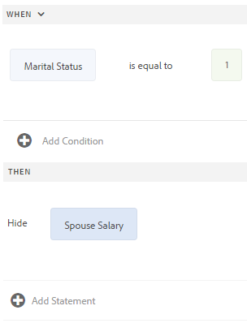
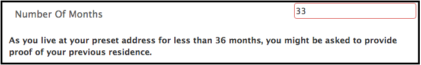

# Lägga till regler i ett adaptivt formulär {#adaptive-forms-rule-editor}

## Översikt {#overview}

Regelredigerarfunktionen ger formuläranvändare och utvecklare möjlighet att skriva regler på adaptiva formulärobjekt. Dessa regler definierar åtgärder som ska utlösas av formulärobjekt baserat på förinställda villkor, användarindata och användaråtgärder i formuläret. Det effektiviserar formulärifyllningen ytterligare och ger större precision och hastighet.

Regelredigeraren har ett intuitivt och förenklat användargränssnitt för att skriva regler. Regelredigeraren erbjuder en visuell redigerare för alla användare.<!-- In addition, only for forms power users, rule editor provides a code editor to write rules and scripts. --> Några av de nyckelåtgärder du kan utföra på adaptiva formulärobjekt med hjälp av regler är:

* Visa eller dölja ett objekt
* Aktivera eller inaktivera ett objekt
* Ange ett värde för ett objekt
* Validera ett objekts värde
* Utför funktioner för att beräkna värdet för ett objekt
* Anropa en tjänst för formulärdatamodell och utföra en åtgärd
* Ange ett objekts egenskap

<!-- Rule editor replaces the scripting capabilities in [!DNL Experience Manager 6.1 Forms] and earlier releases. However, your existing scripts are preserved in the new rule editor. For more information about working with existing scripts in the rule editor, see [Impact of rule editor on existing scripts](rule-editor.md#p-impact-of-rule-editor-on-existing-scripts-p). -->

Användare som läggs till i användargruppen för formulär kan skapa skript och redigera befintliga. Användare i [!DNL forms-users] kan använda skript men inte skapa eller redigera skript.

## Förstå en regel {#understanding-a-rule}

En regel är en kombination av åtgärder och villkor. I regelredigeraren omfattar åtgärderna aktiviteter som att dölja, visa, aktivera, inaktivera eller beräkna värdet för ett objekt i ett formulär. Villkor är booleska uttryck som utvärderas genom att kontroller och åtgärder utförs på ett formulärobjekts status, värde eller egenskap. Åtgärder utförs baserat på värdet ( `True` eller `False`) returneras genom att ett villkor utvärderas.

Regelredigeraren innehåller en uppsättning fördefinierade regeltyper, till exempel När, Visa, Dölj, Aktivera, Inaktivera, Ange värde för och Validera, som hjälper dig att skriva regler. Varje regeltyp gör att du kan definiera villkor och åtgärder i en regel. I dokumentet förklaras dessutom varje regeltyp i detalj.

En regel följer vanligtvis någon av följande konstruktioner:

**Condition-Action** I den här konstruktionen definierar en regel först ett villkor följt av en åtgärd som ska utlösas. Konstruktionen är jämförbar med if-then-programsatsen i programmeringsspråk.

I regelredigeraren **När** regeltypen framtvingar konstruktorn för villkorsåtgärd.

**Åtgärdsvillkor** I den här konstruktionen definierar en regel först en åtgärd som ska utlösas följt av villkor för utvärdering. En annan variant av den här konstruktionen är action-condition-alternate action, som också definierar en alternativ åtgärd som ska utlösas om villkoret returnerar False.

Regeltyperna Visa, Dölj, Aktivera, Inaktivera, Ange värde för och Validera i regelredigeraren framtvingar regelkonstruktionen för åtgärdsvillkor. Som standard är den alternativa åtgärden för Visa Dölj och Aktivera Inaktivera, och tvärtom. Du kan inte ändra den alternativa standardåtgärden.

>[!NOTE]
>
>De tillgängliga regeltyperna, inklusive villkor och åtgärder som du definierar i regelredigeraren, beror också på vilken typ av formulärobjekt du skapar en regel på. Regelredigeraren visar endast giltiga regeltyper och alternativ för att skriva villkor och åtgärdssatser för en viss formulärobjekttyp. Du kan till exempel inte se regeltyperna Validera, Ange värde för, Aktivera och Inaktivera för ett panelobjekt.

Mer information om vilka regeltyper som finns i regelredigeraren finns i [Tillgängliga regeltyper i regelredigeraren](rule-editor.md#p-available-rule-types-in-rule-editor-p).

### Riktlinjer för val av regelkonstruktion {#guidelines-for-choosing-a-rule-construct}

Även om du kan uppnå de flesta användningsexemplen genom att använda valfri regelkonstruktion finns det några riktlinjer för att välja en konstruktion framför en annan. Mer information om tillgängliga regler i regelredigeraren finns i [Tillgängliga regeltyper i regelredigeraren](rule-editor.md#p-available-rule-types-in-rule-editor-p).

* En typisk tumregel när du skapar en regel är att tänka på den i kontexten för det objekt som du skriver en regel för. Tänk på att du vill dölja eller visa fältet B baserat på det värde som användaren anger i fältet A. I det här fallet utvärderar du ett villkor i fält A och baserat på det värde som returneras utlöser du en åtgärd i fält B.

  Om du skriver en regel i fält B (det objekt som du utvärderar ett villkor för) ska du därför använda konstruktorn condition-action eller regeltypen When. Använd på samma sätt konstruktionen action-condition eller Visa eller Dölj regel i fält A.

* Ibland måste du utföra flera åtgärder baserat på ett villkor. I sådana fall bör du använda konstruktorn condition-action. I den här konstruktionen kan du utvärdera ett villkor en gång och ange flera åtgärdssatser.

  Om du till exempel vill dölja fält B, C och D baserat på villkoret som kontrollerar värdet som användaren anger i fält A, skriver du en regel med villkorsstyrd konstruktion eller Regeltyp för När i fält A och anger åtgärder som styr synligheten för fält B, C och D. I annat fall behöver du tre separata regler för fälten B, C och D, där varje regel kontrollerar villkoret och visar eller döljer respektive fält. I det här exemplet är det effektivare att skriva Regeltypen När för ett objekt i stället för att visa eller dölja regeltypen för tre objekt.

* Om du vill aktivera en åtgärd baserat på flera villkor bör du använda konstruktorn action-condition. Om du till exempel vill visa och dölja fält A genom att utvärdera villkor i fält B, C och D, använder du Visa eller Dölj regeltyp i fält A.
* Använd villkorskonstruktion för villkorsåtgärd eller åtgärd om regeln innehåller en åtgärd för ett villkor.
* Om en regel söker efter ett villkor och utför en åtgärd omedelbart när ett värde anges i ett fält eller när ett fält avslutas, rekommenderar vi att du skriver en regel med en villkorsstyrd åtgärd eller med regeltypen När i fältet som villkoret utvärderas i.
* Villkoret i regeln När utvärderas när en användare ändrar värdet på objektet som regeln När används på. Men om du vill att åtgärden ska utlösas när värdet ändras på serversidan, till exempel för förifyllning av värdet, rekommenderar vi att du skriver en When-regel som utlöser åtgärden när fältet initieras.
* När du skriver regler för nedrullningsbara listor, alternativknappar eller kryssruteobjekt fylls alternativen eller värdena för dessa formulärobjekt i förväg i regelredigeraren.

## Tillgängliga operatortyper och händelser i regelredigeraren {#available-operator-types-and-events-in-rule-editor}

Regelredigeraren innehåller följande logiska operatorer och händelser som du kan använda för att skapa regler.

* **Är lika med**
* **Är inte lika med**
* **Börjar med**
* **Slutar med**
* **Innehåller**
* **Är tom**
* **Är inte tom**
* **Har markerat:** Returnerar true när användaren väljer ett visst alternativ för en kryssruta, listruta eller alternativknapp.
* **Har initierats (händelse):** Returnerar true när ett formulärobjekt återges i webbläsaren.
* **Har ändrats (händelse):** Returnerar true när användaren ändrar det angivna värdet eller det valda alternativet för ett formulärobjekt.
* **Navigation(event):** Returnerar true när användaren klickar på ett navigeringsobjekt. Navigeringsobjekt används för att flytta mellan paneler.
* **Stegkomplettering (händelse):** Returnerar true när ett steg i en regel har slutförts.
* **Slutförd sändning(händelse):** Returnerar true när data har skickats till en formulärdatamodell.
* **Fel i sändning(händelse):**  Returnerar true vid misslyckad överföring av data till en formulärdatamodell.

## Tillgängliga regeltyper i regelredigeraren {#available-rule-types-in-rule-editor}

Regelredigeraren innehåller en uppsättning fördefinierade regeltyper som du kan använda för att skriva regler. Vi tittar närmare på varje regeltyp. Mer information om hur du skriver regler i regelredigeraren finns i [Skriv regler](rule-editor.md#p-write-rules-p).

### [!UICONTROL When] {#whenruletype}

The **[!UICONTROL When]** regeltypen följer efter **condition-action-alternate action** regelkonstruktion, eller ibland bara **villkorsåtgärd** konstruera. I den här regeltypen anger du först ett villkor för utvärdering följt av en åtgärd som ska utlösas om villkoret är uppfyllt ( `True`). När du använder Regeltypen När kan du använda flera AND- och OR-operatorer för att skapa [kapslade uttryck](#nestedexpressions).

Med regeltypen När kan du utvärdera ett villkor i ett formulärobjekt och utföra åtgärder på ett eller flera objekt.

Med enkla ord är en vanlig When-regel strukturerad enligt följande:

`When on Object A:`

`(Condition 1 AND Condition 2 OR Condition 3) is TRUE;`

`Then, do the following:`

Åtgärd 2 på objekt B. OCH åtgärd 3 om objekt C,

_

När du har en komponent med flera värden, till exempel alternativknappar eller listor, hämtas alternativen automatiskt och görs tillgängliga för regelskaparen när du skapar en regel för den komponenten. Du behöver inte ange alternativvärdena igen.

En lista har till exempel fyra alternativ: Rött, blått, grönt och gult. När regeln skapas hämtas alternativen (alternativknappar) automatiskt och görs tillgängliga för regelskaparen enligt följande:


När du skriver en When-regel kan du utlösa åtgärden Clear Value Of. Med åtgärden Clear Value Of rensas det angivna objektets värde. Om du har värdet Radera för som ett alternativ i programsatsen När kan du skapa komplexa villkor med flera fält.


**[!UICONTROL Hide]** Döljer det angivna objektet.

**[!UICONTROL Show]** Visar det angivna objektet.

**[!UICONTROL Enable]** Aktiverar det angivna objektet.

**[!UICONTROL Disable]** Inaktiverar det angivna objektet.

**[!UICONTROL Invoke service]** Anropar en tjänst som konfigurerats i en formulärdatamodell. När du väljer åtgärden Anropa tjänst visas ett fält. När användaren knackar på fältet visas alla tjänster som konfigurerats i alla formulärdatamodeller på [!DNL Experience Manager] -instans. När du väljer en tjänst för formulärdatamodell visas fler fält där du kan mappa formulärobjekt med in- och utdataparametrar för den angivna tjänsten. Se exempelregel för anrop av Form Data Model-tjänster.

Utöver Form Data Model-tjänsten kan du ange en direkt WSDL-URL för att anropa en webbtjänst. En Form Data Model-tjänst har dock många fördelar och det rekommenderade sättet att anropa en tjänst.

Mer information om hur du konfigurerar tjänster i formulärdatamodellen finns i [[!DNL Experience Manager Forms] Dataintegrering](data-integration.md).

**[!UICONTROL Set value of]** Beräknar och ställer in värdet för det angivna objektet. Du kan ställa in objektvärdet på en sträng, värdet för ett annat objekt, det beräknade värdet med hjälp av matematiska uttryck eller funktioner, värdet för ett objekts egenskap eller utdatavärdet från en konfigurerad Form Data Model-tjänst. När du väljer webbtjänstalternativet visas alla tjänster som konfigurerats i alla formulärdatamodeller på din [!DNL Experience Manager] -instans. När du väljer en tjänst för formulärdatamodell visas fler fält där du kan mappa formulärobjekt med in- och utdataparametrar för den angivna tjänsten.

Mer information om hur du konfigurerar tjänster i formulärdatamodellen finns i [[!DNL Experience Manager Forms] Dataintegrering](data-integration.md).

The **[!UICONTROL Set Property]** kan du ange värdet för en egenskap för det angivna objektet baserat på en villkorsåtgärd.

Här kan du definiera regler för att lägga till kryssrutor dynamiskt i det adaptiva formuläret. Du kan använda en anpassad funktion, ett formulärobjekt eller en objektegenskap för att definiera en regel.


Om du vill definiera en regel baserat på en anpassad funktion väljer du **[!UICONTROL Function Output]** från listrutan och dra och släpp en anpassad funktion från **[!UICONTROL Functions]** -fliken. Om villkorsåtgärden uppfylls läggs antalet kryssrutor som definierats i den anpassade funktionen till i det adaptiva formuläret.

Om du vill definiera en regel baserat på ett formulärobjekt väljer du **[!UICONTROL Form Object]** från listrutan och dra och släpp ett formulärobjekt från **[!UICONTROL Form Objects]** -fliken. Om villkorsåtgärden uppfylls läggs antalet kryssrutor som är definierade i formulärobjektet till i det adaptiva formuläret.

En regel för att ange egenskap som baseras på en objektegenskap gör att du kan lägga till antalet kryssrutor i ett adaptivt formulär baserat på en annan objektegenskap som ingår i det adaptiva formuläret.

I följande bild visas ett exempel på hur du dynamiskt lägger till kryssrutor baserat på antalet nedrullningsbara listor i det adaptiva formuläret:


**[!UICONTROL Clear Value Of]** Rensar värdet för det angivna objektet.

**[!UICONTROL Set Focus]** Ställer in fokus på det angivna objektet.

**[!UICONTROL Save Form]** Sparar formuläret.

**[!UICONTROL Submit Forms]** Skickar formuläret.

**[!UICONTROL Reset Form]** Återställer formuläret.

**[!UICONTROL Validate Form]** Validerar formuläret.

**[!UICONTROL Add Instance]** Lägger till en instans av den angivna repeterbara panelen eller tabellraden.

**[!UICONTROL Remove Instance]** Tar bort en instans av den angivna repeterbara panelen eller tabellraden.

**[!UICONTROL Navigate to]** Navigerar till andra <!--Interactive Communications,--> Adaptiv Forms, andra resurser som bilder eller dokumentfragment eller en extern URL. <!-- For more information, see [Add button to the Interactive Communication](create-interactive-communication.md#addbuttontothewebchannel). -->

### [!UICONTROL Set Value of] {#set-value-of}

The **[!UICONTROL Set Value of]** kan du ställa in värdet för ett formulärobjekt beroende på om det angivna villkoret är uppfyllt eller inte. Värdet kan anges till ett värde för ett annat objekt, en stränglitteral, ett värde som härleds från ett matematiskt uttryck eller en funktion, ett värde för en egenskap för ett annat objekt eller utdata från en Form Data Model-tjänst. På samma sätt kan du söka efter ett villkor för en komponent, en sträng, en egenskap eller värden som härletts från en funktion eller ett matematiskt uttryck.

The **Ange värdet för** regeltypen är inte tillgänglig för alla formulärobjekt, t.ex. paneler och knappar i verktygsfält. En standarduppsättningsvärde för regel har följande struktur:

Ange värdet för objekt A till:

(sträng ABC) ELLER (objektegenskap X för objekt C) ELLER (värde från en funktion) ELLER (värde från ett matematiskt uttryck) ELLER (utdatavärde för en datamodelltjänst eller webbtjänst),

När (valfritt):

(Villkor 1 OCH villkor 2 OCH villkor 3) är SANT.

I följande exempel används värdet i `dependentid` fält som indata och ställer in värdet för `Relation` till utdata från `Relation` argument för `getDependent` Tjänsten Form Data Model.


Exempel på Ange värderegel med tjänsten Formulärdatamodell

>[!NOTE]
>
>Dessutom kan du använda Ange värde för regel för att fylla i alla värden i en nedrullningsbar listkomponent från utdata från en formulärdatamodelltjänst eller en webbtjänst. Se dock till att det utdataargument du väljer är av en arraytyp. Alla värden som returneras i en array blir tillgängliga i den angivna listrutan.

### [!UICONTROL Show] {#show}

Använda **[!UICONTROL Show]** regeltyp kan du skriva en regel som visar eller döljer ett formulärobjekt baserat på om ett villkor är uppfyllt eller inte. Regeltypen Visa utlöser även åtgärden Dölj om villkoret inte uppfylls eller returneras `False`.

En vanlig Visa-regel är strukturerad på följande sätt:

`Show Object A;`

`When:`

`(Condition 1 OR Condition 2 OR Condition 3) is TRUE;`

`Else:`

`Hide Object A;`

### [!UICONTROL Hide] {#hide}

På liknande sätt som för regeltypen Visa kan du använda kommandot **[!UICONTROL Hide]** regeltyp för att visa eller dölja ett formulärobjekt baserat på om ett villkor är uppfyllt eller inte. Dölj-regeltypen aktiverar även åtgärden Visa om villkoret inte uppfylls eller returneras `False`.

En vanlig Dölj-regel är strukturerad på följande sätt:

`Hide Object A;`

`When:`

`(Condition 1 AND Condition 2 AND Condition 3) is TRUE;`

`Else:`

`Show Object A;`

### [!UICONTROL Enable] {#enable}

The **[!UICONTROL Enable]** kan du aktivera eller inaktivera ett formulärobjekt baserat på om ett villkor är uppfyllt eller inte. Regeltypen Aktivera utlöser även åtgärden Inaktivera om villkoret inte uppfylls eller returneras `False`.

En vanlig Aktivera-regel är strukturerad på följande sätt:

`Enable Object A;`

`When:`

`(Condition 1 AND Condition 2 AND Condition 3) is TRUE;`

`Else:`

`Disable Object A;`

### [!UICONTROL Disable] {#disable}

På samma sätt som för regeltypen Aktivera **[!UICONTROL Disable]** kan du aktivera eller inaktivera ett formulärobjekt baserat på om ett villkor är uppfyllt eller inte. Regeltypen Inaktivera utlöser även åtgärden Aktivera om villkoret inte uppfylls eller returneras `False`.

En vanlig inaktiveringsregel är strukturerad enligt följande:

`Disable Object A;`

`When:`

`(Condition 1 OR Condition 2 OR Condition 3) is TRUE;`

`Else:`

`Enable Object A;`

### [!UICONTROL Validate] {#validate}

The **[!UICONTROL Validate]** regeltypen validerar värdet i ett fält med hjälp av ett uttryck. Du kan till exempel skriva ett uttryck för att kontrollera att textrutan för att ange namn inte innehåller specialtecken eller siffror.

En vanlig valideringsregel är strukturerad enligt följande:

`Validate Object A;`

`Using:`

`(Expression 1 AND Expression 2 AND Expression 3) is TRUE;`

>[!NOTE]
>
>Om det angivna värdet inte överensstämmer med regeln Validera kan du visa ett valideringsmeddelande för användaren. Du kan ange meddelandet i **[!UICONTROL Script validation message]** i komponentegenskaperna i sidlisten.


### [!UICONTROL Set Options Of] {#setoptionsof}

The **[!UICONTROL Set Options Of]** kan du definiera regler för att lägga till kryssrutor dynamiskt i det anpassade formuläret. Du kan använda en formulärdatamodell eller en anpassad funktion för att definiera regeln.

Om du vill definiera en regel baserat på en anpassad funktion väljer du **[!UICONTROL Function Output]** från listrutan och dra och släpp en anpassad funktion från **[!UICONTROL Functions]** -fliken. Antalet kryssrutor som definieras i den anpassade funktionen läggs till i det adaptiva formuläret.


Information om hur du skapar en anpassad funktion finns i [anpassade funktioner i regelredigeraren](#custom-functions).

Så här definierar du en regel baserad på en formulärdatamodell:

1. Välj **[!UICONTROL Service Output]** i listrutan.
1. Markera datamodellsobjektet.
1. Välj en objektegenskap för datamodell i **[!UICONTROL Display Value]** nedrullningsbar lista. Antalet kryssrutor i det adaptiva formuläret härleds från antalet instanser som definierats för den egenskapen i databasen.
1. Välj en objektegenskap för datamodell i **[!UICONTROL Save Value]** nedrullningsbar lista.


## Om regelredigerarens användargränssnitt {#understanding-the-rule-editor-user-interface}

Regelredigeraren har ett omfattande men ändå enkelt användargränssnitt för att skriva och hantera regler. Du kan starta regelredigerarens användargränssnitt i ett adaptivt formulär i redigeringsläge.

Så här startar du användargränssnittet för regelredigeraren:

1. Öppna ett adaptivt formulär i redigeringsläge.
1. Tryck på det formulärobjekt som du vill skriva en regel för och tryck i komponentverktygsfältet . Användargränssnittet för regelredigeraren visas.

   

   Alla befintliga regler för de markerade formulärobjekten visas i den här vyn. Mer information om hur du hanterar befintliga regler finns i [Hantera regler](rule-editor.md#p-manage-rules-p).

1. Tryck **[!UICONTROL Create]** för att skriva en ny regel. Den visuella redigeraren för regelredigerarens användargränssnitt öppnas som standard när du startar regelredigeraren första gången.

   

Vi tittar närmare på varje komponent i regelredigeringsgränssnittet.

### S. Visning av komponentregel {#a-component-rule-display}

Visar titeln på det adaptiva formulärobjektet genom vilket du startade regelredigeraren och den regeltyp som är vald. I ovanstående exempel startas regelredigeraren från ett anpassat formulärobjekt med namnet Lön och den valda regeltypen är När.

### B. Formulärobjekt och -funktioner {#b-form-objects-and-functions-br}

Panelen till vänster i regelredigerarens användargränssnitt innehåller två flikar - **[!UICONTROL Forms Objects]** och **[!UICONTROL Functions]**.

På fliken Formulärobjekt visas en hierarkisk vy över alla objekt som finns i det adaptiva formuläret. Där visas objektens namn och typ. När du skriver en regel kan du dra och släppa formulärobjekt till regelredigeraren. När du skapar eller redigerar en regel när du drar och släpper ett objekt eller en funktion till en platshållare, får platshållaren automatiskt rätt värdetyp.

De formulärobjekt som har en eller flera giltiga regler markerade med en grön punkt. Om någon av reglerna som tillämpas på ett formulärobjekt är ogiltig markeras formulärobjektet med en gul punkt.

Fliken Funktioner innehåller en uppsättning inbyggda funktioner, till exempel summan av, Min av, Max av, Medel av, Antal, och Validera formulär. Du kan använda de här funktionerna för att beräkna värden i repeterbara paneler och tabellrader och använda dem i action- och condition-satser när du skriver regler. Du kan dock skapa [anpassade funktioner](#custom-functions) också.


>[!NOTE]
>
>Du kan utföra textsökning på objekt och funktionsnamn och titlar på flikarna Forms Objekt och Funktioner.

I det vänstra trädet för formulärobjekten kan du trycka på formulärobjekten för att visa reglerna som tillämpas på vart och ett av objekten. Du kan inte bara navigera bland reglerna för de olika formulärobjekten, du kan även kopiera och klistra in regler mellan formulärobjekten. Mer information finns i [Kopiera och klistra in regler](rule-editor.md#p-copy-paste-rules-p).

### C. Växla mellan formulärobjekt och funktioner {#c-form-objects-and-functions-toggle-br}

När användaren knackar på knappen växlar knappen formulärobjekt och funktionsruta.

### D. Visuell regelredigerare {#visual-rule-editor}

Visuell regelredigerare är det område i det visuella redigeringsläget i regelredigerarens användargränssnitt där du skriver regler. Det gör att du kan välja en regeltyp och därefter definiera villkor och åtgärder. När du definierar villkor och åtgärder i en regel kan du dra och släppa formulärobjekt och funktioner från rutan Formulärobjekt och funktioner.

Mer information om hur du använder den visuella regelredigeraren finns i [Skriv regler](rule-editor.md#p-write-rules-p).
<!-- 
### E. Visual-code editors switcher {#e-visual-code-editors-switcher}

Users in the forms-power-users group can access code editor. For other users, code editor is not available. If you have the rights, you can switch from visual editor mode to code editor mode of the rule editor, and vice versa, using the switcher right above the rule editor. When you launch rule editor the first time, it opens in the visual editor mode. You can write rules in the visual editor mode or switch to the code editor mode to write a rule script. However, note that if you modify a rule or write a rule in code editor, you cannot switch back to the visual editor for that rule unless you clear the code editor.

[!DNL Experience Manager Forms] tracks the rule editor mode you used last to write a rule. When you launch the rule editor next time, it opens in that mode. However, you can also configure a default mode to open the rule editor in the specified mode. To do so:

1. Go to [!DNL Experience Manager] web console at `https://[host]:[port]/system/console/configMgr`.
1. Click to edit **[!UICONTROL Adaptive Form Configuration Service]**.
1. choose **[!UICONTROL Visual Editor]** or **[!UICONTROL Code Editor]** from the **[!UICONTROL Default Mode for Rule Editor]** drop-down

1. Click **[!UICONTROL Save]**.
-->

### E. Knapparna Klar och Avbryt {#done-and-cancel-buttons}

The **[!UICONTROL Done]** används för att spara en regel. Du kan spara en ofullständig regel. Ofullständiga är dock ogiltiga och kan inte köras. Sparade regler för ett formulärobjekt visas nästa gång du startar regelredigeraren från samma formulärobjekt. Du kan hantera befintliga regler i den vyn. Mer information finns i [Hantera regler](rule-editor.md#p-manage-rules-p).

The **[!UICONTROL Cancel]** ignorerar alla ändringar du har gjort i en regel och stänger regelredigeraren.

## Skriv regler {#write-rules}

Du kan skriva regler med den visuella regelredigeraren &lt;!>— eller kodredigeraren>. När du startar regelredigeraren första gången öppnas den i det visuella redigeringsläget. Du kan växla till kodredigeringsläget och skriva regler. Om du däremot skriver eller ändrar en regel i kodredigeraren kan du inte växla till den visuella redigeraren för den regeln om du inte rensar kodredigeraren. När du startar regelredigeraren nästa gång öppnas den i det läge som du använde när du skapade regeln senast.

Låt oss först se hur man skriver regler med den visuella redigeraren.

### Använda den visuella redigeraren {#using-visual-editor}

Låt oss förstå hur du skapar en regel i den visuella redigeraren med hjälp av följande exempelformulär.


I avsnittet Krav för lån i exempelformuläret för låneansökan måste de sökande ange sin äktenskapsstatus, lön och, om de är gifta, sin makas lön. Baserat på användarens indata beräknar regeln beloppet för rätt till lån och visas i fältet Låneberättigande. Använd följande regler för att implementera scenariot:

* Fältet för makens lön visas endast när äktenskapsstatus är gift.
* Låneberättigandebeloppet är 50 % av den totala lönen.

Så här skriver du regler:

1. Först skriver du regeln för att styra synligheten för fältet för makslön baserat på det alternativ som användaren väljer för alternativknappen för civilstånd.

   Öppna låneansökningsformuläret i redigeringsläge. Tryck på **[!UICONTROL Marital Status]** och knacka . Tryck sedan på **[!UICONTROL Create]** för att starta regelredigeraren.

   

   När du startar regelredigeraren markeras regeln När som standard. Dessutom anges formulärobjektet (i det här fallet Marital status) från vilket du startade regelredigeraren i programsatsen When.

   Du kan inte ändra eller ändra det markerade objektet, men du kan välja en annan regeltyp med hjälp av den nedrullningsbara menyn. Om du vill skapa en regel för ett annat objekt trycker du på Avbryt för att avsluta regelredigeraren och starta den igen från det önskade formulärobjektet.

1. Tryck **[!UICONTROL Select State]** nedrullningsbar meny och välj **[!UICONTROL is equal to]**. The **[!UICONTROL Enter a String]** visas.

   

   I radioknappen Marital Status **[!UICONTROL Married]** och **[!UICONTROL Single]** alternativ har tilldelats **0** och **1** värden. Du kan verifiera tilldelade värden på fliken Titel i dialogrutan Redigera som visas nedan.

   

1. I **[!UICONTROL Enter a String]** fältet i regeln, ange **0**.

   

   Du har definierat villkoret som `When Marital Status is equal to Married`. Definiera sedan åtgärden som ska utföras om villkoret är sant.

1. Välj **[!UICONTROL Show]** från **[!UICONTROL Select Action]** nedrullningsbar meny.

   

1. Dra och släpp **[!UICONTROL Spouse Salary]** från fliken Formulärobjekt på fliken **[!UICONTROL Drop object or select here]** fält. Du kan också trycka på **[!UICONTROL Drop object or select here]** och välj **[!UICONTROL Spouse Salary]** på popup-menyn som visar alla formulärobjekt i formuläret.

   

   Regeln visas så här i regelredigeraren.

   

1. Tryck **[!UICONTROL Done]** för att spara regeln.

1. Upprepa steg 1 till 5 om du vill definiera en annan regel som döljer fältet för makens lön om äktenskapsstatus är Enskild. Regeln visas så här i regelredigeraren.

   

   >[!NOTE]
   >
   >Du kan också skriva en Show-regel i fältet för makarnas lön, i stället för två When-regler i fältet för civilstånd, för att implementera samma beteende.

   

1. Skriv sedan en regel för att beräkna lånebeloppet, som är 50 % av den totala lönen, och visa det i fältet Låneberättigande. Skapa **[!UICONTROL Set value Of]** regler för fältet Lånekvalificering.

   I redigeringsläget trycker du på **[!UICONTROL Loan Eligibility]** fält och knacka . Tryck sedan på **[!UICONTROL Create]** för att starta regelredigeraren.

1. Välj **[!UICONTROL Set Value Of]** regel från listrutan Regel.

   

1. Tryck **[!UICONTROL Select Option]** och markera **[!UICONTROL Mathematical Expression]**. Ett fält som skriver matematiskt uttryck öppnas.

   

1. I uttrycksfältet:

   * Markera eller dra-och-släpp på fliken Forms-objekt på fliken **[!UICONTROL Salary]** fält i första **[!UICONTROL Drop object or select here]** fält.

   * Välj **[!UICONTROL Plus]** från **[!UICONTROL Select Operator]** fält.

   * Markera eller dra-och-släpp på fliken Forms-objekt på fliken **[!UICONTROL Spouse Salary]** fält i det andra **[!UICONTROL Drop object or select here]** fält.

   

1. Tryck sedan på det markerade området runt uttrycksfältet och tryck **[!UICONTROL Extend Expression]**.

   

   Välj **[!UICONTROL divided by]** från **[!UICONTROL Select Operator]** fält och **[!UICONTROL Number]** från **[!UICONTROL Select Option]** fält. Ange sedan **[!UICONTROL 2]** i nummerfältet.

   

   >[!NOTE]
   >
   >Du kan skapa komplexa uttryck med hjälp av komponenter, funktioner, matematiska uttryck och egenskapsvärden i fältet Välj alternativ.

   Skapa sedan ett villkor som körs när true returneras.

1. Tryck **[!UICONTROL Add Condition]** för att lägga till en When-programsats.

   

   I programsatsen When:

   * Markera eller dra-och-släpp på fliken Forms-objekt på fliken **[!UICONTROL Marital Status]** fält i första **[!UICONTROL Drop object or select here]** fält.

   * Välj **[!UICONTROL is equal to]** från **[!UICONTROL Select Operator]** fält.

   * Välj String i den andra **[!UICONTROL Drop object or select here]** fält och ange **[!UICONTROL Married]** i **[!UICONTROL Enter a String]** fält.

   Regeln visas slutligen så här i regelredigeraren.  

1. Tryck på **[!UICONTROL Done]**. Den sparar regeln.

1. Upprepa steg 7 till 14 för att definiera en annan regel som beräknar låneberättigandet om civilstånd är enkel. Regeln visas så här i regelredigeraren.

   

>[!NOTE]
>
>Du kan också använda regeln Ange värde för för för att beräkna låneberättigandet i regeln När som du skapade för att visa och dölja fältet Makslön. Den resulterande kombinerade regeln när Marital status är enkel visas så här i regelredigeraren.
>
>På samma sätt kan du skriva en kombinerad regel för att kontrollera synligheten för fältet för makars lön och beräkna rätten till lån när civilstånd är gifta.


<!-- ### Using code editor {#using-code-editor}

Users added to the forms-power-users group can use code editor. The rule editor auto generates the JavaScript code for any rule you create using visual editor. You can switch from visual editor to the code editor to view the generated code. However, if you modify the rule code in the code editor, you cannot switch back to the visual editor. If you prefer writing rules in code editor rather than visual editor, you can write rules afresh in the code editor. The visual-code editors switcher helps you switch between the two modes.

The code editor JavaScript is the expression language of Adaptive Forms. All the expressions are valid JavaScript expressions and use Adaptive Forms scripting model APIs. These expressions return values of certain types. For the complete list of Adaptive Forms classes, events, objects, and public APIs, see [JavaScript Library API reference for Adaptive Forms](https://helpx.adobe.com/experience-manager/6-5/forms/javascript-api/index.html).

For more information about guidelines to write rules in the code editor, see [Adaptive Form Expressions](adaptive-form-expressions.md).

While writing JavaScript code in the rule editor, the following visual cues help you with the structure and syntax:

* Syntax highlights

* Auto Indentation

* Hints and suggestions for Form objects, functions, and their properties

* Auto completion of form component names and common JavaScript functions


-->

#### Anpassade funktioner i regelredigeraren {#custom-functions}

Förutom färdiga funktioner som *Summa av* som listas under Funktioner Output kan du skriva egna funktioner som du ofta behöver. Kontrollera att funktionen du skriver åtföljs av `jsdoc` ovanför den.

Medföljande `jsdoc` krävs:

* Om du vill ha anpassad konfiguration och beskrivning
* Eftersom det finns flera sätt att deklarera en funktion i `JavaScript,` och kommentarer gör att du kan hålla reda på funktionerna.

Regelredigeraren stöder JavaScript ES2015-syntax för skript och anpassade funktioner.
Mer information finns i [jsdoc.app](https://jsdoc.app/).

Stöds `jsdoc` taggar:

* **Privat**
Syntax: `@private`
En privat funktion ingår inte som en anpassad funktion.

* **Namn**
Syntax: `@name funcName <Function Name>`
Alternativt `,` du kan använda: `@function funcName <Function Name>` **eller** `@func` `funcName <Function Name>`.
  `funcName` är namnet på funktionen (inga blanksteg tillåts).
  `<Function Name>` är funktionens visningsnamn.

* **medlem**
Syntax: `@memberof namespace`
Kopplar ett namnutrymme till funktionen.

* **Parameter**
Syntax: `@param {type} name <Parameter Description>`
Du kan också använda: `@argument` `{type} name <Parameter Description>` **eller** `@arg` `{type}` `name <Parameter Description>`.
Visar parametrar som används av funktionen. En funktion kan ha flera parametertaggar, en tagg för varje parameter i ordningen för förekomst.
  `{type}` representerar parametertyp. Tillåtna parametertyper är:

   1. string
   1. tal
   1. boolesk
   1. omfång

  Omfattningen avser fält i ett adaptivt formulär. När ett formulär använder lazy loading kan du använda `scope` för att komma åt fälten. Du kan komma åt fält antingen när fälten läses in eller om fälten markeras som globala.

  Alla parametertyper kategoriseras under något av ovanstående. Ingen stöds inte. Välj en av typerna ovan. Typer är inte skiftlägeskänsliga. Blanksteg tillåts inte i parametern `name`. `<Parameter Descrption>` `<parameter>  can have multiple words. </parameter>`

* **Returtyp**
Syntax: `@return {type}`
Du kan också använda `@returns {type}`.
Lägger till information om funktionen, till exempel dess mål.
{type} representerar funktionens returtyp. Tillåtna returtyper är:

   1. string
   1. tal
   1. boolesk

  Alla andra returtyper kategoriseras under en av ovanstående. Ingen stöds inte. Välj en av typerna ovan. Returtyperna är inte skiftlägeskänsliga.

   * **Detta**
Syntax: `@this currentComponent`

  Använd @this för att referera till den adaptiva formulärkomponenten som regeln är skriven för.

  Följande exempel baseras på fältvärdet. I följande exempel döljer regeln ett fält i formuläret. The `this` del av `this.value` refererar till den underliggande adaptiva formulärkomponenten, som regeln är skriven för.

  ```
     /**
     * @function myTestFunction
     * @this currentComponent
     * @param {scope} scope in which code inside function is run.
     */
     myTestFunction = function (scope) {
        if(this.value == "O"){
              scope.age.visible = true;
        } else {
           scope.age.visible = false;
        }
     }
  ```

  >[!NOTE]
  >
  >Kommentarer före anpassade funktioner används för sammanfattning. Sammanfattningen kan sträcka sig över flera rader tills en tagg påträffas. Begränsa storleken till en enda storlek om du vill ha en kortfattad beskrivning i regelbyggaren.

**Lägga till en anpassad funktion**

Du kan t.ex. lägga till en egen funktion som beräknar en kvadratyta. Sidlängd är användarens indata till den anpassade funktionen, som accepteras med en numerisk ruta i formuläret. Beräknade utdata visas i en annan numerisk ruta i formuläret. Om du vill lägga till en anpassad funktion måste du först skapa ett klientbibliotek och sedan lägga till det i CRX-databasen.

Så här skapar du ett klientbibliotek och lägger till det i CRX-databasen:

1. Skapa en kundUtför följande steg i biblioteket. Mer information finns i [Använda bibliotek på klientsidan](https://experienceleague.adobe.com/docs/experience-manager-cloud-service/implementing/developing/full-stack/clientlibs.html#developing).
1. Lägg till en egenskap i CRXDE `categories`med strängtypsvärde som `customfunction` till `clientlib` mapp.

   >[!NOTE]
   >
   >`customfunction`är en exempelkategori. Du kan välja vilket namn som helst för kategorin som du skapar i `clientlib`mapp.

När du har lagt till ditt klientbibliotek i CRX-databasen kan du använda det i ditt adaptiva formulär. Du kan använda den anpassade funktionen som en regel i formuläret. Så här lägger du till klientbiblioteket i ditt adaptiva formulär:

1. Öppna formuläret i redigeringsläge.
Om du vill öppna ett formulär i redigeringsläge markerar du ett formulär och trycker på **[!UICONTROL Open]**.
1. Markera en komponent i redigeringsläget och tryck sedan på  > **[!UICONTROL Adaptive Form Container]** och sedan trycka .
1. Lägg till ditt klientbibliotek i sidofältet under Klientbibliotekets namn. ( `customfunction` i exemplet.)

   

1. Markera den numeriska rutan och tryck på  för att öppna regelredigeraren.
1. Tryck på **[!UICONTROL Create Rule]**. Använd alternativen som visas nedan för att skapa en regel som sparar indatavärdet i fyrkantiga värden i formulärutdatafältet.

   [](assets/add-custom-rule.png)

1. Tryck på **[!UICONTROL Done]**. Din anpassade funktion har lagts till.

#### Typer som stöds för funktionsdeklaration {#function-declaration-supported-types}

**Funktionssats**

```javascript
function area(len) {
    return len*len;
}
```

Den här funktionen ingår utan `jsdoc` kommentarer.

**Funktionsuttryck**

```javascript
var area;
//Some codes later
/** */
area = function(len) {
    return len*len;
};
```

**Funktionsuttryck och -programsats**

```javascript
var b={};
/** */
b.area = function(len) {
    return len*len;
}
```

**Funktionsdeklaration som variabel**

```javascript
/** */
var x1,
    area = function(len) {
        return len*len;
    },
    x2 =5, x3 =true;
```

Begränsning: den anpassade funktionen väljer bara den första funktionsdeklarationen från variabellistan, om den kombineras. Du kan använda funktionsuttryck för varje deklarerad funktion.

**Funktionsdeklaration som objekt**

```javascript
var c = {
    b : {
        /** */
        area : function(len) {
            return len*len;
        }
    }
};
```

>[!NOTE]
>
>Se till att du använder `jsdoc` för alla anpassade funktioner. Fast `jsdoc`kommentarer uppmuntras, innehåller en tom `jsdoc`-kommentar för att markera funktionen som anpassad funktion. Den aktiverar standardhantering av din anpassade funktion.

## Hantera regler {#manage-rules}

Alla befintliga regler för ett formulärobjekt visas när du trycker på objektet och trycker på . Du kan visa titeln och förhandsgranska regelsammanfattningen. I gränssnittet kan du dessutom expandera och visa hela regelsammanfattningen, ändra ordningen på regler, redigera regler och ta bort regler.


Du kan utföra följande åtgärder på regler:

* **Expandera/komprimera**: Kolumnen Innehåll i regellistan visar regelinnehållet. Om hela regelinnehållet inte visas i standardvyn trycker du på  för att utöka den.

* **Ändra ordning**: Alla nya regler som du skapar staplas längst ned i regellistan. Reglerna körs uppifrån och ned. Regeln längst upp körs först följt av andra regler av samma typ. Om du till exempel har reglerna When, Show, Enable och When vid första, andra, tredje respektive fjärde positionen uppifrån, kommer regeln When överst att köras först följt av regeln When vid den fjärde positionen. Sedan körs reglerna Visa och Aktivera.
Du kan ändra ordningen på en regel genom att trycka på  eller dra och släpp det i önskad ordning i listan.

* **Redigera**: Om du vill redigera en regel markerar du kryssrutan bredvid regeltiteln. Alternativ för att redigera och ta bort regeln visas. Tryck **[!UICONTROL Edit]** för att öppna den valda regeln i regelredigeraren <!-- in visual  or code editor mode depending on the mode used to create the rule -->.

* **Ta bort**: Om du vill ta bort en regel markerar du den och trycker på **[!UICONTROL Delete]**.

* **Aktivera/inaktivera**: När du tillfälligt måste inaktivera användningen av en regel kan du välja en eller flera regler och trycka på **[!UICONTROL Disable]** i verktygsfältet Åtgärder för att inaktivera dem. Om en regel är inaktiverad körs den inte vid körningen. Om du vill aktivera en inaktiverad regel kan du markera den och trycka på Aktivera i åtgärdsverktygsfältet. Statuskolumnen för regeln visar om regeln är aktiverad eller inaktiverad.


## Kopiera och klistra in regler {#copy-paste-rules}

Du kan kopiera och klistra in en regel från ett fält till andra liknande fält för att spara tid.

Så här kopierar och klistrar du in regler:

1. Tryck på det formulärobjekt du vill kopiera en regel från och tryck i komponentens verktygsfält . Användargränssnittet för regelredigeraren visas med formulärobjektet markerat och de befintliga reglerna visas.

   

   Mer information om hur du hanterar befintliga regler finns i [Hantera regler](rule-editor.md#p-manage-rules-p).

1. Markera kryssrutan bredvid regeltiteln. Då visas alternativ för att hantera regeln. Tryck på **[!UICONTROL Copy]**.

   

1. Markera ett annat formulärobjekt som du vill klistra in regeln i och tryck på **[!UICONTROL Paste]**. Dessutom kan du redigera regeln för att göra ändringar i den.

   >[!NOTE]
   >
   >Du kan bara klistra in en regel i ett annat formulärobjekt om det formulärobjektet har stöd för den kopierade regelns händelse. En knapp stöder till exempel händelsen click. Du kan klistra in en regel med en klickningshändelse på en knapp, men inte i en kryssruta.

1. Tryck **[!UICONTROL Done]** för att spara regeln.

## Kapslade uttryck {#nestedexpressions}

Med regelredigeraren kan du använda flera AND- och OR-operatorer för att skapa kapslade regler. Du kan blanda flera AND- och OR-operatorer i regler.

Nedan visas ett exempel på en kapslad regel som visar ett meddelande till användaren om rätt att vårdas av ett barn när de obligatoriska villkoren är uppfyllda.


Du kan också redigera genom att dra och släppa villkor i en regel. Tryck och hovra över handtaget ( ) före ett villkor. När pekaren ändras till en handsymbol enligt nedan drar och släpper du villkoret någonstans i linjen. Regelstrukturen ändras.


## Villkor för datumuttryck {#dateexpression}

Regelredigeraren låter dig använda datumjämförelser för att skapa villkor.

Följande är ett exempelvillkor som visar ett statiskt textobjekt om inteckningen på huset redan har tagits, vilket användaren anger genom att fylla i datumfältet.

När datumet för inteckningen av egendomen som fyllts i av användaren har inträffat visas en anteckning om inkomstberäkningen i det adaptiva formuläret. I följande regel jämförs det datum som användaren fyller i med det aktuella datumet och om det datum som användaren fyller i är tidigare än det aktuella datumet visas textmeddelandet (Inkommande) i formuläret.


När det ifyllda datumet infaller tidigare än det aktuella datumet visas textmeddelandet (intäkt) enligt följande:


## Nummerjämförelsevillkor {#number-comparison-conditions}

Med regelredigeraren kan du skapa villkor som jämför två tal.

Följande är ett exempelvillkor som visar ett statiskt textobjekt om antalet månader en sökande stannar på den aktuella adressen är mindre än 36.


När användaren anger att han/hon bor på den aktuella bostadsadressen i mindre än 36 månader visas ett meddelande i formuläret om att det går att begära fler bosättningsbevis.



<!-- ## Impact of rule editor on existing scripts {#impact-of-rule-editor-on-existing-scripts}

In [!DNL Experience Manager Forms] versions prior to [!DNL Experience Manager 6.1 Forms] feature pack 1, form authors and developers used to write expressions in the Scripts tab of the Edit component dialog to add dynamic behavior to Adaptive Forms. The Scripts tab is now replaced by the rule editor.

Any scripts or expressions that you must have written in the Scripts tab are available in the rule editor. While you cannot view or edit them in visual editor, if you are a part of the forms-power-users group you can edit scripts in code editor. -->

## Exempelregler {#example}

### Anropa tjänsten Formulärdatamodell {#invoke}

Överväg en webbtjänst `GetInterestRates` som tar lånebelopp, löptid och sökandens kreditpoäng som indata och returnerar en låneplan som inkluderar EMI-belopp och ränta. Du skapar en formulärdatamodell med webbtjänsten som datakälla. Du lägger till datamodellsobjekt och en `get` till formulärmodellen. Tjänsten visas på fliken Tjänster i formulärdatamodellen. Skapa sedan ett adaptivt formulär som innehåller fält från datamodellsobjekt för att samla in användarindata för lånebelopp, löptid och kreditpoäng. Lägg till en knapp som utlöser webbtjänsten för att hämta planinformation. Utdata fylls i i lämpliga fält.

Följande regel visar hur du konfigurerar åtgärden Anropa tjänst för att slutföra exempelscenariot.


Anropa tjänsten Formulärdatamodell med regeln Adaptiv form

### Utlösa flera åtgärder med hjälp av regeln När {#triggering-multiple-actions-using-the-when-rule}

I en låneansökan vill du ta reda på om lånesökanden är en befintlig kund eller inte. Baserat på den information som användaren anger, bör fältet för kund-ID visas eller döljas. Du vill också fokusera på fältet för kund-ID om användaren är en befintlig kund. Formuläret för låneansökan innehåller följande komponenter:

* En alternativknapp, **[!UICONTROL Are you an existing Geometrixx customer?]**, som [!UICONTROL Yes] och [!UICONTROL No] alternativ. Värdet för Ja är **0** och Nej är **1**.

* Ett textfält, **[!UICONTROL Geometrixx customer ID]**, för att ange kund-ID.

När du skriver en When-regel på alternativknappen för att implementera det här beteendet, visas regeln på följande sätt i den visuella regelredigeraren.


Regel i den visuella redigeraren

I exempelregeln är programsatsen i avsnittet När villkoret, som när returnerar True, utför de åtgärder som anges i avsnittet Sedan.

<!-- The rule appears as follows in the code editor.

 

Rule in the code editor -->

### Använda ett funktionsutdata i en regel {#using-a-function-output-in-a-rule}

I ett inköpsorderformulär har du följande tabell där användarna fyller i sina order. I denna tabell:

* Den första raden är upprepningsbar, så användarna kan beställa flera produkter och ange olika kvantiteter. Dess elementnamn är `Row1`.
* Titeln på cellen i kolumnen Produktkvantitet på den repeterbara raden är Kvantitet. Elementnamnet för den här cellen är `productquantity`.
* Den andra raden i tabellen är inte repeterbar och cellens rubrik i kolumnen Produktkvantitet i den här raden är Total Quantity.


**S.** Rad1 **B.** Kvantitet **C.** Totalt antal

Nu vill du lägga till angivna kvantiteter i kolumnen Produktkvantitet för alla produkter och visa summan i cellen Total kvantitet. Du kan uppnå den här summan genom att skriva en Set Value Of-regel i cellen Total Quantity enligt nedan.


Regel i den visuella redigeraren

<!-- he rule appears as follows in the code editor.


Rule in the code editor -->

### Validera ett fältvärde med uttryck {#validating-a-field-value-using-expression}

I inköpsorderformuläret som förklaras i föregående exempel vill du hindra användare från att beställa mer än en kvantitet av en produkt till ett pris som överstiger 10000. Du kan skriva en valideringsregel enligt nedan.


Regel i den visuella redigeraren

<!-- The rule appears as follows in the code editor.


Rule in the code editor -->
