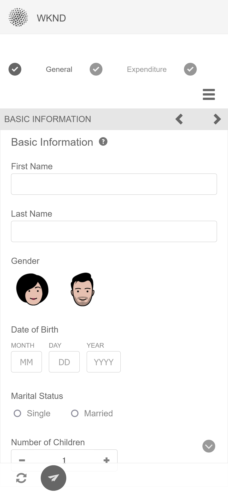

# Exempelteman, mallar och formulärdatamodeller i kärnkomponenter {#sample-themes-templates-and-data-models}

AEM Forms as a Cloud Service innehåller exempelreferensteman, mallar och formulärdatamodeller som hjälper dig att snabbt komma igång med att skapa Adaptiv Forms med kärnkomponenter. Du kan [aktivera adaptiva Forms Core-komponenter](https://experienceleague.adobe.com/docs/experience-manager-cloud-service/content/forms/setup-configure-migrate/enable-adaptive-forms-core-components.html) på AEM Forms as a Cloud Service och lokala utvecklingsmiljö för att få OTB-mallar och till [använda och anpassa exempelteman](https://experienceleague.adobe.com/docs/experience-manager-cloud-service/content/forms/adaptive-forms-authoring/authoring-adaptive-forms-core-components/create-an-adaptive-form-on-forms-cs/using-themes-in-core-components.html) in [!DNL AEM Forms].

Exempelteman, mallar och formulärdatamodeller som ingår i referensinnehållspaketet är:

| Mallar | Teman | Formulärdatamodeller |
---------|----------|---------
| Grundläggande | Arbetsyta | Microsoft® Dynamics 365 |
| Tom | WKND | Salesforce |
| Kontakta oss | Easel |  |
| Uppdatering av kontaktinformation |   |   |
| Samtyckesformulär | |  |
| Loggtjänstbegäran |  |  |
| Ge feedback |  |  |
| Registrering av förmåner |  |   |
| Sammanfattning av löneförmåner för medarbetare |   |   |
| Kontoutdrag för begäran |   |   |
| Formulär för säkerhetskontroll |   |   |
| Kvalitetskontroll |   |   |
| Inköpsbegäran |  |  |

## Exempelteman {#Sample-Themes}

Med exempelteman kan man definiera och anpassa formateringen efter blanketterna, och författare med till och med grundläggande kunskaper i CSS kan anpassa temat efter behov. Formulärförfattare [aktivera adaptiva Forms Core-komponenter](https://experienceleague.adobe.com/docs/experience-manager-cloud-service/content/forms/setup-configure-migrate/enable-adaptive-forms-core-components.html) på AEM Forms as a Cloud Service och lokala utvecklingsmiljö för att få dessa teman beskrivna enligt följande:

### Arbetsyta {#Canvas}

Arbetsytans tema är standardtema för formulär och betonar användningen av grundläggande färger, genomskinlighet och platta ikoner. På skärmbilden nedan ser du hur Canvas-temat ser ut.

### WKND {#WKND}

WKND-temat innehåller en livlig, fantasifull och engagerande design som visar ett snyggt utseende på dina formulär. Temat baseras på utseendet och stilen hos [WKND-webbplats](https://wknd.site/us/en.html) som är en rese- och reklamwebbplats som bygger på [Adobe Experience Manager Core Components](https://experienceleague.adobe.com/docs/experience-manager-core-components/using/introduction).

### Easel {#Easel}

Easel-temat hjälper dig att skapa ett snyggt och lättkonfigurerat formulärutseende som är anpassat för enkelhet och användarvänlighet. Easel-temat bygger på konceptet där en portabel stativ används av konstnärer för att ge stöd åt en arbetsyta medan de arbetar med sina målningar.

## Exempelmallar {#Sample-templates}

Mallar definierar den inledande formulärstrukturen, innehållet och de åtgärder som ska replikeras i formuläret eller använder en mallstruktur som liknar den i formuläret, till exempel Samtyckesformulär, Förmånsregistreringsformulär och många andra. Du kan hämta följande mallar med [aktivera adaptiva Forms Core-komponenter](https://experienceleague.adobe.com/docs/experience-manager-cloud-service/content/forms/setup-configure-migrate/enable-adaptive-forms-core-components.html) på AEM Forms as a Cloud Service eller lokala utvecklingsmiljö. Exempelmallarna i de adaptiva Forms Core-komponenterna är:

### Grundläggande {#Basic}

Med en grundläggande mall kan du snabbt skapa ett formulär för registreringsupplevelser. Du kan också använda den för att förhandsgranska funktioner i [Adaptiva Forms Core-komponenter](https://experienceleague.adobe.com/docs/experience-manager-core-components/using/adaptive-forms/introduction). Den innehåller en guidelayout för avsnitt-för-avsnitt-presentation av data.

>[!BEGINTABS]

>[!TAB Skrivbord]

>[!TAB Telefon]

>[!TAB Tablet]

>[!ENDTABS]

### Tom {#Blank}

En tom arbetsytemall används för att skapa en anpassad formulärstruktur, innehåll och regler från grunden. Inga formulärkomponenter har förintegrerats i den tomma mallen.

### Kontakta oss {#Contact-Us}

Kontakta oss formulärmall som används för att skapa ett formulär som underlättar kommunikationen mellan webbplatsbesökare och administratörer. Användare kan skicka frågor, feedback eller supportförfrågningar via formuläret.

### Uppdatering av kontaktinformation {#Contact-Details-Update}

Kontaktuppgifter uppdaterar mallar så att författare kan skapa ett formulär för att uppdatera kundens adress och kontaktinformation. Blanketten kan även hjälpa kunderna att uppdatera personuppgifter som rör prenumeration eller förmåner för att säkerställa smidig kommunikation och oavbruten tillgång till tjänsterna eller förmånerna.

### Samtyckesformulär {#Consent-Form}

Blankettmall för samtycke används för att skapa ett formulär för att köpa ett juridiskt dokument från deltagare som deltar i en viss verksamhet, en forskningsundersökning, ett medicinskt förfarande eller en situation där deras personuppgifter eller rättigheter kan vara inblandade. Formuläret säkerställer öppenhet, skyddar deltagarens rättigheter och skapar en tydlig förståelse för vad personen går med på.

### Loggtjänstbegäran {#Log-Service-Request}

I mallen för loggtjänstbegäran kan du skapa ett formulär som begär specifika loggningstjänster från en tjänsteleverantör. Formuläret fungerar som en formell begäran om att skapa en biljett och innehåller vissa händelser, aktiviteter eller data som har loggats för övervaknings- eller spårningsstatus.

### Ge feedback {#Give-Feedback}

Ge feedback-formulärmallar hjälper till att skapa ett formulär som ger konstruktiv feedback till en annan person eller grupp. Formuläret ser till att informationen är tydlig, specifik och åtgärdbar och främjar öppen kommunikation och förbättring.

### Registrering av förmåner {#Benefits-Enrollment}

Blankettmall för förmånsregistrering används för att skapa ett formulär som samlar in viktig information från medarbetarna om vilka förmåner de föredrar och vilka täckningsalternativ de har. Det är vanligtvis en del av den årliga perioden för förmånsregistrering.

### Sammanfattning av medarbetarförmåner {#Employee-Benefits-Summary}

En mall för en sammanfattande mall för löneförmåner används för att skapa ett formulär som samlar in viktig information om en persons förmåner. Det hjälper till att snabbt och korrekt utvärdera täckningen och ger en heltäckande översikt för effektivt stöd och stöd.

### Kontoutdrag för förfrågan {#Request-for-Account-Statement}

En mall för kontoutdrag hjälper till att skapa ett formulär som initierar processen att få en korrekt och aktuell kundförsäkran. Rapporten innehåller detaljerad information om finansiella transaktioner, aktiviteter eller annan relevant information om kunder som använder formuläret.

### Säkerhetsinspektion {#Safety-Inspection}

Formulärmallen för säkerhetsinspektioner hjälper till att skapa ett formulär med inmatningsinformation för en säker arbetsmiljö. Genom regelbundna inspektioner med hjälp av denna blankett kan potentiella risker identifieras. Formuläret omfattar olika aspekter såsom nödutgångar, brandsäkerhet, elsäkerhet, farligt material, personlig skyddsutrustning, arbetsstationens ergonomi för anställdas, besökares och kunders säkerhet och välbefinnande.

### Kvalitetskontrollinspektion {#Quality-Control-Inspection}

Formulärmallen för kvalitetskontroll används för att skapa ett formulär för att bedöma och dokumentera en produkts eller objektets visuella utseende, dimensioner, funktionalitet, dokumentation, testresultat och övergripande kvalitet. Det hjälper till att identifiera brister, avvikelser och korrigerande åtgärder som är nödvändiga för att säkerställa att kvalitetsnormerna följs.

### Inköpsbegäran {#Purchase-Request}

Formulärmallen för inköpsbegäran hjälper till att skapa ett formulär som initierar upphandlingsprocessen och gör det möjligt för medarbetarna att formellt begära inköp av varor eller tjänster som är nödvändiga för deras arbete. Formuläret innehåller viktig information som artikelbeskrivning, kvantitet, föredragen leverantör (om tillämpligt), budgetallokering, motivering för inköp, leveransinformation och obligatoriska godkännanden.

## Referensformulärdatamodeller {#reference-models}

När du har skapat en [Adaptiv form](https://experienceleague.adobe.com/docs/experience-manager-core-components/using/adaptive-forms/introduction.html?lang=en#adaptive-forms-core-components) baserat på [Kärnkomponent](https://experienceleague.adobe.com/docs/experience-manager-core-components/using/adaptive-forms/introduction.html?lang=en#adaptive-forms-core-components)kan du ansluta backend-delen av formuläret med databasservrarna Microsoft® Dynamics 365 och Salesforce för att aktivera affärsarbetsflöden. Till exempel:

* Skriv data i Microsoft® Dynamics 365 och Salesforce när du skickar adaptiva formulär.
* Skriv data i Microsoft® Dynamics 365 och Salesforce via anpassade entiteter som definierats i formulärdatamodellen och vice versa.
* Fråga Microsoft® Dynamics 365- och Salesforce-servern efter data och fyll i Adaptiv Forms i förväg.
* Läs data från Microsoft® Dynamics 365- och Salesforce-servern.

Du kan hämta följande formulärdatamodeller genom att installera [Referensinnehållspaket](https://experience.adobe.com/#/downloads/content/software-distribution/en/aemcloud.html?package=/content/software-distribution/en/details.html/content/dam/aemcloud/public/aem-forms-reference-content.ui.content-2.1.0.zip):

* Microsoft® Dynamics 365
* Salesforce

Mer information om hur du använder dessa modeller finns i [Konfigurera molntjänsterna Microsoft® Dynamics 365 och Salesforce](https://experienceleague.adobe.com/docs/experience-manager-cloud-service/content/forms/integrate/use-form-data-model/configure-msdynamics-salesforce.html?lang=en#configure-dynamics-cloud-service)
