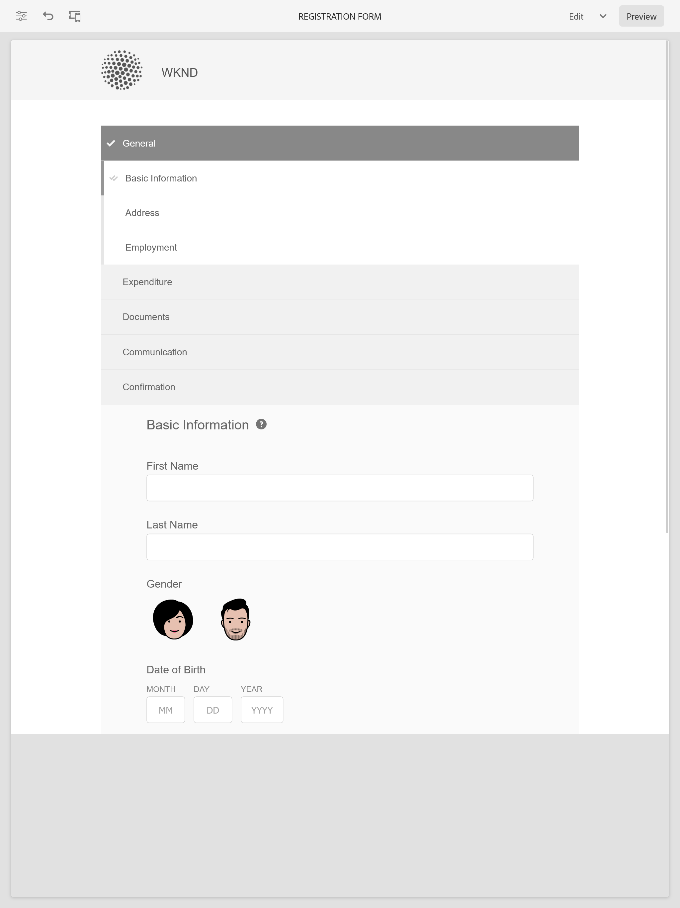

# Exempelteman, mallar och formulärdatamodeller i kärnkomponenter {#sample-themes-templates-and-data-models}

AEM Forms as a Cloud Service innehåller flera exempelreferensteman, mallar och formulärdatamodeller som hjälper dig att snabbt komma igång med att skapa Adaptiv Forms med kärnkomponenter. Du kan [aktivera adaptiva Forms Core-komponenter](https://experienceleague.adobe.com/docs/experience-manager-cloud-service/content/forms/setup-configure-migrate/enable-adaptive-forms-core-components.html) på AEM Forms as a Cloud Service och lokala utvecklingsmiljö för att få OTB-mallar och [använda och anpassa teman](https://experienceleague.adobe.com/docs/experience-manager-cloud-service/content/forms/adaptive-forms-authoring/authoring-adaptive-forms-core-components/create-an-adaptive-form-on-forms-cs/using-themes-in-core-components.html) in [!DNL AEM Forms].

Exempelteman, mallar och formulärdatamodeller som ingår i referensinnehållspaketet är:

| Mallar | Teman | Formulärdatamodeller |
---------|----------|---------
| Grundläggande | Arbetsyta | Microsoft® Dynamics 365 |
| Tom | WKND | Salesforce |
| Kontakta oss | Easel |  |
| Samtyckesformulär | |  |
| Raise Complaint | | |
| Loggtjänstbegäran |  |  |
| Ge feedback |  |  |
| Registrering av förmåner |  |   |
| Sammanfattning av löneförmåner för medarbetare |   |   |
| Kontoutdrag för begäran |   |   |
| Uppdatering av kontaktinformation |   |   |
| Formulär för säkerhetskontroll |   |   |
| Kvalitetskontroll |   |   |
| Inköpsbegäran |  |  |

## Exempelteman {#Sample-Themes}

Med hjälp av referensteman kan du definiera format för dina formulär utan att behöva ha kunskaper i CSS, även du kan anpassa temat efter behov. Du kan [aktivera adaptiva Forms Core-komponenter](https://experienceleague.adobe.com/docs/experience-manager-cloud-service/content/forms/setup-configure-migrate/enable-adaptive-forms-core-components.html) på AEM Forms as a Cloud Service och lokala utvecklingsmiljö för att få dessa teman beskrivna enligt följande:

### Arbetsyta {#Canvas}

Arbetsytan är standardtemat för Adaptiv Forms och betonar användningen av grundläggande färger, genomskinlighet och platta ikoner. På skärmbilden nedan ser du hur Canvas-temat ser ut.

### WKND {#WKND}

WKND-temat innehåller en livlig, fantasifull och engagerande design som visar ett snyggt utseende i dina formulär. Temat baseras på utseendet och stilen hos [WKND-webbplats](https://wknd.site/us/en.html) som är en rese- och reklamwebbplats som bygger på [Adobe Experience Manager Core Components](https://experienceleague.adobe.com/docs/experience-manager-core-components/using/introduction).

### Easel {#Easel}

Easel-temat avser en viss typ av malldesign som är enkel att konfigurera och som är anpassad för enkelhet och användarvänlighet. Easel-temat bygger på konceptet där en portabel stativ används av konstnärer för att ge stöd åt en arbetsyta medan de arbetar med sina målningar.

## Exempelmallar {#Sample-templates}

Mallar definierar den inledande formulärstrukturen, innehållet och de åtgärder som ska replikeras i formuläret eller använder en mallstruktur som liknar den i formuläret, till exempel Samtyckesformulär, Förmånsregistreringsformulär och många andra. Du kan hämta följande mallar med [aktivera adaptiva Forms Core-komponenter](https://experienceleague.adobe.com/docs/experience-manager-cloud-service/content/forms/setup-configure-migrate/enable-adaptive-forms-core-components.html) på AEM Forms as a Cloud Service eller lokala utvecklingsmiljö. Exempelmallarna i de adaptiva Forms Core-komponenterna är:

### Grundläggande {#Basic}

Med en grundläggande mall kan du snabbt skapa ett formulär för registreringsupplevelser. Du kan också använda den för att förhandsgranska funktionaliteten i adaptiva kärnkomponenter i Forms. Den innehåller en guidelayout för avsnitt-för-avsnitt-presentation av data.

>[!BEGINTABS]

>[!TAB Skrivbord]

    

>[!TAB Telefon]

    

>[!TAB Tablet]

    

>[!ENDTABS]

### Tom {#Blank}

En tom arbetsytemall används för att skapa en anpassad formulärstruktur, innehåll och regler från grunden. Inga formulärkomponenter ingår.

### Kontoutdrag för förfrågan {#Request-for-Account-Statement}

En begäran om ett kontoutdragsformulär för att begära en transaktionsredovisning. Denna redovisning ger en detaljerad redovisning av finansiella transaktioner, aktiviteter eller annan relevant information om en individ. Genom att fylla i det här formuläret kan du initiera processen att få en korrekt och aktuell beskrivning av dina uppgifter.

### Uppdatering av kontaktinformation {#Contact-Details-Update}

Kontaktinformationsuppdateringsformuläret för adress- och kontaktinformation har utformats för att hjälpa dig att uppdatera dina personuppgifter som gäller din prenumeration eller dina förmåner för att säkerställa smidig kommunikation och oavbruten tillgång till de tjänster eller förmåner du får.

### Säkerhetsinspektion {#Safety-Inspection}

Säkerhetsinspektionsformuläret är avsett att upprätthålla en säker arbetsmiljö. Genom regelbundna inspektioner med hjälp av denna blankett kan potentiella risker identifieras. Det omfattar olika aspekter såsom nödutgångar, brandsäkerhet, elsäkerhet, farliga material, personlig skyddsutrustning, ergonomi på arbetsstationer osv. för personalens, besökarnas och kundernas säkerhet och välbefinnande och skapar en säker miljö för alla.

### Inköpsbegäran {#Purchase-Request}

Ett inköpsanbudsformulär som initierar upphandlingsprocessen och ger medarbetarna möjlighet att formellt begära inköp av varor eller tjänster som är nödvändiga för deras arbete. Formuläret innehåller viktig information som artikelbeskrivning, kvantitet, föredragen leverantör (om tillämpligt), budgetallokering, motivering för inköp, leveransinformation och obligatoriska godkännanden. Syftet med formuläret är att effektivisera och dokumentera inköpsprocessen, säkerställa korrekt auktorisering och spårning av begärda inköp.

### Sammanfattning av medarbetarförmåner {#Employee-Benefits-Summary}

Sammanfattningsformuläret för anställningsförmåner används för att samla in viktig information om en persons förmåner. Det hjälper till att snabbt och korrekt utvärdera täckningen och ger en heltäckande översikt för effektivt stöd och stöd.

### Registrering av förmåner {#Benefits-Enrollment}

En mall för bidragsansökningar som samlar in viktig information från medarbetarna om de förmåner och täckningsalternativ de föredrar. Det är vanligtvis en del av den årliga perioden för förmånsregistrering.

### Kvalitetskontrollinspektion {#Quality-Control-Inspection}

Ett formulär för kvalitetskontroll där man kan bedöma och dokumentera utseendet, dimensionerna, funktionaliteten, dokumentationen, testresultaten och den övergripande kvaliteten hos en produkt eller produkt. Det hjälper till att identifiera brister, avvikelser och korrigerande åtgärder som är nödvändiga för att säkerställa att kvalitetsnormerna följs.

### Samtyckesformulär {#Consent-Form}

En blankett för samtycke är ett rättsligt dokument som söker frivilligt och informerat tillstånd från en person eller en deltagare innan de deltar i en viss verksamhet, en forskningsundersökning, ett medicinskt förfarande eller en situation där deras personuppgifter eller rättigheter kan vara inblandade. Syftet med ett medgivandeformulär är att säkerställa öppenhet, skydda deltagarens rättigheter och skapa en tydlig förståelse för vad personen går med på.

### Kontakta oss {#Contact-Us}

Kontaktinformationsuppdateringsformuläret för adress- och kontaktinformation har utformats för att hjälpa dig att uppdatera dina personuppgifter som gäller din prenumeration eller dina förmåner för att säkerställa smidig kommunikation och oavbruten tillgång till de tjänster eller förmåner du får.

### Loggtjänstbegäran {#Log-Service-Request}

Ett formulär för loggtjänstbegäran som begär specifika loggningstjänster från en tjänsteleverantör. Formuläret fungerar som en formell begäran om att skapa en biljett och innehåller vissa händelser, aktiviteter eller data som har loggats för övervaknings- eller spårningsstatus.

### Ge feedback {#Give-Feedback}

En mall för&quot;ge-feedback&quot; som ger konstruktiv feedback till en annan person eller grupp. Mallen säkerställer att feedback är tydlig, specifik och åtgärdbar, vilket främjar öppen kommunikation och förbättring.

## Referensformulärdatamodeller {#reference-models}

Den adaptiva Forms kan sedan interagera med Microsoft® Dynamics 365- och Salesforce-servrar för att möjliggöra affärsarbetsflöden. Till exempel:

* Skriv data i Microsoft® Dynamics 365 och Salesforce när ni skickar in anpassade formulär.
* Skriv data i Microsoft® Dynamics 365 och Salesforce via anpassade entiteter som definierats i formulärdatamodellen och vice versa.
* Fråga Microsoft® Dynamics 365- och Salesforce-servern efter data och fyll i Adaptiv Forms i förväg.
* Läs data från Microsoft® Dynamics 365- och Salesforce-servern.

Du kan hämta följande formulärdatamodeller genom att installera [Referensinnehållspaket](https://experience.adobe.com/#/downloads/content/software-distribution/en/aemcloud.html?package=/content/software-distribution/en/details.html/content/dam/aemcloud/public/aem-forms-reference-content.ui.content-2.1.0.zip):

* Microsoft® Dynamics 365
* Salesforce

Mer information om hur du använder dessa modeller finns i [Konfigurera molntjänsterna Microsoft® Dynamics 365 och Salesforce](https://experienceleague.adobe.com/docs/experience-manager-cloud-service/content/forms/integrate/use-form-data-model/configure-msdynamics-salesforce.html?lang=en#configure-dynamics-cloud-service)
