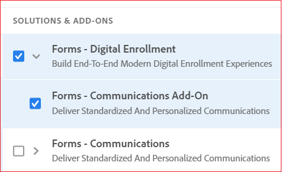

# Anmäl dig till [!DNL AEM Forms] as a Cloud Service {#overview}

## Bestäm profiler {#personas-aem-forms-project}

<!-- When you sign up for the service, Adobe creates an Organization identifier for your company in the Adobe Identity Management System (IMS), where your users and their permissions can be managed. So, --> Före introduktion till en [!DNL AEM Forms] as a Cloud Service miljö, bestäm personligheter och strukturera ett team för projektet. En typisk [!DNL AEM Forms] projektteamet har följande egenskaper:

* **UX-designer (User Experience)**: En UX-designer (User Experience) definierar stil, layout och varumärke för [!DNL AEM Forms] resurser.

* **Forms**: En Forms-designer skapar adaptiva Forms, teman och mallar utifrån den stil, layout och det varumärke som UX-designern ger. Användaren skapar också och integrerar adaptiva formulär med en formulärdatamodell och AEM arbetsflöden. En Forms-deltagare utför vanligtvis kundrelaterade uppgifter.

* **Forms-utvecklare**: En Forms-utvecklare utvecklar en skräddarsydd blankettlösning.  En Forms-utvecklare utför vanligtvis backend-utveckling som utveckling av anpassade komponenter, AEM arbetsflöden, förifyllda tjänster med mera.

* **AEM**: En AEM administratör hjälper till med den övergripande konfigurationen, som att konfigurera användare, göra miljön mer avancerad, konfigurera datakällor, konfigurera e-post och tredjepartsprogram. AEM kan också hjälpa till med integreringar som integrering med Adobe Analytics, Adobe Target och Adobe Sign.

* **Slutanvändare**: Användarna interagerar med och skickar in det publicerade formuläret, signerar inskickade formulär, spårar inskickade ansökningar via webbportalen och får personliga meddelanden.

<!-- While onboarding to the service, assign the following AEM groups to [!DNL AEM Forms] as a Cloud Service based on their role:

| User type | AEM group |
|---|---|
| Form Practitioner | forms-users (AEM Forms Users), template-authors, workflow-user, workflow-editors, and fdm-author  |
| UX Designer| forms-users, template-authors|
| End-User| <ul> <li>When a user must login to view and submit an Adaptive Form, add such users to forms-users group. </li> <li>When no user authentication is required to access Adaptive Forms, do not assign any group to such users. </li> </ul>| -->

## Anlita tjänsten {#onboarding}

* [Inbyggt](https://experienceleague.adobe.com/docs/experience-manager-cloud-service/onboarding/home.html) till [!DNL Adobe Experience Manager] as a Cloud Service.

* (Endast för sandlådor) Efter introduktionen av tjänsten [skapa](https://experienceleague.adobe.com/docs/experience-manager-cloud-manager/using/how-to-use/configuring-pipeline.html?lang=en#how-to-use) och [run](https://experienceleague.adobe.com/docs/experience-manager-cloud-manager/using/how-to-use/deploying-code.html) både rörledningar för produktion och icke-produktion. Den aktiverar och innehåller de senaste funktionerna i [!DNL AEM Forms] as a Cloud Service för din miljö.

Du kan använda Forms as a Cloud Service för att skapa ett anpassningsbart formulär (digital registrering) eller generera en kundkommunikation. Efter slutförande [Onboarding](https://experienceleague.adobe.com/docs/experience-manager-cloud-service/onboarding/home.html) till [!DNL Adobe Experience Manager] as a Cloud Service kan du utföra någon av följande åtgärder för att aktivera funktioner för digital registrering eller kundkommunikation. Du kan även aktivera båda funktionerna:

1. Logga in på Cloud Manager och öppna din as a Cloud Service AEM Forms-instans.

1. Öppna alternativet Redigera program, gå till fliken Lösningar och tillägg och välj **[!UICONTROL Forms - Communications]** alternativ.

   

   Om du redan har aktiverat **[!UICONTROL Forms - Digital Enrollment]** väljer du **[!UICONTROL Forms - Communications Add-On]** alternativ.

   

1. Klicka på **[!UICONTROL Update]**.

1. Kör byggprocessen. När byggprocessen är klar aktiveras API:er för kommunikation för din miljö.

>[!NOTE]
>
> Om du vill aktivera och konfigurera API:er för dokumentbearbetning lägger du till följande regel i [Dispatcher-konfiguration](setup-local-development-environment.md#forms-specific-rules-to-dispatcher):
>
> `# Allow Forms Doc Generation requests`
> `/0062 { /type "allow" /method "POST" /url "/adobe/forms/assembler/*" }`

## Konfigurera användare {#config-users}

När du är klar med introduktionen av tjänsten loggar du in på [!DNL AEM Forms] as a Cloud Service miljö, öppna Author- och Publish-instanser och lägg till användare i Forms-specifika [AEM](https://experienceleague.adobe.com/docs/experience-manager-learn/cloud-service/accessing/aem-users-groups-and-permissions.html#accessing), baserat på deras personlighet. I följande tabell visas Forms-specifika AEM, som är tillgängliga direkt i kartongen, och motsvarande användartyper. Tabellen innehåller även AEM instanstyp för varje användartyp:

| Användartyper (personas) | Användargrupper | AEM |
|---|---|---|
| Formgivare/Forms-utvecklare | <ul> <li> [!DNL forms-users] </li><li> [!DNL template-author] </li><li> [!DNL workflow-users] </li><li> [!DNL workflow-editors] </li><li> [!DNL fdm-authors] </li></ul> | Författarinstans |
| UX-designer (User Experience) | <ul> <li> [!DNL forms-users]</li><li> [!DNL template-author] </li></ul> | Författarinstans |
| AEM-administratör | <ul> <li>[!DNL aem-administrators],</li> <li>[!DNL fd-administrators] </li> </ul> | Skapa och publicera instans |
| Slutanvändare | <ul> <li>När en användare måste logga in för att visa och skicka ett adaptivt formulär lägger du till sådana användare i [!DNL forms-users] grupp. </li> <li>När ingen användarautentisering krävs för att få tillgång till Adaptiv Forms ska du inte tilldela någon grupp till sådana användare. </li> </ul> | Skapa och publicera instans |

Mer information om Forms-specifika AEM och motsvarande behörigheter finns i [Grupper och behörigheter](forms-groups-privileges-tasks.md).

<!-- You can also create  [user groups](https://experienceleague.adobe.com/docs/experience-manager-learn/cloud-service/accessing/aem-users-groups-and-permissions.html#accessing) specific  to your organization, assign policies, and [users](https://experienceleague.adobe.com/docs/experience-manager-learn/cloud-service/accessing/aem-users-groups-and-permissions.html#accessing) to the groups. The policies help control permissions of the users that are part of the group. For information a -->

## Nästa steg {#next-steps}

[Konfigurera en lokal utvecklingsmiljö](setup-local-development-environment.md). Du kan använda den lokala utvecklingsmiljön för att skapa ett adaptivt formulär och relaterade resurser (teman, mallar, anpassade skickaåtgärder, förifyllningstjänst med mera) och [konvertera PDF forms till adaptiv Forms](https://experienceleague.adobe.com/docs/aem-forms-automated-conversion-service/using/introduction.html) utan att logga in i molnutvecklingsmiljön.

<!-- ### Business unit and end-users {#business-unit-and-end-users}

| Role| Organization| Description|
|-----|-------|-----|
| UX Designer                  | Customer/System Integrator/Partner | Defines user experience design (style, layout, branding) as per organizational requirements for Adaptive Forms to allow AEM Forms practitioners to design the corresponding themes and templates.                                     |
| Forms Practitioner           | Customer                           | Authors Adaptive Forms, creates Form Data Model integrations, and creates business workflows using the Experience Manager Workflows. Typically undertakes the front-end work.                                                         |
| Business Executive - Digital | Customer                           | Responsible for business unit’s product marketing strategy and revenues, main business stakeholders for digital use cases, solutions, and service offerings for the end-users, signs off on the use case implementation and delivery. |
| Customer Experience Lead     | Customer                           | Business user persona. Authors, personalizes and updates Adaptive Forms fields/rules/styling, identifies, and prioritizes business needs. Validates business use-case with SI/Partner developers/practitioners during UAT.            |
| Forms Back-Office User       | Customer                           | End-user internal to organization filling forms, participating in back-office Forms workflows such as review/approval of applications etc.                                                                                            |
| Forms End-User               | External to customer               | Interacts with and submits the published form as end customer or citizen, signs submitted forms, tracks her applications through web portal, receives personalized interactive communications.                                        |

### Project team {#project-team}

| Role | Org | Description|
|-----|-----|-----|
| Experience Manager Administrator | System Integrator /Partner/Customer | Helps with overall installation, configures SSL certificates, configures data sources, email, and other third-party software, integrations like Adobe Analytics, Adobe Target, Automated Forms Conversion Services with Experience Manager instance. |
| Project Manager                  | System Integrator /Partner/Customer | Converts customer use-case into technical requirements, manages schedule/cost/scope for overall project.                                                                                                                                             |
| Product Owner                    | System Integrator /Partner/Customer | Prioritizes and evaluates scrum team's work for high-quality delivery on time.                                                                                                                                                                       |
| Scrum Master                     | System Integrator /Partner/Customer | Ensures agile values and processes in place to deliver on defined requirements as per prioritization by PO.                                                                                                                                          |
| Infrastructure / security expert | System Integrator /Partner/Customer | Provisions and configures best possible infrastructure, security controls and infra processes to address current and projected RASP requirements.                                                                                                    |
| Technical Architect              | System Integrator /Partner/Customer | Provides best high-level architecture and infrastructure guidance for use-case implementation and address RASP (Reliability, Availability, Scalability, and Performance) and security challenges.                                                    | -->

<!-- ## Onboard to the service {#onboarding}

[Onboard](https://experienceleague.adobe.com/docs/experience-manager-cloud-service/onboarding/home.html) to the [!DNL Adobe Experience Manager] as a Cloud Service. 

After you onboard the service, configure a [local development environment](setup-local-development-environment.md). 

Administrators are responsible for managing Adobe software and services for their organization. Administrators grant access to developers in their organization to connect and use your [!DNL AEM Forms] as a Cloud Service program. When an administrator is provisioned for an organization, the administrator receives an email with title ‘You now have administrator rights to manage Adobe software and services for your organization’. If you are an administrator, check your mailbox for email with previously mentioned title and proceed to [add users](https://experienceleague.adobe.com/docs/experience-manager-cloud-service/security/ims-support.html?lang=en#onboarding-users-in-admin-console) via IMS and assign [form-specific groups](forms-groups-privileges-tasks.md) to users based on their role.

## Next step {#next-steps} -->

<!-- ## Prerequisites {#prerequisites}

If you are new to AEM as a cloud service, contact your Adobe representative to create an organization identifier for your company in the Adobe Identity Management System (IMS). Once Adobe has created an organization for your company, your designated administrator is added as the first member of the organization. The administrator can setup an [!DNL AEM Forms] as a Cloud Service instance. 

## Onboard and set up a new environment {#onboard-and-setup-a-new-environment}

Log in to Cloud Manager and create a program. After the program is ready, create environments, add developers or users to environments, and run the pipeline to get the latest version of [!DNL AEM Forms] as a Cloud Service and start developing for your environment. The detailed steps are:

1. Contact your Adobe representative to create an organization identifier for your company in the Adobe Identity Management System (IMS) and provide access to an administrator in your organization.
1. Configure [Automated Forms Conversion Service](https://experienceleague.adobe.com/docs/aem-forms-automated-conversion-service/using/configure-service.html?lang=en). After a configuration is complete, a profile for Automated Forms Conversion Service is available in [Admin Console](https://adminconsole.adobe.com/).

    If the service is not available, log in to [Admin Console](https://adminconsole.adobe.com/). Use Adobe ID of administrator provisioned to use Automated Forms Conversion Service to login. Do not use any other ID or Federated ID to login.
    1. Click **[!UICONTROL Automated Forms Conversion Service]** option.
    1. Click **[!UICONTROL New Profile]** in the Products tab.
    1. Specify **[!UICONTROL Name]**, **[!UICONTROL Display Name]**, and **[!UICONTROL Description]** for the profile. Click **[!UICONTROL Done]**. A profile is created. 
1. Log in to [Cloud Manager](https://experience.adobe.com/#/@marketinghub/experiencemanager) and [create a program](https://docs.adobe.com/content/help/en/experience-manager-cloud-service/onboarding/getting-access/cloud-service-programs/creating-a-program.html) for your organization.
1. [Create environments](https://experienceleague.adobe.com/docs/experience-manager-cloud-service/implementing/using-cloud-manager/manage-environments.html?lang=en#adding-environments) within your program.
1. Log in to [Admin console](https://docs.adobe.com/content/help/en/experience-manager-cloud-service/onboarding/what-is-required/add-users-roles.html) and add developers or users to your organization.
1. Run the [build pipeline](https://docs.adobe.com/content/help/en/experience-manager-cloud-manager/using/how-to-use/deploying-code.html). It brings latest [!DNL Experience Manager Forms] as a Cloud Service features to your environment.
1. [Start developing](https://docs.adobe.com/content/help/en/experience-manager-cloud-service/implementing/developing/aem-project-content-package-structure.html) and creating Adaptive Forms on [!DNL Experience Manager Forms] as a Cloud Service environment.
1. Configure the [local development environment](setup-local-development-environment.md) for rapid development

## Configure dispatcher caching {#caching}

You can make dispatcher caching related configuration changes to code on your local development instance and deploy the changes to your [!DNL AEM Forms] as a Cloud Service instance. For details, see [update dispatcher configuration](setup-local-development-environment.md).
 -->
